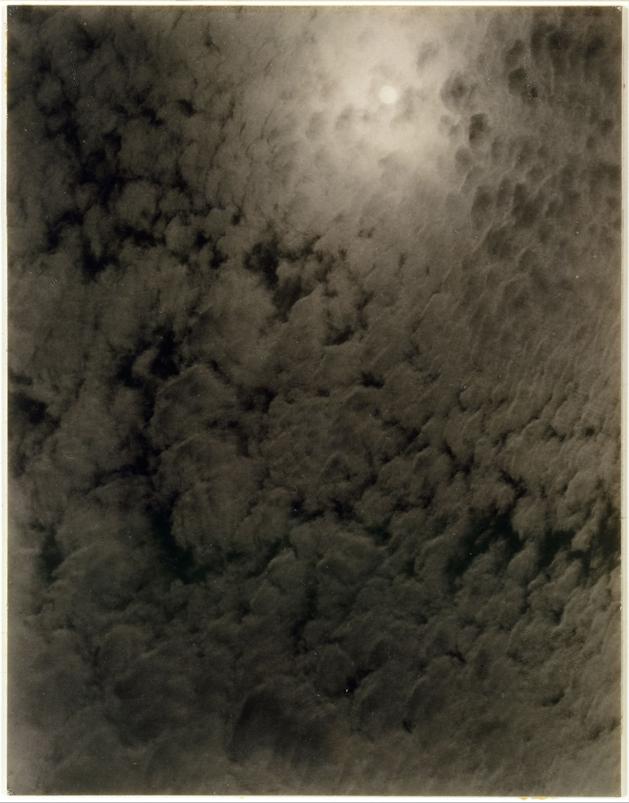
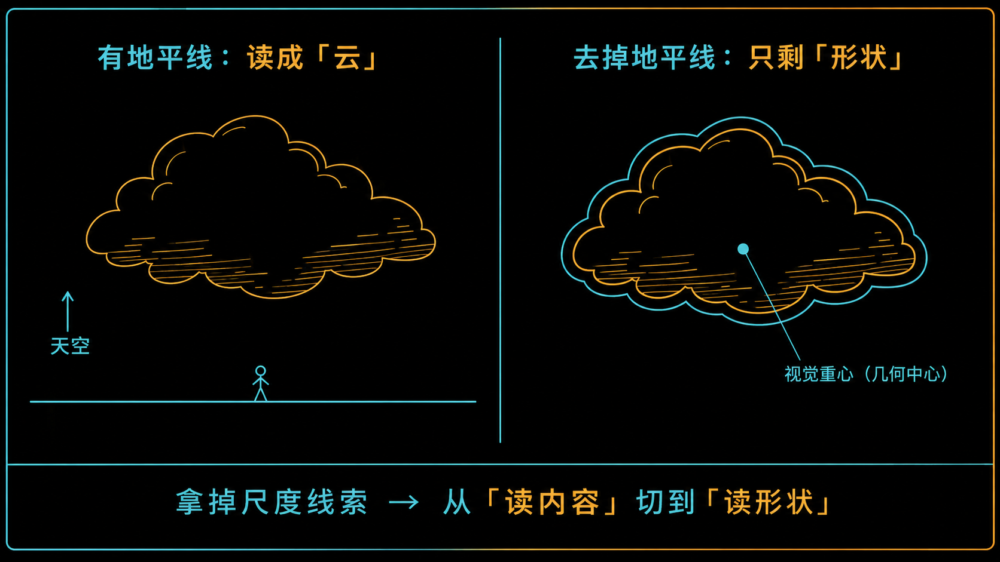
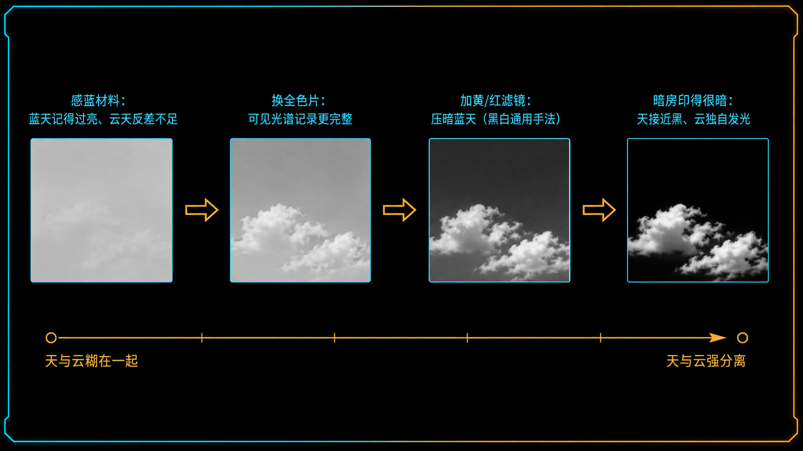
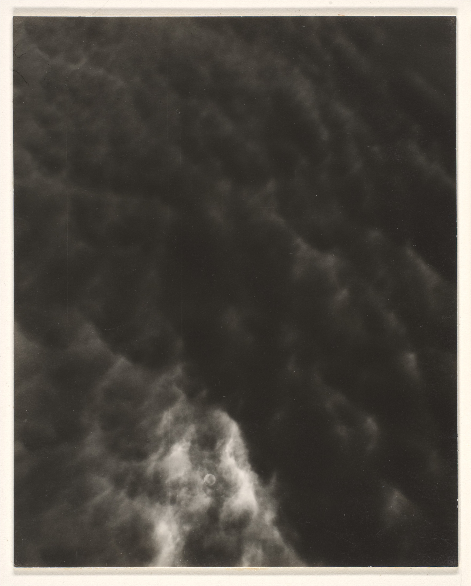
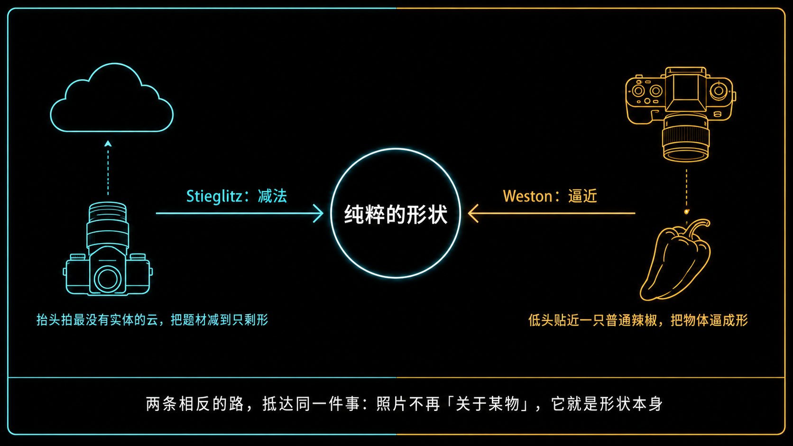

+++
title = "经典作品拆解 #9：Equivalents（等价物）"
description = "斯蒂格利茨用一批云的照片证明——照片打动你的不是题材，而是光、形状与影调的结构。"
date = 2026-07-03
tags = ["摄影", "经典作品", "摄影史", "Alfred Stieglitz", "Equivalents", "抽象摄影", "直接摄影", "影调"]
categories = ["摄影"]
series = ["经典作品拆解"]
showTableOfContents = true
+++

> 斯蒂格利茨用一批云的照片证明——照片打动你的不是题材，而是光、形状与影调的结构。

## 一、从一次被激怒说起

1922 年，一位评论者（Waldo Frank）谈到斯蒂格利茨的肖像时，把那些照片的力量归到一种近乎催眠的本事上——意思是，打动你的不是照片，而是他镇得住人、能支配被摄者。斯蒂格利茨看完气坏了。他做了三十多年摄影，一直在证明摄影本身就是一门艺术，结果被说成靠「摆布人」取胜。

他的回应很干脆：那我去拍一样谁都有、谁也支配不了的东西——天上的云。云不属于任何人，不要门票，也没法被「催眠」。如果拍云的照片还能打动你，那力量就只能来自照片本身，跟拍的是什么、跟我能不能「镇住」对象，都没关系。接下来十几年，他在乔治湖边抬头拍了两百多张云，取名 *Equivalents*（等价物）。

## 二、这批照片是怎么来的

斯蒂格利茨拍云的地方，是他家在纽约州乔治湖边的别墅——一个他年复一年回去的地方，抬头就是天。技术上他先用笨重的 8×10 大画幅座机，很快换成更小、更灵活的 4×5 Graflex，因为拍云要频繁把镜头怼向头顶，大机器实在不趁手。

那个年代的黑白胶片也在换代，而这对拍云关系重大：更早的普通乳剂几乎只感蓝光，稍进步的正色片（orthochromatic）扩展到蓝、绿，但对红光基本无感，直到全色片（panchromatic）出现，才把可见光谱较完整地记录下来。为什么这一步对拍云是关键，下面技术拆解会讲。

照片洗出来非常小。他用接触印相（contact print，把底片直接压在相纸上 1:1 印、不放大），成品大概只有明信片那么大。你得凑到跟前、安静地看，这正是他想要的观看方式。从 1922 年到 1930 年代中期，他拍了两百多张（也有统计到三百多张）。这批照片的名字一路在变：最早叫 *Music: A Sequence of Ten Cloud Photographs*（音乐：十张云的序列），后来叫 *Songs of the Sky*（天空之歌），最后收敛成一个词——*Equivalents*。名字里的「音乐」不是随口一说：他真希望有人看着这些照片喊出「这是音乐！」——一种不描述任何具体事物、却能直接击中情绪的东西。

*图：Equivalent（等价物），Alfred Stieglitz，1926 年。一团亮云斜切过压得极暗的天空，没有地平线、没有比例参照——这就是「把题材删掉、只留影调结构」的样子。图片来源：The Metropolitan Museum of Art（Open Access）／Wikimedia Commons。*

## 三、技术拆解

### 3.1 这张照片在做什么

**它把「题材」整个从照片里抽走了——画面上只剩光、形状和影调，没有一个「东西」让你去指认。** 你看这张 1926 年的 Equivalent：一团亮云斜切过深色的天，没有地平线，没有树、没有房子、没有任何能告诉你「这有多大、哪边朝上」的参照。斯蒂格利茨甚至故意让不少云片的方向可以颠倒——挂反了你也看不出来。当一张照片拒绝告诉你「这是什么」，你的大脑就没法把它讲成一个故事，只能退回去看最原始的东西：哪块亮、哪块暗，边缘是硬还是化开。

**于是它逼你「读形状」，而不是「读内容」。** 一朵云在这里不再是「云」，而是一块在深色背景里发亮的形（massing）。整张照片的张力全压在这块亮形怎么摆、占多大、边缘怎么收上——这是构图最底层的东西，平时被题材盖住了，在这里被单独拎出来放到最大。

*图：左边给一条地平线和参照，同一团云被读成「天上的云」；右边抹掉地平线与比例，它就只剩一块有位置、有重量的抽象形。*

### 3.2 它是怎么做到的

先说一个反直觉的事实：拍云最难的地方，恰恰是让云「看得见」。晴天你抬头，眼睛能靠颜色和亮度轻松分开蓝天和白云；可一旦落到黑白胶片上——尤其感蓝为主的正色材料——蓝天会被记录得过亮，云和天的灰度反差被压扁，一张拍下来常是灰蒙蒙一片、云陷在天里。斯蒂格利茨要的那种云——从深色天空里「跳」出来、边缘清清楚楚——现实里不会自动出现，是一整条技术链条「造」出来的。

这条链条要做的始终是同一件事：拉开天和云的灰度差。黑白拍云有一套通用配方——先靠胶片，从感蓝材料换到全色片，让明暗层次更完整、更可控；再靠滤镜，在镜头前加一片黄或红滤镜压暗蓝天、几乎不动白云，一压一留，反差就出来（这是黑白摄影压暗天空的常规手法，至于斯蒂格利茨是不是每张都上滤镜，没必要写死）。而这套配方里，他最舍得下手、也最有记载的一环是暗房：他刻意把这些照片印得很暗，把天压到接近黑，让云的亮成为整张照片里几乎唯一的光。曝光在拍摄端决定了「记下多少信息」，印放在暗房端决定了「最后让你看到哪一段」，他两头都往「高反差、强分离」推。

*图：从「天云糊在一起」到「天云强分离」的技术链——换全色片、加滤镜压暗蓝天、暗房印得很暗，每一步都在拉大灰度差。*

把这条链条讲完，那句听起来很玄的「情绪的等价物」其实就落地了。斯蒂格利茨没有魔法——他能调的变量，就是明暗块面的分布、边缘的软硬、整体调子的高低这么几样。一张压得很暗、云像刀刻一样锋利的照片，和一张灰调、边缘化开的照片，给你的情绪完全不同；而这个不同纯粹来自上面那几个可控变量，跟「拍的是哪朵云」没关系。这正是他要证的事：

> 当你把题材拿掉，照片照样能表达——靠的就是影调结构本身。云只是他找到的、最干净的实验材料：因为云什么都不是，剩下的一切就都是「照片在做什么」。

顺带说那个「小」。这些照片只有明信片大小，不是将就，是选择：接触印相把底片 1:1 印下来，影调过渡最细腻、颗粒最实；而巴掌大的尺寸逼你走近、安静、一个人看——这套「向内看」的观看方式，本身就是作品的一部分。

至于这套暗房功夫，今天基本不用你练了：一个 RAW 文件、一条曲线、在黑白混色器里把蓝色亮度往下压保住云的高光，需要时再加一片偏振镜增强天空分离，几分钟就能复现他当年拉开天云反差的效果。工艺被工具接管之后，剩下的才是真问题——他为什么要把天压到黑、让云独自发光。

## 四、它在摄影史里的位置

这批云之前，「摄影到底算不算艺术」还在靠模仿绘画来自证——柔焦、摆拍、印得像炭笔画，这一路叫画意摄影（Pictorialism）。斯蒂格利茨自己早年就是这条路的旗手，而 *Equivalents* 是他公开转身：不靠柔焦、不靠题材、不装成别的画种，就用相机最擅长的锋利影调，直接把情绪拍出来。这一步，是直接摄影（straight photography，指不修饰、不模仿绘画、如实发挥相机本性的路线）的关键完成。要说先例，Paul Strand 早在 1910 年代就给出过直接摄影和摄影抽象的重要样本，斯蒂格利茨自己还在《Camera Work》上郑重推过他；而 *Equivalents* 是斯蒂格利茨本人从画意走向现代的代表性收束；再往后，Ansel Adams 和 Group f/64 才把这条路推到极致。

往长里看，这批照片常被算作史上最早的一批「完全抽象」的摄影——画面里没有可辨认的题材，只剩纯粹的形式。更要紧的是它立下的那个观念：一张照片可以是拍摄者内心状态的「等价物」。这条线后来被 Minor White 直接接了过去，他干脆把自己一整类作品也命名为「Equivalent」，还把它整理成一套教学方法。

我的看法是：*Equivalents* 真正的价值不在「好看」——单张拿出来，未必比一张漂亮风光更抓眼球；它的价值在于一次性地、干净利落地证明了「内容不等于题材」这件事，给后来所有想拍「感觉」而不是「东西」的人，发了一张通行证。

*图：Equivalent, Set C2 No. 1，Alfred Stieglitz，1929 年。同一批实验里的另一张——云的方向已经很难判断哪边朝上，你只会本能地去看明暗块面怎么分布。图片来源：The Metropolitan Museum of Art（Open Access）／Wikimedia Commons。*

## 五、与主线的接口

**如果你想深入……**

这张照片的核心决策，对应我们摄影主线的「构图几何与注意力预算」和「叙事与编辑」两个模块：

- **#6-5 形状优先：大形（Massing）决定生死** — 讲了一张照片的成败首先由「大块明暗形状怎么摆」决定，题材其实是后面的事。*Equivalents* 就是这条原则被推到极端的样子：题材归零，只剩大形。
- **#6-12 负空间：不是留白，是「隔离缓冲带」** — 讲了暗下去的天空不是「空」，而是给亮云腾出的带宽。斯蒂格利茨把天压到接近黑，正是在用负空间给主体让路。
- **#7-5 余味的心理学：蔡格尼克效应** — 讲了「不给结论」如何在观众脑里留下痒点。这批照片拒绝告诉你「这是什么」，正是靠这种「未完成」把你留在画面里反复补完。

读完这些，你对 *Equivalents* 的理解会从「看过一批很酷的云」变成可操作的拍摄认知。

## 六、对今天的启示

把胶片、滤镜、暗房这些当年的功夫都交给现代工具之后（上一节说了，今天一条曲线加一片偏振镜就能复现），真正值得你从这批云里搬走的，是那个决定本身：**主动拿掉题材，只留影调结构。**

给两条能直接上手的：

1. 想练「形状优先」，就专门去拍那些你没法叙事化的东西——天空、水面、大面积的墙、地上的光斑。强迫自己不靠「这是什么」构图，只靠明暗块面的位置和大小。
2. 后期时把「去题材」当成一个可控动作：故意裁掉地平线和比例参照、压暗背景让主体的形跳出来、必要时连方向都打乱。你会发现，一旦「这是什么」这个问题被关掉，你对「照片在做什么」的敏感度会突然打开。

但别把「去题材」误当成「随手裁掉参照就完事」。斯蒂格利茨的云之所以不是「random 一团灰」，恰恰因为每一块亮形的位置、大小、边缘都是摆过的。删掉地平线只是第一步——真正难的是删完之后，画面即使没有「内容」，也仍要有清楚的大形、明确的重心、经营过的边缘和留白。参照拿掉了，构图的责任反而更重。

## 七、收尾

读这篇之前，你可能觉得「云的照片」就是随手拍拍天、图个好看。读完你知道了：这是一次蓄谋已久的实验——把题材从照片里删干净，只留下光、形状和影调，用来证明照片的表达力压根不依赖「拍的是什么」。

下一篇，我们看一个从完全相反的方向抵达同一个终点的人——Edward Weston 和他的 *Pepper No. 30*（辣椒 30 号）。斯蒂格利茨走的是减法：把题材一直减，减到只剩虚空里的形。Weston 反过来——他低头把一只最普通的青椒扣进一只金属漏斗里，让四壁反射的柔光把它整个包住，再用极小光圈换来的极致景深、长时间曝光，把这只菜市场里两毛钱的青椒，拍成一座像人体、像雕塑的东西。他属于把「一切都清晰」当宣言的 f/64 学派——至于那些具体参数（光圈开到多小、曝了多久），我们留到下一篇拆《辣椒 30 号》时逐一确认。一个抬头拍最没有实体的云，一个低头把实物逼到极致；一个用减法逼近抽象，一个用逼近逼出抽象。但他俩最后证明的是同一件事：好照片可以不是「关于某个东西」，它就是形状本身。

*图：Stieglitz 用减法把题材减到只剩形，Weston 用逼近把普通物体逼成形——方向相反，终点相同。*

## 参考资料

- **作品原图（收藏页）**：The Metropolitan Museum of Art，*Equivalent* 系列，Open Access／公有领域 — [Met · Equivalent 收藏页](https://www.metmuseum.org/art/collection/search/267451)、[Met · Equivalent No. 314](https://www.metmuseum.org/art/collection/search/265529)
- **权威整理**：National Gallery of Art，*Alfred Stieglitz: The Key Set*（收藏逾 300 张 Equivalents，含系列源流考据） — [NGA · Alfred Stieglitz Key Set](https://www.nga.gov/research/publications/alfred-stieglitz-key-set/introduction-key-set)
- **系列说明**：The Art Institute of Chicago，The Alfred Stieglitz Collection · Equivalents — [Art Institute · Stieglitz Collection · Equivalents](https://archive.artic.edu/stieglitz/equivalents/)
- **一手文献**：Alfred Stieglitz，*How I Came to Photograph Clouds*（1923，斯蒂格利茨自述拍云缘起与「等价物」构想） — [Stieglitz 原文](https://on-air.caricomassimo.org/en/airchive/how-i-came-to-photograph-clouds)
- **摄影师**：Alfred Stieglitz（1864–1946），美国现代摄影的推手：主持 291 画廊与《Camera Work》杂志，把欧洲现代艺术引进美国，晚年与画家 Georgia O'Keeffe 结婚。他早年是画意摄影旗手，中后期转向并推动直接摄影，*Equivalents* 是这一转向的代表作。
- **延伸阅读**：Sarah Greenough，*Alfred Stieglitz: The Key Set*（NGA 权威图录，系统收录 Equivalents 与创作背景）；概览可参 [Wikipedia · Equivalents](https://en.wikipedia.org/wiki/Equivalents)。
