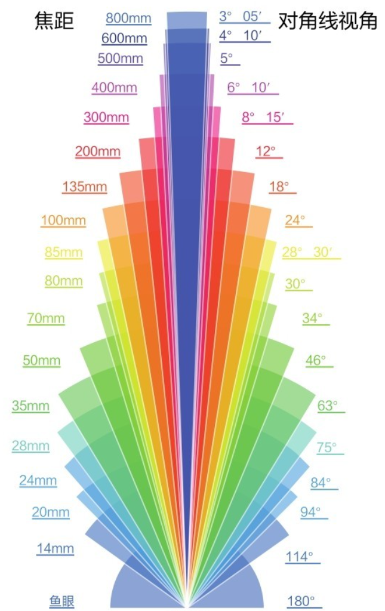
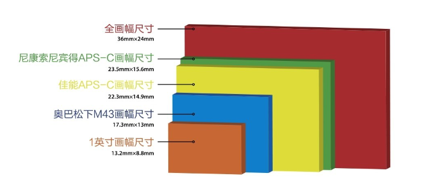
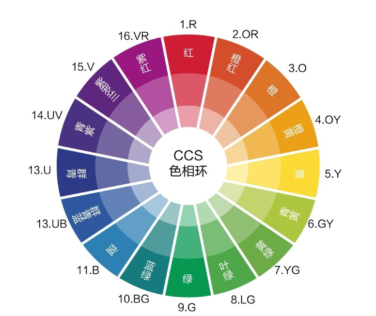
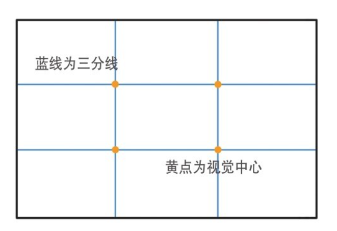
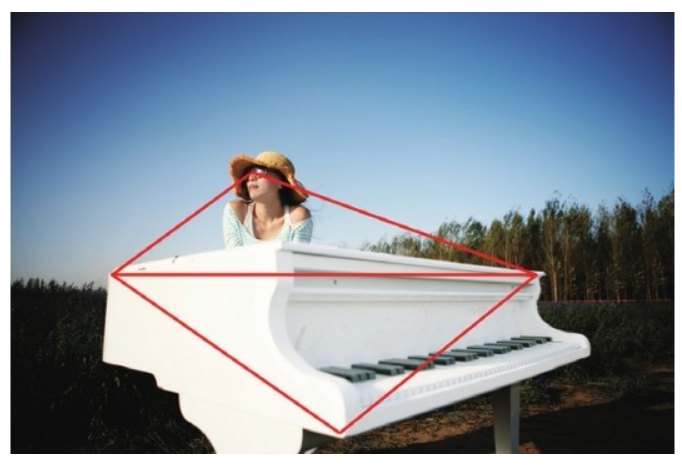
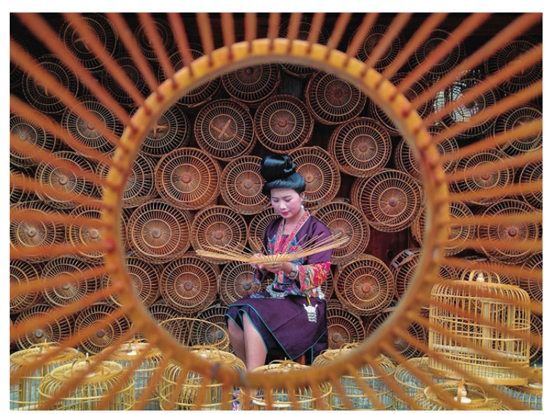

+++
title = "摄影基础：从光学原理到画面控制的系统整理"
description = "系统梳理摄影核心知识体系：镜头与焦距、曝光控制、光线与色彩、对焦与景深、快门运用、构图法则，以及多重曝光与星轨等进阶技法"
date = 2026-03-31
tags = ["摄影基础", "焦距", "曝光", "测光", "景深", "虚化", "构图", "白平衡", "Zone System"]
categories = ["摄影"]
showTableOfContents = true
+++

## 镜头与焦距

### 焦距与视角

焦距决定了镜头的视角范围：焦距越短，视野越宽，画面容纳的景物越多，但单个景物在画面中占比越小；焦距越长，视野越窄，画面中景物越少，但单个景物占比越大。

手机通过数码变焦（裁切像素）或多定焦镜头切换来实现焦距变化。

#### 定焦焦段特性

| 焦段 | 典型焦距 | 适用题材 | 特点 |
|------|---------|---------|------|
| 超广角 | < 24mm | 大场景风光、建筑、狭小空间 | 视野极宽，透视夸张，能把小空间拍"大" |
| 标准广角 | 24–28mm | 风景 | 比超广角收敛，画面更"端正" |
| 人文广角 | 35mm | 人文纪实 | "大师的焦距"，兼顾主体与环境关系，代入感强 |
| 标准镜头 | 50mm | 人文、人像 | 近似人眼透视，光圈通常较大，虚化效果好 |
| 人像镜头 | 85mm / 135mm | 人像特写 | 85mm 拍半身和特写最经典，135mm 适合稍远距离拍摄 |
| 长焦 | 200–300mm | 鸟类、荷花、运动 | 可"打到"中远距离的主体 |
| 超长焦 | > 300mm | 野生动物、运动、天文特写 | 日出日落、满月弦月等天体特写 |

#### 变焦镜头分类

| 类型 | 焦段范围 | 适用场景 |
|------|---------|---------|
| 超广角变焦 | 11/12/14/16/18mm 起 → 24/35mm 止 | 超广角到一般广角的灵活切换 |
| 标准变焦 | 24/28mm 起 → 70/85/105/120mm 止 | 日常万能焦段，变焦比一般不超过 5 倍 |
| 中长焦变焦 | 70/100mm 起 → 200/300/400mm 止 | 远景、人像、街拍人文 |
| 超长焦变焦 | 150/200mm 起 → 500/600mm 止 | 野生动物等远距离题材 |

### 等效焦距与画幅

#### 画幅标准的由来

35mm 相机使用 35mm 宽、两边打孔的胶片（即 135 胶卷），单帧实际尺寸为 **36mm × 24mm**（3:2 比例）。这就是"135 全画幅"或"35mm 全画幅"的由来。

当传感器尺寸不是全画幅时，同一实际焦距对应的视角会发生变化，需要通过焦距转换系数换算为等效焦距。

**核心规律：画幅越小，同一实际焦距对应的等效焦距越长。**

#### 焦距转换系数

| 系统 | 转换系数 |
|------|---------|
| 全画幅 | 1×（无需换算） |
| 尼康 / 索尼 / 宾得 / 富士 APS-C | 1.5× |
| 佳能 APS-C | 1.6× |
| M43（奥之心 / 松下） | 2× |

#### 镜头与机身兼容性

- 全画幅机身只能用全画幅镜头（APS-C 镜头装上后会进入裁切模式，传感器外圈不工作）
- 全画幅镜头可用于全画幅和半画幅机身
- 镜头上标注的焦距均为实际焦距，无论全画幅镜头还是半画幅专用镜头
- 只要是半画幅机身，无论搭配什么镜头，都必须乘以转换系数得到等效焦距

> 等效焦距不等于等效景深。小画幅相机可以同时获得长焦的空间压缩效果和广角般的大景深——对于既想要压缩感又需要前后清晰的场景，这反而是优势。

### 透视与空间感

透视的本质是"近大远小"。决定透视强度的不是焦距本身，而是**拍摄距离**：

- **距离近 → 透视强烈**：近处物体被放大，远处物体被缩小，画面纵深感强
- **距离远 → 透视平淡**：近远物体比例趋近真实，画面趋于扁平

由于广角镜头通常需要靠近拍摄，长焦镜头通常远距离拍摄，因此在实际使用中表现为：

| 镜头类型 | 透视效果 | 空间感 |
|---------|---------|--------|
| 广角 | 强烈的近大远小 | 强纵深感 |
| 长焦 | 近大远小不明显 | 画面扁平、空间压缩 |

#### 透视对人像的影响

- **广角拍人像**：透视过强会出现"大鼻子"效果，面部变形
- **长焦拍人像**：面部过于扁平，显胖
- **50mm / 85mm** 是人像最佳焦段，兼顾景深与透视
- 圆脸适合 50mm（略带透视拉长脸型）；瘦长脸适合 85mm
- **全身照**用 24mm 或 35mm；**半身和特写**用 50mm 或 85mm

### 取景的核心原则

取景的本质是选择——画面中的每个元素都应服务于主题表达，至少不能干扰主题。

- **人物特写**：避免低角度仰拍，稍微俯拍能让脸型更好看
- **城市风光**：高处俯拍是最常见也最有效的角度
- **前景运用**：加入前景的唯一理由是它能更好地烘托主题和氛围，否则不如不加
- **35mm 人文**：近距离拍摄带来强烈的代入感，"镜头会讲故事"

---

## 曝光控制

### 曝光三要素

光圈、快门速度、感光度共同决定了画面的曝光量。三者之间，相邻两挡的曝光量均为 **2 倍**关系——某个参数调亮 n 挡，另外的参数反向调暗 n 挡，最终曝光不变。

#### 光圈

光圈值（f 值）是焦距与光圈孔径的比值。常见档位：f/1.0、f/1.4、f/2、f/2.8、f/4、f/5.6、f/8、f/11、f/16、f/22、f/32，相邻两挡约 1.4 倍关系，光圈孔面积和通光量为 2 倍关系。

**光圈的三重作用：**

| 作用 | 说明 |
|------|------|
| 控制通光量 | 光圈越大画面越亮；拍星空时 f/2.8 是实用极限 |
| 控制虚化 | 光圈越大，景深越浅，背景虚化越强 |
| 影响画质 | 最佳光圈通常比最大光圈强 30%–50%，比最小光圈强 50% 以上 |

**光圈的特殊效果：**

- **星芒**：小光圈（约 f/11）下点光源会呈现星芒线条
- **前景消融**：大光圈可让紧贴镜头的前景（铁丝网、栅栏等）几乎消失
- **检验清洁度**：小光圈下传感器上的污点会更加明显

#### 快门速度

快门速度即曝光时间。速度越高，曝光时间越短，进光量越少。

| 速度范围 | 分类 | 典型用途 |
|---------|------|---------|
| < 1/4s | 极低速 | 需三脚架，光绘、星轨 |
| 1/4s – 1/60s | 慢门 | 流水、车轨等动态模糊 |
| 1/60s – 1/250s | 常规速度 | 日常拍摄 |
| 1/250s – 1/2000s | 高速 | 凝固运动瞬间 |
| > 1/2000s | 极高速 | 水滴、体育等极速场景 |

#### 感光度（ISO）

感光度表示传感器对光线的敏感程度，标准值为 ISO 100。ISO 越高，画面越亮，但噪点也越多。原则上**能用低 ISO 就用低 ISO**。

#### 三者的联动

M 挡手动曝光时，以曝光补偿作为指导——光圈、快门、ISO 三者共同作用的结果就是最终的曝光量。

### 测光与曝光补偿

**曝光补偿**本质上就是照片的亮度值。以 0EV 为基准，+1EV 是 0EV 的 2 倍亮度，-1EV 是 0EV 的 1/2。

#### 测光模式

| 模式 | 测光范围 | 适用场景 |
|------|---------|---------|
| 评价测光 | 全画面加权 | 绝大多数场景的默认选择 |
| 点测光 | 画面约 1%–1.5% 区域 | 逆光、舞台灯光等极端光比场景 |

> 逆光人像实例：黄种人肤色接近 18% 灰，对模特面部点测光并保持 0EV，无论背景多亮，面部曝光都能正常。若用评价测光，面部会严重欠曝。

#### 白加黑减

- 拍摄白色 / 浅色为主的场景 → **增加曝光补偿**（白加）
- 拍摄黑色 / 深色为主的场景 → **减少曝光补偿**（黑减）

实用经验：拍人物对准脸部亮度锁定曝光；拍风光可先对准草地测光。

### 曝光模式

| 模式 | 全称 | 你控制的参数 | 相机自动控制 | 适用场景 |
|------|------|------------|------------|---------|
| **M** | 手动曝光 | 光圈 + 快门 + ISO | 无（曝光补偿仅作指示） | 拼接、堆栈等需固定参数的场景 |
| **A/Av** | 光圈优先 | 光圈 + 曝光补偿 | 快门速度 | 人像、风光等需控制景深的场景 |
| **S/Tv** | 快门优先 | 快门 + 曝光补偿 | 光圈 | 有动态元素的场景 |
| **P** | 程序曝光 | 曝光补偿 | 光圈 + 快门 | 快速抓拍 |
| **AUTO** | 全自动 | 无 | 全部 | 完全交给相机 |

建议将 ISO 设为 AUTO，让相机根据光圈和快门自动调节感光度。

### 正确曝光与直方图

多数场景下 0EV 就是最合适的曝光。但要根据场景做判断：

- 大面积白色 / 浅色 → 适当提亮，还原本来亮度
- 大面积黑色 / 深色 → 适当压暗，还原本来亮度

**直方图**是判断曝光的客观依据。直方图最左端有数据意味着"死黑"，最右端有数据意味着"死白"，这些区域后期无法恢复细节。

#### 曝光策略

| 场景 | 策略 | 原因 |
|------|------|------|
| 风光（可控环境） | **向右曝光**——尽量拍亮，但不死白 | 暗部提亮会产生噪点，亮部压暗画质更好 |
| 纪实抓拍（大光比） | **宁欠勿过** | 无法控制环境，过曝不可恢复 |
| 摆拍（可慢调） | **宁过勿欠** | 有时间精调，保证不死白即可 |

### 大光比场景处理

当场景明暗反差超出传感器动态范围时，需要特殊手段：

| 方法 | 原理 | 适用场景 |
|------|------|---------|
| **中灰渐变镜（GND）** | 物理滤镜压暗画面亮部区域 | 日出日落等天地分界明显的场景 |
| **黑卡** | 用不反光黑卡在亮部区域摇动遮挡 | 同上，手动版 GND |
| **HDR 合成** | 多张不同曝光合成一张 | 亮暗细节都需保留的场景 |
| **包围曝光（BKT）** | 相机自动拍摄欠曝/正常/过曝多张 | 为后期 HDR 合成提供素材 |

---

## 光线与色彩

### 光线的强度

光线强度取决于光源能量、距离和传播介质，直观感受就是明暗程度。

> 不管拍风光还是人像，室外拍摄应**避免正午强光直射**。强光下拍人像：打在脸上过曝，不打在脸上发暗，面部阴影又极重。

### 光线的方向

| 光位 | 光源位置 | 效果 | 适用场景 |
|------|---------|------|---------|
| **顺光** | 主体正面 | 消除阴影，面部趋于平面化（又称"平光"） | 风光（容易获得蓝天白云红花绿草）；**不宜多用于人像** |
| **侧光** | 主体 45° 侧面 | 明暗过渡自然，面部立体感强 | **人像造型**首选光位 |
| **90° 侧光** | 主体正侧面 | 强烈的明暗对比，戏剧性强 | 强调光影对比的艺术表达 |
| **逆光** | 主体背面 | 画面偏暖，雾蒙蒙的光感；降低影调可消散光雾 | 日出日落、透射光（树叶、薄纱等） |

在没有补光的条件下，逆光拍摄中绚烂的晚霞与人物面部细节往往不可兼得——必须做取舍，让人物成为剪影可能是更好的选择。

### 色温与白平衡

**色温**描述光线的颜色倾向，单位为 K（开尔文）。**蓝色是冷色但色温高，红色是暖色但色温低**——这与日常"冷暖"的直觉相反。

#### 白平衡设置

白平衡的作用是将不同色温环境下的白色物体还原为真正的白色。

| 方式 | 操作 | 说明 |
|------|------|------|
| 手动色温 | 选择 K 值 | 精确控制，可主动制造冷暖倾向 |
| 自定义白平衡 | 对白色物体校准 | 以该白色为基准还原所有颜色 |
| 自动白平衡（AWB） | 相机自动判断 | 多数场景够用 |

> 拍摄 RAW 格式时，白平衡可在后期重新定义，理论上无画质损失。这是 RAW 相比 JPEG 的重要优势之一。

---

## 对焦与景深

### 对焦模式

| 模式 | 缩写 | 行为 | 适用场景 |
|------|------|------|---------|
| 手动对焦 | MF | 完全手动旋转对焦环 | 无反差区域（白墙）、极暗环境、高速无规则运动、微距 |
| 单次自动对焦 | AF-S | 半按快门锁定焦点 | 风景、静态人文、动作变化不大的人像 |
| 连续自动对焦 | AF-C | 半按快门持续追焦 | 运动物体 |

### 对焦区域

| 区域模式 | 特点 | 适用场景 |
|---------|------|---------|
| 单点对焦 | 精确控制焦点位置 | 需要精准对焦的小主体 |
| 扩展对焦 | 主对焦点 + 周围辅助点联动追焦 | AF-C 下追踪运动目标 |
| 区域对焦 | 一片对焦点同时工作 | 速度优先、主体较大的场景 |

**推荐搭配：**
- 常规拍摄：AF-S + 单点对焦
- 运动题材：AF-C + 扩展对焦

### 景深原理

**焦平面**是成像清晰的平面，焦平面前后有一段"可接受的清晰范围"，就是景深。

- 焦平面前方的清晰范围叫**前景深**，后方的叫**后景深**
- **前景深 < 后景深**——前方更容易虚，后方相对不容易虚
- 随参数变化，后景深的变化幅度远大于前景深

| 景深类型 | 含义 | 典型用途 |
|---------|------|---------|
| 浅景深 | 清晰范围小 | 人像虚化、突出主体 |
| 深景深 | 清晰范围大 | 风光、建筑、纪实 |

### 背景虚化四要素

实现背景虚化的核心是让背景处于景深之外，且越远越好：

| 要素 | 效果 | 说明 |
|------|------|------|
| **背景远** | 背景离主体越远越模糊 | 最容易控制的变量 |
| **相机近** | 拍摄距离越近景深越浅 | 微距拍摄天然浅景深 |
| **光圈大** | 大光圈 = 浅景深 | f/1.4 vs f/8 差异显著 |
| **焦距长** | 长焦更容易虚化 | 但太长会导致面部扁平 |

人像虚化的焦距建议控制在 **50–200mm**，兼顾透视效果与虚化能力。

### 超焦距与深景深

拍风光需要远近都清晰时，使用"**小光圈 + 广角 + 对焦距离远**"的组合。

- 实用光圈：**f/8 或 f/11** 即可（不必用极小光圈，避免衍射降质）
- **超焦距**：对焦到某个特定距离时，可获得理论上最大的景深范围——从该距离的一半到无穷远都在景深内

---

## 快门运用

### 高速快门：凝固瞬间

高速快门可以冻结运动中的精彩瞬间。但需要注意闪光灯的同步限制：

- **最高闪光同步速度**：由于卷帘快门结构，超过一定速度后画面不是整体曝光而是逐行扫描。这个临界速度就是最高闪光同步速度
- **高速闪光同步（HSS）**：闪光灯在快门扫描过程中连续频闪，让每个区域都被照亮，突破同步速度限制

### 慢速快门：记录时间

- **追随摄影**：快门释放时保持与运动主体同步移动，主体清晰而背景拉成动感线条
- **前帘 vs 后帘闪光同步**：慢门拍摄时应使用**后帘同步**，让运动轨迹在主体后方而非前方，更符合视觉逻辑

### 星空拍摄的"500 法则"

用 **500 ÷ 等效焦距 = 最长曝光秒数**（星点不拖线）。

例：全画幅 + 20mm 镜头 → 500 ÷ 20 = **25 秒**，曝光不超过 25 秒星星就不会拖影。

---

## 构图法则

### 基础构图方法

#### 居中构图

将主体置于画面正中，最直接、最有力。适合对称场景、单一强主体。

#### 三分法构图

将画面用两横两纵分为九宫格，主体放在交叉点或沿线条排布。关键原则：**主体朝向画面中空旷的一侧**——如果人物在画面左侧，面部应朝向右侧。

#### 引导线构图

画面中的线条（道路、栏杆、河流等）能分割画面并引导视线延伸。当多条线条交汇时，视线会自然汇聚到交点——这就是最强的视觉焦点。

#### 三角构图

画面元素或线条构成三角形，带来稳定感和结构感。

#### 框架构图

利用门窗、拱门、树枝等天然元素形成画框，将视线聚焦于框内主体。

#### 重复构图

当画面中没有单一主体时，一组重复的元素本身就是主体——规律中的节奏感就是画面的表达。

### 横构图与竖构图

| 构图方向 | 传达的感受 | 适用场景 |
|---------|----------|---------|
| **横构图** | 稳定、宽阔、延展 | 大场景风光、街拍、人文 |
| **竖构图** | 纵深、高耸、落差 | 有上下"落差"的画面、建筑仰拍 |

### 点与线的视觉规律

**点的位置感受：**

| 位置 | 视觉感受 | 应用 |
|------|---------|------|
| 画面中心 | 受力均衡，略显呆板 | 对称构图 |
| 画面上方 | 上浮、轻盈 | 飞鸟、飞机等飞行元素 |
| 画面下方 | 下沉、稳重 | 人物一般不要放太高，避免"飘"在空中 |

**线条的方向感受：**

- 横向线条 → 开阔感
- 纵向线条 → 高耸感

### 人像构图要点

- **头部位置**：半身像或全身像中，头部不能放在画面中线及以下，否则显矮
- **裁切禁区**：**避免在关节处裁切**（手腕、膝盖、脚踝、手指、脚趾），会产生"截肢"的不适感

---

## 进阶技法

### 多重曝光

将两张或多张画面叠加合成。核心技巧：在第一张的**暗部区域**安排第二张的主要元素，同时避免第二张的亮区遮盖第一张的主体。

### 光绘

利用长曝光时间，手持光源在画面中"作画"。曝光期间光源的运动轨迹会被记录在最终画面上。

### 星轨

星轨通常不是单张完成，而是通过多张堆栈合成：

| 参数 | 设置 |
|------|------|
| 单张曝光时间 | 30 秒 |
| 间隔 | 1 秒 |
| 总张数 | ≥ 120 张（可更多） |
| 曝光模式 | **M 挡**（固定参数） |
| 白平衡 | **手动设定**（固定色温） |
| 长曝降噪 | **关闭**（否则间隔时间翻倍） |

拍摄完成后，在后期软件中使用堆栈功能将所有照片叠加合成为一张完整星轨。
