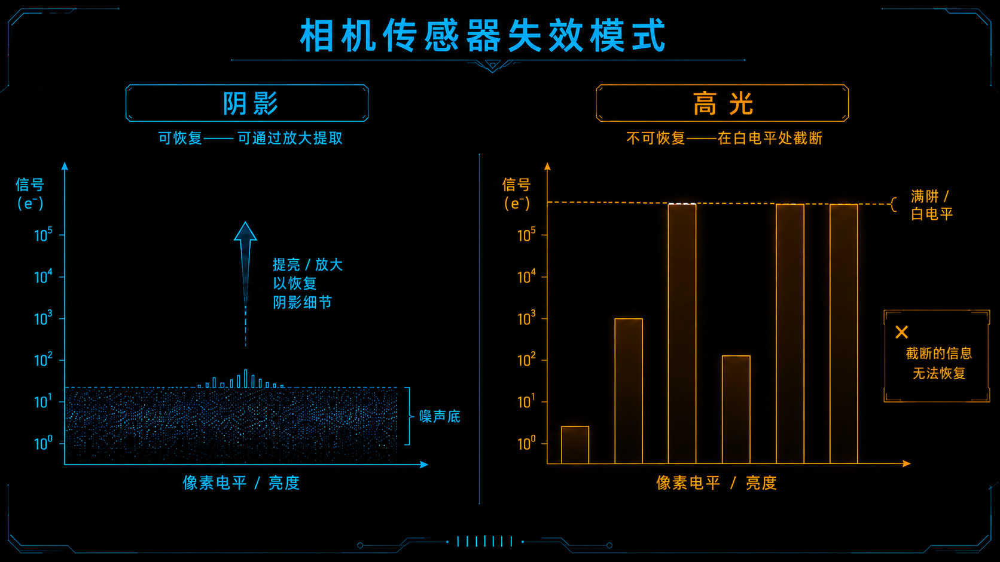
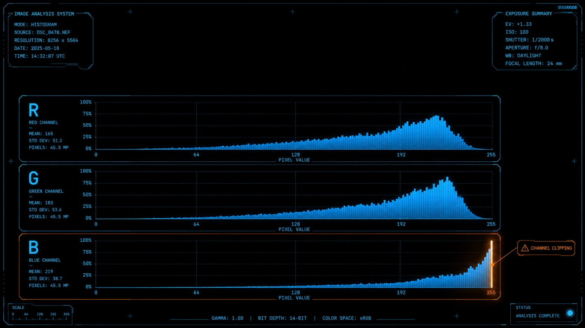
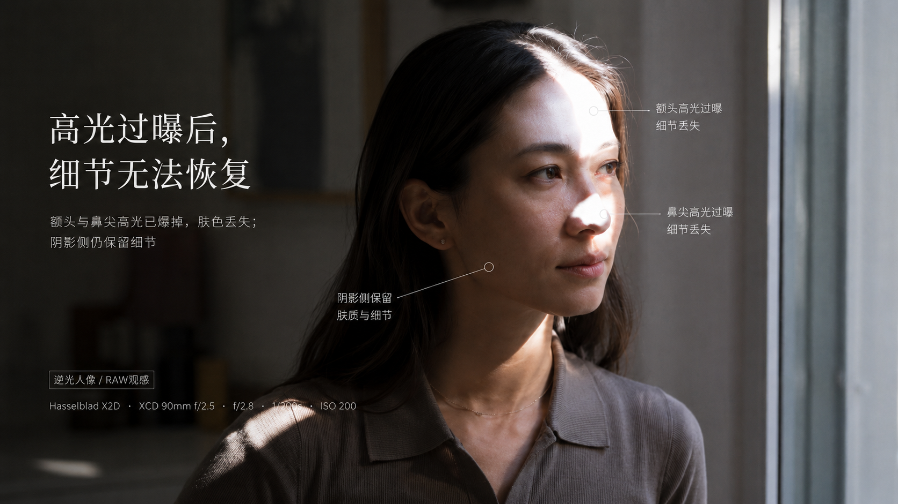

+++
title = "1-10 高光为何更「不可逆」：溢出与肤色崩坏"
description = "暗部噪声和高光溢出不是一回事——暗部的细节埋在噪声里还能挖，高光撞到天花板后，信息是真的没了。"
date = 2026-06-06
tags = ["摄影", "曝光", "高光溢出", "动态范围", "满阱容量", "RGB 直方图", "肤色"]
categories = ["摄影"]
series = ["主线"]
showTableOfContents = true
+++

> 暗部噪声和高光溢出不是一回事——暗部的细节埋在噪声里还能挖，高光撞到天花板后，信息是真的没了。

逆光拍人，最常见的翻车是这样的：为了让脸够亮，你给脸正常曝光，回家一看，人是清楚了，背后的天空和窗户却糊成一片惨白，怎么拉「高光」滑块都拉不回云的层次。可奇怪的是，同一张照片，你把「阴影」滑块往上一提，墙角暗处居然还能抠出砖缝和衣服的褶皱——脏是脏了点，但东西在。

同样是曝光没给对，为什么暗部能救、高光不能？很多人把这归结为「相机宽容度不够」，然后继续在后期里跟高光死磕。但真正的原因不在软件，在传感器记录光线的物理方式：暗部和高光的「坏」，根本是两种不同的坏。

我们在 #1-6 看直方图时提过一句：高光溢出不可逆，暗部只是掉进噪声地板，两者并不对称；#1-9 又讲清了暗部为什么能救。这一篇补上另一半——高光那一头到底发生了什么，以及为什么搞懂它，你按快门前的判断会完全不一样。

## 一种是「埋起来」，一种是「削平了」

先说暗部为什么能救。想象你在一个吵闹的房间里录下一句很小声的话。声音是录进去了的，只是被环境噪音盖住。你回家把音量调大，那句话就浮出来了——代价是噪音也一起被放大，听着发毛。

暗部就是这样：光子收得少，信号很弱，紧贴着传感器的噪声地板。你在后期「提亮暗部」，做的是数字放大，信号和噪声一起抬起来。细节一直都在，只是脏。要干净就得降噪，降噪又会抹掉一点纹理——这就是 #1-9 说的那个代价函数：暗部每多救一档，细节就少一分。但不管怎么说，是双向门，进得去也出得来。

高光是另一回事。传感器的每一个像素，可以理解成一只接光子的小桶（工程上叫满阱容量，full well capacity）。光越强，桶里的电荷攒得越多，读出来的数值就越大。但桶就那么大，装满了就溢出去——再多的光子进来，读数也只停在那个「满格」不动。这个满格有个上限：比如 14-bit 最多能数到 16383 这一档（每台相机实际的白电平不一定正好卡在这个数，但道理一样）。问题就在这儿：所有比「装满」更亮的区域，无论它实际亮 2 倍还是 20 倍，读出来全是同一个满格值，一模一样。

> 暗部像隔着一层毛玻璃看字，擦干净还能认出来；高光像录音爆了音，波形的尖被一刀切平——你知道那里曾经很响，但响到什么形状，没记下来，也就还原不回来。

*图：暗部信号埋在噪声地板里可被放大挖出，高光信号撞到满阱天花板后被齐齐削平*

差别就在「记没记下来」。暗部的信息是被噪声埋着，挖得出；高光超过那个满格的部分，亮度差异传感器压根没记录，不是藏起来了，是从一开始就不存在。这就是 #1-6 里那个「不对称」的物理根源：暗部丢的是信噪比，高光丢的是信息本身。

所以暗部是有代价的双向门，高光是单向门。后期能从暗部里抠东西，是因为东西还在；后期「恢复高光」很多时候只是软件在帮你猜——猜得像不像，是色彩章 #5-7 的话题。这一篇先认清一件事：高光一旦爆透，拍摄端没保住，后期就没有原件可恢复。

## 为什么经常是「某一个通道」先爆

到这儿你可能会问：那直方图不是好好的吗，整体也没顶到最右边，怎么脸上那块还是白死了？

因为相机不是只记一个亮度，它分开记红、绿、蓝三个通道。而这三个通道，几乎从不同时到顶。

想象三个水桶分别接红光、绿光、蓝光。你拍一片蓝天，蓝光特别强，蓝桶哗哗地满了，红桶绿桶才接了小半。等蓝桶溢出来的时候，红绿还有余量——这时候看那根「总亮度」直方图，平均下来还没到头，可蓝色这一路其实已经爆了。

哪个通道先满，是在传感器采集那一刻就定下的，看几样东西：场景本身的光谱（蓝天蓝光多、夕阳和肤色红光多、钨丝灯偏暖红光强），曝光给了多少，再加上每个通道的滤色片响应和满格高低。这里头其实没白平衡什么事——白平衡是数据读出之后、做渲染时才给三个通道分别乘的增益，它改不了感光井当时有没有物理溢出。它影响的是另一回事：你在机内 JPEG、预览直方图和后期里，看到哪个通道更容易被推到顶。

通道一旦爆了一个，真正的麻烦才开始：颜色是靠 R、G、B 三者的比例定出来的。某个通道被卡在满格不动，另外两个还在涨，这个比例就错了，颜色当场就歪。等你后期去压高光，那个爆掉的通道根本没数据，软件只能拿旁边的通道去重建、去猜——猜出来的，往往是发灰的色块，或者云边上一圈青边、品红边。

那拍的时候怎么提前看出来？把相机的 RGB 直方图（分通道显示）打开，看哪一条最先贴到右墙；再把高光警告（很多机器叫 blinkies，闪烁的斑马纹）打开，取景时哪块在闪。但要记住一件事：机内这根直方图和这个警告，都是按机内 JPEG 预览算的，受你设的白平衡、对比度、色彩风格影响，并不等于 RAW 的真实数据。好在它通常偏保守——我们在 #1-6 说过，机内直方图比 RAW 的实际余量保守大约 0.5 到 1 档，所以它一闪，往往 RAW 里还留着一点空间。把它当成现场的保守预警，而不是 RAW 的最终判决；真要抠边界，靠 RGB 直方图加曝光包围更稳。

*图：拍蓝天时蓝通道直方图先顶到右墙报警，红绿通道仍有余量——总亮度看不出的通道先爆*

高光翻车很少是「整张过曝」，更多是某一个通道悄悄先爆，把颜色带歪。判断高光安不安全，看的不是总亮度，是分通道——而且别全信机内那根，它只是 JPEG 预览算出来的保守参考。

## 肤色和天空：两个最容易崩的点

先说肤色。健康的肤色，在漫反射的皮肤上，红通道往往最高，绿次之，蓝最低——这是肤色之所以看起来是「肉」的底层比例（后面 #1-12 和色彩章 #5-9 讲肤色轴时会反复用到）。所以硬光打在额头、鼻尖、颧骨这些凸起的地方，先顶上去的常常是红通道，暖光下尤其明显。红被卡住，绿蓝还在走，那个让皮肤显得温暖的红色偏移就没了——高光块要么发黄发灰，要么干脆惨白。更糟的是纹理：皮肤的光泽本来是一段平滑的渐变（从亮到更亮），爆掉之后这段渐变被压成同一个白，毛孔、油光的明暗全没了，脸上像贴了一片纸。这种白，后期是真的擦不出东西的，因为红通道那一段根本没记下来。

不过有个例外得分清：额头油光、鼻尖那种亮闪闪的镜面反光（specular），反的是光源的颜色，不是皮肤的颜色，它可能是另一个通道先爆，甚至几个通道一起爆成纯白。这种点状的小高光，本来就该是白的，允许它小面积爆，不必为了救它把整张脸压暗——真正要保的，是大面积的漫反射肤色。

*图：逆光半身人像，额头与鼻尖高光红通道先爆成纸片状死白、肤色发灰，而暗面仍保有层次*

再说天空。蓝天本身蓝光最强，先接近上限的常常是蓝通道，过曝时云的边缘会泛青白。但白云、太阳附近、明晃晃的窗户就不一样了：这些地方是接近中性的强光，红绿蓝往往是一起冲到顶的——三个通道全爆，结果是一块彻底没有层次的纯白死片。这也是为什么大白天的云比蓝天更难拍：不是某个通道歪了色，是整段高光被一刀切平，什么都不剩。

还有一个容易被忽略的点：通道不用爆透，只要逼近天花板，麻烦就开始了。越靠近顶端，能用来记录亮度差异的数值级别越少（这里还牵涉高光过渡那条曲线的形状，是 #1-15 专门要讲的高光滚降，Roll-off）。一段本该有层次的高光，被挤进很窄的几个数值里，看上去就是一片说不上爆、却也没了明暗层次的「片状白」。婚纱、白衬衫、雪地最吃这个亏。

这些都推向同一个拍摄结论：高光必须在按快门前保住。暗部你还能赌一把「大不了后期提」，大面积高光没有这个赌注——爆透了就是爆透了。也正因为肤色高光一旦崩就最显眼、最不可逆，后面讲容错优先级（#1-13）时，「保肤色、保高光」会排在「保暗部细节」前面。这不是审美偏好，是物理决定的先后。

肤色常爆在红通道、蓝天常爆在蓝通道，崩的是「比例」而不只是「亮度」；白云、太阳这类中性强光则是多通道一起爆，直接成无纹理的死白；至于镜面反光这种点状高光，可以放它小面积爆。

## 拍上手：今天就能做的三件事

1. **把相机的高光警告和 RGB 直方图打开。** 找个大光比的场景（窗边、逆光、晴天的天空都行）拍一张，回放时看哪个通道最先贴到右墙、画面里哪块在闪。先养成「看分通道」的习惯，而不是只瞄那根白色的总直方图；同时记住它是 JPEG 预览算的、偏保守，闪了 RAW 里通常还留着一点余量。
2. **同一个高反差场景，从 −0.3 EV 往下试到 −1 EV 左右，各拍一张。** 逆光人像这种，先减一点曝光、开着高光警告拍，回家对比额头、鼻尖、天空这些高光区：欠一点的那张，高光是不是明显多了层次，而暗部也没真的崩？这个「该减多少」的余量，就是你以后遇到高光吃紧时主动让出去的空间。
3. **专门拍一张额头反光的人像，故意让它爆一点点。** 然后在后期里分别拉「高光」和「阴影」两个滑块，亲眼看一次：死白的额头怎么拉都是平的，而暗部却能提出东西。看过一次，这个不对称你就再也不会忘。光比实在太大、一张装不下的时候，别只想着后期硬拉——补光、反光板，或者包围曝光合成（#1-16），都比「事后救高光」靠谱得多。

## 写在最后

读这篇之前，「曝光没给准」在你眼里大概是一类问题，反正后期都能修一点。读完之后，它应该裂成两半了：暗部是一扇有代价的双向门，进得去也出得来，代价是细节和噪点；高光是一扇单向门，过了满阱容量那条线，信息就留在门外，再不回来。而且它常常不是整张一起爆，是某个通道偷偷先爆，把肤色和天空的颜色带歪——你在机内看到的那根直方图，还只是 JPEG 预览给的保守参考。

那么问题自然就来了：既然高光不可逆、暗部有代价，拍的时候到底该把脸放在第几档、把天空压到哪里、谁让位给谁？这正是接下来要建立的工具——用 Zone 系统（#1-11）把「放在哪一档」说成一套可复现的语言，再用容错优先级（#1-13）回答「动态范围不够时先保谁」。高光这道单向门，是这套优先级的起点。

## 参考与延伸

- 本篇承接 #1-6（直方图与「右侧」）、#1-9（动态范围两口径），把两篇里「高光不可逆」的伏笔展开。
- 后期端的高光恢复与通道重建代价见 #5-7；高光过渡的曲线塑形（Roll-off / 肩部）见 #1-15；完整的曝光策略（ETTR / 保肤色 / 保高光）见 #1-14；包围曝光与 HDR 合成见 #1-16。
