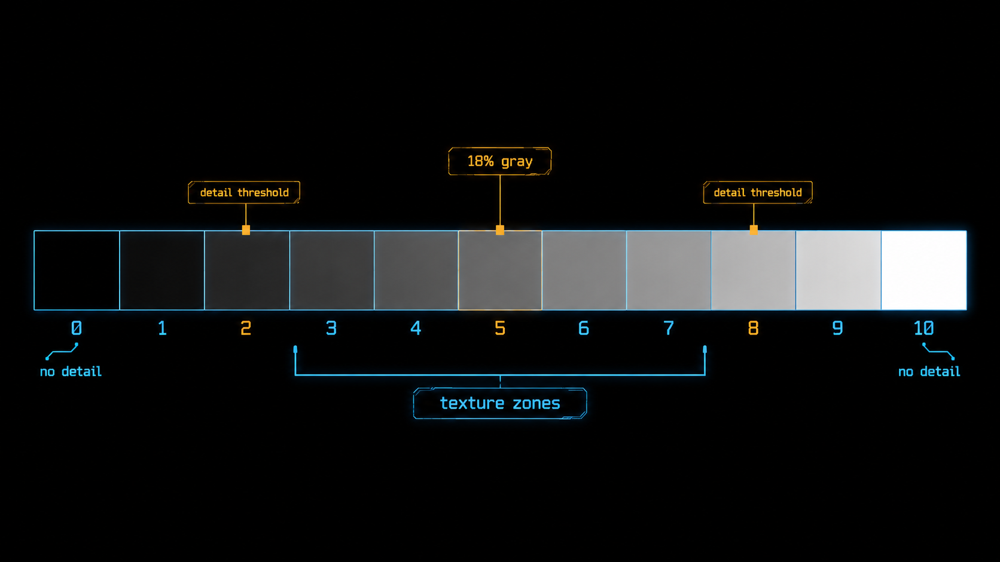
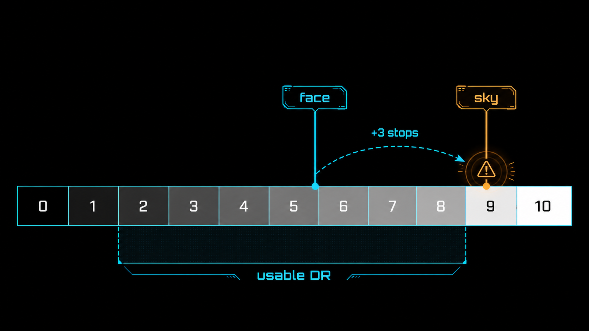
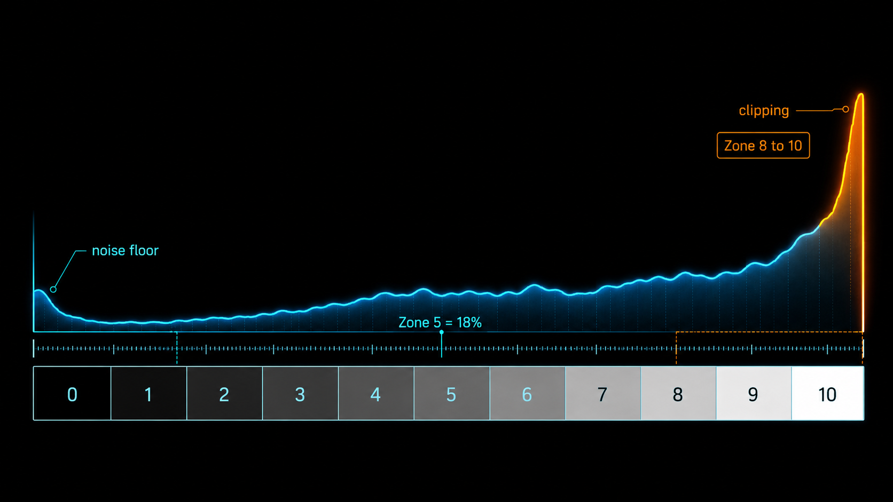

+++
title = "1-11 Zone 0–10：用影调系统统一「放在哪一档」"
description = "测光只会把一切推成中间调；「放在第几档」得自己决定——Zone 系统就是这套可复现的语言。"
date = 2026-06-09
tags = ["摄影", "曝光", "Zone 系统", "影调", "Ansel Adams", "动态范围", "直方图", "测光"]
categories = ["摄影"]
series = ["主线"]
showTableOfContents = true
+++

> 测光只会把一切推成中间调；「放在第几档」得自己决定——Zone 系统就是这套可复现的语言。

拍雪景，整片白茫茫的雪，相机一拍出来是灰扑扑的；拍一堆煤，黑乎乎的煤，拍出来居然也是灰的。#1-4 讲过原因——反射式测光会把它测到的区域推荐成一个中间调的曝光，不管那块实际是雪还是煤；这个中间调在摄影教学里常被近似成 18% 中灰。于是你学会了用曝光补偿去纠正：雪景加两档、煤堆减两档。

但加多少、减多少，常常是凭手感反复试。有没有一种说法，能让「这片雪我要它白得透亮、又保住雪粒的纹理」「那堆煤我要它黑得沉、但别糊成一团死黑」，从一句模糊的愿望，变成一个能说清、能复现、下次还能照做的决定？

有。这套说法叫 Zone 系统。它不解决什么新的物理问题——前面十篇讲的信号、噪声、直方图、动态范围，物理早就摆在那了。它干的是另一件同样要紧的事：给这些零散的结论配一把统一的尺子，让「曝光放在哪一档」第一次有了精确的含义。

## 把连续的明暗，切成 11 把椅子

从死黑到死白，亮度本来是连续滑过去的，中间没有台阶。Zone 系统做的第一件事，就是在这条连续的滑梯上钉 11 个台阶，编号 0 到 10（习惯上写成罗马数字 0、I、II……一直到 X）。

你可以把它想成一排 11 把椅子。每往右挪一把，亮度翻一倍——也就是 #1-3 说的「一档（stop）」。所以这把尺子不是随便画的刻度，它和曝光参数是同一种单位：挪一把椅子，等于光圈或快门动一档。最当中那把，Zone V（5 号椅），就是 18% 中灰——相机测光默认想把你对准的东西都安排过去的那把椅子（#1-4）。

两头的椅子是「空」的：Zone 0 是死黑，Zone X 是死白，两端都没有任何细节可言。真正有东西可看的，是中间那几把。习惯上这么认：

- **0** 死黑，无细节
- **I** 接近全黑，仅一丝微光，没有纹理
- **II** 暗部细节的临界——最深还能勉强分辨的地方
- **III** 有纹理的暗部：深色毛衣、黑头发，还看得出织纹和发丝
- **IV** 偏暗的中间调：背光的脸、深色树叶
- **V** 中灰（18%），测光的默认归宿
- **VI** 偏亮的中间调：日光下的浅肤色、浅色水泥墙
- **VII** 有纹理的高光：白衬衫、雪地，还看得出布纹和雪粒
- **VIII** 高光细节的临界——最亮还能留住质感的地方
- **IX** 接近纯白，几乎没有纹理
- **X** 死白，无细节：镜面反光、光源本身

这里头有两组关键的椅子要记住。III 到 VII 这五把，是最稳妥的纹理区——落在这个范围里的东西，明暗层次和质感都扎实。再往两端各跨一把，II 和 VIII 是纹理的边缘：还留得住一点可辨的质感，但已经踩在临界上——II 是暗部最深还能分辨的地方，VIII 是高光最亮还能留住质感的地方。所以经典 Zone 系统会把整个「有纹理的范围」说成 Zone II 到 VIII，而 III–VII 是其中最保险的核心。再往外越界——跌破 II 沉进噪声，越过 VIII 压平质感——就是 #1-9 的噪声地板和 #1-10 的满阱天花板在这把尺子上的投影，后面会接上。

*图：从死黑（0）到死白（10）被切成 11 档，相邻一档差一个 stop；Zone V 锚在 18% 中灰，III–VII 是有纹理的实用区，II 与 VIII 是细节临界*

切成 11 档之后，「亮度」这件本来连续又模糊的事，就变成了 0 到 10 十一个能用嘴说出来的档位。接下来要做的，是往这把尺子上「放东西」。

## 落子与分配：你只能决定一个，其余的自己落座

定曝光，像往这排椅子上安排人入座。但要紧的是：你只有一个自由度。

你能做的，是挑「一个」目标，决定让它坐第几把椅子——这一步叫落子（placement）。可一旦这个目标坐定了，场景里其他所有亮度，就按它们和这个目标的真实光比，自动落到对应的椅子上——这一步叫分配（fall / allocation）。你没法在拍摄端单独把天空往下挪一档而不动别的，整条曝光是拴在一起平移的：你抬一档，所有东西一起往右挪一把椅子。单独压某一块，那是后期分区调整的活，不是按快门这一下能干的。

举个最常见的例子——逆光人像。你决定把脸放到 Zone VI（偏亮、健康的浅肤色），这是你的落子。可脸一旦坐定 6 号椅，背后那片比脸亮 3 档的天空，就自动落到了 Zone IX——接近死白。这时候你回头看「分配」出来的整盘结果，会发现天空已经冲出了 VIII 那道临界线，纹理保不住了。

这就是「放在哪一档」真正的分量：你亲手落子的只有脸，但你要负责的，是落子之后整盘人都落在哪。

> 落子像在一排椅子里给主角指定座位；可一旦主角坐下，配角们的座位也就跟着定死了——你只能挑一个人的位置，剩下的人坐哪，是他们和主角的距离说了算。

那「整盘塞不塞得下」，看的就是你这台相机能稳住几把「有细节」的椅子——这正是 #1-9 的可用动态范围。这里有个容易绕进去的坑：动态范围数的是「挪了几档」，不是「占了几把椅子」。假设它能稳住大约 6 档，对应到尺子上，大致就是从 Zone II 到 Zone VIII 这一段——你数椅子会数出 7 把（II、III、IV、V、VI、VII、VIII），但两端之间只跨了 6 档间隔，动态范围算的就是这 6 档。落子之后，只要场景的明暗跨度整段落在这个窗口里，就都保得住；可一旦跨度超了——脸放 VI、天空奔着 IX、X 去——总有一头要被挤出窗外。

*图：落子定在脸（Zone VI），天空按 +3 档光比自动落到 Zone IX，已越过可用 DR 的右边界——拍摄端只能整条平移，救一头就丢另一头*

至于这一头掉出去、该保谁该舍谁，不是这一篇要回答的——那是 #1-13 容错优先级的事。真要动手，路也就那么几条：压一点曝光保住天空、用补光或反光板把脸提上来、包围曝光回去合成，或者干脆接受天空过曝；到底怎么选，#1-13 和 #1-14 会展开。这里先把动作建立起来：**落子 → 看分配 → 检查整盘有没有超出窗口**。曝光决策的真身，从来不是「拍亮还是拍暗」，而是「我把哪一个目标，钉在第几档，然后接受其余的自动落点」。

## 直方图：数字时代的 Zone 近似表

Zone 系统不是这几年才有的新发明。它是 Ansel Adams 在黑白胶片年代搭出来的，而且当年他手上有两个独立的旋钮。

第一个旋钮是曝光，管暗部落在哪——底片的暗部一旦欠曝就什么都没有，所以要先保住暗部。第二个旋钮是显影：同一张底片，显影时间越长，高光涨得越高、反差越大；显影时间短，高光就压得住。于是有了那句名言——「expose for the shadows, develop for the highlights」，曝光定暗部、显影定高光，两端分开控制。落子放暗部，再用显影去调高光那头落在哪。

到了数字时代，这两个旋钮变了样。你没法对单独一张 RAW「延长显影」，但当年显影那只手的活，被 RAW 后期接管了——曲线、高光与阴影滑块，干的就是「调高光那头反差和落点」的事（高光过渡那条曲线具体怎么塑形，是 #1-15 Roll-off 的专题）。变的是后端工具，没变的是前端这套定位语言：落子 + 分配，一个字都没改。

而且数字时代还白送了一件 Adams 当年没有的东西——一张随时能看的 Zone 近似表，就是直方图（#1-6）。胶片年代要靠点测光表一块一块去量、靠经验估显影，现在这张图实时把整盘的落点摊在你眼前。

说「近似」是有讲究的：直方图横轴画的，不是严格按 stop 均分的 RAW 档位，而是 JPEG 预览经过 gamma、对比度、色彩风格之后的色调分布。但就现场判断而言，「左边是暗部、右边是高光、两端撞墙就要丢细节」这套对应已经够用。你在取景时瞄某个高光有没有贴到右墙，就是在看它在 JPEG 预览里是不是接近裁切、大致落进了 VIII 到 X 那一段（高光裁切，#1-10）；看暗部有没有挤在最左边那堵墙，就是在看它有没有跌破 Zone II、掉进噪声地板（#1-9）。

有两件事得留个心眼。一是「贴近右墙」不等于「RAW 真的爆了」——#1-10 提过，机内直方图按 JPEG 预览算，比 RAW 的真实余量保守约 0.5 到 1 档，它一贴墙，RAW 里往往还留着小半档，真要抠边界得靠高光警告加 RAW 回放。二是这根亮度直方图没撞墙，不代表单独某个 R、G、B 通道没爆——夕阳、蓝天、霓虹、红花这种场景，常常是某一个通道悄悄先顶到头，把颜色带歪（#1-10 讲过通道先爆）。

*图：直方图横轴大致对应 Zone 0–10——右端撞墙就是高光在预览里冲过 Zone VIII 走向 X，左端堆墙就是暗部跌破 Zone II 进噪声地板；横轴基于 JPEG 预览，不是严格按 stop 均分*

所以 Zone 系统真不是老法师的情怀。它是一张坐标纸：把 #1-3 的「一档」、#1-4 的「中灰」、#1-6 的「直方图」、#1-9 的「可用 DR」、#1-10 的「高光撞顶」，摆到同一根 0 到 10 的尺子上对齐。前面那些零散的物理结论，到这里第一次拥有了共同的坐标。

## 拍上手：今天就能做的三件事

1. **给身边几样东西「报 Zone 数」。** 找一面白墙、一件深色外套、自己的手背，用点测光分别对准——一定要用点测或局部测光、对着具体一块测，评价/矩阵测光会掺进相机的算法判断，给不出这种干净的单点读数。记住相机想把你测的每一样都放到 Zone V（中灰）。然后反过来想：白墙我想要它落在 VII（亮但有质感），手背的肤色想要它在 VI，那分别该加几档曝光补偿？把「我要它在第几档」翻译成「加减几档 EV」，反复练这个翻译——这就是落子的基本功。
2. **挑一个高反差场景，按「落子」拍一张。** 窗边的人、桌上一杯逆光的茶都行。决定让主体落在 Zone VI：点测主体、加约一档补偿（把它从中灰 V 抬到 VI），拍下。回放时盯着直方图看一眼——主体到位了，可高光那头落在哪？有没有掉出右墙？这一眼，就是在「检查分配」。
3. **给直方图脑内标上 Zone 刻度。** 把横轴想象成均分的 11 格，以后每次回放别再只说「有点过」「有点欠」，改成「主体在 VI、高光顶到 VIII、暗部压到 III」。能用 Zone 的话把一张照片描述出来，你就能把它复现出来。

## 写在最后

读这篇之前，定曝光大概是个连续的手感活：往左拧拧、往右拧拧，亮了暗了凭眼睛收。读完之后，希望它在你眼里变成一个离散的、能说出口的决定——从黑到白十一把椅子，你挑一个目标钉上去，剩下的接受它们自动落座，再回头看看有没有谁被挤出了有细节的窗口。这套「落子 + 分配」的语言，把前面十篇关于信号、噪声、直方图、动态范围的物理，全收进了同一根尺子。

但有件事这篇故意没回答：那「一个目标」到底该挑谁？逆光人像里，凭什么落子的是脸，不是天空、也不是地面？这正是下一篇 #1-12 要建立的——中间调锚定：把脸、灰卡，或者画面里最关键的那块材质选成锚点，让一组照片的影调稳定一致。而当场景的明暗跨度实在塞不进可用 DR、总有一头要掉出窗外时，先保谁、后舍谁，是 #1-13 容错优先级的事。Zone 系统给了你这张坐标图；接下来两篇，教你往上面落下第一颗子。

## 参考与延伸

- 本篇把 #1-3（一档 / stop）、#1-4（中灰测光）、#1-6（直方图）、#1-9（可用 DR 两口径）、#1-10（高光不可逆）收进同一套 Zone 0–10 坐标。
- 锚点的选择与影调一致性见 #1-12；动态范围不够时的容错优先级见 #1-13；三大曝光策略（ETTR / 保肤色 / 保高光）见 #1-14；高光过渡的曲线塑形（Roll-off / 肩部）见 #1-15。
- Zone 系统源自 Ansel Adams《The Negative》(1981)；反射式测光的中间调校准（含 18% 灰卡与 ISO 2720 校准常数）是它在数字机上落地的基础。
