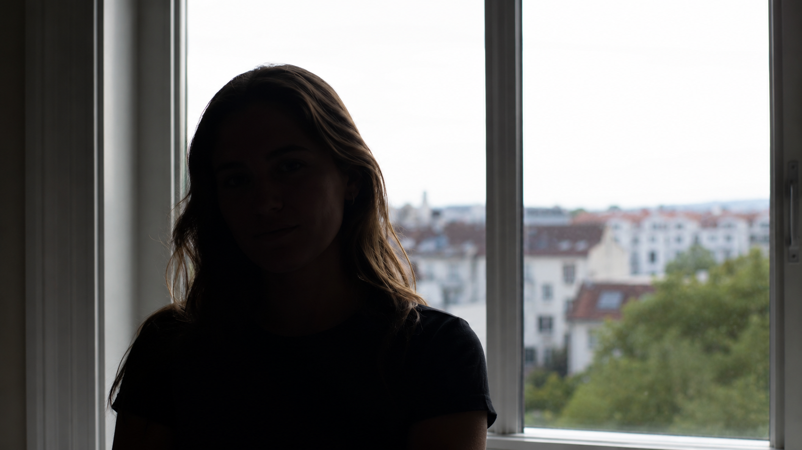
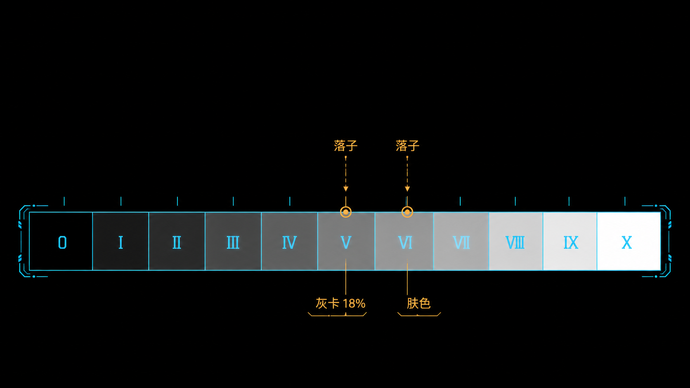
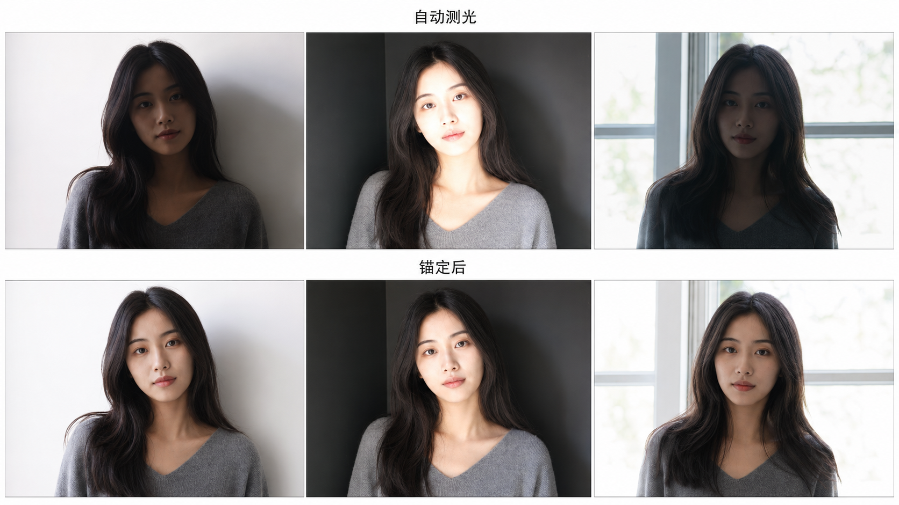

+++
title = "1-12 中间调锚定：主体/肤色应该「落在哪」"
description = "曝光不是把整张照片调到合适亮度，而是先选一个最该准确的目标、定下它落在哪一档，其余自然各就各位。"
date = 2026-06-14
tags = ["摄影", "曝光", "中间调", "锚点", "肤色", "Zone 系统", "点测光", "曝光补偿"]
categories = ["摄影"]
series = ["主线"]
showTableOfContents = true
+++

> 曝光不是把整张照片调到合适亮度，而是先选一个最该准确的目标、定下它落在哪一档，其余自然各就各位。

你大概有过这种经历：同一场拍摄，回到电脑前发现每张照片里人脸的明暗都不太一样，有的发灰、有的偏亮，调色得一张张手动救。又或者，对着一个逆光的人按下快门，相机自动给的结果不是脸黑成剪影，就是背景白成一片。这两个问题看起来一个在后期、一个在前期，其实是同一件事没做好：你没有为这张照片定下一个「锚」。

上一篇我们用 Zone 系统把「曝光」翻译成了一句话——**落子 + 分配**：主动决定把某个目标放到哪一档，画面其余亮度随之落位。但 Zone 系统只给了语言，没回答最实际的那个问题：画面里有那么多亮度，到底该把哪一个「落子」、放到第几档？这一篇就来回答它。

*图：逆光下交给相机自动曝光，脸常常黑成一片——相机并不知道你最在乎的是脸*

## 一张照片那么多亮度，先管哪个

随手拍一张，从最深的阴影到最亮的高光，画面里有成百上千个亮度等级。你不可能同时把每一个都控制到完美——光比一大，顾了脸就丢了窗外，保住天空脸又黑了。

> 这就像搬家摆家具：你不会同时挪动所有东西，而是先把最大件、最重要的沙发摆到定位，其余的围着它布置。曝光也是——先把最该准的那个亮度「摆好」，剩下的让它们各自落位。

这个被你优先摆好的目标，就是**锚点（anchor）**：你主动选定的、最该被准确还原的那个中间调。一旦锚点定了，你的曝光决策就从「整张感觉偏亮还是偏暗」这种说不清的判断，收敛成「把这个目标放到第几个 Zone」这样一个可测量、可复现的动作。

为什么锚点要选**中间调**，而不是高光或暗部？因为中间调是人眼最敏感、信息最丰富的区域，也是相机测光系统的工作原点——我们在 #1-4 讲过，反射式测光会把你瞄准的对象渲染成中间调，也就是 Zone V（摄影教学里常用 18% 灰卡作为这个中间调的参照；不同相机的测光校准其实略有出入，常落在 12%–18% 之间，但「按 Zone V 归位」这个方向是一致的）。把锚放在中间调，等于把决策放在最稳的地方，再回头检查高光和暗部有没有出界。

> 锚定的本质，是用一个可测量的点，替代「整体感觉」这种说不清的判断。

## 锚谁、放第几档

确定了「要先锚一个中间调」，接下来是两个具体问题：锚谁？放第几档？

### 锚谁：按语义重要性排

- **画面里有人 → 锚脸/肤色**。人脸是观众视线的第一落点，也是最容易看出「不对」的地方——肤色发灰、发暗，外行都能一眼察觉。所以只要画面里有人，脸几乎永远是第一锚点。
- **没有人 → 锚灰卡，或画面里的关键材质**。灰卡最精确（它的反射率就是已知的约 18%）；没带灰卡，就锚主体最重要的那块中间调表面——产品的主体材质、风光里中间调的岩石或植被。

测脸的时候还得选对地方：点测**受光那一侧的脸颊、额头，或者手背**这类平整的漫反射区域，避开鼻尖的高光、眼镜反光、头发和阴影侧——这些地方要么过亮要么过暗，测出来会把整个锚点带偏。

### 放第几档：先记住 Zone V 这个零点

标准灰卡、或者任何接近中灰的反射目标，**落在 Zone V**。这正是测光系统的归位点：对着灰卡点测、按读数曝光，灰卡就落到中间调的位置。

> 一个提醒：别太迷信机内直方图的「正中」。机内直方图是基于 JPEG 预览和机内曲线算的，跟 RAW 的线性数据并不等价（#1-6 讲过，机内直方图通常比 RAW 的实际余量保守约 0.5–1 档）。判断锚点落位，机内直方图只能当粗略参考；要精确，还得回 RAW 软件里取样或看波形。

而**肤色不是中灰——多数肤色都比中灰亮，但亮多少取决于肤色深浅，不是一个固定数字**。这一点是无数人栽跟头的地方：如果你对着脸点测、直接按相机给的读数拍，相机会把脸也渲染到 Zone V，对大多数肤色来说这就偏暗发灰了。这就是为什么自动测光拍出来的人脸常常「差一口气」。解决办法是给一点正补偿，把脸从 Zone V 往上抬。具体抬多少，按肤色深浅分：

- **深肤色**：Zone V 左右（约 0 到 +0.5 EV）
- **中等肤色**：Zone V.5–VI（约 +0.5 到 +1 EV）
- **浅肤色**：Zone VI–VI.5（约 +1 到 +1.5 EV）
- **极浅肤色**：Zone VI.5–VII（约 +1.5 到 +2 EV）

这是个起点，不是铁律——具体还要看你想要的调性和现场光。要记的就一件事：肤色的零点不在 Zone V，而在它上面半档到两档之间。这里我们只谈肤色的「明度落点」——健康肤色其实还有一条完整的色相/饱和度轨迹（肤色轴），那是色彩篇（模块 5）的事；本篇只管它在影调维度上落第几档。

> 对脸点测、直接按读数，相机会把肤色压到 Zone V，对多数肤色都偏暗。给它半档到一档多的正补偿，才把肤色放回它该在的位置。

选语义上最重要的中间调当锚，灰卡落 V、肤色往上抬半档到两档——这套落点，是后面一切操作的地基。

*图：把锚点放到指定 Zone，画面其余亮度随之落位*

## 把锚钉死，让整组照片一致

知道脸要落哪个 Zone 了，怎么在实拍里真正做到？流程其实很短：

1. 切到**点测光**（#1-5 讲过的几种测光模式里，点测就是为「主动选一个目标」而生的），对准锚点的漫反射区（脸颊/额头，或灰卡）。
2. **把锚点推到目标 Zone**——怎么推，取决于你用什么模式：
    - **A/Av、S/Tv、P 等自动档**：用曝光补偿（比如中等肤色拨 +1 EV）。
    - **全手动 M 档**：曝光补偿一般不直接改变曝光，得自己动快门/光圈/ISO，让机内测光标尺从 0 移到目标位置（+1 EV）。
    - **M + Auto ISO**：这时曝光补偿又回来了，可以直接用它。
3. **锁住这个曝光**：自动档按 AE-L 锁定，再重新构图；M 档参数是手动定死的，本身就不会变，直接构图拍即可。
4. 按快门。

如果你拍 RAW，还有第二条路：现场只要大致锚对——别让锚点严重欠曝掉进噪声、也别过曝撞顶——精确的明度留到后期再微调。这呼应我们在 #1-7 说过的，RAW 让你「先按下快门，再决定影调」。但「大致锚对」不等于乱拍，锚点该落哪个 Zone，心里得有数。

手机也能做同样的事，只是入口不同：拍摄界面里**长按对焦点会触发 AE/AF 锁定**，然后上下滑动调曝光补偿，盯着脸别让它过亮就行；遇到逆光，优先打开 HDR，或者干脆放下「背景也要清楚」的期待，先保住脸。

还有个容易被忽略的前提：**锁定曝光只在光线基本不变时才成立**。人从窗边走到阴影里、云层飘过来、室内灯位换了，锚点的实际亮度就变了，这时得重新测、重新锁，而不是抱着刚才那组参数一路拍到底。

真正把锚定从「拍准一张」升级成「拍稳一组」的，是它带来的**一致性（consistency）**——这也是半职业和业余之间一条很清楚的分水岭。

> 像电影调色里的「场景统一」：同一场戏，主角的脸不能这个镜头亮、那个镜头暗。

如果一组人像每张都把脸锚在同一个 Zone，那么不管背景是亮是暗、机位怎么换，所有照片里肤色的明度都是一致的——后期可以一套参数批量套用，成片观感整齐。反过来，如果每张都交给相机自动测光，脸的明度会跟着背景漂移：背景一白脸就黑，背景一暗脸就过（这正是 #1-4 讲的测光偏差在作怪），后期只能一张张救。

*图：同一个人在三种背景前各拍一张。上排交给自动测光，脸的明暗随背景漂移；下排点测脸 + 补偿 + 锁定，三张肤色明度一致*

这也是为什么我们在模块收尾的复盘模板（#1-17）里会专门留一栏「锚点放哪」：每次拍摄记录下你把锚点放在了哪个 Zone，下次遇到同类场景直接复用，经验就这样一点点变成可迁移的流程。

点测、补偿、锁定，把一个数字钉进每一张照片；锚点统一了，一致性就是免费送的。

## 上手练三个

- **找零点**。拿一张灰卡（没有实体灰卡，就用一面干净的中性灰墙做近似练习，但别把它当成校准标准），切点测光对准它，按相机读数拍一张。它应该落在中间调、也就是 Zone V 的位置。记住这个「零点」的感觉。
- **给脸加补偿**。找个人，或者就拍自己的手背：点测脸先按读数拍一张，再按肤色深浅加 +0.5 到 +1.5 EV 拍一张，对比哪张更接近你眼睛看到的真实肤色。多数情况下，加了补偿那张才对。
- **测一次一致性**。同一束光下，让同一个人站到三个不同背景前（亮墙、暗角、窗边逆光）各拍一张。第一轮全用自动测光，第二轮全用「点测脸 + 补偿 + 锁定」。回看两组里脸的明度——你会很直观地看到锚定带来的那种「稳」。

## 收尾：从「感觉准」到「测量准」

读这篇之前，「曝光准不准」大概是你看着整张照片凭感觉下的判断。读完之后，它变成了一个具体动作：选一个锚点，把它放到一个确定的 Zone。曝光从一种感觉，变成了一件可以测量、可以锁定、可以在每张照片之间复制的事。

但锚定有个隐含前提——画面的光比得装得下。当场景太亮太暗，锚好了主体，高光和暗部还是有一头保不住，你就必须做取舍：肤色、高光、暗部，先救谁？下一篇 #1-13，我们就来把这个优先级排清楚。

## 参考与延伸

- Ansel Adams,《The Negative》——Zone System 原典，「中间调锚定」这套思路的思想源头。
- 你手上相机的说明书里「点测光」与「AE-L / 曝光锁定」两节——把本篇的流程落到具体按键操作。
