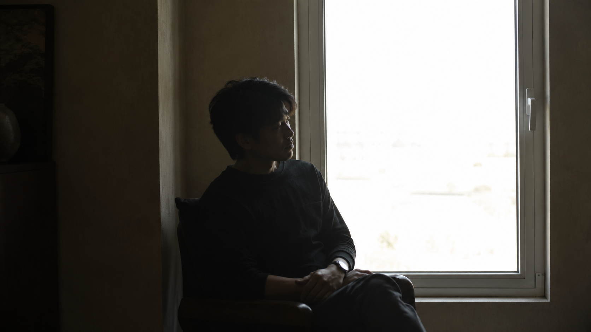
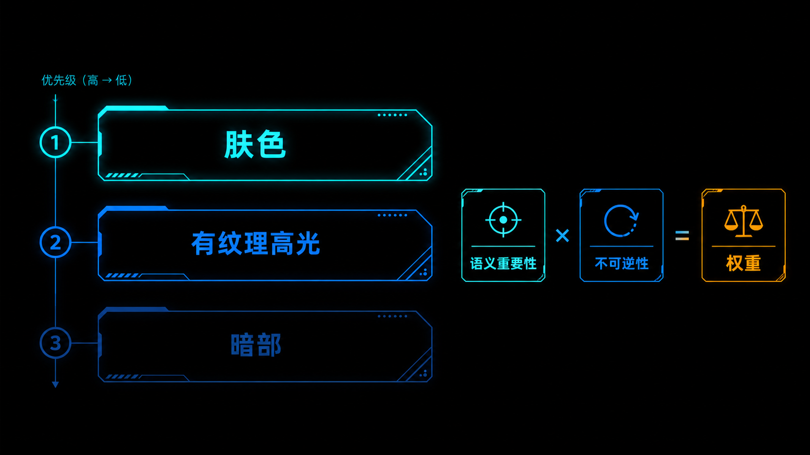
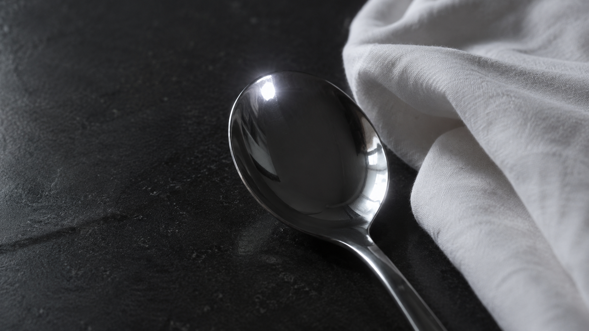
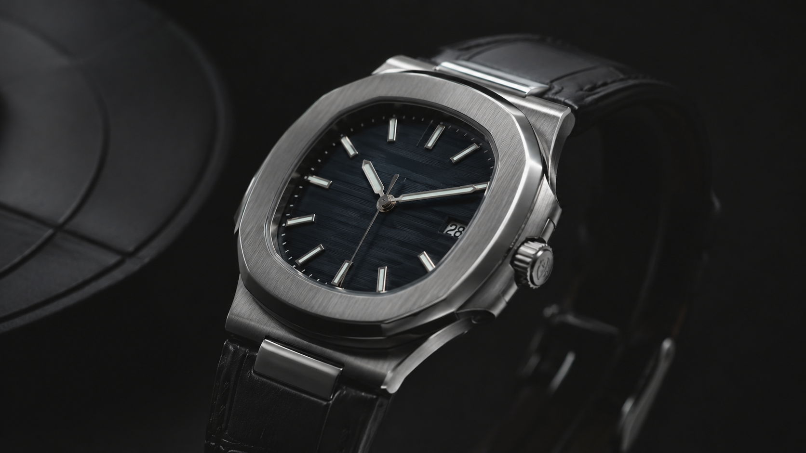

+++
title = "1-13 容错优先级：DR 不够时的「损失最小化」策略"
description = "动态范围装不下整个场景时，取舍不靠感觉——按「肤色 > 有纹理高光 > 暗部」的优先级，先放掉最救得回来的那部分。"
date = 2026-06-23
tags = ["摄影", "动态范围", "曝光", "高光", "暗部", "肤色", "损失最小化", "容错优先级"]
categories = ["摄影"]
series = ["主线"]
showTableOfContents = true
+++

> 动态范围装不下整个场景时，取舍不靠感觉——按「肤色 > 有纹理高光 > 暗部」的优先级，先放掉最救得回来的那部分。

在窗边给人拍张照，常会撞上这种尴尬：对着脸测光，窗外白成一片；保住窗外的云和光，脸又黑成剪影。你想两个都要，相机却只肯给你一个。

这不是你技术不行，也不是相机不够好，而是这个场景的明暗跨度超过了相机一张照片能稳住的范围。我们在 #1-9 区分过两个 DR：工程 DR（动态范围）是传感器物理上能记录的最大明暗比，可用 DR 才是真正「有细节、能看」的那一段——后者通常更窄。一旦场景的光比比可用 DR 还大，两端就必然有一端要被牺牲。

所以真正的问题不在「要不要取舍」，而在「取舍谁」。这一篇要做的，就是把这个决定从凭感觉，变成一条可以照着执行的优先级。

*图：窗边逆光，脸暗下去还是窗外白掉，大光比逼你二选一。哈苏 X2D + XCD 90mm，f/4 · 1/125 s · ISO 200*

## 取舍是一道损失最小化题

先说清楚为什么必须取舍。场景光比一旦超过可用 DR，相机这一张就装不下全部层次，硬塞的结果是某一端撞墙——要么高光白成一片，要么暗部黑成一团。这时候随手定一个曝光，等于把「牺牲谁」这件事交给了运气。

> 这有点像搬家时车厢装不下所有家具：你不会闭着眼睛随便扔，而是先扔那些既不贵重、又最容易再买回来的。

把这个直觉搬到照片上，每一块区域「该不该保」，由两件事相乘决定：

- **语义重要性**：观众的注意力会不会落在它身上。一张人像里，脸几乎是全部；天空只是背景。
- **不可逆性**：如果这次没拍好，后期还救不救得回来。

两者相乘得到这块区域的「权重」。权重最低的那一块——既不重要、又最容易补救——第一个被牺牲。这就是**损失最小化（loss minimization）**：不追求「全都要」，而是让这次取舍造成的总损失尽量小。

> 取舍不是认输，是主动把损失放在最不疼的地方。

## 三块区域，谁更救得回来

要排出优先级，得先知道每块区域的不可逆性到底差多少。我们在 #1-10 讲过，高光和暗部的「坏」在物理上根本不是一回事；这里把肤色也放进来一起排。

**暗部——通常更有回旋余地。** 暗部没拍够，信号多半是淹在噪声里，而不是彻底消失。后期把暗部往上提（shadow push），相当于事后做一次数字增益，细节还在，只是噪声被一起放大；再配合降噪，常常能挖回可用的层次。但这有前提：得是 RAW、暗部信号没完全跌破噪声底、ISO 也不太高。要是已经压成死黑、或者拍的是 JPEG、或者欠曝到信噪比太低，暗部一样救不回来——再提亮也只是提出一片噪点、条带和色偏。所以说暗部「好救」，是相对高光而言，不是无条件的。

**高光——撞顶就没了。** 当一个区域亮到撞上传感器的满阱容量（full well capacity），超过上限的亮度差异根本没被记录下来，传感器只会输出一个「到顶了」的最大值。这不是埋起来，是真的没了；后期再怎么拉，也只是从一片死白里硬猜。所以高光比暗部金贵得多。

**肤色——最不能碰。** 肤色的麻烦是双重的。一方面它脆：在经过白平衡的预览里，肤色高光常常是红通道最先逼近右端（RAW 层面到底哪个通道先饱和，还得看机身、光源和白平衡），而任一通道一爆，R:G:B 的比例就被破坏，软件只能猜，于是肤色要么发青发洋红，要么糊成一片没血色的纸片——#1-10 说的肤色崩坏就是这么来的。另一方面它重：人脸恰恰是观众第一眼盯着看的地方，别处怪一点没人注意，脸一旦不对，整张就废了。又脆又重，肤色的权重最高。

把三者排起来，默认的保护优先级就出来了：

> 肤色 > 有纹理的高光 > 暗部细节。

反过来读就是牺牲顺序：真到了装不下的时候，先放暗部（救得回），再放高光纹理，最后才轮到动肤色。

需要说在前头：这套优先级默认你拍的是 RAW。RAW 给高光留了约 0.5–1 档余量、给暗部留了可观的提亮空间；换成 JPEG，三块的回旋余地都会明显缩水，取舍只能更早、更狠。

*图：每块区域的权重 = 语义重要性 × 不可逆性，权重最低的先牺牲。*

拍的时候怎么看哪块先告急？别只盯着取景器的亮度感觉，打开直方图和高光警告（blinkies）来看。不过得拎清它们的身份：机内直方图和 blinkies 多数是基于 JPEG 预览算出来的，会被白平衡、Picture Style、对比度设置左右——它是个近似预警，不是 RAW 级的判决，可能误报也可能漏报。关键的片子别只信它，结合 RAW 回放、降一档对比度的预览、或后期里的 RAW clipping 检查再下结论。

还有一点别想当然：RGB 直方图只告诉你哪个通道贴了右壁，并不告诉你是画面哪一块爆的。红通道贴右，可能是红衣服、夕阳、暖色灯牌，未必是脸。拍人像时，得是红通道贴右、且高光警告恰好落在人脸受光区，才该当成肤色过曝来处理——那种情况确实比什么都优先。

## 不是所有高光都要保

上面说「高光金贵」，但这里有个常被误解的地方：高光也分两种，有一种该让它白，硬保反而出错。

想想这些场景：水面的波光、金属勺上的反光点、夜景里的路灯灯泡、人眼里的眼神光。这些点状的、刺眼的纯反光，你见过谁在现实里能「看清」灯泡的灯丝吗？人眼本来就预期它们是纯白的。

这类反光叫**镜面高光（specular highlight）**：它是光源在光滑表面上的直接镜像，本身没有「表面纹理」可言。和它相对的是**有纹理的高光**——云的层次、婚纱的褶皱、白墙的肌理、人脸受光那一侧的皮肤；它们来自漫反射（diffuse），亮，但带着结构和细节。

要守的，主要是后者。小面积、不承担主体的镜面高光，让它干干净净地白掉，画面反而更自然、更有光感；为了救一个灯泡的「细节」去压暗整张照片，纯属本末倒置。

不过「镜面高光就能放」也不是铁律。拍产品、珠宝、汽车、玻璃器皿时，镜面高光的形状、以及那条从亮到暗的过渡，本身就是材质和轮廓的表达——这时它不再是可有可无的反光点，而是卖点，得保住它的边缘和过渡，不能让它糊成一坨死白。

> 看到高光别急着保，也别急着放，先问一句：这块高光里有没有内容、是不是主体的一部分？有纹理、是卖点就守，纯反光点又不碍事就放。

*图：金属勺上的反光点爆成纯白毫无违和，旁边白布的褶皱纹理却要留住。哈苏 X2D + XCD 90mm，f/8 · 1/200 s · ISO 100*

## 换个题材，权重就得重排

前面那条「肤色 > 有纹理高光 > 暗部」，是以人像和日常拍摄为默认的。题材一换，权重表就得跟着改。

**人像**：肤色一骑绝尘，其余都让路。哪怕背景高光溢出、暗部发死，只要脸是干净准确的，这张就站得住。不过保肤色不等于脸越亮越好——肤色高光别贴着右壁拍，宁可比理想亮度压低 0.3–0.7 EV 留一点余量，后期再提亮，也比贴右拍爆了去抢救稳得多。

**产品 / 静物，尤其金属、珠宝**：质感高光可能反超肤色的位置。一块手表的金属拉丝、一颗钻石的火彩，卖点就在那层高光的过渡里——这里的有纹理高光权重极高，宁可暗部死黑也要把它的层次留住。注意，说的还是有纹理的那部分；纯反光的高光点，该爆还是让它爆。

**风光**：画面里通常没有肤色，优先级整体上移。云、雪、水面波光这些有纹理高光往往排第一，前景的树林、岩石这些暗部排后面（反正救得回）。风光还有个好处是你常常有得选，不一定非在「牺牲暗部」和「HDR」之间二选一：上一片渐变 ND 压住天空、等一段反差更柔的光线、换个机位避开最刺眼的方向、甚至用手或物体局部遮挡太阳，都能先把光比压进可用 DR 里。实在压不下，再上多张合成——这条留到 #1-16 讲 HDR。

**纪实 / 抓拍**：还藏着一条优先级——速度。决定性瞬间稍纵即逝，这种时候容忍更糙的取舍是值得的：先拍到，再谈保住谁。

把四种题材并排看，迁移起来更省事：

| 题材 | 优先保 | 可牺牲 | 常见翻车点 |
| --- | --- | --- | --- |
| 人像 | 肤色（受光面、明度统一） | 背景高光、暗部 | 肤色贴右爆红通道、脸忽明忽暗 |
| 产品 / 珠宝 | 有纹理 + 承担卖点的镜面高光（材质、轮廓、过渡） | 暗部、背景 | 为压高光把质感压成死灰；镜面糊成死白 |
| 风光 | 有纹理高光（云、雪、水） | 前景暗部（可后期提） | 天空爆成纸片；为保暗部丢了高光层次 |
| 纪实 / 抓拍 | 抓到瞬间（速度优先） | 高光、暗部都可放宽 | 为追曝光错过决定性瞬间 |

*图：金属表壳的质感全在那层高光过渡里，宁让暗部死黑也要守住。哈苏 X2D + XCD 90mm，f/11 · 1/160 s · ISO 64*

不管哪种题材，有一点是共通的：取舍要在按下快门之前就定好。等回到电脑前才发现高光爆了，已经晚了——高光不可逆这件事，后期救不了。按快门前，可以走一条固定的判断流程：

1. **先认主体是谁**——它决定了这张里谁的权重最高；
2. **再看高光里有没有纹理**——有纹理要守，纯镜面反光点可以放；
3. **再看高光警告落在哪**——落在主体或肤色上最该紧张，落在镜面反光点上基本可以无视；
4. **最后才定动作**——加减曝光补偿、转手动曝光、还是干脆包围曝光多拍几张保底。

至于「定动作」那一步具体怎么走——是向右曝光把暗部抬离噪声，还是压一点保住高光，还是死守肤色——那是三条更细的曝光策略（ETTR / 保肤色 / 保高光），各有触发条件和翻车方式，留到 #1-14 专门拆。这一篇你先把「谁比谁重要」这把尺子刻进脑子就够了。

## 拍摄行动点

挑一个就能上手，今天就能练：

1. **看清谁先爆。** 找个大光比场景（窗边逆光最方便），打开高光警告。先让相机自动曝光拍一张，看哪里在闪；再按「先保肤色、再保有纹理高光」的顺序补偿曝光重拍一张，对比两张各废了哪、保住了哪。
2. **体会镜面高光可以放。** 对着一个有镜面反光的物体拍——金属勺、玻璃杯、水面都行。故意让那个最亮的反光点爆成纯白，回看一下，你会发现它一点都不碍眼。
3. **亲手验证高光不可逆。** 同一个大光比场景拍两版：一版压到保高光（整体偏暗）、一版抬到保暗部（高光爆掉）。回去在后期里分别去救另一端——你会很直观地感到，欠曝那版的暗部能拉回来，过曝那版的高光是真拉不回来。这一次对比，胜过看十遍理论。

## 写在最后

读到这里，你对「曝光取舍」的理解应该换了个样：以前遇到大光比，要么纠结「两个都想要」，要么凭感觉随手定一个；现在你手里有了一把尺子——按语义重要性和不可逆性给区域排权重，肤色 > 有纹理高光 > 暗部是默认序，换题材就重排，镜面高光随时可以放。取舍从此是个有依据的主动决定，而不是事后才发现的遗憾。

但「知道谁重要」还只是判断，真按快门时你得有可执行的动作。下一篇 #1-14，我们就把这条优先级落成三套具体的曝光策略：ETTR、保肤色、保高光——每套优化的是什么、什么时候该用、什么时候反而会坑你。

## 参考资料 / 推荐阅读

- 前置篇目：#1-9（动态范围两口径：工程 DR vs 可用 DR）、#1-10（高光为何更不可逆）、#1-12（中间调锚定）
- Ansel Adams, *The Negative* —— Zone System 关于「哪个区域放在哪一档」的原始论述
- 后续篇目：#1-14（三大曝光策略）、#1-16（HDR 与多张合成）、#1-17（曝光复盘模板）
