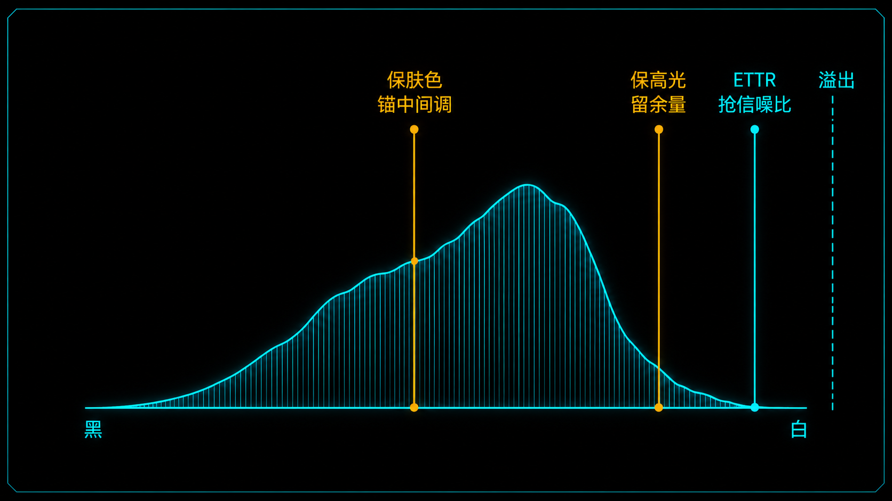
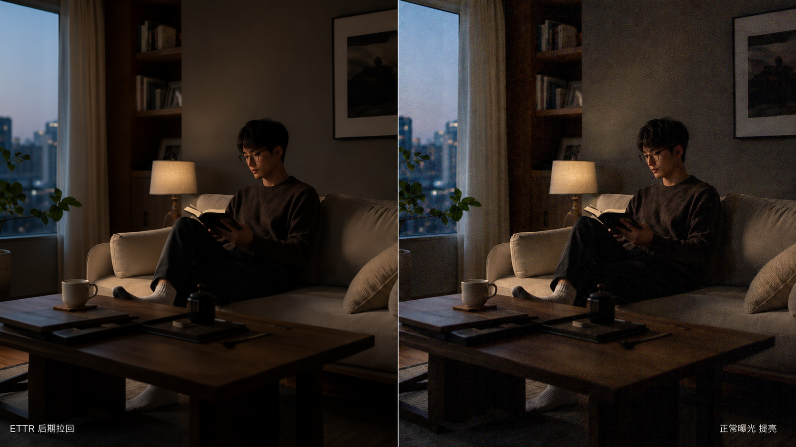
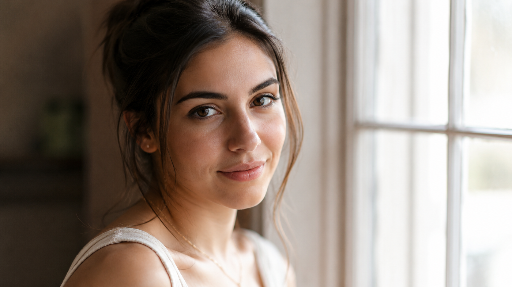
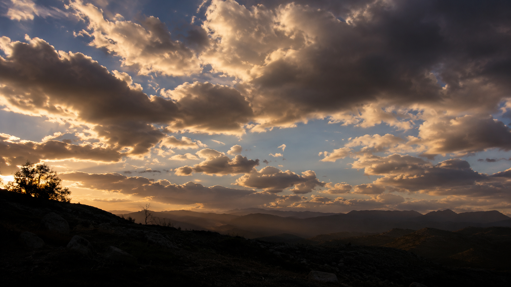
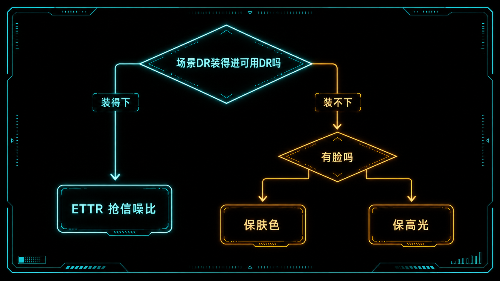

+++
title = "1-14 三大曝光策略：ETTR / 保肤色 / 保高光"
description = "同一个曝光决定，可以为三个完全不同的目标服务——信噪比、肤色、高光质感。先选目标，再定落点。"
date = 2026-06-27
tags = ["摄影", "曝光", "ETTR", "向右曝光", "保肤色", "保高光", "信噪比", "动态范围"]
categories = ["摄影"]
series = ["主线"]
showTableOfContents = true
+++

> 同一个曝光决定，可以为三个完全不同的目标服务——信噪比、肤色、高光质感。先选目标，再定落点。

傍晚的窗边，你举起相机想拍坐在沙发上的人。这时候凑过来三个老法师，给了你三句完全打架的建议：第一个说「往右拍，拍亮点，暗部干净」；第二个说「别管别的，对着脸测光就行」；第三个说「千万别过，先保住窗外的天」。三个人都不算错，但你只能按一个快门。

问题出在哪？不是谁对谁错，而是他们各自在优化不同的东西。我们在 #1-13 聊过，当场景的明暗跨度超出相机能记录的范围时，曝光就是一道「先牺牲谁」的取舍题。而这一篇要把那道取舍题，落成三套你按快门前就能选定的具体策略。

理解它们的钥匙只有一句话：**曝光落在哪，取决于你这一张到底想优化什么。** 把这三套策略当成三个不同的「优化目标」——ETTR 优化的是整张照片的信噪比，保肤色优化的是画面里最重要的那个人，保高光优化的是高光区域的质感。目标不同，直方图该往哪儿放就不同。

*图：同一张直方图，三个落点。ETTR 贴右缘抢信噪比，保肤色锚中间调，保高光在右缘留一段余量*

下面挨个拆。

## ETTR：把光抢满，优化信噪比

先说第一个老法师的「往右拍」。它有个正经名字，叫 **ETTR（Expose To The Right，向右曝光）**：在不让重要高光溢出的前提下，把整个直方图尽量往右推，让画面比「看起来正常」更亮一些，回到电脑上再用后期把亮度拉回来。

听起来像是脱裤子放屁——拍亮了又调暗，图什么？图的是干净。

打个比方：传感器收集光线，像拿桶在雨里接水。光子是雨点，落进桶里的是信号；而传感器自己还有一层底噪，像桶壁上本来就沾着的泥沙。如果你只接了小半桶水（曝光不足），水里那点泥沙占比就很扎眼；要是接满一整桶，同样多的泥沙就被稀释得几乎看不见了。向右曝光，就是趁高光还没溢出，尽量把桶接满。

落到信号上：照片的信号正比于收到的光子数 N，而光子本身的涨落噪声正比于 √N，于是信噪比也正比于 √N——光收得越多，画面越干净。这正是我们在 #1-9 说的「把暗部抬离噪声地板」：与其事后从噪声里抢暗部，不如拍的时候就让暗部多吃一档光。

这里要先把「重要高光」这个边界说清。ETTR 推到哪儿为止，不看任何一个亮点，只看那些**有纹理、不能丢的高光**——镜面反光、灯珠这种本就该白的，爆了无所谓（#1-13 讲过这个区分）。红线画在有纹理的高光上，不是直方图右墙上随便哪根刺。

ETTR 也不是随便用的，它有几个前提，缺一个就要打折扣：

- **必须拍 RAW。** #1-7 讲过，RAW 是没做完渲染的原始数据，机内直方图和高光警告多半基于 JPEG 预览，通常比 RAW 的真实溢出点保守一些——但保守多少因机型、白平衡、Picture Style 而异，不是一个固定数；更要命的是，亮度直方图可能藏住某个单通道的溢出。所以「还能不能再往右」别只信那根亮度直方图，要看 RGB 三通道、开斑马线，拿不准就包围曝光，平时再用 RawDigger / FastRawViewer 这类工具校准一下自己这台机器的真实余量。JPEG 是已经定妆的成品，拉回亮度就是糟蹋画质——它根本没有 ETTR 的空间。
- **场景的明暗跨度，决定你能往右推多远。** ETTR 的右边界永远卡在「重要高光别爆」上。低反差场景，这条边界离直方图右墙还远，你能整体大幅右移，白捡一份信噪比；高反差场景，重要高光很快顶到边界，能右移的空间被压缩——这时该把边界设多保守，就过渡到了后面要讲的「保高光」。
- **先靠光圈、快门、补光多收光，ISO 是最后一招。** 真正让画面干净的是多收光子——开大光圈、放慢快门、补一盏灯，把更多光打到传感器上。ISO 不是进光量，只是信号读出后的增益（#1-8 讲过）。所以优先用光圈 / 快门 / 补光把曝光做足、ISO 压到尽量低；这些都到顶了，再去抬 ISO——在一些机型上适当抬 ISO 还能压住读噪，但那是退而求其次，不是首选。
- **你有时间，且暗部干净比省后期更重要。** ETTR 必然要后期回拉，是一套「拍摄端多花心思、后期多一步」的打法。

> ETTR 的本质：用「拍得偏亮 + 后期拉回」换一张更干净的底片。成片不该是偏亮的，偏亮只是中间状态。

什么时候别用？三种情况：拍 JPEG（没余量）；抓拍、扫街这种没时间盯直方图的场合（#1-13 说的纪实抢拍，可用率优先于极致画质）；以及推过头——一旦重要高光溢出，那部分细节就是 #1-10 说的「撞到满阱被削平」，再也救不回来，这是 ETTR 最典型的翻车：**blown highlights（高光溢出）**。

*图：同一暗光场景左右对比——左为 ETTR 拍亮后期拉回（暗部干净），右为正常曝光后期提亮（暗部噪点明显）。哈苏 X2D + XCD 55mm，f/2.8 · 1/60 s · ISO 200*

小结：ETTR 优化的是全画面信噪比，靠的是趁重要高光没爆把光抢满；它的命门是 RAW 和那条高光红线。

## 保肤色：锚住那张脸，优化语义主体

第二个老法师说「对着脸测光」，优化的是另一样东西——画面里语义上最重要的那个主体，通常就是人脸。

为什么人像要单独拎出来？因为观众的眼睛是有偏向的。一张人像里，背景过曝半档、暗角噪一点，多数人根本不在意；可一旦脸色发灰、发脏、忽明忽暗，整张照片立刻就废了。肤色是 #1-13 里那张「语义重要性 × 不可逆性」权重表上排第一的东西。

所以这套策略不是去优化整个画面，而是先把脸这个「主角」的站位钉死，让其余亮度围着它排。这正是我们在 #1-12 建立的中间调锚定：用点测光对准受光那侧的脸颊或额头，加一点正向曝光补偿，把肤色推到它该在的 Zone，再用 AE-L 锁住曝光重新构图。脸落在哪一档定下了，画面其余部分的明暗就随之 fall。

不过肤色落哪一档，不是一个死数。多数肤色比 18% 中灰亮，落在 Zone VI 上下，但具体加多少补偿，得看肤色深浅——浅肤色大约 +1 到 +1.5 EV，东亚中等肤色约 +0.7 到 +1 EV，深肤色可能接近 0 甚至略低，最终以「脸部高光不爆、肤色不发灰」为准，而不是背一个固定数。测光点也要落在脸颊、额头这种漫反射区，避开鼻梁反光、额头油光那种局部镜面高光——那些点偏亮，会把读数带歪。

这么做最大的好处是**一致性**：一组人像，每张都把脸锚在同一个 Zone，肤色明度就齐了，后期调色一套参数走到底，成片像出自同一只手。这是半职业和「碰运气」的分水岭。

*图：窗边半身人像，点测受光侧脸颊把肤色锚在 Zone VI，窗户轻微过曝可接受。尼康 Z6 III + Z 85mm，f/2 · 1/200 s · ISO 400*

什么时候会翻车？两种。一是为了「保险」一味往暗里拍，肤色掉到该在的 Zone 以下，出来就是 **muddy skin（肤色发灰发脏）**——肤色一旦欠曝再后期提亮，红通道里的噪声和断层全冒出来了。二是脑子里还惦记着 ETTR，把整体往右推，结果脸是亮了，背景的窗户却整片爆掉——这时候你已经不是在保肤色，而是两套目标打架，谁都没顾上。

小结：保肤色优化的是语义主体，靠的是把肤色锚在该在的 Zone、其余 fall；它换来的是整组照片的肤色一致。

## 保高光：留住右缘，优化质感

第三个老法师喊「别过，保住天」，优化的是高光区域的质感。

它的场景是高反差：逆光的人像、有云的天空、白色的婚纱、金属反光的产品。这些场景里，最贵的信息恰恰藏在最亮的地方——云的层次、婚纱的纹理、发丝边缘的光。一旦这些高光撞到天花板被削平，就成了 #1-10 说的「纸片化死白」，再也找不回来。

打个比方：往一个杯子倒水，倒到快满时你会本能地留一指空隙，怕它溢出来弄湿桌子。保高光就是这个「留一指空隙」——主动把曝光压低一点，给最亮的、**有纹理的**那块高光留一道安全余量，让它稳稳卡在溢出红线的下方。

这里有个关键区分，来自 #1-13：不是所有高光都要保。

- **可以放掉的**：太阳本体、灯泡灯珠、金属或水面上的小反光点——这些是镜面高光，人眼本来就预期它们是纯白的，让它们白掉没人会觉得不对。
- **必须保住的**：云层、婚纱、白墙的肌理、受光的脸——那里有纹理，削平了就肉疼。

判断哪个通道贴边，靠 blinkies（高光闪烁警告）和 RGB 直方图。一个常用的经验：拍人时重点盯红通道有没有过饱和，拍蓝天时重点盯蓝通道——但这只是经验，到底哪个通道先顶到墙，取决于光源光谱、白平衡和被摄物的颜色，实拍要以 RGB 三个通道里哪个先贴边为准，别只看那根亮度直方图（#1-6 讲过通道先爆的判读）。按快门前就把这条线定死，不指望后期。

保高光还有一个绕不开的场景：**拍 JPEG 时它几乎是唯一选择。** JPEG 没有 RAW 那点余量可救（#1-7），高光一旦在机内爆了就是真没了，所以拍 JPEG 必须在按下快门前就把高光保住。

*图：午后逆光，压低曝光让天空云层保住完整层次，前景山体接近剪影。哈苏 X2D + XCD 38mm，f/8 · 1/500 s · ISO 64*

代价也很直接。你为了保右缘把整体压暗了，暗部就压得更低，后期再 push 提亮，#1-9 说的那条代价函数就生效了——暗部噪声被一起放大，于是出现这套策略的典型翻车：**noisy shadows（暗部噪声泛滥）**。所以保高光也不能压过头：压到刚好护住有纹理的高光就收手，多压一档，换来的全是暗部的噪点。

什么时候别用？低反差的场景——阴天、雾天、柔光棚里，高光本来离溢出还远，你再特意去「保」它就是多此一举，平白把暗部拖噪。

小结：保高光优化的是高光质感，靠的是给右缘留一道安全余量、只保有纹理的那部分；它的账单记在暗部的噪声上。

## 那到底听谁的：三套策略怎么选

三个老法师的话，现在能翻译成三个优化目标了。但真站在窗边，到底按哪一套？

先把一个更底层的共性挑明：**这三套其实是同一条原则的三个版本——先圈定这一张里「绝不能牺牲」的东西，再在那条红线之内尽量多吃光。** 区别只在红线画哪儿：

- ETTR 的红线是「重要高光别爆」，在红线内能推多远推多远，换全局信噪比；
- 保高光是把红线设得更保守，给有纹理的高光多留一道安全余量，宁可暗部噪一点也不赌它溢出——所以它不是 ETTR 的反方向，而是同一方向上更紧的那一档；
- 保肤色才是真正换了锚点的那个：它不盯右缘，而是锚定在中间调的那张脸上，让两端自己 fall。

想清楚这层，选起来就是两问：

**第一问：场景的明暗跨度，装得进相机的可用 DR 吗？** 装得下——皆大欢喜，红线离右墙远，整个直方图能放心往右挪，那就大胆 ETTR，白捡一份干净。装不下——你没法两头都要，红线很快顶住，曝光就退化成 #1-13 那道「先牺牲谁」的取舍，进入第二问。

**第二问：这张画面里，谁的权重最高？** 有人、且人是主体——保肤色，先把脸钉死，背景和高光按优先级往后排。没人、但高光里有命根子般的质感（风光的天、产品的反光面）——保高光，把红线设保守点，先护住右缘，暗部噪一点认了。

> 一句话决策：装得下就 ETTR 抢信噪比；装不下，有脸保肤色、没脸保高光。

*图：先问场景装不装得进可用 DR，装得下走 ETTR；装不下再问有没有脸，分流到保肤色或保高光*

回到开头的窗边人像：如果窗外天空和室内人脸的反差不大、屋里光线柔和——ETTR，往右拍，回头暗部干净又好调。如果是大晴天的逆光，窗外白花花、屋里暗沉沉，反差远超相机一张能装下的范围——那就别幻想「全都要」了：人是主体，保肤色，把脸锚在 Zone VI，让窗户爆掉（反正那是镜面般的强光，本就该白）；除非你这张就是要拍窗外的云，那才切到保高光、让脸沉进剪影。

至于反差大到三套都救不了的硬骨头——比如日落时分既要地景细节又要太阳周围的火烧云——那是单张曝光的物理极限，得靠多张合成来破，那是 #1-16 的题目了。

小结：三套策略不是三选一的信仰，而是同一条「先定红线、再尽量多吃光」原则下，由「装不装得下 + 谁权重最高」决定的三个落点。

## 拍摄行动点

挑一个窗边或逆光的高反差场景，找个朋友坐在窗前，按下面三步走一遍，亲手把这三套策略拍出来：

1. **拍一组 ETTR：** 换一个低反差的柔光角度（比如背对窗、用窗光当柔光），盯着 RGB 直方图把曝光往右推到快贴右墙但 blinkies 不闪，拍 RAW。回家在后期里把曝光往下拉回正常，放大暗部，对比一张「正常曝光」的暗部噪声——感受 ETTR 换来的干净。
2. **拍一组保肤色：** 回到逆光机位，点测受光侧的脸颊，按肤色加补偿——浅肤约 +1 到 +1.5 EV、中等肤色约 +0.7 到 +1 EV、深肤色接近 0 甚至略低，把肤色推到该在的位置，AE-L 锁定后重新构图连拍三张。检查这三张的脸是不是一样亮——这就是批次一致性。
3. **拍一组保高光：** 同一个逆光机位，这次对着窗外最亮、还带云层纹理的那块测光，压到 blinkies 刚好不闪、RGB 三通道都没贴墙。回看暗部——脸大概率沉成了剪影。这时你就真切体会到：保高光的账，是记在暗部头上的。

三组拍完并排一看，你会比读十遍定义都更明白：它们优化的根本不是同一样东西。

## 写在最后

读这篇之前，「曝光」在你脑子里可能还是一个模糊的「拍得准不准」。读完之后，希望它变成一个更清楚的两步：先圈定这一张里绝不能牺牲的东西，再问自己想优化什么——信噪比、肤色，还是高光质感。红线画在哪、直方图该往哪儿放，几乎就自动浮现了——三个老法师的话也就不再打架，而是各有各的适用场景。

不过我们一直绕着一个词没细讲：高光「撞顶」到底是怎么个撞法？是啪一下硬切，还是有个圆滑的过渡？这段从正常曝光滑向纯白的曲线——它的斜率，恰恰决定了一张照片的高光看起来「贵不贵」。下一篇 #1-15，我们就来拆这条 Roll-off 高光滚降曲线。

## 参考资料

- Ansel Adams，《The Negative》——Zone System 与「曝光定暗部、显影定高光」的原始论述
- ETTR 与信噪比、向右曝光的边界，可参考 Wikipedia「Exposing to the right」「Shot noise」，以及 PhotonsToPhotos / DxOMark 的传感器动态范围、读噪测试方法
- 本系列前置：#1-7（RAW vs JPEG）、#1-9（DR 两口径）、#1-10（高光为何不可逆）、#1-12（中间调锚定）、#1-13（容错优先级）
