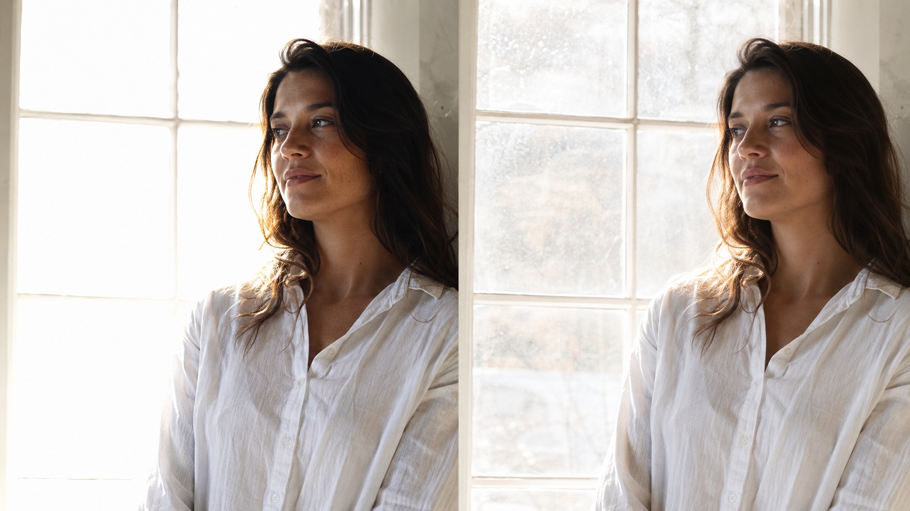
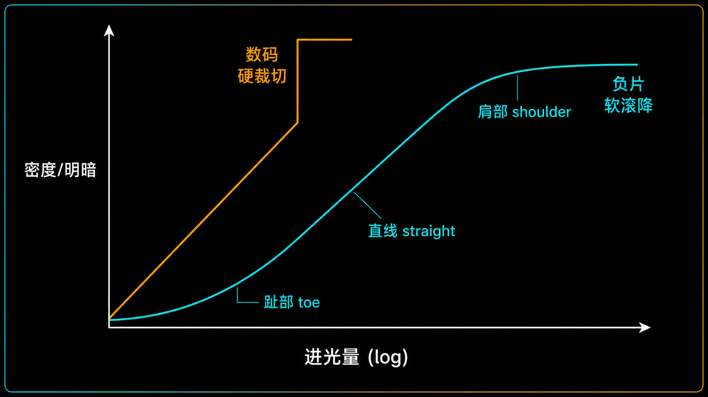
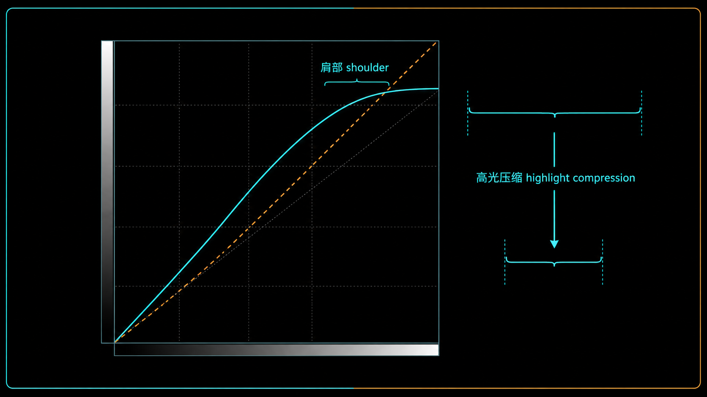
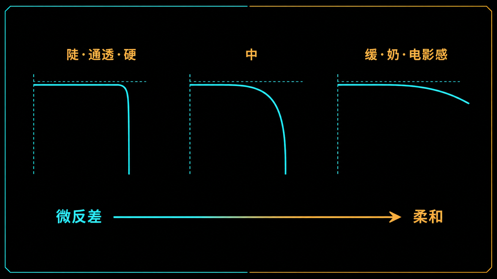

+++
title = "1-15 Roll-off 与肩部：高光过渡如何决定「贵不贵」"
description = "「高级感」不是玄学——高光从正常亮度滑向纯白的那段过渡曲线长什么样，是照片「贵不贵」里一个能说清、也能上手调的物理来源。"
date = 2026-07-03
tags = ["摄影", "Roll-off", "高光滚降", "特性曲线", "高光压缩", "色调曲线", "动态范围", "后期"]
categories = ["摄影"]
series = ["主线"]
showTableOfContents = true
+++

> 「高级感」不是玄学——高光从正常亮度滑向纯白的那段过渡曲线长什么样，是照片「贵不贵」里一个能说清、也能上手调的物理来源。

## 从「死白」说起

随手拍一张逆光下的白衬衫，或者阴天窗边的一团云，你大概率会撞上同一个扫兴的瞬间：画面里最亮的地方，白得特别「硬」——像有人拿橡皮把那一块直接擦成了纯白，边缘一刀切下去，中间一点起伏都不剩，活像贴了张剪纸上去。

可你在电影截图里、在别人用胶片或那些「很贵」的机器拍的照片里，看到的白不是这样。它是慢慢亮上去的：从受光的脸颊到最亮的额头，从云的中心到边缘，白里还透着层次和一点「空气」，你甚至说不清到底哪一处才算纯白。

同一个白，为什么差这么多？很多人把这种差别记成「高级感」「电影感」——听着玄，其实说了等于没说。真正在起作用的，是高光从正常亮度滑向纯白的那一小段过渡长什么样。这段过渡的曲线形状有个专门的名字：**Roll-off（高光滚降）**。这篇就来把它拆开——为什么它是一张照片「贵不贵」里最容易被忽略的一环，以及在拍摄端和后期端，你分别能拿它怎么办。

*图：同一件逆光白衬衫，左边高光被硬裁成一片死白，右边高光柔和滚降、保住了布料肌理与渐变*

## 到顶的两种方式：撞墙，还是上坡

先问一个更基本的问题：为什么数码直出的白，那么容易「硬」？

我们在 #1-9 聊过，传感器每个像素就像一个装电荷的小桶，桶的容量叫满阱容量，光子越多、桶里的水位越高；#1-10 接着说过，桶一满，再多的光子也装不下，超过上限的亮度差异不是被「藏起来」，而是当场消失、被削平成同一个纯白，而且不可逆。把这件事画成一条「进多少光 → 出多少亮」的曲线，数码的样子就是：一路笔直往上爬，爬到满阱那一刻，啪，垂直断掉。

> 数码传感器到顶的方式，像上楼梯一步跨到最高层、然后一脚踏空——之前每一级都清清楚楚，最后一步直接没了。

负片不是这么到顶的。以彩色负片为代表，乳剂里的卤化银颗粒越接近饱和就越「钝」：已经曝了很多光的地方，要让它再明显变亮一点，得喂进去多得多的光。于是它的响应在接近纯白之前会自己慢下来、拐个弯——不是撞墙，是上坡到顶前坡度越来越缓，最后几乎贴平。这段「越来越缓的坡」，就是我们要讲的主角。（反转片也有自己的特性曲线，但高光容错小得多，曝光上更接近后面要讲的「保高光」逻辑，不能照负片的宽松来套。）

把整条响应曲线画全，摄影里管它叫**特性曲线（characteristic curve）**：横轴是进光量的对数（log exposure）。纵轴严格说不是画面亮度，而是显影后底片的**光学密度（density）**——密度越高、底片越黑，翻成正片或照片后那一块就越亮；本文为了讲清最终观感，下面把它简化成「输入亮度 → 输出明暗」的映射来看。经典负片的特性曲线是一条 S 形，分三段——趾部（toe）是最暗的一端，曲线从零缓缓抬起，对应暗部；直线段（straight-line）是中间调，进光和输出大体成正比，反差最「正」；肩部（shoulder）是高光的一端，曲线斜率逐渐变缓、拐向水平。

轮到数码，还要多提一句：一张数码照片最终的明暗响应，其实是两段拼起来的——传感器那条几乎笔直的**捕获响应**，加上出片时套上去的一条**渲染曲线**。别把传感器、机内 JPEG、胶片扫描的结果混成同一条线；这篇关心的，正是这条组合曲线在**高光那一端**（肩部）被塑成什么形状。

Roll-off 说的就是**肩部这段的斜率**——高光滑向纯白时，坡有多缓、拐得多自然。数码传感器的捕获响应几乎没有这个肩：一条直线怼到满阱，然后一堵垂直墙。你现在看相机直出 JPEG 的高光没那么惨烈，靠的正是刚说的那条渲染曲线——机内 tone curve 已经偷偷替你加了一段模拟肩部；要是把线性数据直接出图，高光会硬得没法看。

*图：特性曲线的三段——趾部/直线/肩部；负片在高光端有天然的肩，数码则是直线撞上垂直墙*

一句话收束这节：数码的捕获响应天生「撞墙」，负片天生带一段「上坡渐缓」的肩，Roll-off 就是那段坡的形状，它落在特性曲线的肩部——也落在数码那条渲染曲线的高光端。

## 拍摄端：塑形之前，先把「可塑的料」留住

知道了差别在肩部，很自然会想：那我拍的时候，能不能直接把好的 roll-off 拍进去？

能，也不能，分两头说。**曝光本身改不了 RAW 传感器那条线性捕获响应**——不管你怎么加减曝光，它到满阱都是垂直断掉，你没法靠拧参数在 RAW 上拧出一段胶片肩。但「拍摄端」不只有 RAW：机内 JPEG、相机的胶片模拟、拍视频用的 Log/HLG 配置文件，都是在出片那一刻套一条 tone curve，替你在**输出端**塑了个肩。所以更准确的说法是——**塑形可以发生在机内，也可以留到后期，但有一条铁律两头通用：先别把有纹理的高光顶到 clip。**

为什么这条是铁律？因为不管机内还是后期，曲线能塑的都只是「还有数据的那段过渡区」。一旦云、婚纱、受光的皮肤这些有纹理的高光撞了满阱、被削平成纯白（#1-10），那段过渡连同它的数据一起消失了——再高级的 tone curve 也无料可塑。

> Roll-off 是过渡塑形，不是高光恢复。撞死的白救不回来，这是 #1-10 反复强调过的物理事实，也是本篇一切操作的前提。

所以拍摄端最要紧的任务是「留料」，两个手段。一是压光比：高反差的场景——正午顶光、逆光、大光比窗光——本身就把高光死死推到天花板，用反光板给暗部补一点、等一朵云把硬光打散、或者换个受光柔和的角度，把场景光比压下来，高光离满阱远一点，可塑的过渡区自然就宽了（怎么系统地治理光比是模块 2 光照设计的活，这里只点到）。二是给高光留余量：这正是 #1-14 讲过的保高光策略——面对高反差场景，主动压一点曝光，把画面里最亮的**有纹理**高光卡在临界点下方，别让它贴顶。拍 RAW 的前提下（#1-7），高反差场景常用 -0.3 到 -1 档来保住高光纹理，代价是暗部更暗、后期提亮时更噪，这正是 #1-13 里那道「先牺牲谁」的取舍。这里还有个坑：机内直方图和斑马纹通常基于 JPEG 预览，比 RAW 的实际余量保守约半档到一档（#1-6 提过），所以严肃保高光时盯 RGB 直方图、看哪个通道先爆、给右缘留一点余量，光比实在太大就直接包围曝光兜底。

这里有个关键区分，别一刀切地想保住所有高光：水面的反光点、金属的高光、画面里的灯——这些是镜面高光（specular highlight），人眼本来就预期它们是纯白的，让它们白掉没关系（#1-13）。真正要拼命保住的，是有纹理的高光：云、婚纱、白墙的肌理、受光的皮肤。

*图：逆光人像，受光的皮肤与背景的云都稳在临界点下方，最亮处仍有纹理，没有一块被推成死白*

一句话收束这节：不管塑形放在机内还是后期，前提都一样——先把有纹理的高光稳在临界点之下，#1-14 保出来的那段高光余量，就是下一步能塑成柔和滚降的原料。

## 后期端：造肩、压缩，与「柔和还是通透」的权衡

料留住了，最精细的塑形往往放在后期。我们在 #1-11 说过，数字时代胶片「曝光定暗部、显影定高光」里显影那一半，交给了后期的曲线——造 roll-off，就是这一步的核心动作之一。

怎么造？想象把最亮那一段亮度像手风琴一样「压扁」，塞进一个更小的输出范围里。

> 硬裁切是让高光一脚踏空；后期造肩，是在悬崖边上修一段下坡的缓坡，让高光顺着坡滑下去，而不是直接掉下去。

落到工具上，几件事其实在协作。最直观的是 **Tone Curve（色调曲线）**：在接近高光的那一段**降低斜率**、让它平缓地拐弯——注意是「压斜率」，不是简单把右上角的白点端点整个拉低；后者会让本该透亮的地方发灰、发闷、起雾，那不是滚降，是把整体压暗了。Lightroom、Capture One 里的 **Highlights** 和 **Whites** 滑块则从另外两个角度影响亮部映射：Highlights 更偏把中高光往回压、给亮部让出腾挪空间，Whites 更偏定义白场和剪切边界——纯白点摆在哪、从哪里开始 clip。三者效果相关，但不是同一个操作，配合起来才是一次完整的「造肩」。这个动作有个准确的名字，叫**高光压缩（highlight compression）**：把顶部一段亮度（用 #1-11 的 Zone 语言说，大概是 Zone VIII 到 X 那一段）映射进更小的输出区间，用一段平缓斜率替代原来的垂直墙，过渡就从「啪」变成了「滑」。很多胶片模拟 LUT、所谓「电影感」预设，「贵」的秘密有一大半就是内建了一条调好的软肩（完整的曲线与 LUT 语言留给模块 5 色彩与曲线，这里只认它跟 roll-off 的关系）。

但天下没有免费的滚降。你把高光段压缩、斜率放缓，高光里的局部对比也会被一起压平——这就是那个绕不开的权衡：微反差（micro-contrast）对柔和度（softness）。云的层次、皮肤高光的细腻起伏，本来靠的就是高光区里那点明暗对比；肩部压得越狠、斜率越缓，这点对比被压得越平，画面就越「奶」、越柔、越有电影感，但也越「肉」、越不通透。反过来，肩部留得越陡，高光越锐利通透，可越陡就越接近硬裁切那种生硬。

所以这里没有一个「调到某个正确数值」的标准答案，只有按题材做的取舍：拍人像、婚纱、情绪片，往往要更柔的肩，让高光奶一点、贵一点；拍产品、建筑、要「脆」的商业硬照，就留更陡的过渡，宁可通透也不要肉。这跟 #1-13 里「换个题材就换一套优先级」是同一个道理。

*图：在接近高光处降低曲线斜率、压出一个渐缓的肩，顶部一段输入亮度被映射进更小的输出范围，即高光压缩*

一句话收束这节：后期造肩，是拿输出范围换过渡的平滑；换多少，取决于这张片子你要的是柔和高级，还是通透脆亮。

## 拍摄行动点

理解 roll-off，最快的方式是亲手把这段坡「掰」一遍。

1. **拍一张高反差的有纹理高光，回家复制成三份对比**：逆光的白衬衫、窗边的一团云都行，拍 RAW，用 -0.7 档左右把最亮处稳在直方图右缘之内、别贴顶。回家复制三份——A 保持默认；B 故意抬 Exposure 或 Whites 把高光推到剪切，看它「死」成什么样；C 用 Highlights 或曲线肩部把高光压缩回来。三张并排，你会直接看懂那句话：**有数据的高光能塑形，已经剪切的高光救不回来**。
2. **对同一张片做三档肩部**：在曲线工具里，把高光段分别拉成「陡（几乎不动）/ 中 / 很缓」三个版本，盯着云或皮肤高光的纹理，看它怎么随着肩部变缓而一点点变「奶」。这一步是让你亲眼确认微反差和柔和度在此消彼长。
3. **给自己定一个题材的默认肩**：挑一个你最常拍的题材（比如人像），试出一组自己满意的高光肩部处理，记下来，下次同题材直接从这个默认起步——这就是把「手感」变成可复用的流程。

*图：从陡到缓的三档肩部——越陡越通透越硬，越缓越「奶」越电影感，底部是微反差与柔和度的权衡轴*

## 收尾：白怎么收，决定照片的段位

读到这里，你对「高级感」这个词的认知应该换了个位置：那种让照片显得「贵」的高光质感，不是玄学，也不全靠器材，而是高光从正常区滑向纯白那段过渡曲线——Roll-off——的形状在起作用。硬裁切让白「撞」进纯白，读起来生硬、廉价、数码味；柔和的肩部让白「卷」进纯白，读起来柔和、耐看、有电影感。这段曲线，拍摄端负责用光比和曝光把料留住，后期端负责把料塑成你要的坡，中间横着微反差与柔和度此消彼长的那道权衡。

当然，roll-off 只是这块拼图里的一片，不是全部——一张照片「贵不贵」，还被光线质量、色彩关系、局部反差、构图和题材一起决定。它真正的价值在于：这一片你原来只能靠「感觉」去够，现在有了能说清、也能上手调的抓手。

不过 roll-off 有它的能力边界：它只能塑形「还装得进单张、还留着数据」的高光过渡。当场景本身的动态范围大到单张怎么曝光、怎么造肩都容不下——高光要么撞死、要么暗部埋进噪声——那就不是塑形能解决的了，得靠多张合成。那正是下一篇 #1-16 要讲的：HDR、包围曝光，以及「多张合成」到底该摆在整个曝光体系的什么位置。

## 参考资料 / 推荐阅读

- Kodak，《Basic Photographic Sensitometry Workbook》——特性曲线、density vs log exposure 的一手来源
- Ansel Adams，《The Negative》——曝光与显影分工、Zone 系统的经典源头
- Charles Poynton，《Digital Video and HDTV: Algorithms and Interfaces》——tone curve、gamma 与感知亮度的工程视角
- Adobe，《Lightroom Classic：调整图像色调与颜色》官方文档——Highlights / Whites / Tone Curve 各自的作用边界
- 本系列 #1-10（高光为何更「不可逆」）、#1-14（三大曝光策略）、模块 5（色彩与曲线：完整曲线 / LUT / film emulation）
