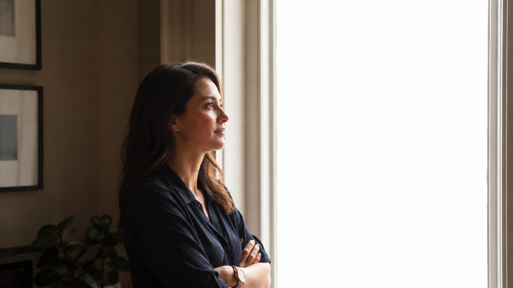
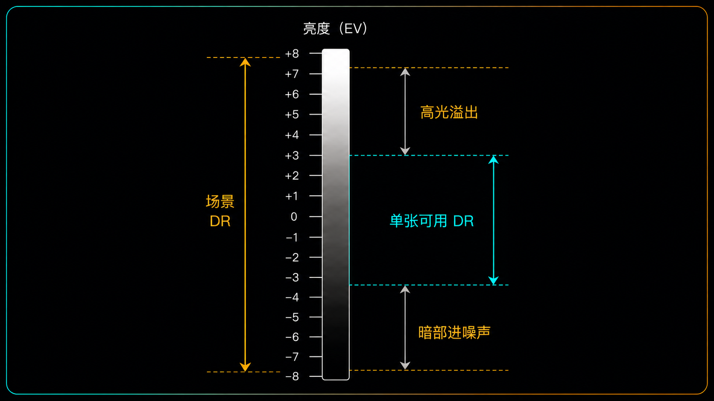
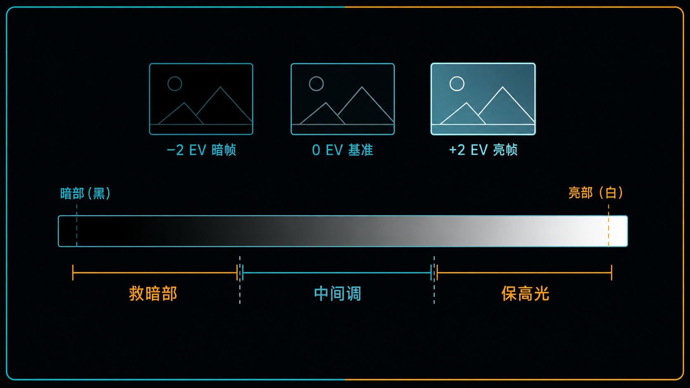
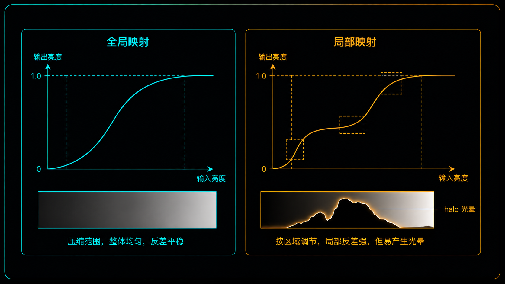
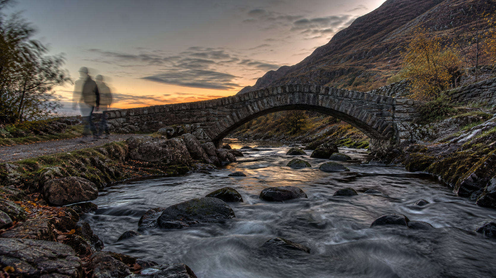

+++
title = "1-16 HDR、包围曝光与「多张合成」的位置"
description = "当一张照片装不下整个场景的明暗，多拍几张再合成不是作弊，而是给动态范围扩容——代价是鬼影，和一不小心就「假」。"
date = 2026-07-12
tags = ["摄影", "HDR", "包围曝光", "多张合成", "动态范围", "色调映射", "鬼影", "曝光融合"]
categories = ["摄影"]
series = ["主线"]
showTableOfContents = true
+++

> 当一张照片装不下整个场景的明暗，多拍几张再合成不是作弊，而是给动态范围扩容——代价是鬼影，和一不小心就「假」。

## 破题：有些场景，单张怎么曝都不对

站在窗边给朋友拍张照。对着脸测光，人是好看了，窗外的街景白成一片；对着窗外测光，街景有了，人却黑成一团剪影。你换了好几组参数，慢慢发现：不是某一组没调好——是这个画面里，最亮的窗户和最暗的人脸差得太远，一张照片同时装不下。

这几篇我们一直在「单张之内」想办法。#1-13 讲装不下时先牺牲谁（容错优先级），#1-14 讲往哪边曝（保肤色还是保高光），#1-15 讲高光过渡怎么塑形得柔和。这些招式都很有用，但它们有个共同前提：**场景的明暗跨度，勉强还在单张能装下的范围里，只是需要巧妙安排。** 可窗边这个场景不是「安排不好」，是「装不下」——两头都要，单张给不了。

这时候就得换一条路：不在一张里取舍，而是多拍几张、每张管一段明暗，再合成一张信息完整的图。这就是这一篇要讲的 HDR 与包围曝光。

不过「HDR」这个词现在被用得很宽，动手之前先划清本文的范围。它至少指三件不同的事：

- **捕获 HDR**：用不同曝光的多张包围拍摄，扩展能记录下来的动态范围——本文讲的就是这一种，也叫经典多曝光 HDR。
- **计算 HDR**：手机按一次快门，用固定或近似曝光的多帧即时合成（Google 的 HDR+ 就是固定曝光连拍，并不是曝光包围），属于计算摄影，机内那套算法另有讲究。
- **显示 HDR**：HDR 屏幕、以及带增益图的 HDR 文件（如 Ultra HDR JPEG），能显示超出普通屏幕白点的高光，是输出与显示环节的事。

三件事相关，走的却是不同路径。本文只谈第一种：你自己架好机器、拍一组不同曝光、再亲手合成。它有明确的触发条件，也有它的代价。

*图：对人脸曝光时，窗外只能白成一片——这不是没调好，是场景动态范围超出了单张的极限*

## 先分清：是「没用好 DR」，还是「DR 根本不够」

动手合成之前，得先确认你真的需要它。判断的标准只有一个：这是你没把有限的动态范围安排好，还是场景的动态范围本来就超出了单张的极限？

> 单张的可用动态范围，像一个固定容量的杯子。前面几篇教的是怎么把水（场景的亮度）在杯子里安排好、溢出来时先倒掉哪一部分。但如果面前是一整桶水，杯子再怎么安排也装不下——这时候要的不是更好的安排，是换个更大的容器。

回顾一下这个「杯子」有多大。我们在 #1-9 讲过，可用动态范围（Usable DR）本身就是按某个噪声阈值圈出来的：传感器能记录、且信噪比还在你能接受范围内的那段明暗跨度。现代全画幅相机拍 RAW，基准 ISO 下大概有十来档可用——但具体多少，要看机型、测试标准，还有你能忍受多少暗部噪声，没有一个铁打的数字。不管怎么算，日常大部分场景，包括不那么极端的阴天、室内，都能塞进这一段。

但有些场景的明暗跨度会冲到十几二十档：正午的强逆光、日出日落时对着光源、站在暗房间里拍明亮的窗外。这些场景的动态范围，实打实地超出了单张能装下的量。

*图：场景 DR 跨度远大于单张可用 DR 窗口，最亮端溢出、最暗端进噪声——两头同时留不住，才是真正的「装不下」*

怎么现场判断到底是哪种情况？别只盯着直方图两端——机内直方图是按 JPEG 预览算的，受相机的色彩风格、白平衡、曲线影响，和 RAW 的真实边界不是一回事；而且它显示的是亮度分布和有没有剪切，并不能告诉你暗部的信噪比够不够。更靠谱的判断分两步：先按保高光的原则拍一张，让最重要的高光不剪切；然后把这张 RAW 的阴影提到你想要的亮度，看看细节和噪声能不能接受。如果在高光不剪切的前提下，阴影救上来还是一片噪声、没法用，那才是单张 DR 真的不够。反过来，只要挪一下曝光落点、两端就都能兼顾，那就还是安排问题，用 #1-14 的单张策略解决，别急着上合成。

这里和 #1-13 的容错优先级接上了：容错优先级是「装不下时，在一张里止损，先牺牲权重最低的那块」。而合成，是**当止损的代价大到牺牲不起时的升级方案**——既要窗内人脸、又要窗外街景，两块语义权重都很高、谁都牺牲不起，单张的「牺牲谁」逻辑就失效了，这才轮到多张出场。

> 合成不是默认动作，是单张止损失败之后的升级。

## 怎么拍：包围曝光把一段 DR 拆成几趟搬

确认了单张装不下，接下来的问题是：多张到底怎么拍，才能把整个动态范围覆盖住？

> 一个人搬不动一整摞书，就分几趟搬。包围曝光（Bracketing）就是把一个单张装不下的动态范围分几「趟」记录：一张专门保高光，一张专门救暗部，中间再来一两张过渡。

具体做法：以你测好的基准曝光为中心，按固定的档位间隔，往暗和往亮各拍几张。这几张各自在干嘛，正好对应前面讲过的两种不可逆：

- **暗帧保高光。** #1-10 讲过，高光撞到满阱容量的天花板就被削平、救不回来。所以要有一张故意拍得暗，让最亮的窗户、天空还没撞顶，把高光的细节实打实记下来。
- **亮帧救暗部。** #1-9 讲过，暗部埋在噪声地板里，事后硬提亮会把噪声一起放大。与其后期硬拉，不如现场就拍一张亮的，让暗部实打实多收一些光。但这里有个关键：多收的光得来自更慢的快门（或更大的光圈），不能靠拉高 ISO——#1-8 说过，ISO 只是读出后的增益，并不会让传感器多接到一个光子。所以经典 HDR 包围的正确做法是**固定光圈和 ISO，只用快门去拉开这几张的曝光差**。

落到具体设置：用 M 档，或者 A 档配曝光补偿包围；拍 RAW，固定光圈、固定基准 ISO（关掉 Auto ISO）、锁住对焦和白平衡，让相机只改变快门速度。改光圈会连带改景深、暗角和成像，几张之间对不齐，合成更麻烦——所以能不动就别动。大多数相机有自动包围曝光（AEB，Auto Exposure Bracketing）：设好张数和间隔，按一次快门连拍一组，省得手动一张张调。

张数和间隔也不用死记「3 张 ±2 EV」。真正的标准是两个端点：最暗的一帧要让重要高光不剪切，最亮的一帧要让关键阴影的噪声降到能接受，中间再有一两张把两端接上就够。反差没那么大，3 张、±2 EV 足够；反差极大，才需要更多张或更大间隔。端点覆盖到了还继续加张，只会徒增运动风险和存储负担。

*图：−2 EV 暗帧保高光、0 EV 基准帧管中间调、+2 EV 亮帧救暗部，三段拼起来才覆盖住单张装不下的动态范围*

但包围曝光有个硬前提：**几张之间，画面要能对得上。** 最好上三脚架，让机位纹丝不动；实在没有，也要尽量稳住、靠连拍缩短几张之间的时间，好让后期能把它们对齐（Alignment）。对不齐，合成就是一团糊。

顺带分清几个容易混的「多张」：**曝光包围**改变曝光、扩的是动态范围（本文主角）；**对焦包围**改变对焦点、扩的是景深；这两个都算「包围」——围绕某个参数取不同值。而**同曝光多帧堆栈**（burst stacking / 多帧降噪）是同一套参数连拍多张叠加降噪，参数根本没变，严格说不叫包围。手机按一下出的「HDR」也多属于这类固定曝光的多帧计算路线，和你手动拍一组不同曝光再合成不是一回事。这一篇只谈为扩 DR 而拍的曝光包围。

还有个常被叫成 HDR、其实是特殊分支的场景：星空加地面。天空和地面的曝光时间往往差好几档，星星还在慢慢移动，实际做法通常是天地分开曝光再混合、或者星空单独堆栈，而不是标准的连续 AEB。它属于多张合成的另一支，本文这套包围流程不完全适用。

> 拍的时候，你要的不是一张「完美曝光」，是一组「各管一段」的曝光。

## 怎么合：merge 定底片，tone mapping 定成片

拍回来一组 RAW，怎么变成一张能看的照片？这一步分两段，两段各管一件事。

> 合成（Merge）像把几段不同音量的录音，拼成一条完整的音轨——信息全了，动态巨大。但你的音响能放的音量范围有限，得把这条大动态的音轨压进音响放得出来的范围。压的方式，决定了好不好听。

**第一步，HDR 合成（HDR Merge）。** 软件先把几帧对齐，再把它们融成一张高位深（比如 32-bit 浮点）的图。直觉上可以理解成暗帧贡献高光、亮帧贡献暗部、基准帧贡献中间调；但实际不是机械地按亮度切成三段，而是对每张里没有剪切、信噪比更高的像素做**加权融合**——越靠近某张「拍得正好」的区间，那张在那儿的权重越高。这一步扩的是「**记录下来**」的动态范围：现在这张图里，从最亮到最暗的层次都在了。

但这张高位深图还不能直接拿去用。如果你的输出目标是普通 SDR 屏幕、纸张、或传统的 SDR JPEG，它们能显示的动态范围有限，装不下全部明暗，就得把扩展出来的范围压回去。（如果用的是 HDR 显示器、配上支持增益图的 HDR 文件，能多留一部分超出普通白点的高光，但那也不是原样搬上去，仍要做一次显示映射。）至于有人打开原始 HDR 文件看到「灰蒙蒙一片」，那不是 HDR 数据本身的样子，而是软件还没做曝光解释和显示变换——换个正确的查看方式就正常了。

**第二步，色调映射（Tone Mapping）。** 把这张大动态的图，压回目标能显示的范围。压的方式有两条路，区别很大：

- **全局映射（Global Tone Mapping）：** 用一条统一的曲线，对整张图一视同仁地压缩。好处是保真、过渡自然，不容易出幺蛾子；代价是遇到超大反差时容易平淡——高光和暗部都被拉到中间来，整体对比被压扁，画面发闷。
- **局部映射（Local Tone Mapping）：** 按画面不同区域自适应地压。它能在压住整体大动态的同时，保住局部的对比——暗部的纹理、云层的层次都还在，信息量最大。

局部映射信息量大，听起来更好，但它正是「HDR 味」的来源。压过头会冒出两个典型问题：一是**光晕（Halo）**，在明暗交界处（比如山脊和天空之间）出现一圈不自然的亮边或暗边；二是全局对比被压平后，画面发灰、发脏，再配上拉高的饱和度，就成了那种一眼假的「塑料 HDR」。

*图：全局映射一条曲线压全图，保真但平淡；局部映射分区自适应，局部对比更足，但压过头就在明暗交界处冒出 halo 光晕*

顺带提一条不太一样的路：**曝光融合（Exposure Fusion）**。它不先重建那张完整的高位深图，而是直接从几张曝光里各挑「看起来最合适」的区域，混成一张普通图——手动拉亮度蒙版也是同一个思路。碰到窗户边缘、局部运动这类难缠的地方，有时比走完整 HDR 流程更好控制，也更不容易出「HDR 味」。

把两步的分工说清：**merge 决定这张「底片」干不干净、完不完整**——对齐准不准、运动区域怎么处理、每张的权重和参考帧怎么选，这些都是实打实的技术决策，做好了信息就齐、做砸了先天带缺陷；**tone mapping 决定最终画面自不自然**——同一张干净的 HDR 图，压得克制就「看不出合成过」，压得贪心就「一眼假」。

> merge 决定底片是否干净完整，tone mapping 决定成片是否自然。

## 代价与刹车：鬼影，和「自然」这条底线

合成能扩 DR，但它不是免费的。有两件事得盯住：一件是技术上的坑，一件是审美上的底线。

**技术上的坑：鬼影（Ghosting）。** 包围曝光有个隐含假设——几帧之间画面没变。可世界是会动的：一次连拍之间走过的路人、被风吹动的树叶、流淌的溪水，在每一帧里都在不同位置。软件把它们叠在一起，同一个东西就出现在好几个地方，成了半透明的重影，这就是鬼影。

> 三脚架能锁住相机，锁不住画面里会动的东西。相机不动、世界在动，动的那部分就在几帧里「分身」，合成出来是一团透明的影子。

对付鬼影，软件提供去鬼影（De-ghost）：选一帧作参考，在有运动的区域只用这一帧的数据——代价是那一块放弃了多帧带来的 DR 优势，换一个干净。也有相机能在一次快门内完成包围、靠缩短帧间时间来减轻。但这些都治标：运动特别剧烈的场景（人来人往的街头、大风里的树），合成本身就不适用，老老实实拍单张更靠谱。

**审美上的底线：自然度约束（Naturalness Constraint）。** 这是给整套流程踩的一脚刹车。人眼看真实场景时，会随着看向哪儿自动调整明暗，并不会在同一瞬间把烈日和深阴影的所有细节都看得一样清楚。所以如果一张照片把每一档都塞得满满当当、暗部和高光一样纤毫毕现，反而不像人眼所见，透着一股假。

**合成的目标从来不是「信息最大化」，而是「看起来像你当时站在那儿看到的样子」。** 多数真正好的 HDR，是让人看不出用了 HDR 的。

*图：几帧之间走动的人成了半透明的「分身」，流水和树叶边缘出现重影——这是鬼影，也是合成对运动场景的天然边界*

把这条底线放回开头那个窗边人像，会发现它其实是个「别急着上 HDR」的典型。人会呼吸、会眨眼、会轻微晃动，正是最容易在合成里留下脸部鬼影的主体。而且真要解决它，办法比合成简单得多：给脸补一点光（反光板、补光灯、甚至一次轻闪光），把人和窗外的光比拉近，一张就能同时留住两边；再不然，单张拍 RAW、按 #1-14 保住高光、后期轻提暗部，也够用了——这些都不用三脚架、不怕人动。经典包围 HDR 真正的主场，是**静止的高反差场景**：站在室内拍明亮窗外的空间、房产内景、大光比的风光——机位和被摄物都不动，几帧才对得齐、合得干净。

> 合成扩的是你的能力，不是你的义务。用不用、压多狠，最终都由一句话裁决：像不像肉眼当时看到的。

## 拍摄行动点

1. **先确认「装不下」。** 找一个静止的高反差场景——比如站在室内、对着明亮的窗外，或者一个大光比的角落（先别拿会动的人练手）。手持对室内测光拍一张，看窗外是不是白掉、细节全无。这一步是让你亲眼确认：这是单张 DR 装不下的场景，不是你没曝好。
2. **拍一组、合一版。** 把相机稳在三脚架或桌上，拍 RAW，用 M 档或 A 档固定光圈和基准 ISO、只让快门变化，AEB 拍 3 张 ±2 EV。导进 Lightroom，用默认合并加 Auto Tone 得到一版基准（先别急着加阴影、清晰度、去雾），看看窗内窗外是不是都有细节了。手机那个「HDR」开关是另一套计算摄影，这里先不混着练。
3. **故意做过头，记住那个「假」。** 在同一版上，把「阴影 / 去雾 / 清晰度」往上猛推到明显过火，观察光晕和「塑料味」长什么样。记住这个过头的样子——以后你就知道，刹车该踩在哪儿。

## 收尾

读这篇之前，HDR 在你眼里可能是个滤镜效果，或者手机里那个说不清好在哪的「HDR」开关。读完之后，至少这一种——经典的多曝光包围 HDR——该变成一个边界很清楚的工具：**它用在场景动态范围超出单张、单张取舍又牺牲不起、而且画面足够静止的时候**；它扩的是记录下来的动态范围，成败在 merge 的干净和 tone mapping 的克制，天花板是运动（鬼影）和自然度这条底线。它不是让照片「更 HDR」，是让本来装不下的场景装得下，还看不出痕迹。至于手机的计算 HDR、HDR 屏幕的显示 HDR，是相关但要另说的两条路。

到这里，模块一从「曝光到底在控制什么」，一路走到了「单张不够怎么办」。曝光这件事的原理和策略，基本讲全了。但你可能也发现，每次拍摄现场做的这些判断——锚点放在哪、牺牲了谁、要不要合成——拍完往往就忘了，下次遇到类似场景还得从头再试。下一篇 #1-17，我们做一张曝光复盘模板，把这些一次性的现场决策，变成能沉淀、能翻查、能迁移到下次的流程资产。

## 参考资料 / 推荐阅读

- Debevec & Malik, *Recovering High Dynamic Range Radiance Maps from Photographs*（SIGGRAPH 1997）——HDR 合成的奠基论文，理解「记录 DR」与「显示 DR」分离、以及按响应曲线加权重建的源头。
- Mertens, Kautz & Van Reeth, *Exposure Fusion*（2007）——不重建 radiance map、直接混合多张曝光的另一条路。
- Reinhard et al., *Photographic Tone Reproduction for Digital Images*（2002）——tone mapping 的经典方法，对应本文全局 / 局部映射的取舍。
- 完整的 tone curve、局部对比与后期调色语言，留到模块 5（色彩与后期）系统展开。
