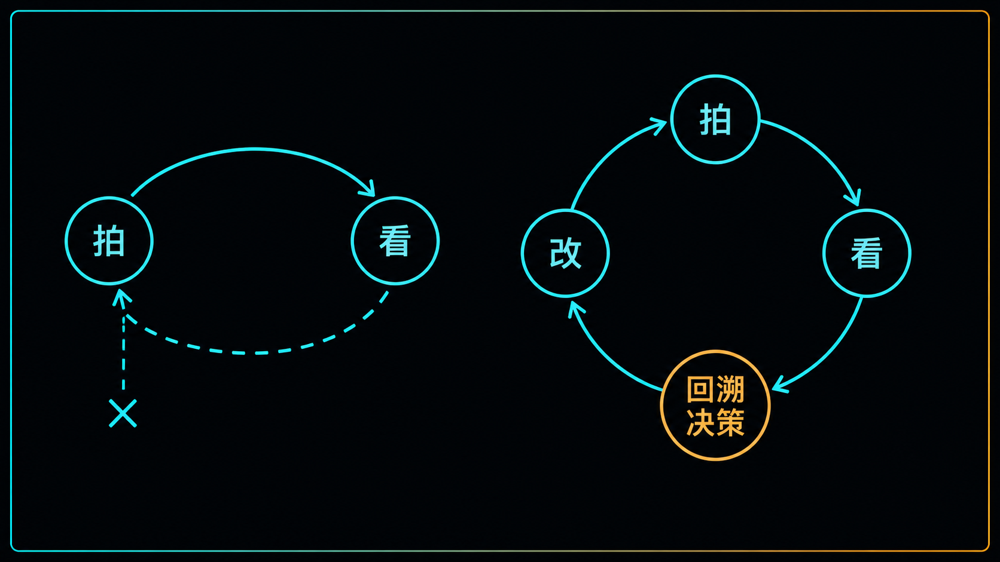
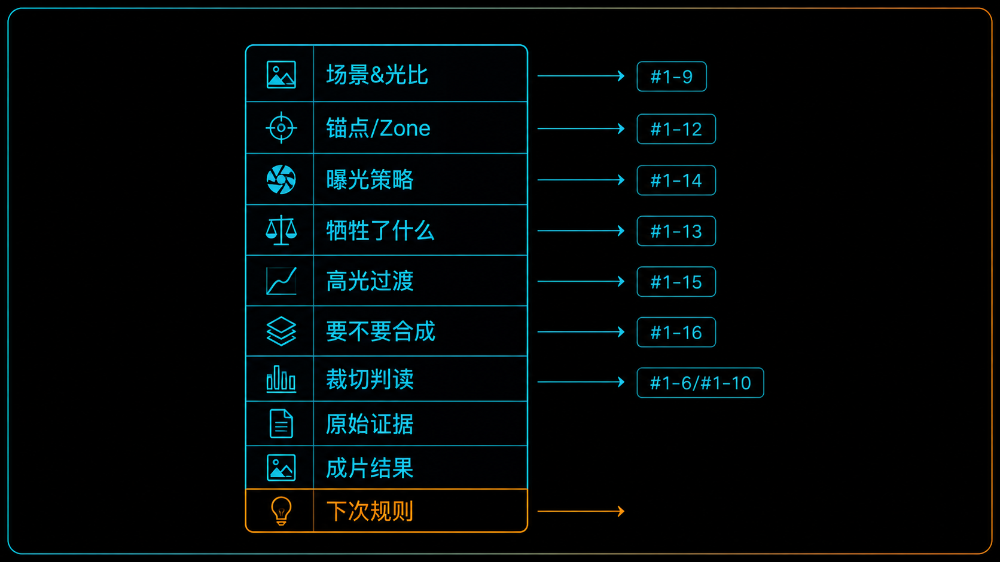
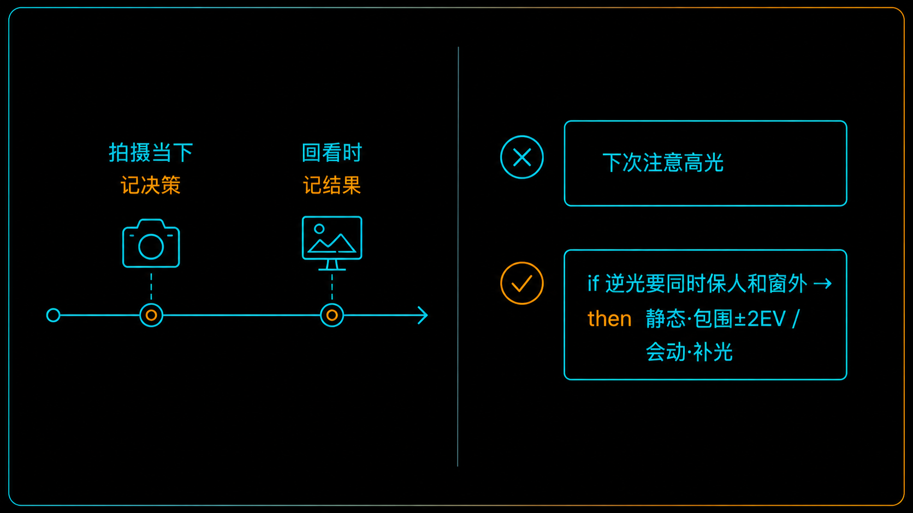
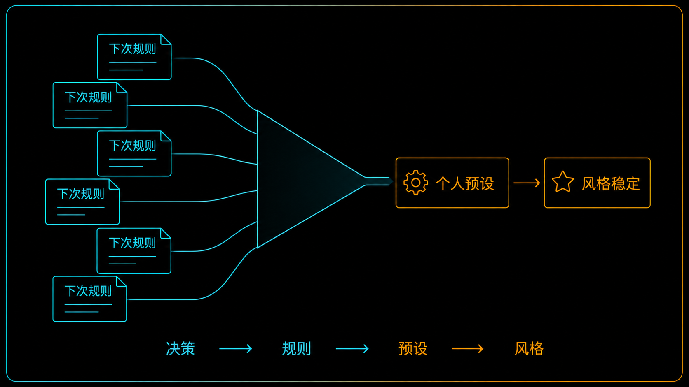

+++
title = "1-17 曝光复盘模板：从一次拍摄沉淀可迁移经验"
description = "拍得多不等于拍得好。真正让技术复利的，是每次拍完把决策和结果对上、抽出下次能用的规律。"
date = 2026-07-19
tags = ["摄影", "曝光", "复盘", "工作流", "决策库", "Zone 系统", "刻意练习", "个人预设"]
categories = ["摄影"]
series = ["主线"]
showTableOfContents = true
+++

> 拍得多不等于拍得好。真正让技术复利的，是每次拍完把决策和结果对上、抽出下次能用的规律。

卡拍满了一张又一张，逆光人像还是老三样：要么脸黑成剪影，要么背后的天白成一片。回看时你皱着眉说「这张没拍好」，删掉，下次遇到同样的光，还是凭手感来一发——然后又踩进同一个坑。

问题不在快门数，也不在器材。问题是：你从没把「当时做了什么决策」和「最后得到什么结果」对上过。这一篇不讲新的曝光原理，讲怎么用一张固定的表，把前面十六篇攒下来的决策力，真正变成你自己的、能复用的经验。

*图：逆光人像的单张两难——保住脸就丢了窗外，保住窗外脸就黑。这类「老三样」最该进复盘表。*

## 从「多拍」到「会拍」：断掉的反馈回路

很多人拍了三五年，水平却卡在某个台阶上不去——不是不够勤快，是每次拍摄都像一次性消费：拍完就过，没有沉淀。

> 这就像背单词只翻书不测验，或者健身从不记录重量：动作做了一大堆，身体却不知道该往哪儿长。任何技能的长进，都靠一个闭环——做出决策、看到结果、修正下次的决策。这个环一断，练多少次都在原地打转。

回到这个模块，我们其实一直在讲同一件事：拍一张照片，是一连串可判读的决策。先估这个场景的动态范围装不装得进相机的可用 DR（#1-9），点测哪个区域、把它锚在 Zone 几（#1-12），DR 不够时先牺牲谁（#1-13），最后是向右曝光（ETTR）、保肤色还是保高光（#1-14）。这些决策，发生在按下快门前的两三秒里。

可到了看片这一步，我们通常只做一件事：评价结果——好看，或者不好看。决策链和结果之间，隔着一条几乎没人去走的回溯路。没有回溯，就没有归因：这张脸黑了，到底是锚点点错了位置、是策略选错了，还是场景本就超出可用 DR、单张根本装不下？这三种原因，对应三种完全不同的改法。可如果你不回去对一遍，最后只会得到「下次注意点」这种等于没说的结论，下次照样凭感觉。

复盘表干的就是这道对齐工序：把飘在脑子里的决策，和眼前的结果，强行摆到同一行上，逼你回答一句——这个结果，是刚才哪个决策带来的。

> 小结：进步不来自快门数，来自「决策—结果」这条回路有没有闭合。

*图：多拍却不进步，是因为左边这个回路断在「回溯决策」这一步；复盘要补的，正是右边闭合的那一环。*

## 复盘表长什么样：每一栏都是一个决策

那这张表具体记什么？光圈、快门、ISO 这些参数不用手抄——它们跟着 RAW 和 EXIF 自动存下来了。但也别急着说「参数不重要」：暗部发死，到底是曝光不足、还是 ISO 太高、还是快门慢了拖出运动模糊？这些都得回头翻参数才分得清，所以表里要留一栏，把 RAW 和关键 EXIF 圈住（导出成 JPEG 时 EXIF 还容易丢）。真正要你动脑写下来的，是参数背后的那个判断。

> 想想医生的病历，或者飞行员的飞行记录：它们都不是流水账，而是一组固定的字段。正因为字段固定，几十次记录才能横着比对，看出「每次遇到这类情况，我都栽在同一步」的模式。复盘表也一样——栏位固定，经验才能累积成能比对的数据，而不是一堆各说各话的感想。

一张够用的曝光复盘表，大致是下面这几栏。关键在于：几乎每一栏，都恰好对应前面某一篇里我们做过的一个决策。

| 栏位 | 记什么 | 对应 |
| --- | --- | --- |
| 场景 & 光比 | 什么场景；点测要留纹理的最亮处和最暗处，两个读数差 ≈ 场景 DR，对一下装不装得进可用 DR | #1-9 |
| 锚点 / 目标 Zone | 锚在脸还是灰卡；点测读数 + 补偿，落在 Zone 几 | #1-12 |
| 曝光策略 | ETTR / 保肤色 / 保高光 / 直接合成，用了哪套 | #1-14 |
| 牺牲了什么 | 这一张主动放弃了谁：暗部细节？有纹理的高光？ | #1-13 |
| 高光过渡 | 有没有硬 clip；后期 roll-off 怎么塑 | #1-15 |
| 要不要合成 | 单张够不够；用没用包围曝光；主体会不会动（防鬼影） | #1-16 |
| 裁切判读 | 拍摄级（未调 RAW 里真饱和、救不回）还是显影级（当前显影推出来的、还能调回）；哪个通道先爆 | #1-6 / #1-10 |
| 原始证据 | 留住 RAW + 关键 EXIF（曝光补偿 / 测光模式 / 是否 Auto ISO / 闪光·ND）+ 现场参考图 | — |
| 成片结果 | 成没成；问题归哪一类（见下） | — |
| 下次规则 | if 遇到同类场景，then 怎么改 | — |

前面几栏记的是「你做了什么决策」，中间圈住原始文件当证据，最后两栏记「结果如何」和「下次怎么改」。你会发现整张表里没有一个新概念——它只是把这个模块那条决策链，拍平成一张能逐栏勾选、逐栏回看的清单。

「成片结果」这栏值得单独说一句：别只写「没拍好」，要把问题归到具体一类——是 RAW 高光裁切、暗部信噪比不够、运动模糊、对焦没到、显影时才裁切的，还是白平衡 / 混合光的问题？把失败分了类，才不会什么都往「曝光没弄对」上推，回头也才知道该练哪一环。

第一次填可能觉得繁琐，但真正逼你想清楚的，其实只有三栏：**锚点放哪、牺牲了什么、下次怎么改**。其余几栏很多时候一眼就能填，甚至可以先空着。别被十栏吓住，先跑起来。

> 小结：复盘表不是新知识，是把你已经学过的决策链，变成一张能反复对照的清单。

*图：复盘表的每一栏，都是这个模块里某一篇教过的决策——它不是新知识，是把学过的决策链拍平成一张清单。*

## 怎么填：当下记决策，回看记结果，最后写「下次规则」

表有了，什么时候填、怎么填才不会变成又一个坚持不下来的负担？关键是分两个时间点，各记各的。

**拍摄当下（趁记得，30 秒）：记决策。** 锚点点了哪、加了多少补偿、用的哪套策略、有没有包围曝光——这些一离开现场就忘，必须当场记。不用打开电脑，在相机里给这张打个星标、手机语音备忘一句、或者速记 App 敲两行都行。记的是「我刚才是怎么想的」。

**回看时（对着屏幕和直方图）：记结果与代价。** 成没成、哪里崩了、直方图右缘触没触壁、哪个通道先爆——#1-6 和 #1-10 那套判读，这时候正好派上用场。不过盯后期直方图有个坑：后期软件里的直方图会随显影设置（白平衡、配置文件、曝光）实时变，右缘触壁，可能只是当前这套显影结果触壁，不代表拍的时候传感器真饱和了。要弄清拍摄时到底过没过曝，得看未调整的 RAW、裁切警告或 RAW 数据，别只认成片直方图——这也接着 #1-6 说过的：机内直方图基于 JPEG 预览，比 RAW 的实际余量保守。所以「裁切」这一栏最好分两层记：拍摄级（未调 RAW 里真饱和、救不回）和显影级（当前显影推出来的、还能往回调）。

**最后一栏最值钱，也最容易写废：下次规则。** 差别就在一句话写得够不够具体：

> 反面例子：「下次注意高光。」——这等于没写。什么叫注意？注意了又该怎么做？下次站在同样的光里，这句话给不了你任何动作。

正面的写法，是拆成条件不同的分支，动作才跟着不同：

> 「if 逆光拍人、既要人也要窗外的天：主体是静的，就包围 ±2 EV 拍三张回来合；主体会动（人会晃、会眨眼），就别赌合成不出鬼影，改用补光 / 反光板压光比，或者换个机位避开硬逆光。」

> 「if 这张只优先保肤色、窗外可以舍：对脸固定区域点测，按你这台机器标定出来的补偿量把肤色推到目标 Zone，放任窗外过曝。」

第二条里那个「补偿量」得多说一句。很多人顺手就写成「+1.3 EV」，但这个数字不能跨人、跨机身、跨场景照搬：反射式点测会把测到的区域往中灰还原，你到底要补多少，取决于肤色深浅、测的是脸颊中调还是额头高光、光线方向、还有你这台机身的测光标定。所以规则别只存一个数字，存成一组条件——「机身 + 测光位置 + 光线类型 → 补偿区间」。你可能复盘出「这台 + 逆光 + 点脸颊 ≈ 补一档半起步」，那也只是你的起始值，现场还得看高光警告和 RAW 余量再微调。

把经验写成这种 if-then 的「条件—动作」，像给自己写一行代码，而不是留一句「要多注意光线」的心灵鸡汤。条件要具体到能一眼认出场景，动作要具体到能直接照做。下次真遇上，你不是重新凭感觉判断一遍，而是调用一条现成的规则。

> 小结：决策在当下记（否则忘光），结果在回看记（那时看得清），规律沉淀成一条能触发、能执行的规则。

*图：决策趁当下记、结果回看时记；最后把经验写成能触发、能执行的 if-then 规则，而不是一句模糊的「多注意」。*

## 从一张表到一套「决策库」：复盘的复利在哪

填一次表，收益有限。真正的价值，在同类场景的规则攒够之后。

当你为「逆光人像」这类场景攒下五条、十条「下次规则」，它们会开始收敛——你发现自己每次的结论都在往同一个落点靠：逆光拍人、对脸颊点测，补偿量稳定在一档半上下（就你这台机器、这类逆光）。这时候，这条规则就从一句复盘笔记，升级成了你的「个人默认参数」。它不是从哪本教程抄来的通用建议，而是你自己的机器、你常拍的题材、你的审美，三者磨合出来的起手式。别人补的那一档半未必适合你，但你这条是自己复盘出来的，贴身。

我们在 #1-12 说过，一组照片如果测光位置、光线结构、显影流程大体一致，每张都把脸上同一块区域锚在相近的 Zone，肤色明度就会更统一，调色和成片都省事。这里得说清楚：锚定统一的，是被测那块区域的目标亮度，不是整张脸的光比和色彩——逆光、侧光、硬光下，额头的高光和眼窝的阴影仍会各走各的，白平衡和配置文件也还会左右最终的肤色呈现（Zone 只管亮度落点，色相和肤色校正是另一回事，留到模块 5）。即便如此，把锚点稳住，仍是一组照片一致性的地基。复盘做的，就是把这种一致性从「一组」放大到「长期」——你的照片之所以看起来是「你的」、风格稳定，靠的不是玄乎的「感觉对了」，而是一套可复现的决策在背后反复运行。

再说一层。如果你在做摄影账号，这套决策库还是别人抄不走的东西。参数是公开的，谁都能抄你的 f/2.8、抄你补的那一档半；但「什么场景该怎么判断、DR 不够时你为什么这么取舍」——这套决策逻辑长在你自己的复盘里，是账号真正的护城河。把每次拍摄的那点「感觉」沉淀成流程资产，攒的就是这个。

> 小结：复盘的复利是一条链——决策 → 规则 → 个人预设 → 风格稳定，顺带长出别人抄不走的内容壁垒。

*图：同类场景的「下次规则」攒够了会收敛成你的个人预设——风格的稳定，来自可复现的决策，不是玄学。*

## 拍摄行动点

1. **今天就把表建起来。** 拿 Notion、备忘录或者一张纸，把上面那几栏抄下来。下次出门拍一组，回来只逼自己填三栏——锚点放哪、牺牲了什么、下次规则；再翻一张上个月不满意的旧片，用同一张表倒着填一遍（倒推比正着记更能暴露你的习惯性错误）。先跑起来，别追求填满。
2. **给你的点测光做一次个人校准。** 固定一台机身、一种光、脸上同一个测光位置，以 1/3 EV 为步长拍一组，看肤色落在哪一档最舒服。这组数据，就是你「逆光对脸到底补多少」的私人标定，比任何通用建议都准。
3. **攒够 5 条，试着并成 1 条。** 等你对某类场景攒下 5 条「下次规则」，看它们能不能收敛成 1 条默认参数。但记住这只是「初始」预设——5 次样本很容易被季节、机身、光线偏差带偏，之后继续拿新片修正它，别急着当成铁律供起来。

## 回顾与下一站

读完这篇，你对「怎么变强」的理解应该变了：不是「拍得多就会好」，而是「拍得多，加上每次把决策和结果对上，才会好」。前面十六篇教的那串决策——测光、直方图、Zone、锚定、容错优先级、三大策略、roll-off、合成——不是拍完就丢的临时工具，而是复盘表里一栏一栏、可以回头追问的变量。曝光这件事，学会判断只是上半场；把判断沉淀成能复用的规律，才是让它长在身上的下半场。

紧接着的 #1-18 是这个模块的动手作业：找一个场景，拍三版——保肤色、保高光、均衡各一张，标出每版的 Zone 落点、牺牲了什么、roll-off 怎么处理。相当于把这张复盘表在同一个场景里连跑三遍，亲手摸一摸每套决策的代价长什么样。做完它，曝光控制论这个模块就闭环了。再往后，我们会离开「曝光」，走进「光」本身——从模块 2 起，聊环境光和闪光怎么解耦、一个空间里几种颜色的光混在一起该怎么治理。

## 参考资料

- Ansel Adams,《The Negative》——Zone 系统与「可复现地控制影调」这套思路的源头；这张复盘表，本质上是它的当代记事本。
- Anders Ericsson,《Peak: Secrets from the New Science of Expertise》——刻意练习为什么需要即时反馈与针对性修正，解释了复盘回路的底层逻辑。
