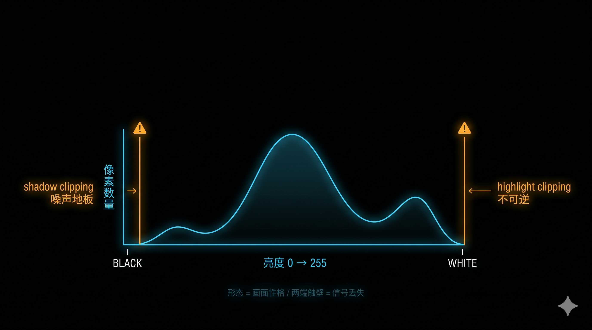
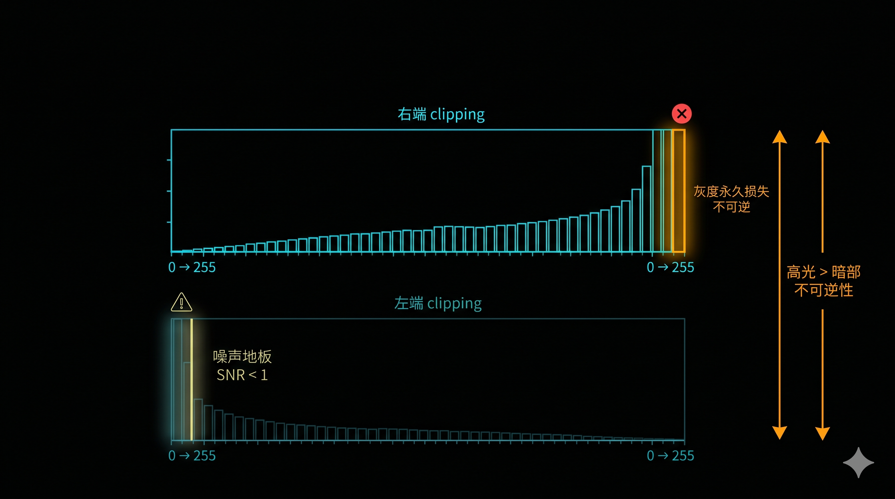
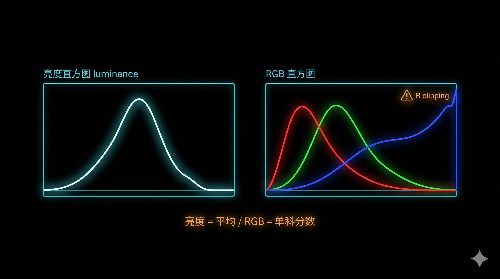

+++
title = "1-6 直方图与「右侧」：你到底在看什么信号"
description = "直方图不是美术评分，是相机给你的信号分布报告——读懂它，曝光从「猜」变「查」。"
date = 2026-05-10
tags = ["摄影", "曝光", "直方图", "ETTR", "Clipping"]
categories = ["摄影"]
series = ["主线"]
showTableOfContents = true
+++

> 直方图不是美术评分，是相机给你的信号分布报告——读懂它，曝光从「猜」变「查」。

---

上一篇我们把曝光决策放在一个点上：选一个测光目标，决定它落在第几档。但你按下快门那一刻，相机捕捉到的不是一个点，而是几千万个像素——这几千万个像素的亮度怎么分布？哪些已经溢出？哪些已经掉进噪声里？相机给你的答案，写在一张你大概率打开过、却没真读懂的图上：直方图（Histogram）。

很多教程把直方图讲成「曝光是否正确的判分表」——左偏=欠曝、右偏=过曝、中间饱满=正确。这个口径其实在误导你。直方图不替你打分，它只是把整张照片按亮度分布画成图给你看；剩下的判断靠你自己。

下面我们把这张图拆成四件事：它在画什么、两端为什么比中间更重要、亮度版本和 RGB 版本看的不是同一件事、以及「为什么读数倾向右侧」的物理依据。

---

### 一、直方图是什么：从一个点到一张分布图

直方图的工程定义其实很朴素：

- **横轴**：亮度刻度，从最黑（0）到最白（255 或 100%）
- **纵轴**：该亮度对应的像素数量

> 想象一张全国人口分布表。横轴是年龄（0–100 岁），纵轴是这个年龄的人有多少。直方图就是把照片里每个像素按亮度分桶——所有亮度为 0 的像素堆成最左边一根柱子，亮度为 128 的堆成中间一根，依此类推。一张图的形状就是这张照片的「亮度人口分布」。

这意味着两件事。

第一，**直方图没有标准形状**。风光照常见的是三段山形（暗部地面、中调天空、高光云），人像常见的是一个偏中间或中右的「驼峰」（肤色集中），低调（low-key）作品常见的是分布主要堆在左半边，高调（high-key）作品则堆在右半边。「直方图应该饱满」是一个被反复传错的说法——没有应该，只有当下场景适合什么样的分布。

第二，**直方图的真正信息在分布的形态加两端**。形态告诉你画面整体是亮调、暗调还是反差大；两端告诉你信号是否已经超出可记录范围（clipping）。中间什么样基本不会让一张片子废掉，两端触壁则可能让你后期想救都救不回来。

所以读直方图的第一步永远是：**先看右端有没有贴到右壁，再看左端有没有贴到左壁**——这两件事比「形状好不好看」重要得多。

*图：直方图横轴=亮度刻度（黑→白），纵轴=该亮度像素数量；触壁 = clipping，超出可记录范围。*

**小结**：直方图是亮度的分布图，没有「标准形状」。读它先看两端，再看形态，最后判断是否符合本张照片的意图。

---

### 二、两端比中间更重要：clipping 的不对称

两端虽然都叫「触壁」，但代价完全不一样。先看右端。

**右端触壁——高光不可逆性的边界**。当一个像素的亮度超过文件能记录的最大值（在 8-bit JPEG 上是 255、12/14-bit RAW 上是 4095/16383），它就被「压」在最大值上，所有超出的部分都被裁掉。但这里有一件容易混的事：「看到右端贴墙」和「高光真的没救」并不等价——你需要把它拆成两层：

- **JPEG 渲染触壁**：相机里那条 tone curve 把高光压到 255 显示触壁，但 RAW 文件对应通道未必真的达到饱和。这种情况下 RAW 仍有一定余量可挖，有时还能借助未爆的通道做高光重建（highlight reconstruction）补回一部分质感
- **RAW 通道真正饱和**：传感器读出值真的达到了最大，具体超过多少没有被记录——到这一步，无论 RAW 还是 JPEG，超出的纹理信息都不可恢复

机内直方图显示的是 JPEG 渲染后的结果，所以你看到的右端贴墙更接近第一种情况；但一旦真的进了第二种，文件格式已经救不了你了。

**左端触壁——暗部不止是「触底」**。一个像素的亮度被压在最左端，可能是几件事在叠加：JPEG 的 black point 把信号压到 0；RAW 中其实还有微弱信号，但已经接近本底噪声（read noise + shot noise，详见 #1-8）；或者两者都有。后期从 RAW 里把暗部拉亮，能找回一点纹理，但**信号越接近噪声地板，提亮放大的就越多是噪声而不是信息**——拉得越多，画面越脏。

> 高光是悬崖，掉下去就是悬崖；暗部是沼泽，越往里走泥越深。一张照片如果非要牺牲一边，绝大多数情况下选牺牲暗部——拉亮带来的噪声比追回失去的高光纹理容易处理。

这条优先级回到了 #1-5 提过的「主体优先级」：肤色 > 高光纹理 > 暗部细节。直方图的两端，正是这条优先级的「信号体征」。如果你的拍摄主体是脸，右端有少量贴墙（背景窗户白成一片）通常可以接受；但如果右端那一小块代表的是脸颊高光，溢出就意味着脸上一块「白斑」——这种 clipping 没法靠后期救。

实拍时，单看直方图按下快门后再回放，反应链太长。现代机身基本都提供两种**实时**反馈：

- **blinkies（高光警告）**：回放时溢出的区域会闪烁。一目了然，但只能在拍完后看
- **斑马纹（zebra pattern）**：取景器实时显示，超过设定阈值（如 95% 亮度）的区域会被斜条纹覆盖。可以在按快门**之前**就看到哪一块快爆了，是 video 工作者的标配，静态摄影也越来越常用

把 blinkies 或斑马纹打开，等于在你回看直方图之前，提前给你一次「高光将爆」的报警。

*图：右端高光 clipping 不可逆 / 左端暗部 clipping 反映噪声地板。*

**小结**：两端不是镜像关系。右端要先分清 JPEG 渲染触壁还是 RAW 通道真饱和——前者还有挖的余地，后者没了；左端则要看暗部信号离噪声地板多近，越近越救不回。所以拍摄端的第一道防线是右端不爆——blinkies 和斑马纹是这条防线的实时哨兵。

---

### 三、亮度直方图 vs RGB 直方图：通道先爆的陷阱

如果你的相机只显示一根曲线的直方图，那是**亮度直方图（luminance histogram）**——把 R/G/B 三个通道按视觉权重合成一个亮度值（粗略地说约 0.3R + 0.59G + 0.11B，绿色权重最高，因为人眼对绿色最敏感）。这是一张「灰度版」分布。

但实际上每个像素是由 R、G、B 三个独立通道组成的，每个通道也都有自己的最大值。**只看亮度直方图，你会漏掉一种典型翻车**：合成后的亮度看起来没贴墙，但单个通道（通常是 R 或 B）其实已经先爆了。

两个最常见的场景：

1. **拍蓝天**：天空里 B 通道远高于 R 和 G。亮度合成后这个区域可能只到 220（远没到 255），但 B 通道本身已经触壁。后期一处理，蓝天里的纹理（云的细节、渐变层次）就一片死蓝
2. **拍肤色**：肤色里 R 通道占比高。脸上高光区的亮度看着只到 230，但 R 通道已经爆了。后期降亮度也救不回——蜡感、塑料感的根因之一就是 R 通道先爆导致肤色失去纹理

这就是 **channel clipping（单通道先爆）**。

> 亮度直方图像班级平均分。三通道都在 80 分（平均 80）和两科 100 一科 50（平均也是 80）的「健康度」完全不同——前者一切正常，后者已经有学科崩盘了。RGB 直方图就是把每科的分数单独拉出来给你看。

实拍上：

- **进阶机身**：基本都能切到 RGB 直方图模式，三条曲线分别画出。看到哪条先贴右壁，就知道哪个颜色在那块区域要爆
- **只能看亮度直方图的机身**：实战经验——遇到大面积纯色（蓝天、红裙、白皮肤），把 EC 留 1/3 到 2/3 档余量。亮度直方图离右壁还有空间不等于安全
- **拍 RAW + 用 ETTR 思路**（在适用场景下）：基于 RGB 直方图判断，比基于亮度直方图判断激进半档以内是合理的；超过一档基本就是赌

注意一个常见误会：很多机器的「直方图」（包括 RGB 模式下的三条曲线）其实仍然是基于 JPEG 预览生成的，**不是 RAW 通道的真实饱和状态**——它能告诉你「哪个通道在 JPEG 渲染后先到顶」，但不等于 RAW 通道真的饱和。这点我们留到第四节展开。

*图：同一张照片，亮度直方图右侧未触壁，但 RGB 通道里的红/蓝已先爆。*

**小结**：亮度直方图是合成后的「平均分」，能掩盖单通道先爆。能看 RGB 直方图就看；不能看的，对纯色场景留半档余量。但要记住：RGB 直方图本身仍然是 JPEG 渲染的产物，不等于 RAW 真相。

---

### 四、「右侧」是物理直觉，不是构图美学

最后一节，我们来回答标题里那个「右侧」是什么意思。

**Expose to the Right（ETTR，向右曝光）** 是 Michael Reichmann 在 2003 年提出的策略：在不爆右端的前提下，让分布尽可能贴右。它流传很广，但常被简化成「曝光越亮越好」——这是个误解。理解它的物理依据，才能知道什么时候该用、什么时候别用。

物理依据来自传感器的本质：**传感器是一个线性光子计数器**。曝光向右移一档，意味着每个像素收到的光子数量翻一倍。光子数翻倍直接带来两个结果：

1. **信号增强一倍**：每个亮度桶里的「信号量」×2
2. **shot noise 只增加 √2 倍**——光子计数遵循泊松分布，噪声 ∝ √N

两者一相除：SNR（信号噪声比）= N / √N = √N，曝光向右一档，SNR 提高 √2 倍。这就是「向右」的根本理由。换句话说，同样的暗部，曝光在直方图右部时记录到的信号比噪声大；在左部时则可能被噪声淹没。

后期把「右部分布」拉回中间（让画面变暗）几乎不损失什么；反过来要把「中间分布」拉到右部（也就是从欠曝的画面里强行提亮），暗部噪声会被同步放大。所以**有 RAW 余量的前提下**，拍摄端往右贴一档，后期就能用更干净的暗部。

> 「右侧」不是说画面要拍亮，是说**信号要尽可能远离噪声地板**。后期想要暗调（low-key），你随时能从右部拉回中间，画面变暗的同时不会带回噪声；反过来从欠曝的暗部强行提亮，噪声会跟着信号一起被放大。

但 ETTR 不是无脑策略，至少有四种情况要警惕：

- **优先保肤色**：浅肤色在常规光线下落在 Zone VI 附近是合理起点，但深肤色、低调人像、舞台戏剧光下完全可能落在更低或更高 Zone——关键不是把脸放到固定档位，而是不让脸部高光过曝失去层次
- **高光纹理优先**：拍金属、白衣、雪——这些材质的微纹理就在高光区。一旦右端贴墙，纹理就被压平了
- **场景对比度大**：当场景的 DR（动态范围）已经接近或超过传感器可用 DR 时，往右就是直接爆。这种情况下要么牺牲右端，要么用 HDR / 包围曝光（详见 #1-16）
- **必须配合 RAW**：ETTR 的整套逻辑都建立在「RAW 还有余量、后期能压回去」之上。如果你拍的是 JPEG 直出，画面亮度就是最终亮度，没有「先右曝再后期压回」这条路——无脑往右只会得到一张偏亮、难修的成片

完整的 ETTR 触发条件、和肤色保护怎么协调、和 #1-13 的「容错优先级」怎么衔接，留到 #1-14 专门讲。这一篇只建立**物理直觉**——为什么向右移在物理上有道理。

最后一个工程事实必须说清楚：**机内直方图来自 JPEG 预览，不是 RAW 的真实信号分布**。机器把传感器读出的 RAW 数据先经过 JPEG 渲染流程（应用一条 tone curve 把高光压缩、把暗部抬亮），再生成那张你看到的直方图。这个流程会让暗部看起来更亮、高光看起来更早贴墙——也就是说：

- 当机内直方图右端**刚刚贴到墙**时，RAW 不一定真的爆——但具体还有多少余量，因机型、Picture Profile、白平衡、ISO 设定差异很大，没法一刀切
- 当机内直方图**严重溢出**（一根高耸的细柱挤在右壁）时，RAW 通道大概率也已经饱和了

这条规律对决定 EC 的起手位很重要：如果你拍 RAW，机内直方图右端贴墙不一定意味着已经无救——但具体能多挖多少，要看你这台机器的脾气；如果你拍 JPEG，眼前看到的就是最终的，没有「隐藏余量」可用。

RAW 和 JPEG 的差异远不止这一条——下一篇 #1-7 会把整条边界讲透。

**小结**：右侧不是审美，是 SNR 的物理结论。但把它当万能策略会翻车——肤色、高光纹理、超 DR 场景、JPEG 直出都是例外。机内直方图基于 JPEG，可能比 RAW 的实际余量保守，但保守多少因机器而异。

---

### 拍摄行动点

1. **打开直方图与高光警告**：进入相机的显示设置，把「直方图显示」和「高光警告（blinkies / 斑马纹）」都打开。回看你最近 20 张照片，识别哪些两端触壁、哪些只是「形态偏一边」。这是建立读图直觉最快的练习
2. **同场景三档曝光 + 高光警告退档**：找一个反差适中的场景（窗边的桌面、傍晚的街道），同一构图拍 0、+1、−1 EV 三张，回放对比三张的直方图形态。重点看右移一档时左侧暗部像素如何整体上移、以及哪一档开始右端贴墙。然后再做一组：往上加 EV 直到高光警告刚开始亮起，回退 1/3 EV——拍 RAW 时这是一个保守的起手位，比无脑贴右更稳
3. **RGB vs 亮度直方图对比**：切到 RGB 直方图模式（如果机身支持），找一个有大面积蓝天或穿红衣服的人，对比亮度直方图右端 vs RGB 三通道右端——你会直观看到亮度看似没爆，但 B 或 R 已经触壁

---

### 读完这篇，你拿到了什么

读这篇前，你打开直方图大概是机器默认开着、或者听人说「要看直方图」。读完后你应该有一个工程框架：直方图是横轴亮度、纵轴像素数的**分布报告**——形态本身没有对错，但两端触壁不可忽略；右端要分清 JPEG 触壁还是 RAW 通道饱和，左端要看暗部离噪声地板多近；亮度直方图会骗你，单通道先爆才是肤色发蜡、天空发青的根因；向右偏移的依据是 SNR 物理直觉，不是审美主张，而且只在 RAW 工作流里成立。

但有一个前提一直没拆：机内直方图是 JPEG 的，那 RAW 的实际余量到底有多少？为什么 RAW 拉回高光的能力比 JPEG 强？下一篇 #1-7 就把这条边界讲透——RAW 与 JPEG，同一次曝光为什么在两者里「结果不同」。

---

### 参考资料 / 推荐阅读

- Cambridge in Colour. *Camera Histograms: Tones & Contrast*. [https://www.cambridgeincolour.com/tutorials/histograms1.htm](https://www.cambridgeincolour.com/tutorials/histograms1.htm)
- Reichmann, M. *Expose to the Right*. Luminous Landscape, 2003.（ETTR 概念的最早系统阐述；后续 #1-14 会深入展开）
- 各机身用户手册：直方图显示、高光警告（blinkies / 斑马纹）、RGB 直方图模式开关——不同机器位置不同，建议查一次记下来
