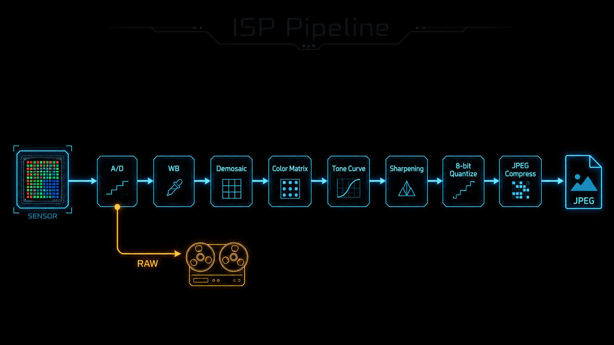
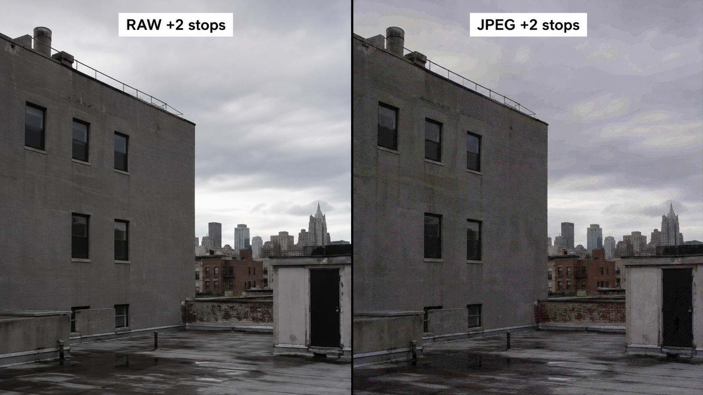
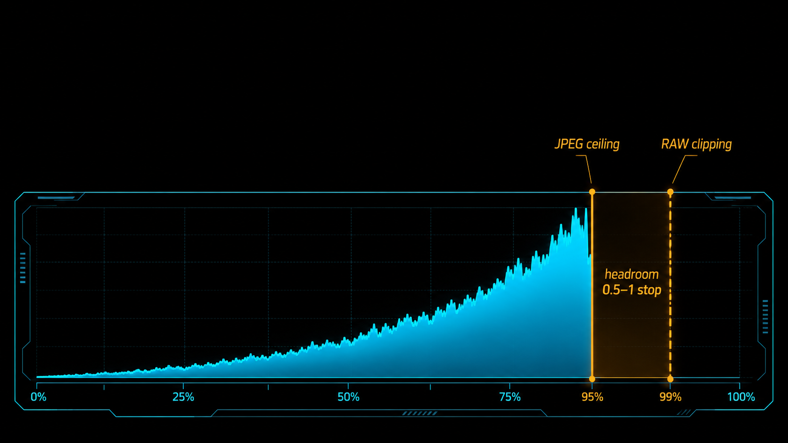

+++
title = "1-7 RAW 与 JPEG：为什么同一曝光「结果不同」"
description = "RAW 与 JPEG 不是画质高低，而是 ISP 链路上两个截断点——一个把影调决策留给你，一个替你做完了。"
date = 2026-05-17
tags = ["摄影", "曝光", "RAW", "JPEG", "ISP", "tone curve"]
categories = ["摄影"]
series = ["主线"]
showTableOfContents = true
+++



## 一、按下快门那一刻，相机里发生了什么

回家把卡里的片子导进电脑，常会撞上一件事：相机屏幕上看着挺漂亮的那张，到了 Lightroom 里打开 RAW，怎么就变得灰平平的、对比也松了。回相机看 JPEG，又是好的。

这不是相机出了问题，也不是 RAW 比 JPEG 更「本真」。它说明的是另一件事——你按下快门到生成一张可看的图片之间，相机其实跑了一整条流水线。

> 类比：相机的内部就像一家餐厅的厨房。RAW 是洗好切好但还没下锅的食材，JPEG 是已经炒好摆盘端上来的菜。两者来自同一批食材，但一个是半成品、一个是成品。

这条流水线行话叫 **ISP（Image Signal Processor）链路**，从左到右大致是：

```
传感器曝光 → 模拟信号 → A/D 转换 → 黑电平校正 → 白平衡 → 去马赛克（demosaic）→ 色彩矩阵 → tone curve → 锐化/降噪 → 8-bit 量化 → JPEG 压缩
```

RAW 文件是从这条链路的**前段**直接截下来的——通常在白平衡和去马赛克之前（不同厂家细节略有差异，但一定在 tone curve 之前）。严格说 RAW 也不是「完全未经处理」：黑电平校正、坏点修复、镜头校准信息有时还会被写进去，部分厂家会做无损或有损压缩；但那些决定影像观感的关键变换——白平衡、tone curve、色彩矩阵、8-bit 量化——都还没发生。JPEG 是把整条链路跑完之后才落地的成品。

这件事对曝光控制论的意义很直接：**机内直方图来自 JPEG 预览**——我们在 #1-6 已经埋过这个伏笔。屏幕上看到的那张直方图，已经被 tone curve 推过、被 picture style 美化过；它不是传感器真实记录到的信号，而是经过你相机内置「修图师」加工过的版本。


> 差异不是「画质好坏」，而是同一次曝光被切了两次——一次切早，一次切晚。

## 二、编码空间：14-bit 和 8-bit 不只是数字游戏

第二个常见场景：你想把一张暗部欠了两档的片子拉回来。在 RAW 里推一推，画面变亮，暗部还干净；同一张 JPEG 用同样的参数推，暗部出现一块块色斑、平滑的过渡变成可见的「台阶」。

> 类比：用尺子量长度。14-bit 的尺子每毫米都有刻度，8-bit 的尺子每厘米才有一道。两把尺子量的是同一段距离，但能记录到的细节精度差了一个数量级。

具体到数字：常见的 RAW 编码每个**感光点（photosite）**用 12 或 14 个 bit，对应 4096 或 16384 个离散码值——12-bit RAW 在很多机型上仍然是默认或高速连拍模式下的标准，并不是所有 RAW 都是 14-bit。Bayer 阵列里一个感光点只记录一种颜色滤镜后的亮度，要等 demosaic 之后才合成成 RGB。JPEG 则是已经渲染完成的 RGB 图像，每个颜色通道 8 bit、256 级。

总码值的对比看起来很大——14-bit 是 8-bit 的 64 倍。但这并不是说每个亮度区间里 RAW 都比 JPEG 多 64 倍可用级数：RAW 是线性编码，每低一档曝光码值减半（最高一档占用最多码值，暗部的码值非常少）；JPEG 经过 gamma 与 tone curve 之后码值分配反过来——暗部相对密集、高光被压缩。两边的「码值地图」长得不一样，不能简单逐档等比。但落到后期实操上，几乎总能观察到的是同一件事：在重度调色、拉曲线、平滑渐变与暗部上提时，RAW 保留的可用量化空间明显更宽。它在你「动那张曲线」的时候才显形：

- **平滑过渡**：天空、肤色这种缓慢渐变，需要密集的离散级数才不出现 banding（断层）。8-bit JPEG 在重度后期下经常逼出断层，RAW 不容易。
- **暗部上提**：把信号往上拉等于把那段编码空间放大。RAW 那段空间里有几百个级数，放大后还是连续的；JPEG 那段空间可能只有几十个级数，放大后中间的「空隙」就显现成色斑。
- **二次压缩**：JPEG 本身还有一层有损压缩（DCT + 量化表），重度后期会让压缩痕迹被进一步放大。

要把一件事讲清楚：**bit depth 大 ≠ 动态范围大**。动态范围由噪声地板与满阱容量决定（这件事留给 #1-9），bit depth 决定的是「在已有的动态范围之内，能切多细」。一台 8-bit 的相机如果传感器极好，DR 也可以很高；只是它的可后期空间比 RAW 窄很多。



> bit depth 是后期可塑性的物理上限。JPEG 不是不能修，是它的「修图编码空间」已经被压成 256 级——每一档操作都更接近「硬碰硬」。

## 三、Tone curve 的写入时机：曝光决策能后置吗

第三个场景，也是最容易被忽视的一个。同一次按下快门，回相机里看 JPEG，光感觉刚好；同样这张片，导入 Lightroom 打开 RAW，对比是松的、暗部也偏灰，看上去「没有那么好」。

很多人到这里会怀疑机器或者镜头。其实不是。

> 类比：JPEG 是相机替你「调过色」的版本，RAW 是没调过、把调色权留给你的版本。后者看上去淡，是因为它在等你来上色。

JPEG 在生成的时候，已经在 ISP 链路里被写入了一条 **tone curve**——把高光做 roll-off、把阴影压暗、把中间调对比拉开。这条曲线长什么样，由你相机里的 picture style 决定（标准/中性/风光/人像/各家厂商的「色彩科学」），一旦写入就不可逆地烧进了 JPEG 的 8-bit 像素值里。后期你能在已经被压扁的曲线上做的，只是微调。

RAW 没有写入这条 tone curve。它保留的是传感器记录到的、近似线性的信号。导入软件时，软件会在显示时给你套上一条**默认的渲染曲线**让你能看；但这条曲线只是「显示用」，底层数据是平的，你想换成什么样的曲线都行。

这件事翻译成曝光决策的语言：

- **拍 RAW** = 影调决策可以**后置**——按下快门时，你只要保证主要信号还在传感器记录范围内（不溢出、不沉到噪声地板），具体怎么分配高光、中间调、阴影的对比，肤色的色调，回家慢慢决定。
- **拍 JPEG** = 影调决策必须**前置**——按下快门之前，相机已经准备好了一条 tone curve 等着把信号压进 8-bit。这条曲线在快门按下的那一刻就生效了，后期能「再调」的空间非常有限。

这个差异是 RAW 工作流最核心的特权。后面会讲到的 #1-14 三大曝光策略——比如 ETTR（曝光向右）——之所以成立，本质上是因为它们都是「先把信号收好、tone curve 留到后期再说」的策略。在 JPEG 工作流里，不能照搬 RAW 那套激进向右——相机的 tone curve 已经替你做完 roll-off，你「向右收一档信号」的余地大半会被曲线吃掉；但 JPEG 仍然可以**轻微**向右改善噪声，只是必须优先保护高光：越线就直接是 255，没有传感器级的反悔空间。

> 这一节的点：拍 RAW 是把「影调决策」留到后期，拍 JPEG 是必须在按快门之前就接受相机的影调决策。曝光策略的所有自由度，都来自这个时机差。

## 四、RAW headroom 与 highlight recovery 的边界

最后到一个最常被神化的现象——「RAW 能救高光」。

直方图右侧已经触壁，相机屏幕上的高光警告（blinkies）在闪。你按了快门，回家导入 RAW 试一试，发现高光滑块往左拉一拉，本来一片白的天空居然回来了一些层次。

> 类比：你看到一群人靠墙站着，看到了「墙」。但你看到的「墙」其实是 JPEG 给你画的那道墙——他们离真正的墙还有一小段空间。

这段空间叫 **RAW headroom**——RAW 文件相对机内直方图所看到的「上限」，还多出来的一段未裁切余量。它的来源很直接：机内直方图基于 JPEG 预览，JPEG 已经被 tone curve 把高光段推到接近上限，所以「看起来到顶」通常比 RAW 实际溢出早一点。在很多现代机器上，这段余量的经验值大约是 **0.5–1 档**；但具体多少强依赖机型、当前 picture style、对比度设置、白平衡、是否开了高光优先 / D-Range 优化之类的功能——也可能更少，甚至几乎没有。可靠的判断方式是用本机自己测一次（行动点里有方法）。

但 headroom 有它的边界——这是这一段最重要的事：

- **三通道全爆 = 信息消失**。如果红、绿、蓝三个通道在那个像素位置都已经裁切到饱和值，RAW 里也没有更多信号了。这种情况下「拉回高光」得到的不是真细节，是软件根据周围像素**重建**出来的近似值。
- **只要还有一个通道未爆，RAW 就有救的余地**。蓝天、霓虹招牌、夕阳、肤色高光这一类场景，常常会出现某一两个通道先裁切、另一些通道还有信号——具体哪个通道先爆，取决于光源光谱、白平衡乘子、场景颜色和传感器响应。只要还有未爆的通道，RAW 软件就能用它把已爆通道的细节做有限的「反推」。
- **JPEG 没有 RAW 意义上的传感器余量**。如果 JPEG 高光还没到 255，确实还能做点微调；但一旦被 tone curve 映射到 255，再加上 8-bit 量化和有损压缩，剩下的工作只能是变暗或者插值式修复，不可能恢复出真正的层次。

通道是否先爆、为什么高光裁切比暗部噪声更不可逆、肤色和天空的恢复极限——这件事的深度，留给 #1-10「高光为何更『不可逆』」和 #5-7「高光恢复的物理边界」。在曝光控制论这一篇里，只需要记住：



> headroom 是 RAW 给你的「反悔时间」。但反悔的窗口由通道结构决定，不是无限的。

## 拍摄行动点

1. **同曝光各拍一张 RAW + JPEG**：大部分相机支持 RAW+JPEG 同时记录，开一次。导入电脑后选一张暗部欠了一档左右的，分别在 RAW 上和 JPEG 上推 +2 档曝光，看天空、肤色这类大面积平滑区域哪个先出现 banding 或色斑。亲手做一次，bit depth 的差异就从抽象数字变成视觉印象。
2. **测一下你机器的 RAW headroom**：找一个刚好让机内直方图触顶、blinkies 闪烁的高光场景拍一张 RAW（比如阴天的窗外、白衬衫的高光面）。先把 picture style 切到 Neutral 或 Flat、对比度和锐度调到最低，再看一遍直方图——这种平直的曲线让机内预览更接近 RAW 的实际余量，触顶位置会更「诚实」。然后导入 Lightroom，把曝光降一档、再用高光滑块往左拉，看你能恢复多少。试过一次之后，你拍 RAW 时就会知道：在自己这台机器上，「机内直方图触顶」和「真的爆了」之间到底差几档。
3. **切一天只拍 JPEG**：picture style 选标准，关闭一切自动 D-Range 增强。回家用 JPEG 修。这听上去像倒退，但它强迫你在按快门之前就把影调想清楚——这是黑白胶片时代的工作方式，对训练「曝光决策前置」非常有用。它会让你回到 RAW 工作流时，更清楚自己在按快门那一刻「放下了什么决策」。

## 五、收尾

读完这一篇，关于 RAW 和 JPEG 的认知应该从「哪个画质更好 / 谁更高级」挪到了「它们在 ISP 链路的哪个位置被截断了」——一个把影调决策权留给你，一个替你做完了；一个保留了更厚的后期空间，一个被压进 8-bit 的容器；一个让曝光决策可以后置，一个要求必须前置。

这不是 JPEG 的退化论。新闻直出、运动连拍、家庭记录，以及手机里那一整套计算摄影，影调决策本来就不需要后置——快、轻、可发就是它的核心价值；JPEG 在这些场景下不是缩水版的 RAW，而是另一条专门为「立刻交付」优化过的链路。两条链路在解决不同的问题。本系列默认我们站在「想要建立可控后期空间」的位置，所以把 RAW 工作流当主线讲；但你完全可以为不同任务挑不同链路。

这个视角是曝光控制论后面几篇的前提。下一篇 #1-8，我们要回答一个更细的问题：既然 RAW 给了这么多后期空间，那把 ISO 拉高之后，噪声到底从哪里来？为什么有时候在后期「补」曝光反而比拍摄时拉 ISO 还干净？

## 参考阅读

- Bill Claff, *Photons to Photos*（[photonstophotos.net](http://photonstophotos.net)）：各机型传感器实测数据，包含 RAW DR、读出噪声、ISO 不变性等指标
- DPReview, *Studio Comparison Tool* 与 *Raw bit depth is about dynamic range*：在同光照下对比不同机型 RAW vs JPEG，以及 bit depth 与 DR 关系的讨论
