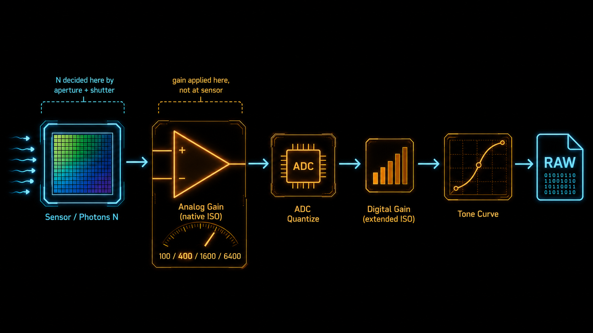
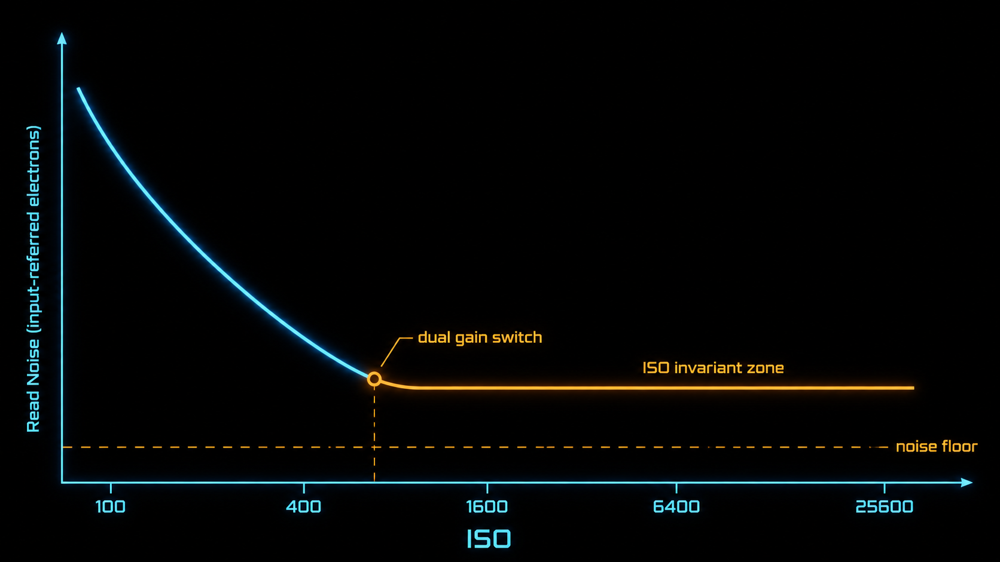
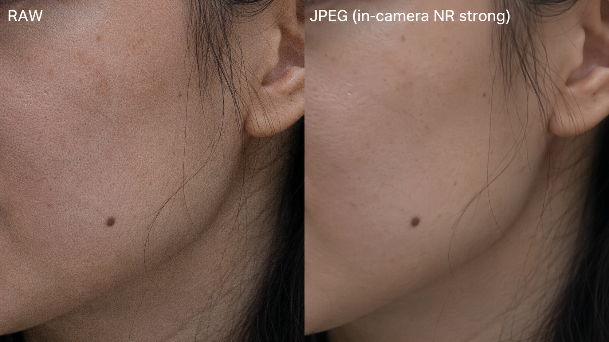

+++
title = "1-8 ISO 的真相：噪声从哪来，「拉高 ISO 会更干净吗」"
description = "ISO 不是把传感器调敏感，是把已经收到的弱信号放大到合理亮度——噪声从光子来，不从 ISO 来。"
date = 2026-05-23
tags = ["摄影", "曝光", "ISO", "噪声", "shot noise", "read noise", "ISP"]
categories = ["摄影"]
series = ["主线"]
showTableOfContents = true
+++



> 一句话摘要：ISO 不是把传感器调敏感，是把已经收到的弱信号放大到合理亮度——噪声从光子来，不从 ISO 来。

## 一、ISO 在 ISP 链路的真实位置

夜里室内拍娃。Auto 档下相机给到 ISO 6400，1/60 s、f/2.8，回看一片噪点。下意识把 ISO 调回 800，光圈快门不动——画面立刻变成一团黑，但放大去看，黑下来那一团里「噪点」反而更少。

这个直觉让人困惑：明明传感器没动、镜头没动、曝光也没变，为什么 ISO 一变，噪点和亮度都跟着变？

> 类比：传感器接住的「光」像一桶水。光圈是水管粗细，快门是水龙头开多久，决定接到多少水——这是曝光。ISO 不在这一段。它是接完水之后，把这桶水按比例倒到另一个杯子里的过程：杯子小，水显得满（亮度高，但水还是那么多水）；杯子大，水显得少（亮度低）。

工程上，相机内部的信号链大致是：

```
传感器曝光 → 模拟增益（多数原生 ISO 在这里）→ ADC 量化 → 数字增益（扩展 / 部分中间档在这里）→ tone curve → 后续处理
```

承接 #1-7 把 RAW 看作 ISP 链路位置的视角：曝光由光圈和快门完成，决定了传感器实际接到多少光子 N；这堆光子转换成电荷之后，相机要把它们送进 ADC（模拟-数字转换器）量化成 RAW 数值——**ISO 主要就是控制这条链路上「放大倍数 + 亮度映射」的几个旋钮**。在多数机型的原生 ISO 档上，主要的「放大」发生在读出链路里的模拟增益（某些档之后还会切换 dual conversion gain，换一个更省噪的读出模式）；但并不是所有 ISO 档都这么干净——很多相机的扩展 ISO（最低或最高那一两档）、中间步进档，实际上掺了 ADC 之后的数字增益甚至 tone curve 上的亮度映射，跟纯模拟增益不是同一件事。

数字相机的 ISO 标定本身也不是「传感器灵敏度」——行业标准 ISO 12232 规定的是给定曝光下相机把传感器信号映射到「标准输出亮度」的方式，里面区分了曝光指数（exposure index）、饱和灵敏度（saturation-based）、噪声灵敏度（noise-based）等口径。落到日常理解上抓住一点就够：**ISO 改变的不是传感器灵敏度，是把传感器信号映射到输出亮度的标定参数**。

这个位置关系决定了一件最容易被忽略的事：**传感器接到的光子数 N 跟 ISO 设到多少完全无关**。同样的 1/60 s + f/2.8，不论 ISO 是 100 还是 6400，落到传感器上的光子数都是同一个 N。改 ISO 不增加 N，也不减少 N。


> 这一节的点：ISO 不在曝光那一头。它在曝光之后，把弱信号映射到合理亮度的那一步——而且不同档位发生在链路的不同位置。

## 二、噪声从哪来：shot noise 和 read noise

那为什么抬 ISO 会「看起来」噪点变多？要回答这个，得先把噪声拆开看。

数字相机里的噪声有两个主要来源。

**Shot noise（光子散粒噪声）**——光子本身的 Poisson 涨落。同一秒内落到同一片传感器的光子数不是固定值，是围绕一个均值在涨落。亮的地方一秒接到几万个光子，少几个不影响；暗的地方一秒只接到几百个光子，少几个就肉眼可见。统计上 shot noise 的标准差等于 √N，所以 SNR = N / √N = √N。

> 类比：shot noise 像数雨滴。某一秒落进同一个量筒的雨滴数永远在涨落。雨大的时候（N 大），少几滴不显眼；雨小的时候（N 小），同样的涨落就把读数搅乱。

**Read noise（读出噪声）**——传感器把电荷转换成电压、再送进 ADC 量化的整个读出链路里，电子学贡献的随机偏差。它不是单一来源，而是几段电路噪声的总和：像素读出、列放大器、ADC 量化、后级数字电路各贡献一部分。它跟光多少无关，是相机硬件的固有属性。

> 类比：read noise 像一台秤的归零误差。不管你称什么，每次读数都加一点固定的随机偏差。秤上放 10 公斤东西，误差 100 克可以忽略；放 100 克，误差 100 克就把读数毁了。

两件关键的事。

**Shot noise 由曝光量 N 决定，跟 ISO 完全无关。** 改 ISO 不改 N，shot noise 一分不少。想降 shot noise 唯一的办法是开大光圈、放慢快门、补光、或上更大传感器——也就是多收光子。这是 SNR ∝ √N 的物理含义。

**Read noise 跟 ISO 有关，但方向反过来。** 抬 ISO 等于把模拟增益往前推一格——增益**之前**已经叠加的噪声（像素层面的那部分）会跟着信号一起被放大，没好处；但增益**之后**才进入的那些噪声（主要是 ADC 量化噪声和后级电路噪声）折算回传感器输入端时，占比会变小——因为它们除以的「放大倍数」变大了。在低 ISO 段（base ISO 到 dual gain 切换点之间），后级电路噪声占主导，抬 ISO 通过这种「前移放大」能让最终画面里的 read noise 相对变小；过了 dual gain 切换点，前后级噪声都被压到地板，再抬意义就不大了。

所以「抬 ISO 噪点变多」的真相是：shot noise 没变（弱信号本身就吵），ISO 把这堆带噪信号一起放大到了你能看见的亮度。你以为是 ISO 制造了噪声，其实是 ISO 把本来藏在黑暗里的噪声**显形**了。

> SNR 的根本手段是 √N，多收光子。ISO 不增加 N，所以 ISO 不能降低 shot noise；它在低 ISO 段能压低后级 read noise 的相对占比，但这只是「让电子学那部分噪声变小一点」，不是真的多收了光子。

## 三、「拉高 ISO 会更干净吗」：分场景

这是从摄影论坛一路吵到现在的问题。答案不是简单的「是」或「否」，要分场景。

### 场景 A：曝光卡死，决策只在 ISO

这是大多数实际拍摄的真实场景——光线就这么多，光圈和快门已经卡到极限（再开就景深炸了，再慢就糊了），剩下的决策只有「按下快门时把 ISO 设到几」和「按下快门时设低 ISO、回家在 Lightroom 里 push」。

- **低 ISO 段（base ISO 到 dual gain 切换点之间）**：机内抬 ISO 通常更干净。模拟增益在 ADC 之前压低了后级 read noise 的相对占比；如果你低 ISO 拍完回家硬 push 5 档，会发现 read noise 在数字 push 里被原样放大，画面比直接抬 ISO 拍要脏。
- **过了 ISO invariant 点**：后级 read noise 已经被压到地板，再抬 ISO 没有额外好处。这时候机内提 ISO ≈ RAW 后期 push 曝光，两者**等价**——结果几乎一样干净（或者一样脏），看你想把「调亮」留在拍摄时还是后期。

这两件事的差别可以用一个词概括：amplification 发生在哪一段。机内抬 ISO（原生档）是 ADC 之前的 **analog gain**——能在 read noise 还没「凝固」成数字之前先放大信号；后期 push 曝光是 ADC 之后的 **digital gain**——只是数字层面的乘法。在 invariant 点之前 analog 显著优于 digital；过了之后两者结果几乎重合。

不少现代 CMOS 机型在某个 ISO 档之后接近 ISO invariant；老一些的机器或廉价机型 invariant 性较差，机内抬 ISO 全程都比后期 push 更干净。**具体切换点不能按品牌系列拍脑袋**——同一系列不同机型的传感器、dual gain 点、RAW 压缩策略都可能不同——必须看机型实测：Bill Claff 在 Photons to Photos 上的 read noise / PDR 曲线是最常用的参考，或者用行动点里的方法自己测一次。



### 场景 B：曝光本身还能变

这是更根本的决策。在能多收光子的场景下，**先想办法多收光子**，再考虑 ISO。

- 开大光圈一档（景深允许的话）= 多收一倍光子 = √2 倍 SNR
- 放慢快门一档（手持 / 被摄物允许的话）= 多收一倍光子 = √2 倍 SNR
- 抬 ISO 一档 = 把信号放大一倍，光子数 N 没变 = shot noise 不变

承接 #1-6 直方图与「向右」、#1-14 ETTR：**只要重要高光没被裁掉，且向右是通过开大光圈 / 放慢快门 / 补光真的多收了光子，那么「低 ISO + 更充分曝光」比「高 ISO + 欠曝两档」更干净**。这条不是无条件成立的口诀——如果你只是调低 ISO 但没让传感器多收光子，RAW 数值就只是单纯变低，并没有任何 SNR 优势；如果向右过头把高光烧掉，#1-7 提到的那点 RAW headroom 也救不回。所以决策序是：先看能不能多收光子（光圈 / 快门 / 补光），能就先收；然后再决定 ISO。

> 一句决策：能多收一档光子，永远胜过 ISO 端调一档。

这里先埋个伏笔：抬 ISO 的代价不只是把噪声显形——它还会**压缩高光余量**。同一台相机标着 14 档 DR，base ISO 下高光头顶可能还有一档 RAW headroom，到了 ISO 6400 那档余量基本耗尽。下一篇 #1-9 会把这件事讲透，本节先到这里。

## 四、为什么 JPEG 看起来高 ISO 也「很干净」

最后一个常见困惑。手机夜景模式拍出来 ISO 12800 但画面看起来又亮又干净；同样场景用相机拍 RAW、ISO 6400，导入电脑放大一看满是颗粒。

不是相机不如手机。是 JPEG 和计算摄影帮你「修过」了。

> 类比：RAW 是直接给你看实测温度的温度计，每一点涨落都显示出来；JPEG 是给你看「经过平滑算法处理后」的温度曲线，看着柔和，但中间那些短暂的真实涨落被吃掉了。

承接 #1-7 ISP 链路视角：JPEG 在生成时已经过 tone curve、降噪（noise reduction, NR）、锐化等一整条处理链。机内降噪算法的工作原理是把图像里「低空间相关性」的成分（噪点本身就是低相关的）当成噪声去掉。问题在于：真实的高频细节——皮肤纹理、毛发、远景的树叶、织物的肌理——空间相关性也低，会被一起当成噪声涂掉。

所以 JPEG 高 ISO 看起来「干净」是真的，代价也是真的：

- 噪点确实少了——降噪算法把它们抹平了
- 细节也确实少了——和噪点一起被抹平了
- 100% 放大去看，平面区域很纯净，但纹理区域会变成蜡塑感

手机的计算摄影更激进：多帧合成（拍 5-10 帧叠加平均，**总光子数累积到约 n 倍，随机噪声标准差降到 1/√n，SNR 提升约 √n 倍**——shot noise 真的被降下来了）+ AI 降噪（语义级理解什么该保、什么该抹）。所以手机 ISO 12800 的「干净」里，有一部分是真的（多帧合成确实收了更多光子），另一部分是算法替换重建的结果。

RAW 不做这一套。你看到的颗粒是传感器实际记录到的信号涨落——看起来吓人，但所有可恢复的细节都还在。后期 Lightroom 里的 AI 降噪能在 RAW 上做出比机内 JPEG 更好的结果，因为它有更多原始信号可用。



> JPEG「干净」≠ 噪声少，而是「细节也一起被删了」。这是为什么后期空间需要 RAW。

## 五、拍摄行动点

1. **测一下你机器的 ISO invariant 点**：找一个稳定光源的暗场景（最好上三脚架），固定光圈和快门。**先把机内自动亮度优化（Sony DRO / 佳能 ALO / 尼康 Active D-Lighting）、动态范围扩展、机内长曝降噪和高 ISO 降噪全部关掉**，只比较 RAW——否则会把 JPEG / 软件处理误判成传感器特性。分别用 ISO 100 / 400 / 1600 / 6400 各拍一张 RAW，导入 Lightroom，把低 ISO 那几张用曝光滑块拉到和 ISO 6400 一样的亮度（比如 ISO 100 拉 +6 档，ISO 400 拉 +4 档），100% 放大对比阴影区噪点。从某一档开始往后，机内抬 ISO 和后期 push 看起来几乎一样——那就是你这台机器的 invariant 点。一次性投入，之后所有低光决策都有据可依。
2. **比一次手机 JPEG 和相机 RAW 的「干净」**：相同低光场景，手机夜景模式拍一张，相机 RAW、ISO 同样高拍一张。两张都放大到 100%，看平面区域噪点，再看脸上的皮肤纹理、衣服织物。手机平面更纯，但纹理常常蜡塑——这就是降噪和细节的代价交换。
3. **下次低光决策时，先问「能多收光子吗」**：能开大光圈先开（接受景深变浅），能放慢快门先放（接受运动模糊或上三脚架），能补光先补，都用完了再抬 ISO。把「接更多光子」和「事后调亮」两件事在脑子里分开，是这套思路的核心。

## 六、收尾

读完这一篇，关于 ISO 的认知应该从「调高变亮、调低变暗、高了会脏」挪到一个更准确的位置：ISO 是 ISP 链路里曝光之后控制「信号往输出亮度映射」的标定参数，多数原生档对应读出链路的模拟增益（包括 dual conversion gain 的切换），扩展档和部分中间档可能掺数字增益和 tone 映射；它跟传感器实际收了多少光子无关，所以改 ISO 既不增加也不减少 shot noise；在低 ISO 段，模拟增益能压低后级 read noise 的相对占比，那段抬 ISO 反而更干净——过了 invariant 点这条路径就走完了；「抬 ISO 噪点多」不是 ISO 凭空造了噪声，是它把本来藏在黑暗里的弱信号涨落显形了；想从根上降噪只有多收光子（开光圈、放慢快门、补光、上更大传感器、多帧合成），不是动 ISO；JPEG 高 ISO 看起来干净是降噪算法把细节一起抹掉的代价。

把这个视角带回曝光决策，三件事变得清晰：

- 曝光端（光圈 + 快门 + 光照）才是 SNR 的根本控制点
- ISO 是亮度匹配的标定步骤，在低 ISO 段能压低后级 read noise，但它不能降低 shot noise
- 在不裁重要高光、且能多收光子的前提下：低 ISO + 更充分曝光 > 高 ISO + 欠曝

下一篇 #1-9，我们要把这一篇里出现过的「噪声地板」接回动态范围——同一台相机宣称 14 档 DR，到了 ISO 6400 还剩几档？工程 DR 跟可用 DR 之间那个差距，正是 ISO 在背后悄悄拉开的。

## 参考阅读

- Bill Claff, *Photons to Photos*（[photonstophotos.net](http://photonstophotos.net)）：各机型传感器实测 read noise、ISO 不变性曲线、PDR 曲线
- Emil Martinec, *Noise, Dynamic Range and Bit Depth in Digital SLRs*：图像噪声物理来源的经典技术写作
- DPReview, *Exposing for ISO Invariance*：ISO invariance 在实际机型上的实测对比
- ISO 12232 标准：数字相机感光度的标定方式（曝光指数 / 饱和灵敏度 / 噪声灵敏度三种口径）
