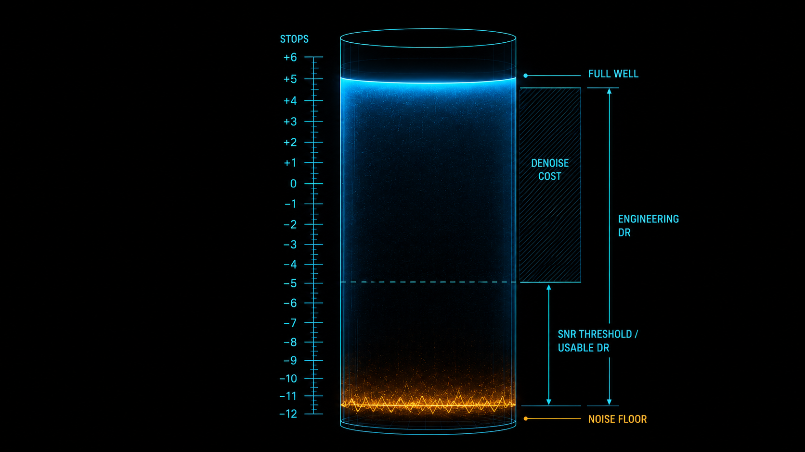
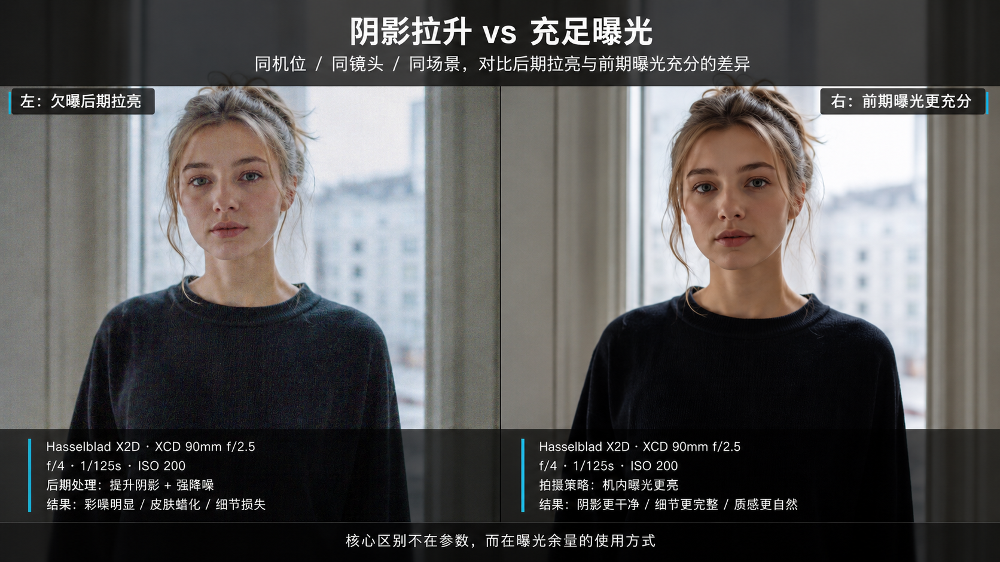

+++
title = "1-9 动态范围两口径：工程 DR vs 可用 DR"
description = "相机标称的动态范围是物理极限，你真正能交付的那部分要小上若干档——差额由降噪的代价决定。"
date = 2026-05-30
tags = ["摄影", "曝光", "动态范围", "DR", "噪声地板", "SNR", "向右曝光"]
categories = ["摄影"]
series = ["主线"]
showTableOfContents = true
+++



> 相机标称的动态范围是物理极限，你真正能交付的那部分要小上若干档——差额由降噪的代价决定。

## 那个「14 档」到底骗没骗你

傍晚逆光拍人，天空和人脸差了好几档光。你按着人脸测光，回家一看天空白成一片；这次保住天空，人脸又黑成剪影。你想起参数表上写着「14 档动态范围」——一张照片从最亮到最暗能装下 14 档明暗，这个场景的光比明明没到 14 档，怎么还是顾此失彼？

不死心，把人脸那块暗部往上一拉，细节是回来一点，可满屏都是彩色噪点；再降噪压一下，人脸又糊得像打了层蜡。问题到底出在哪？

其实「14 档」这个数字没骗你，但它说的不是你以为的那件事。相机能「记录到」14 档，和你「能用」几档，是两个不同的口径——中间差掉的那几档，正是这篇要讲清楚的东西。

## 动态范围量的是「从白到黑能塞几层」

先说清楚动态范围到底在量什么。

把传感器想成一个有刻度的水桶。光子像水，曝光就是往桶里灌水。桶灌满了再灌就溢出来——这是桶的上沿，对应高光过曝、纯白一片，是它能容纳的最大信号。但桶底不是干净的，永远晃着一层浑水：那是传感器在没光、或接近没光时也甩不掉的电子噪声——读出电路的 read noise、暗电流噪声、量化误差垫在最底下，高度大体固定，不随你收多少光变化。我们在 #1-8 把这条线叫作噪声地板（noise floor）。比它还浅的信号，你分不清哪是真画面、哪是噪点。

（那光子本身的随机涨落 shot noise 呢？它是另一回事：随信号变强而变大，但信噪比同时按光子数的平方根往上走——所以它决定的是中间调和暗部「够不够干净」，而不是垫死最底那条线；越往暗处走，它的绝对值反而越小。这条 #1-8 推过。）

动态范围（Dynamic Range，DR），量的就是这个桶「上沿」到「浑水面」之间的高度，单位是档（stop）——每多一档，信号翻一倍。一只满阱容量（full well capacity，溢出前能装下的最大电子数）大、噪声地板又低的桶，能塞下的明暗层次自然多。

> 动态范围量的不是「最亮」也不是「最暗」，而是这两端之间还能分辨出多少层次。

## 「14 档」是物理极限：工程 DR

那参数表上那个数字是怎么来的？

参数表、评测站和传感器测试里报的那个 DR，多半是**工程口径**的动态范围。它的定义很干脆——最大不溢出信号，除以噪声地板：

$$
\text{工程 DR (stop)} = \log_2 \frac{\text{full well capacity（满阱容量）}}{\text{noise floor（噪声地板）}}
$$

分子是桶满之前能收的最大信号，分母是浑水面的高度，两者之比换算成档数，就是「这块传感器从溢出到刚好淹进噪声里，理论上跨多少档」。这是个物理极限，一台机器出厂就定死了：base ISO（厂商标定的最低噪声工作点）下最高。往上抬 ISO，可记录的高光余量被压窄——满阱容量是固定的，但增益把信号放大后更早撞上 ADC 顶格，亮端先丢，DR 因此变小（至于噪声地板那一端，随 ISO 不一定单调上升，有些传感器在某些档位 read noise 反而下降，尤其带双增益结构的，这条 #1-8 聊过）。

这里要提一句：同样叫 DR，DxOMark 的 Landscape DR、Photons to Photos 的 PDR、厂商宣传册、视频机标的 stops，用的 SNR 阈值和归一化规则各不相同（屏幕归一化 vs 打印归一化就能差出小半档）。所以别拿不同来源的数字硬比，更别把某个评测值当成厂商承诺。

但这里有个坑。工程 DR 最暗的那一两档，是「刚好能从噪声里分辨出来」的信号——分辨得出，不等于好看。那几档暗部，信号只比浑水高出一点点，信噪比低得可怜，放大了看全是噪点。相机确实「记录到」了它，可你未必「用得上」它。

> 工程 DR 回答的是「传感器最多能记录多少档」，是物理上限，不是你能交付的画质。

## 能记录 ≠ 能用：可用 DR 与那条代价函数

那我到底能用几档？这就引出第二个口径——**可用 DR**（Usable DR）。

它不看「能不能记录」，只看「信噪比够不够好看」：从最亮端往下数，只要某一档的信噪比（SNR）还在你能接受的阈值以上，就算进可用范围；一旦掉到阈值以下——暗部噪点多到硌眼——就不算了。所以可用 DR 永远小于工程 DR。

这个阈值能粗略量化：SNR ≈ 1 只是「勉强能从噪声里认出有个东西」，那正是工程 DR 的下沿；要看着干净，暗部得到 SNR ≈ 10；要经得起放大细看，往往要 SNR ≈ 20 以上。可用 DR，就是从高光端往下数到「信噪比还在你这次用途的及格线以上」为止的那一段。

而这个「及格线」本身还是浮动的。发张手机小图，暗部糊点噪点没人凑近看，阈值低，可用 DR 就宽；要放大打印挂墙上、站近了端详，阈值高，可用 DR 就窄。同一台相机、同一张 RAW，输出目标不同，能用的档数就不一样。

那中间差掉的那一段（常见两档上下，但不是定数）去哪了？没消失，是被一道「代价」挡在了门外。工程 DR 记录到的那些暗部，你想把它救进可用范围，唯一的办法是后期把暗部提亮——shadow push。可 push 是事后的数字增益，它放大信号的同时，把垫在底下的噪声一起放大了。提得越多，噪点越凶；噪点凶了就得降噪，而降噪是拿细节换干净——降噪算法分不清「皮肤纹理」和「噪点」，常常一并抹平。

于是有一条代价函数（cost function）摆在这儿：

> 暗部每多救一档 → push 越狠 → 噪声越大 → 降噪越重 → 细节损失越多。

可用 DR 的边界，就是这条代价曲线上「还划算」的那个点。过了那个点，救回来的暗部还不如不救。

所以可以这样收束这两个口径：工程 DR 是相机给的物理极限，可用 DR 是你在「细节损失能接受」前提下真正能交付的范围，中间隔着一条降噪的代价函数。

## 与其事后救，不如拍摄时给暗部喂光

知道差额卡在哪，拍摄时就有了对策。

暗部之所以难救，根子是它离噪声地板太近、信噪比太低。那最省事的办法，不是事后拼命 push，而是拍摄时就让暗部多收点光，把它从浑水面往上抬——信号一高，信噪比自然跟着涨，根本不用后期硬拉。

怎么抬？在不溢出高光的前提下，曝光尽量往右偏（直方图右侧，我们在 #1-6 聊过那条「向右曝光」的物理直觉：暗部往右一档 ≈ 多收一倍光子，信噪比开着方往上走）。同样是一档曝光，拍摄时喂进去的是真光子，事后 push 放大的是已经掺了噪声的信号——前者干净得多。不过向右不是无脑加曝光：加之前先看 RAW 的高光警告 / 斑马纹 / 回放，确认重要高光（尤其肤色、天空、金属反光）还没顶格。这套思路系统化之后就是 ETTR 策略，#1-14 会专门讲它的触发条件和翻车场景。

还有一个常被说拧的点要拎清楚：真正让画面干净的是「多收了光」，不是「ISO 调低了」。如果你能放慢快门、开大光圈或补光，把真实进光量加上去（高光不溢出），那低 ISO + 充分曝光肯定赢过欠曝再 push。但要是进光量根本加不了、只是把 ISO 往下拨然后靠后期提亮，结果就不一定了——在读出噪声占主导的场景里，机内高 ISO 增益反而可能更干净；只有当传感器接近 ISO 不变性（ISO invariance）时，机内提 ISO 和后期 push 才大致等价。这些传感器架构的细节 #1-8 拆过。

当然，向右曝光的前提是高光别溢出——高光那一端为什么比暗部更「救不回来」，是另一个故事，留给 #1-10。还有一种情况：场景本身的光比就超过了你单张能用的 DR（比如室内对着窗外的大太阳），那不是曝光策略能解决的，得靠包围曝光加 HDR 合成把多张拼起来，那是 #1-16 的活。

> 可用 DR 不够时，第一选择是拍摄端把暗部喂饱，而不是后期端硬救。

## 拍摄行动点

1. 找一张你拍过的逆光或大光比 RAW，把阴影滑块拉到 +60 以上，100% 放大看暗部——记住噪点炸开的那个临界点，那就是这台机器在这个 ISO 下「可用 DR」的实际下沿。
2. 同一个大光比场景拍两张：一张按相机建议曝光，一张在不溢出高光的前提下增加 2/3 到 1 档曝光（向右）。后期都把整体影调调到一致，再对比暗部噪点——你会直观看到「拍摄时喂光」比「事后 push」干净多少。
3. 把同一张 RAW 分别导出成手机分享尺寸和打印尺寸，各自调到「暗部噪点可接受」为止，记下两次你愿意把阴影拉到多亮——这两条不同的界限，就是可用 DR 随输出目标浮动的活证据。

## 写在最后

读这篇之前，「动态范围 14 档」大概只是参数表上一个用来比高低的卖点数字。现在你应该能把它拆成两件事：工程 DR 是传感器从溢出到淹没的物理极限，可用 DR 是你在细节损失能接受的前提下真正能交付的那一段。两者之间总隔着一段差距：常见在 2 档上下，但它不是定数，会随相机、ISO、输出尺寸、观看距离和降噪强度浮动。那段差距，就是降噪代价函数收走的过路费。想通这点，曝光决策的重心就从「事后能不能救回来」挪到了「拍摄时把光喂到哪里」。

不过我们这一篇一直默认暗部和高光是对称的：都是离边界越近越糟。其实不是。暗部噪点至少还能靠多收光、靠降噪挣扎一下；高光一旦溢出，那是连数据都没留下，神仙难救。为什么高光这么「不可逆」，又为什么常常是某一个颜色通道先爆、连带把肤色和天空搞坏？下一篇 #1-10 接着聊。

## 参考资料

- DxOMark，*Dynamic Range* 测量方法说明（landscape / 打印归一化口径）
- Bill Claff，*Photons to Photos*——各机型传感器 PDR（Photographic Dynamic Range）实测数据库
- Emil Martinec，*Noise, Dynamic Range and Bit Depth in Digital SLRs*
