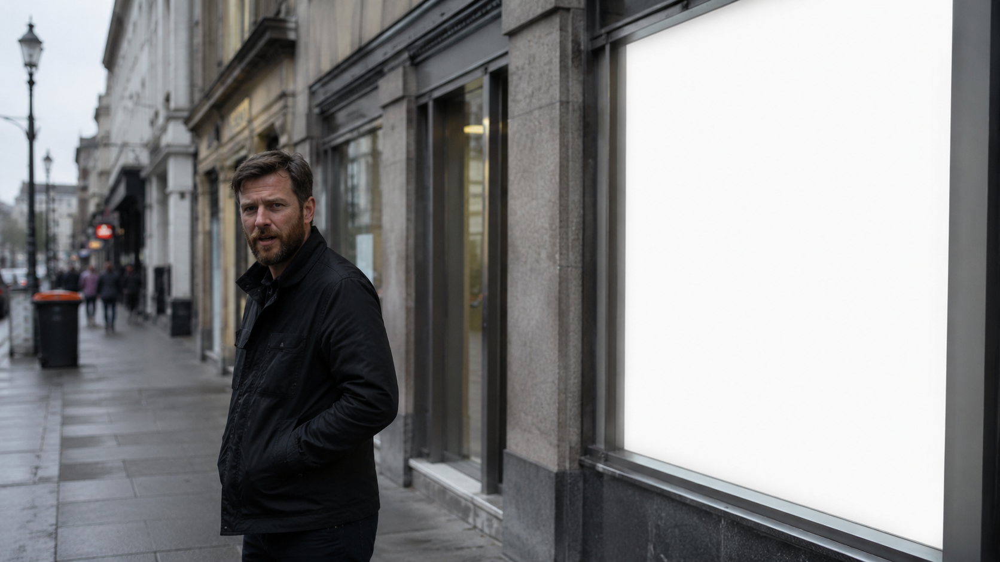
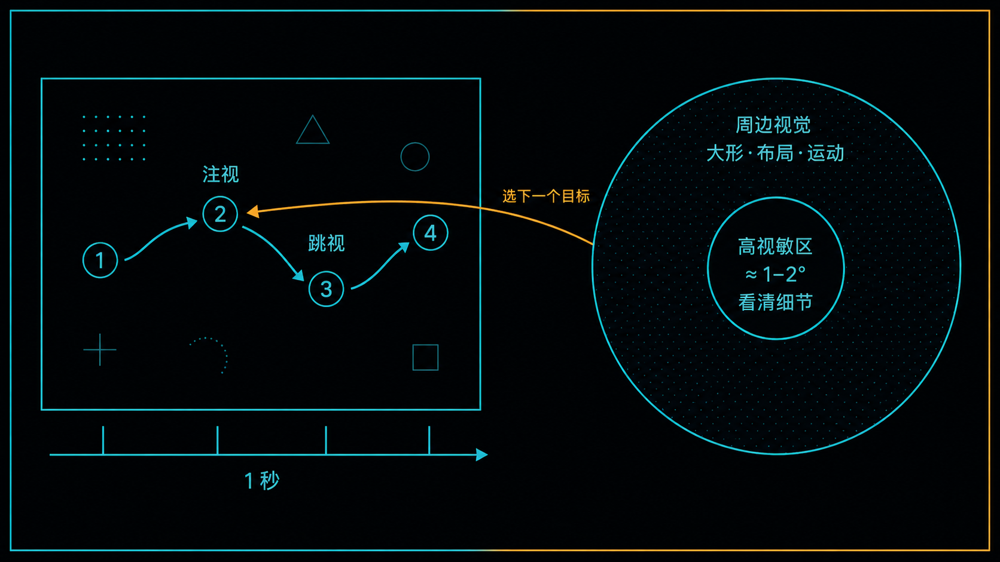
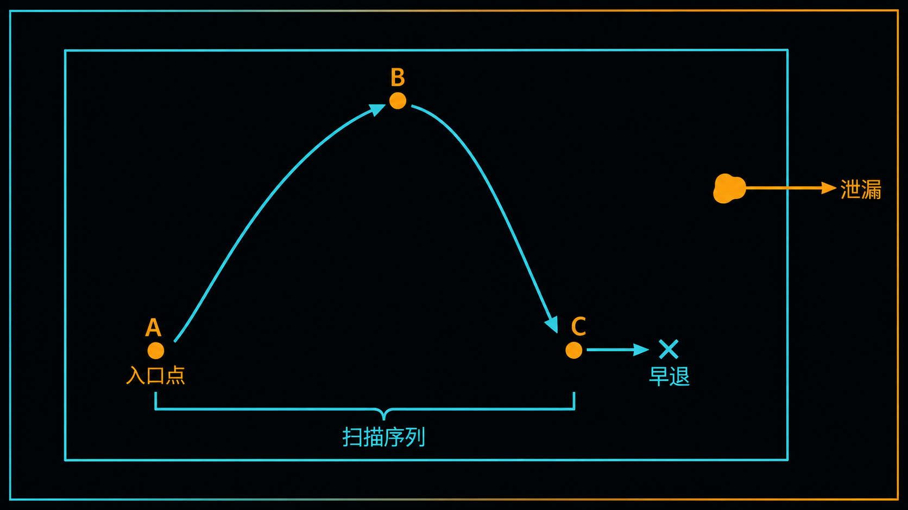
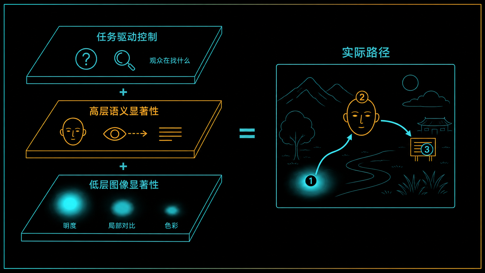
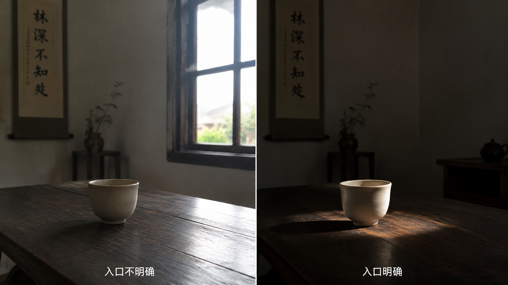

+++
title = "2-1 构图的本质：注意力预算的调度"
description = "构图不是把元素摆好看，而是调度观众有限的注意力：从哪儿开始看、按什么顺序读、什么时候离开。"
date = 2026-07-27
tags = ["摄影", "构图", "注意力", "视觉显著性", "扫描路径", "入口点", "眼动", "格式塔"]
categories = ["摄影"]
series = ["主线"]
showTableOfContents = true
+++

> 构图不是把元素摆好看，而是调度观众有限的注意力：从哪儿开始看、按什么顺序读、什么时候离开。

## 模块导言：模块二 · 构图几何与注意力预算

这个模块要解决一个问题：**「这张好看」和「那张乱」，能不能不靠感觉，而是靠一套说得清、查得出、能复现的标准？**

模块一我们把曝光拆成了一套决策系统——场景亮度怎么映射成信号、哪些细节留得住、装不下时先牺牲谁。那套系统回答的是「信息能不能留在画面里」。这个模块接着往下问一步：信息留住了，观众会按什么顺序去读它，会不会读错，会不会读到一半就走。

十六篇的路线是这样：先建立资源观与权重机制（#2-1 到 #2-3），再挖到视觉系统的底层规则（#2-4 格式塔分组、#2-5 大形优先），然后搭几何骨架（#2-6 引导线与流场、#2-7 平衡与力矩、#2-8 透视投影、#2-9 焦段与压缩感），接着处理画面的边界与空间（#2-10 边缘管理、#2-11 切线与粘连、#2-12 负空间、#2-13 层次与深度），最后把经典规则降级成启发式（#2-14）、把裁切当成二次调度（#2-15），收在一套可复现的自检流程上（#2-16）。

读完这个模块，你应该能做到两件事：按快门之前，预判观众的视线会往哪儿走；照片拍完之后，说得出「这张为什么乱」，并指出该动哪一个变量。

（这个模块在最初的大纲里排得靠后，我们把它提到了第二个来讲——构图是最多人卡住的地方。模块号按实际发布顺序走，不按当初的排列。）

---

## 破题：说不上哪儿不对的那张照片

你在街上拍到一张自认为不错的照片。人物的表情抓得准，曝光也没毛病——暗部干净，高光没爆，肤色落在你想要的那一档上。可发给朋友，对方看了两秒，回一句「挺好的」，就划走了。你自己再打开看，也觉得差点意思，但说不上差在哪。

这时候很容易开始怀疑参数：是不是光圈该再开大一点，是不是后期对比度不够。但问题多半不在那儿。

换个法子验一下：把这张照片给几个人各看三秒，然后只问一句——「你先看到的是什么？」如果答案五花八门，其中一个还是背景里那块白得发亮的店招，那就找到了。照片里的信息一样不少，只是观众根本没按你想的顺序去读它。

问题不在曝光，也不在参数，在于你没有安排观众怎么看。这就是这个模块的起点：**构图不是把元素摆得好看，而是调度观众有限的注意力。**

*图：曝光、表情、清晰度都没问题，可第一眼被拽走的是右侧那块发亮的店招——照片的信息没错，读取顺序错了*

## 注意力是有预算的

先回答一个更基础的问题：为什么「画面里多放点内容」几乎总是错的？

> 看一张照片，更像拿手电筒在黑屋子里扫，而不是打开吊灯把整间屋子照亮。手电照到的地方看得一清二楚；照不到的地方也不是全黑——你能看见家具的轮廓、门在哪边、有没有东西在动，只是看不清花纹。

这个比喻的两半都有生理依据，而且两半都重要。

视网膜上视力最好的是中央凹（Fovea）这一块，而其中分辨率最高的核心只有一两度——伸直手臂，差不多是大拇指指甲盖那么大。离开这个核心，辨认精细纹理和小字的能力迅速下降。所以人看图不是均匀扫描，而是「注视（Fixation）+ 跳视（Saccade）」交替推进：眼睛跳到某个位置停下来看清，停留两三百毫秒，再跳到下一个。

但周边视觉不是废的。它看不清细节，却能感知大形、明暗分布、空间布局、运动，以及粗略的语义——那一团东西大概是人还是树。更要紧的是，**下一次眼跳往哪儿去，主要靠周边视觉提供候选目标。** 中央凹负责看清，周边视觉负责开出「下一个看清哪儿」的候选名单——最终挑中哪个还受语义、任务和眼动自身习惯的影响，但名单是周边视觉开的。这也是为什么 #2-5 要花一整篇讲「大形」——大形恰好是周边视觉读得到、并据此导航的东西。

还有一件事常被忽略：第一眼不是空的。人在一次注视、甚至一百多毫秒之内，就能抓到场景的要旨（gist）——这是什么场合、大致什么结构、气氛如何。精细的「读」发生在之后那几次注视里。所以一张照片的开场其实分两步：先被整体扫一眼定调，再决定值不值得花注视去细看。

再叠上第二层——照片能拿到的时间很短。在手机信息流里往下划，一张照片常常只有一两秒。这一条随观看场景变化很大：翻画册可以停留几十秒，展览里在一张大画幅前站两分钟也正常。本篇讨论的主要是信息流这种短时浏览，因为那是如今绝大多数照片实际被看到的方式。

两头一凑，就是构图要面对的现实：**短时浏览里，观众能用来精细辨认的注视只有寥寥几次。** 你在画面里安排的每一个抢眼元素，都在跟别的元素抢这几次。放六个同样抢眼的东西，不会让观众多看六个地方，只会让这几次注视被分散到你控制不了的位置上。

「三五处」是个方便的心算数字，别把它当成生理硬指标——真实次数随任务、画面复杂度、观看时长浮动。它的用处在于把构图从「摆得好不好看」换成一个可以估算的分配问题：**这一张，我想让观众把有限的几次注视花在哪儿。**

*图：视力最好的那个核心只有一两度，负责「看清」；周边视觉看不清细节，却读得到大形、布局与运动，并为下一次跳视开出候选目标*

## 观看时间轴：入口、序列、出口

注视次数有限，接下来的问题是怎么花。

先把边界立清楚：下面这套讲的是**概率，不是遥控器**。同一张照片，不同的人、不同的心境，甚至同一个人看第二遍，视线走法都会不一样。构图能做的是提高某些落点、某个先后次序出现的可能性，让画面有一个比较稳定的注意力层级——不是给所有观众规定一条唯一路线。下面的「设计」都按这个口径读。

> 把一张照片想成一段三秒的短片，只不过镜头不在你手里，在观众的眼睛里。你能剪的不是画面，是他们的运镜顺序：从哪一格开始，接着切到哪儿，什么时候黑场。

这条时间轴由三个部件构成。

**入口点（Entry Point）**，视线的第一落点。如果你不设计它，观众并不会「随便看」，而是退回默认行为——眼动研究里反复观察到明显的中心偏好：在没有强引导的画面上，第一眼倾向于落在画面中央附近，然后再向外弹开。（这条也跟观看方式有关，比如图像突然出现在屏幕上时更明显。）所以「没有入口」的真实后果不是观众乱看，而是**你把开场让给了默认值**——起点由画布中心决定，之后往哪走则交给画面内容和观众自己。

**扫描序列（Scan Path）**，从入口出发，视线依次经过哪些地方。它决定的是信息的交付顺序：先看到人的表情、再看到手里攥着的东西，和倒过来看，是两个不同的读法。（顺序本身怎么生出意义，那是模块七叙事的活儿，这里只管路径怎么走。）

**出口（Exit）**，视线什么时候、从哪儿离开画面。这里有两种坏情况，得分开说：一种是**早退**——注视还没用完，人已经觉得看完了，因为画面里没有第二站，或者第二站不值得去；另一种是**泄漏**——画面边缘有块亮斑，或者有条线一路指向框外，把视线拽出去就没回来。（怎么把四条边封住，#2-10 专门讲。）

入口决定从哪开始，序列决定按什么顺序，出口决定什么时候结束。构图要做的，就是把这三样从纯随机推向可设计。

*图：入口点是第一落点，扫描序列是 A→B→C 的读取顺序，出口分两种坏情况——注视没用完的早退，和被边缘拽出画框的泄漏*

构图的产物因此不是一张静态的布局图，而是一条时间轴。

## 谁在改写这条时间轴

你设计好了路径，观众却不照着走——这几乎是常态。因为实际路径不是一股力量决定的，而是三层叠加的结果，而你能插手的程度逐层递减。

**第一层，低层图像显著性。** 视觉系统有一套不经过思考的抢眼机制：在亮度、局部对比、色彩、边缘方向、纹理密度上跟周围反差最大的地方，会自动从画面里浮出来。这一层只关乎图像属性，跟画的是什么无关。计算机视觉里有一整类显著性模型——Itti、Koch 与 Niebur 1998 年那套是经典——就是用多尺度的亮度、颜色对立与方向特征算出一张「显著图」，据此预测人会先看哪儿。

摄影师能大幅操控的正是这一层：曝光落点、机位、取景范围、后期的局部明暗，改的都是它。落到实操，我们会把它收成三个常用旋钮——明度、局部对比、色彩强度——下一篇 #2-2 展开。这三个是**操作模型，不是视觉显著性的完整机制**：真实的显著性还牵涉边缘方向、尺寸、纹理密度，「饱和度」也不等同于模型里的颜色对立通道。三个旋钮好用，是因为它们恰好是你在相机和后期里能直接拧的那几个。

这一层我们在模块一其实已经动过手了。#1-11 的 Zone 落子、#1-12 的中间调锚定，表面上是在决定「脸放在第几档」，同时也就决定了「谁在画面里最亮」——而明亮、高反差的区域通常更容易拿到注视。曝光决策一直在悄悄分配注意力预算，只是当时我们是从信号的角度看它的。

**第二层，高层语义显著性。** 人脸、眼睛（以及眼睛看向的方向）、文字、人的轮廓、一眼能认出的物体，会强行插队——哪怕它们在图像属性上并不突出。这一层仍然由画面本身带来，不是观众带来的，只不过起作用的是「认出来是什么」而不是「亮不亮」。它的分量常被低估：有研究把画面按「每块区域含多少可理解的意义」画成图，发现在自由观看下，它预测注视位置比低层显著图更准。

这一层删不掉，但能削弱：缩小它、挪出关键区、虚化、遮挡、裁掉、压低它的对比。想在画面里放一张清晰的脸、又让观众先看别处，代价很高；但把那张脸缩到很小、推进暗部，或者干脆等它走开，都是可行的。背景里一行看得清的字很容易被读一遍——具体多容易，跟字号、位置、以及观众熟不熟悉那套文字都有关。

**第三层，任务驱动控制。** 观众带着自己的目的在看：他在找什么、要回答什么问题、有没有先入之见。Yarbus 在 1960 年代做过一组经典演示——同一幅画，每次换一个问题（这家人有多富裕、他们几岁、记住他们的衣着），注视分布明显不同。那组演示来自很少的观察者、性质偏定性；后续研究总体支持「任务会改变眼动」，但反过来想从扫描路径倒推观众在执行什么任务，结果并不可靠。对摄影师来说够用的结论是：**观众带着什么目的来看，你控制不了，但可以预判**——发在哪个平台、配了什么标题、放在哪一组照片的第几张，都会给观众预设一个任务。

三层叠加，才大致决定了实际发生的路径。分工可以这么记：

- **低层显著性是你的旋钮。** 随手能调，是构图的主要工具。
- **高层语义是你的地形。** 删不掉，只能绕、削弱，或者顺着用——把强势的语义元素当入口或第二站，往往比跟它对抗划算。
- **任务是观众自带的天气。** 你只能预报，顺带用标题和上下文施加一点影响。

这三层是给拍摄用的简化模型，不是完整的视觉生理学。真实的眼动还带着一些跟画面内容无关的习惯——比如前面说的中心偏好，比如眼睛更倾向于小幅度、水平方向的跳转。它们不归这三层管，但会一起塑造最终那条路径。

*图：底层是可调的图像显著性，中层是删不掉只能削弱的语义显著性，顶层是观众自带的任务——三层叠加才是观众实际走的那条路径*

## 把「好看」翻译成三条可诊断的判据

「氛围感」「高级感」「有质感」这类词的麻烦，不在于它们说错了，而在于它们不可操作——听完你不知道该改哪儿。这个模块统一用三条判据来替代它们，每一条都对应一个能当场问出来的动作。

**判据一，入口是否清楚。** 把照片给一个没看过的人，三秒后拿走，问「你先看到了什么」。答案和你想的主体一致，这项过。不一致，说明入口设计失败，通常是别的东西比主体更亮、反差更大，或者主体太小、太靠边。

**判据二，层级是否清楚。** 序列设计得好不好，能查的其实是它的影子——层级清不清楚。再追一句「然后你还注意到了什么」。对方接着说出来的东西和你设计的第二、第三站对得上，或者至少不打架，这项过。如果答不上来，或者说「就在几个地方来回跳」，那说明画面里有好几个权重相当的元素在互相抢。这正是 #2-3 要用信噪比重新定义的那个「乱」。

注意问的是「注意到了什么」，而不是「眼睛怎么动的」。人其实报告不准自己的视线轨迹，连有没有看过某个东西都常常记错。你拿到的是**主观感知与记忆的顺序**，它和真实扫描路径相关但不等同。做构图诊断够用，别当眼动数据。

**判据三，有没有泄漏或早退。** 最后问「有没有什么东西一直把你眼睛往边上拉」。如果对方提到边缘的亮块、跑出画面的线条、角落里的杂物，那是泄漏；如果对方不到两秒就说「看完了」，那是早退。

这三条把主观感受换成了可以重复执行的检查动作。但它们不是「好看」的定义——它们诊断的是一类照片：有明确主体、希望信息按顺序交付的照片。有整类作品不吃这一套。重复图案与纹理摄影本来就没有唯一入口，全画面均匀正是目的；群像和环境肖像常常要求观众自己在画面里游走；极简风景可能只有一个元素，谈不上序列；还有些作品刻意制造多义与暧昧，让你在两个可能的主体之间拿不定主意，那恰恰是它想要的效果。碰上这类照片，这三条会给出「不合格」的误判——该被怀疑的是判据，不是照片。

把它们当检查清单，别当及格线。

在它们管用的那类照片上，模块二剩下的十五篇，全都在优化其中某一项：

- **优化入口**：三个权重旋钮 #2-2、大形与眯眼法 #2-5
- **优化序列**：引导线与流场 #2-6、平衡与力矩 #2-7、层次与深度 #2-13、经典规则 #2-14
- **减少泄漏与超支**：「乱」的工程定义 #2-3、格式塔分组 #2-4、边缘管理 #2-10、切线与粘连 #2-11、负空间 #2-12
- **事后重新调度**：裁切 #2-15
- **把整套流程变成可复现的自检**：#2-16

透视 #2-8 与焦段 #2-9 稍微特殊，它们回答的是这条路径的舞台怎么搭。按我们的全局口径，透视只由相机位置和拍摄距离决定，焦段改变的是取景范围——这两件事经常被混着讲，到那两篇会拆干净。

*图：同一个杯子、同一张桌子、同一个机位——左边把窗户带进了画面，它比杯子亮，你的眼睛先去了窗户；右边把窗户移出去、让一小束光落在杯子上，杯子成了画面里最亮的地方*

## 拍摄行动点

1. **做一次三秒测试——记住它是口头回忆，不是眼动仪。** 挑三张你自己拍的、觉得「还行但说不上好」的照片，找 3–5 个人，每人看三秒后拿走。用同一块屏幕、大致相同的观看距离，问两个分开的问题：「第一眼看到什么」和「你觉得这张的主体是谁」——这两个答案经常不一样，而差异本身就是信息。要清楚你拿到的是事后回忆，会被语言和推理修饰过，跟真实扫描路径不是一回事；但作为构图诊断，它足够便宜也足够灵敏。
2. **给同一个主体设计两个入口。** 找个静止的对象（桌上的杯子、窗边的植物都行），拍两张：第一张让主体成为画面里最亮的地方，第二张让背景某处比它更亮（比如把窗户带进来）。回看这两张，留意自己的眼睛第一下落在哪。你会发现改变入口根本不需要移动主体：改取景（把窗户框进来或框出去）、换机位、或者改变光落在哪儿，就够了。但别指望整体曝光：全局加减曝光会把主体和背景一起抬起或一起压下去，改不了谁比谁亮。真要单独压暗背景或提亮主体，靠的是布光、取景，或者后期的局部调整。
3. **做一次边缘与语义巡查。** 拿最近拍的十张照片，先只看四条边往里大约画面宽度 5%–10% 的一圈，把亮块、断掉的手脚、指向画外的线条列出来；再看一遍整张，专门找背景里的人脸、文字、路牌、logo 和其他一眼能认出的东西——它们不靠亮度抢预算，靠的是「被认出来」。先别改，只是列。这份清单会告诉你，你的注意力预算平时都漏在哪儿。

## 收尾

读这篇之前，构图在你眼里可能是一堆规则：三分法、对角线、留白、对称。读完之后，它应该变成一个资源分配问题——短时浏览里观众只有寥寥几次「看清」的机会，你决定这几次给谁、按什么顺序给、什么时候收尾。那些规则并没有被推翻，只是降了级：它们不再是必须遵守的信条，而是解决特定调度问题的快捷按钮，哪个按钮对应哪个问题，#2-14 会一条条对上。

框架有了，判据也有了，还缺最关键的一环：观众的视线到底凭什么被某个地方吸引？「更亮的、反差更大的、颜色更跳的更容易拿到注视」这句话，得拆成可以调的旋钮才有用。下一篇 #2-2，我们来看三个权重旋钮——明度、局部对比、色彩强度——它们各自怎么改变视觉权重，以及为什么调高其中一个，往往意味着另一个必须让路。

## 参考资料 / 推荐阅读

- Buswell, G. T., *How People Look at Pictures*（1935）——最早用眼动记录系统研究「人怎么读一张画面」的工作。
- Yarbus, A. L., *Eye Movements and Vision*（1967）——任务改变注视分布的经典演示来源。
- Greene, M. R., Liu, T. & Wolfe, J. M., *Reconsidering Yarbus: A failure to predict observers' task from eye movement patterns*（Vision Research, 2012）——任务效应成立，但由扫描路径反推任务并不可靠。
- Itti, L., Koch, C. & Niebur, E., *A Model of Saliency-Based Visual Attention for Rapid Scene Analysis*（1998）——低层显著性的计算模型，本文第一层的理论依据。
- Henderson, J. M. & Hayes, T. R., *Meaning-based guidance of attention in scenes as revealed by meaning maps*（Nature Human Behaviour, 2017）——自由观看下，语义意义比低层显著图更能预测注视位置，本文第二层的依据。
- Tatler, B. W., *The Central Fixation Bias in Scene Viewing*（2007）——中心偏好现象的系统讨论。
- Thorpe, S., Fize, D. & Marlot, C., *Speed of processing in the human visual system*（Nature, 1996）——复杂自然图像可以在约 150 ms 内完成分类，说明「第一眼」在极短时间内就拿到了信息。
- Larson, A. M. & Loschky, L. C., *The contributions of central versus peripheral vision to scene gist recognition*（Journal of Vision, 2009）——中央与周边视觉各自对「一眼看懂这是什么场合」的贡献，正对应本文第一节的分工。
- Barnbaum, B., *The Art of Photography*——构图规则的经典整理；读的时候不妨把每条规则翻译成一句「它在优化入口、序列还是出口」。
