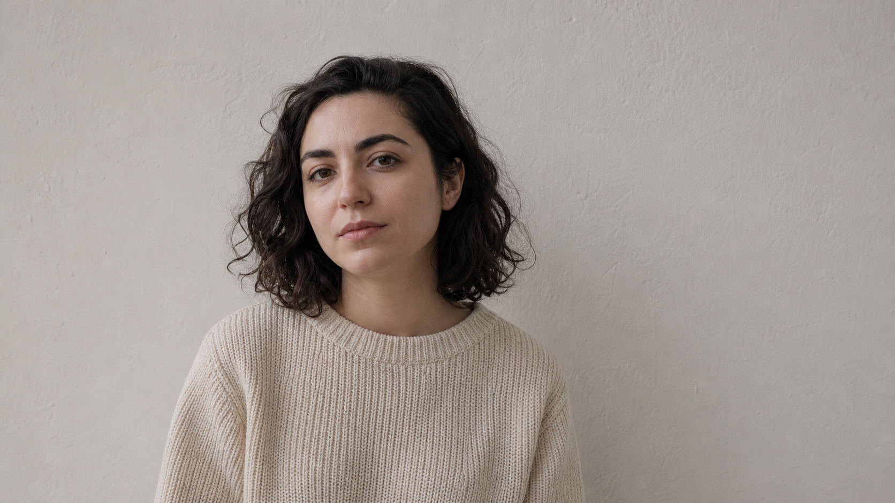
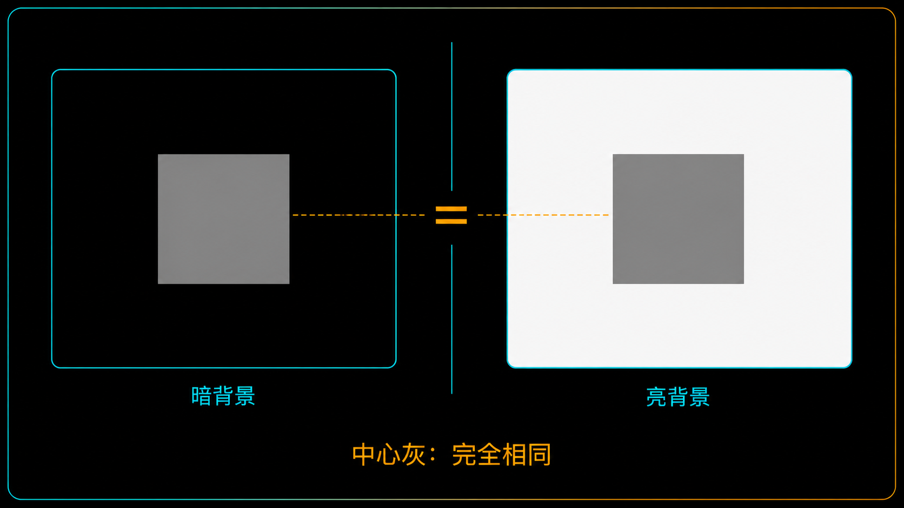
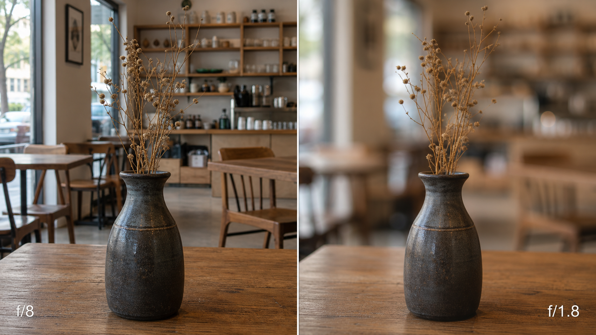
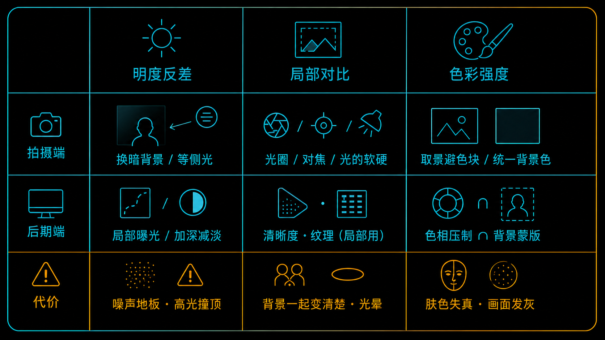
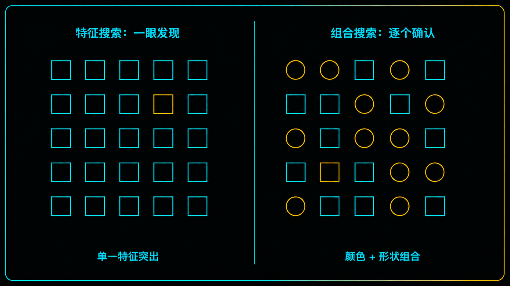

+++
title = "2-2 三大权重旋钮：明度 / 局部对比 / 色彩强度"
description = "抢眼的从来不是「亮」，而是「和周围差多少」——这是构图里你最能直接拧动的三个旋钮。"
date = 2026-08-01
tags = ["摄影", "构图", "明度", "局部对比", "色彩", "视觉权重", "注意力", "视觉搜索"]
categories = ["摄影"]
series = ["主线"]
showTableOfContents = true
+++

> 抢眼的从来不是「亮」，而是「和周围差多少」——这是构图里你最能直接拧动的三个旋钮。

## 破题：把主体调亮了，它还是没跳出来

咖啡馆靠窗的位置，朋友穿一件米色毛衣，背后是一面刷白的墙。你觉得人有点「陷」在背景里，于是加了半档曝光补偿——照片确实亮了，人还是陷在里面。再加一档，整张开始发灰，人依旧没出来。

问题不在曝光量。米色毛衣和白墙，在加曝光之前差不多一样亮；加完曝光，它们还是差不多一样亮。你抬的是整张画面的水位，主体和背景之间的那点高低差，基本没动。

#2-1 我们说过，构图是在调度观众有限的注意力，而实际路径由三层叠加决定：低层图像显著性是你的旋钮，高层语义是你的地形，观众自带的任务是天气。这一篇只处理最下面那层——把「低层显著性」收成三个你在相机和后期里真能拧的旋钮：明度反差、局部对比、色彩强度。

不过在拧之前，得先弄清楚它们拧的到底是什么。

*图：曝光没有任何问题——暗部干净、高光没爆，毛衣和墙几乎一样亮，整个躯干直接融进了背景；还能把人拉住的，只剩头发的深色和一张脸——而脸不归这三个旋钮管，它属于 #2-1 说的第二层。这种情况下加曝光补偿帮不上忙，因为它把两边一起抬走了*

## 一、权重是「差」，不是「值」

先解决那个最反直觉的地方：为什么把主体调亮，它不一定更抢眼。

> 抢注意力这件事，更像声音，不像灯光。深夜房间里 40 分贝的脚步声很吵；正午菜市场里 80 分贝的叫卖没人回头。分贝数高得多的那个反而没被听见——而且分贝这个单位本身就是个比值刻度，它量的从来不是绝对能量，是高出参考值多少。

视觉系统处理亮度也是这个路子。#2-1 提到的那类显著性模型（Itti、Koch 与 Niebur 1998 那套是经典），第一步不是去画面里找最亮的像素，而是拿一小块跟它周围一圈比，算两者的**差异幅度**。注意是幅度，不分方向——暗物体落在亮背景上，和亮物体落在暗背景上，同样能拿到高分。模型里跑的是亮度、颜色对立、边缘方向三条通道，各算一遍、各自归一化，最后才合成那张显著图。

这里要先说清楚一件事，免得后面对不上号：**本篇的三个旋钮，不是那三条通道的一一对应版本。** 明度反差和局部对比其实都住在亮度这一域里，区别在尺度——前者说的是大尺度上的明暗关系（主体和它身后那片背景差多少），后者说的是中小尺度上的起伏（边缘有多硬、纹理有多密）；色彩强度对得上颜色对立；而模型里的边缘方向通道，本篇不展开，它是 #2-6 引导线与流场的地基。

之所以要拆成三个，是因为它们在**你手上**是三套完全不同的操作：换一块背景和开大一级光圈是两回事，尽管改的都是亮度域里的东西。也正因为如此，它们各自的实用标尺并不通用。

> 明度反差可以用档位差当尺子——差几档，接得上模块一整套曝光语言；色彩强度量的是对立方向上的色差；局部对比则是边缘能量、纹理密度、空间频率这一类更宽的操作概念，没有一个像「档」这么干净的单位。三者共享的是同一条原则——相对于周围形成差异——但不共享量纲，也不能互相换算。

「周围一圈」有多大，本身也是变量。同一套机制会在多个尺度上各跑一遍，于是一个很小但极亮的反光点，和半面略亮的白墙，会在不同尺度上分别拿分。明度反差与局部对比的分界正在这里：它们不是两种不同的物理量，是同一种物理量在两个尺度带上的表现。这也是为什么「主体够大」和「主体够亮」是两件事，而 #2-5 要专门花一篇讲大形。

回到那件米色毛衣：它和白墙的档位差本来就小，而全局曝光在没撞到两端、也没经过强烈曲线映射的时候，是把两边按同一比例一起缩放——档位差基本不变。它抬得动水位，抬不出**选择性**。（真要说全局操作完全无效也不对：一旦推到曲线的肩部或趾部，两端会被压缩，反差反而变小，这正是 #1-15 讲 roll-off 时那条曲线在做的事。只是那种改变你没法只施加给主体。）

顺着这条定义还能推出一个很实用的推论：**提高主体的权重，和降低背景的权重，是同一件事。** 而后者往往便宜得多。你没办法让那件毛衣自己发光，但你可以让朋友往左挪两步，让背后从白墙变成深色的木门洞——档位差一下就有了，曝光一动没动。

*图：中间那块灰的绝对亮度在两边完全相同，但它在暗背景上是全场焦点，在亮背景上几乎消失——显著性算的是它和周围一圈的差异幅度，不是像素值本身*

三个旋钮遵循同一条原则：主体得相对于它紧邻的背景形成差异。但它们作用在不同的特征通道、不同的尺度上，而最终谁更显著，还要看面积，以及画面整体处在什么亮度水平——同样的相对反差落在很暗的区域里，未必和落在中间调时一样明显。

## 二、三个旋钮：拧什么、在哪拧、代价是什么

低层显著性的特征集不止这些，边缘方向、尺寸、运动都在里面。我们单独拎出这三个，是因为它们同时满足两个条件：权重贡献大，而且你在取景器里和后期滑块上都能直接动它。它们是一套操作模型，不是显著性机制的全集。

### 旋钮一：明度反差——最稳，也最便宜

在许多自然场景里，明度反差是三个旋钮中最稳定、最容易判断、也最容易控制的一个。但它的权重并不永远排第一——一片灰蒙蒙的雨天里，一块饱和色能轻松盖过它，这一节末尾还会回到这件事。

**拍摄端**能拧的地方按便宜程度排：换背景（挪两步，让主体背后从亮墙变成暗门洞、树荫、逆光下的阴影面）；等光或换机位，让光落在主体上而不落在背景上（侧逆光的场景里，背景常常整片在阴影里）；用前景遮挡压暗周边；取景时把亮块框出去。**后期端**则是局部曝光、渐变与径向蒙版，以及最老派也最有效的 dodge & burn。

要不要给个数？借 #1-11 的那把尺子——Zone 系统把纯黑到纯白离散成 0 到 10 共 11 档，相邻两档差一档光。但要说清楚：Zone 只提供刻度，不提供阈值，「差几档才够」不是从它推出来的。我自己的试拍起点是 **1 到 2 档**，常见场景下够用；主体面积小、背景复杂、或者整体处在低照度环境里，这个数就得往上加。想找到属于你自己的那个数，最快的办法是拍一组阶梯：让主体与紧邻背景分别差 0.5、1、2、3 档各拍一张，看从哪一张开始，主体是「一眼就到」而不是「找一下才看到」。

代价很明确，而且模块一已经把两条边界画好了。背景压过头，暗部跌进噪声地板（#1-9 讲的可用 DR 下限：能记录到不等于能用），后期一 push 就是一片噪点；主体提过头，有纹理的高光撞上满阱天花板被削平（#1-10），肤色通常是红通道先到顶——不过具体哪个通道先爆，取决于光源色温和白平衡增益，真要判断得看 RGB 直方图，别凭默认——某个通道一旦被削掉，肤色就崩了。所以明度旋钮的可用行程是被曝光决定的，反过来说，#1-11 的 Zone 落子和 #1-12 的中间调锚定其实早就在做第一次权重分配，只是那时我们是从「信息保不保得住」的角度在看它。

想快速看一眼这个旋钮拧到位没有，可以转成黑白。颜色一撤，明度关系会清楚很多。（这只是单点验证，不是结论——黑白转换本身带着一套通道混合权重，换一套配置明暗关系就会重排。完整的自检流程留到 #2-16。）

### 旋钮二：局部对比——决定「哪里看起来清楚」

先跟另一个概念分开：局部对比不是整体反差。整体反差说的是黑场到白场拉多开；局部对比说的是中小尺度上的明暗起伏——边缘有多硬，纹理有多密。一张雾天照片可以整体反差很低，但近处树皮的局部对比一点不低；反过来也成立。

> 局部对比之于画面，像清晰度之于一段录音。音量是另一回事：一句清清楚楚的耳语，比一段糊成一片的喊叫更容易让人凑过去听。

边缘硬、纹理密的区域，对视觉系统来说信息密度高，值得花一次注视去读。反过来，一块糊掉的区域几乎不产生中小尺度的反差。

**这正是虚化真正在做的事。** 大光圈的作用机制不是「背景变好看了」，而是把背景里的高频信息——锐利的边缘、细密的纹理——大幅衰减掉。与其把它想成一块能抹掉背景的橡皮擦，不如想成一层**磨砂玻璃**：细节没了，大块的明暗、成片的颜色、还能认出轮廓的人形，全都留着，也都还在拿权重。这个区别很实用，因为它告诉你什么时候「再开大一点」是没用的：背景里那个人形只要还能被认出来，语义那一层（#2-1 的第二层）就还在给它加权，光靠光圈解决不了，得靠挪机位或者裁掉。

**拍摄端**：光圈、拍摄距离和焦段共同决定景深，对焦落点决定谁清楚，光的软硬影响阴影边缘的过渡宽度。光的软硬这里要说准一点——它取决于光源在主体那儿张开多大角度，也就是**相对视角尺寸**，而不是灯本身有多大：同一盏灯挪近，在主体看来变大了，光就变软、阴影边缘的过渡变宽；挪远则相反。光越硬，明暗跳变越窄越强。但纹理能不能被表现出来，还取决于光的方向、表面结构和镜头的成像素质：擦着表面打过来的柔光，常常比正面来的硬光更能把纹理拉出来。这里顺带守一下全局口径：透视只跟机位和拍摄距离有关，焦段改变的是取景范围和景深，不改变同机位下的比例关系——这两件事经常被混着讲，#2-8 与 #2-9 会拆干净。**后期端**：清晰度、纹理、局部对比这几个滑块，加上局部锐化和蒙版模糊。

这是三个旋钮里代价最大的一个，原因在于那些滑块默认是全局的。全局拉高纹理，背景那堆杂物会跟主体一起变清楚——等于顺手给噪声也加了权重，净效果常常接近零；同时噪点被一并放大，高反差边缘还容易出现光晕（halo）。另一头，在高光端压局部对比会牺牲通透，这笔账 #1-15 已经算过：高光微反差被压平换来柔和的滚降，代价是不够锐利。

> 局部对比必须局部用。全局那一版滑块，多数时候是在给你的背景做免费加权。

*图：同一个机位、同一个主体，只改光圈，并且用快门把曝光补回来了（f/8 · 1/13 s 与 f/1.8 · 1/250 s，相差约四又三分之一档），两张整体亮度一致，差异才不是亮度造成的。f/8 那一版里，背景的椅子、杯子、货架都还保留着边缘和纹理，各自都在拿权重；开到 f/1.8，它们一件没少，高频细节被削掉，但大块的明暗和颜色还在。主要差异来自景深——光圈同时也会改变镜头的锐度、暗角和像差表现，所以它并不是唯一变量*

### 旋钮三：色彩强度——最像作弊，也最容易误判

常见操作是这样的：觉得主体不够跳，把整张照片的饱和度拉到 +25。主体确实更艳了，但没更抢眼——因为背景的绿树、蓝天、路人的红外套也一起艳了。

这里需要一次纠偏。我们手上的滑块叫饱和度、自然饱和度，但视觉系统里并没有一条叫「饱和度」的通道。颜色在早期视觉里走的是对立通道——红对绿、蓝对黄。真正决定一块颜色跳不跳的，是它在这些方向上跟周围差多少。

> 一块中等饱和度的橙色，落在一片青灰色的环境里，比一整片高饱和绿地里的一棵高饱和绿树抢眼得多。前者是环境里唯一的暖色，后者只是一堆绿里的又一团绿。

这就是色彩唯一性（color singleton）：一块颜色的权重不只看它有多浓，更取决于它和周围差多少、在整张画面的色彩分布里孤不孤立。

**拍摄端**：挪机位把那块偷权重的色块移出画面；等一个穿对颜色的人走进来；换角度让背景色统一（一整面同色的墙比一堵花墙好用太多）；白平衡决定整体色偏（完整的色彩语言是模块 5 的活儿）。**后期端**首选按色相单独处理——把背景里那块抢眼的品红压下去，比全局降饱和精确得多。但要清楚 HSL 认的是色相、不是位置：画面里所有落进这个色相范围的东西都会跟着变，主体的衣服、嘴唇或者肤色如果正好在附近，就会被一起改掉。真要干净，把色相选择再和一层背景蒙版相交，让它只在背景生效。

代价有两头。全局加饱和的问题是没有空间选择性——它把画面里所有带颜色的东西一起推上去，背景要是也有颜色，干扰项跟着一起变强。这里有个例外值得记住：如果背景本来就接近中性灰——阴天的水泥街道、雾天的湖面、冬天的裸树林——全局加饱和确实可能让唯一那个有颜色的主体更跳，因为它几乎只作用在主体身上。这正是「低饱和环境里色彩能后来居上」的另一面：不是全局操作忽然变好用了，是这个场景恰好替你完成了空间选择。另一头，全局加饱和还会把肤色推离肤色轴（健康肤色在色彩空间里的那条分布轨迹，模块 5 详述），人一艳就假；而把背景饱和度压得太狠，画面开始发灰——观众说不出你压了什么，只会觉得这张「后期味太重」。

*图：三个旋钮的完整对照——每一个都有拍摄端和后期端两种拧法，也都有各自会撞上的墙*

## 三、唯一性打败堆料

那既然三个旋钮都能加权重，主体全给满不就好了——最亮、最锐、最艳。

这是个很自然的想法，但视觉搜索的经典结果给出了相反的答案。当目标在**单一**基础特征维度上跟一群同质的干扰项不同——一堆绿方块里的一个红方块——找到它几乎不花力气，而且再加多少个干扰项，用时基本不变。这就是 pop-out。而当目标要靠**多个维度的组合**才能区分——一堆红圆和绿方里找那个红方——搜索效率会明显下降，干扰项越多越慢。（Treisman 与 Gelade 1980 年的特征整合理论正是从这组对照来的。）

先划清适用边界：这些实验用的是干扰项高度同质的搜索阵列，真实照片没那么听话。后来的引导搜索模型把「真能引导注意力」的特征收得很窄——颜色、方向、大小、运动是其中最没有争议的几项——同时也说明，组合搜索并不是老老实实一个个数过去，颜色、场景结构和你脑子里的目标模板都会给它提供引导。所以下面两条要当作**设计启发**，不是自然照片里的铁律。

**第一，唯一性比强度重要。** 主体只要在一个维度上是画面里独一份的——全场唯一亮的、唯一清楚的、唯一带暖色的——入口通常就成立了。反过来，三个维度都调到最强，但每个维度上都还有别的东西站在同一水平，观众就得多花几次注视才能确认谁是主角。

**第二，堆料常常是自毁。** 原因在于你手上的工具默认是全局的：拉曝光、拉饱和、拉纹理，抬的都是整张照片。三样一起拉，主体和背景一起上升，唯一性反而被抹平了。这也是 #2-1 结尾那句「调高其中一个，往往意味着另一个必须让路」的真正含义——让路的不是旋钮之间，是主体和背景之间：**权重是相对量，给主体加权重和给背景减权重本来就是同一个动作的两面**，而全局滑块把两边一起动，抬的只是水位。

三个旋钮不等价，排序还随场景变。多数自然场景里明度最稳；在整体低饱和的环境里（雨天、雾天、水泥色的城市街区），一小块饱和色能后来居上；在密集纹理的场景里（树林、市集、砖墙），局部对比最容易失控——你以为在突出主体，实际上背景的纹理密度一直在跟它抢。

最后一条边界，是旋钮管不到的地方。背景里那张清晰的人脸、那行看得懂的字，权重不来自这三个旋钮，来自「被认出来」——#2-1 讲的第二层。降饱和、压暗、虚化都只能削弱它们，删不掉，而且它们经常强到足以盖过你精心拧好的三个旋钮。真要处理，得动取景、机位、虚化程度或者裁切。把它移出画面，永远比在后期跟它较劲划算。

*图：左边是特征搜索——目标只靠「颜色」这一个维度就跟全场不同，找到它几乎不花时间，加多少干扰项都一样；右边是组合搜索——画面里既有琥珀色的圆，也有青色的方，目标是唯一那个「琥珀色的方」，得靠两个特征的组合才能确认，找起来明显慢*

旋钮拧对了，只解决了「主体够不够重」这半个问题。画面还可能因为另一件事乱：没人管的高权重点太多，预算漏得到处都是。那是 #2-3 的题目。

## 拍摄行动点

1. **三个独立的小实验：每次只让一个旋钮起作用。** 这三个不是同一组对照，各做各的——因为换背景和开光圈本来就动不到同一个东西，硬凑成一组只会让变量混在一起。
    - **明度**：机位、光、光圈全部固定，只在主体背后换一块深色背景板（一张深色卡纸就够），拍一张有、一张没有。
    - **局部对比**：机位、背景、光全部固定，只改光圈，从 f/8 开到镜头最大附近（f/1.8 - f/2.8）。**这一组有个坑**：改光圈会同时改变进光量，从 f/8 到 f/1.8 差了四档多，必须用快门或 ISO 把曝光补回来，否则你比较的不是虚化，是亮度。
    - **色彩**：机位、光、光圈全部固定，只把主体旁边那块抢眼的色块，换成一块跟背景同色、明度也差不多的东西。
    
    三组各看三秒，记下第一眼落在哪。你要找的不是哪张最好看，而是哪个旋钮在这个场景里最有效——这个答案会随场景变，攒多了就是你的经验。
    
2. **反向练习：找出偷权重的那一个。** 挑一张你觉得「主体不够突出」的旧照片，用同一套黑白转换配置转成黑白（两版之间别去动通道混合器，否则明暗关系会被重排，比较就不作数了）。如果黑白版里主体明显更站得住，那颜色通道很可能在干扰——回到彩色版确认：找出那块比主体更艳或更孤立的色块，把它的色相单独压下去（不要全局降饱和），看主体是不是回来了。
3. **给「堆料」做一次对照。** 同一张 RAW 导出两版：A 版只做一件事，把背景压暗一档半；B 版三样全上，加曝光、加饱和、加纹理，各拉到你平时的习惯值。放在一起看，然后问自己一句：B 版的主体，是不是其实也没比背景更突出？

## 收尾

读这篇之前，「让主体更突出」大概是一句只能凭感觉执行的话。读完之后，它应该变成三个能报数的量：主体与紧邻背景差了几档、主体是不是画面里局部对比最高的区域、主体的颜色在画面的色彩分布里孤不孤立。比这三条更要紧的是那条统一的原则——权重来自相对于周围的差异，所以全局操作抬的永远是整张照片的水位，很难只把主体抬起来；「给主体加权重」和「给背景减权重」，从一开始就是同一件事。

但把主体调重，只解决了一半。你大概见过这样的照片：主体确实够亮、够清楚、够跳，画面依然乱得让人不想多看——因为除了主体，还有五六个没人管的高权重点在同时抢。下一篇 #2-3，我们给「乱」一个工程定义，把它写成信噪比，看看预算到底漏在哪儿，以及为什么「元素多」和「乱」根本不是一回事。

## 参考资料 / 推荐阅读

- Itti, L., Koch, C. & Niebur, E., *A Model of Saliency-Based Visual Attention for Rapid Scene Analysis*（IEEE TPAMI, 1998）——多尺度的中心-周边差异与跨通道归一化，本篇「权重来自局部反差」的直接依据。要注意模型的三条通道（亮度 / 颜色 / 方向）和本篇三个操作旋钮不是一一对应关系。
- Treisman, A. & Gelade, G., *A Feature-Integration Theory of Attention*（Cognitive Psychology, 1980）——单一特征的高效搜索与组合特征的低效搜索，pop-out 的经典对照。
- Wolfe, J. M. & Horowitz, T. S., *Five factors that guide attention in visual search*（Nature Human Behaviour, 2017）——到底哪些特征真的能引导注意力，以及这份清单为什么比想象中短得多。
- Wolfe, J. M., *Guided Search 6.0: An updated model of visual search*（Psychonomic Bulletin & Review, 2021）——把场景结构、语义与搜索历史一并纳入的现代版本，本篇给 pop-out 划边界的依据。
- Adams, A., *The Negative*——Zone 系统的原始出处，本篇借它的档位尺子来量明度差；但「差几档才够」是实拍经验，不是 Zone 系统的结论。
- 回看模块一的 #1-9、#1-10 与 #1-15——可用 DR 的地板、高光的天花板、以及高光微反差与柔和度的权衡，正是明度与局部对比这两个旋钮的行程边界。
