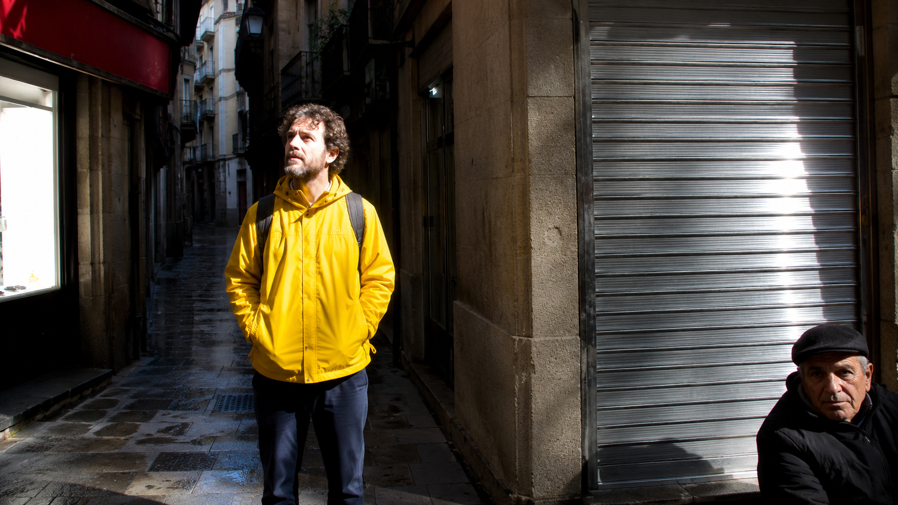
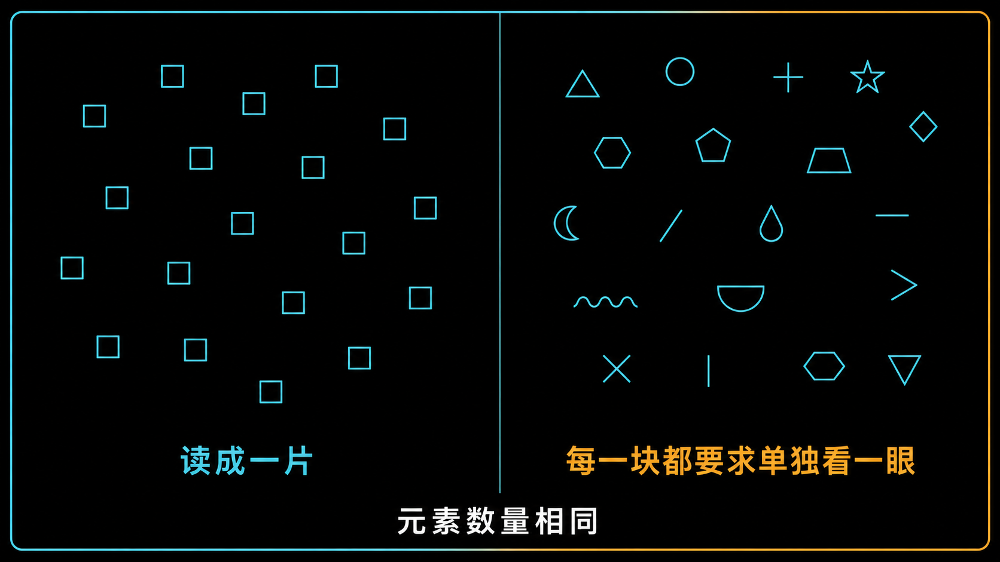
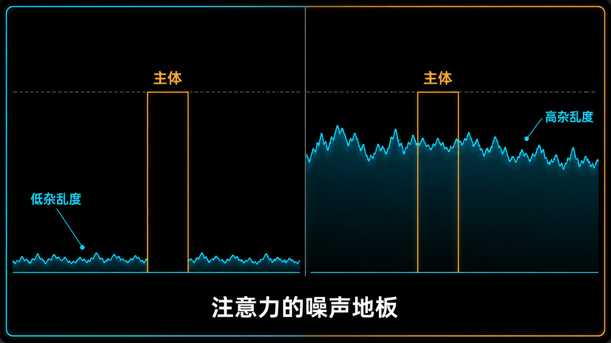
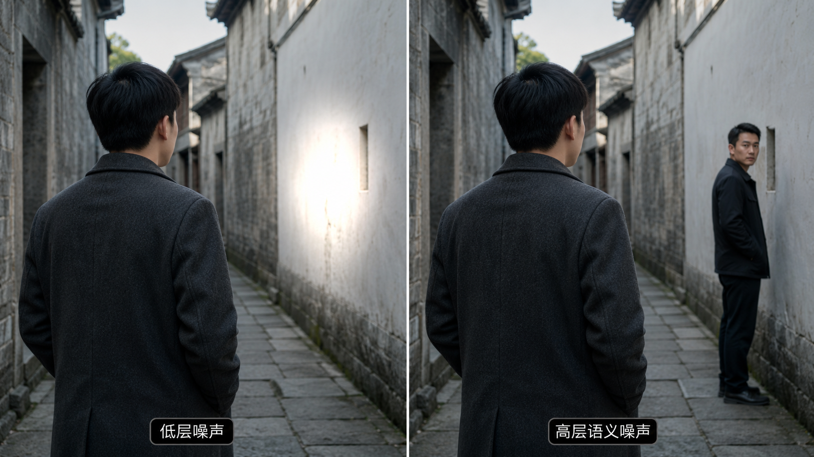
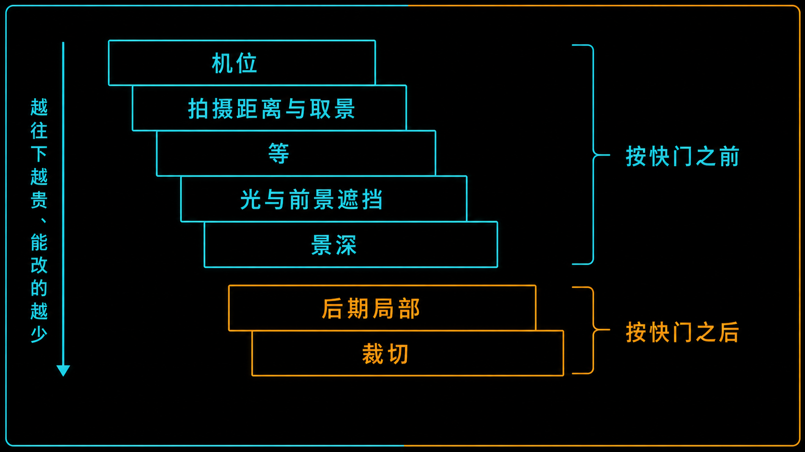

+++
title = "2-3 「画面乱」的工程定义：信噪比过低与权重泄漏"
description = "乱不等于元素多，是没人管的高权重点太多——先看噪声的权重来自哪一层，再决定拧旋钮还是挪脚。"
date = 2026-08-09
tags = ["摄影", "构图", "信噪比", "视觉噪声", "权重泄漏", "干扰项", "注意力", "降噪"]
categories = ["摄影"]
series = ["主线"]
showTableOfContents = true
+++

> 乱不等于元素多，是没人管的高权重点太多——先看噪声的权重来自哪一层，再决定拧旋钮还是挪脚。

## 破题：主体够重了，画面还是乱

老街上给朋友拍了一张。人站在光里，比身后的墙亮出一档多，边缘清楚，穿的还是全场唯一一件亮黄色外套——#2-2 讲的那三个旋钮，明度反差、局部对比、色彩强度，你都拧对了。

回家一看，还是乱。

再看一遍才找到原因：画面右侧横着一块反光的不锈钢卷帘门，左上角挂着半块红色招牌，右下角站着一个路人，脸不大但很清楚，最左边还露出半扇过曝的橱窗。主体确实是最重的那个，可它不是唯一重的——画面里同时有四五处东西在抢，谁也没让谁。

这就是这一篇要处理的问题：**主体够重，画面依然乱。**「重」是主体自己的属性，「乱」是主体和其他所有元素之间的关系。#2-2 解决的是前者，剩下的这半个问题在后者身上。

我们要给「乱」一个能诊断的定义，而不是停在「看着不舒服」。

*图：主体在光里、比背景亮出一档多、还是全场唯一的亮黄色——三个旋钮都拧对了。可反光的卷帘门、红色招牌、路人的脸、过曝的橱窗各自都在抢一份注意力，谁也没让谁。这张照片的问题不在主体身上*

## 一、乱不等于元素多

先破掉那个最常见的误判：把「乱」直接换算成「元素多」。

如果这条成立，那砖墙、碎石滩、落满叶子的地面、密林的树冠，应该是最乱的画面——它们的元素数以千计。可这些照片看起来不乱，它们看起来是「一片」。反过来，一张只有主体加三个亮点的照片，元素总共四个，却能乱到让人不想多看。

> 这更像声音里的两种吵。一屋子人同时低声交谈，是背景音——你能安安稳稳跟旁边的人说话，因为那些声音混成了一整片，没有哪一句要求你单独去听。换成三个人在屋里各自大声说不同的事，人少得多，你一句也听不清了。吵的不只是人数，更是有几个声音在要求你单独处理它。

视觉搜索的经典结论正是这个结构。Duncan 与 Humphreys 在 1989 年提出，找一个目标有多难，很大程度上由两个相似度决定：**目标和干扰项越像，越难找；干扰项彼此越像，越好找。** 后半句是关键——一堆彼此高度相似的东西容易被知觉分组成一整片，然后被整体排除掉，你不需要挨个去否决它们。碎石滩上的每一块石头都和旁边那块差不多，于是整片石头合成一个「背景」，你不必确认每一颗都不是主体。（视觉系统凭什么把它们合成一片，是分组机制的活儿，#2-4 会专门讲；它们合起来构成的那块大形是 #2-5 的题目。）

而那三个亮点——一块反光的金属、一块红招牌、一张脸——彼此毫无相似之处。它们很难被统一排除，于是各自留在竞争里。（这不是说眼睛真的排着队一个个看过去；现代的搜索模型是并行引导加选择性识别的混合，不是串行扫描。这里说的是它们没被合并成一片，各自还在争预算。）

前半句同样有用，只是常被忽略：**主体和干扰项越像，越难找。** 穿米色毛衣的人站在一群穿米色的人里，比同一个人站在一群穿黑衣的人里难找得多，哪怕后一种情况的人数更多。所以「主体不突出」有时候不是主体的问题，是它旁边站了一堆跟它很像的东西。

那元素数量到底算不算数？算，只是它一个人说了不算。真正决定这张照片乱不乱的是三件事一起：**有几处在抢、它们彼此像不像、它们和主体像不像。** 光数元素总数，是个不够用的诊断。

*图：两边的元素数量完全一样，变的只是它们彼此像不像。左边是一片相同的东西，眼睛把它整个当成一块背景，扫一下就过去了；右边每一块都不一样，很难被一起排除，于是每一块都在要求你单独看它一眼。这里刻意没放「目标」——一旦放进一个要找的东西，就同时改变了它和干扰项之间的相似度，比较的就不止异质性这一个变量了*

## 二、把「乱」写成信噪比

有了上面这条，可以把「乱」翻译成一个能算账的说法了。

先说清楚借用关系，免得和模块一打架。**模块一讲的信噪比是电子学量**：#1-8 里的散粒噪声与读出噪声、#1-9 里传感器的噪声地板，都是有单位、能测量的东西——多少个电子，多少档 DR。**这一篇的信噪比不是那个量**，它是注意力预算口径下的一次借用：

> **信号 = 服务于你这张照片主题的权重；噪声 = 不服务于主题、却仍然在拿注视的权重。**

没有仪器能测它，也不能跟模块一的数值互相换算。但这个借用不是硬凑的，两者的结构很像。

杂乱这件事在视觉研究里有人做过量化。Rosenholtz 等人在 2007 年提出的 Feature Congestion，把一个区域的杂乱程度定义成：**局部的颜色、亮度对比、方向这些特征的变异程度，决定了一个新元素得跟周围差多少，才能在这里显眼。** 读一遍这句话，再回去看 #1-9 里噪声地板的定义——地板越高，信号得越强才能被读出来。两句话是同一个句式。

> **杂乱度可以类比成注意力的噪声地板：地板越高，主体需要的权重反差就越大。**

这解释了破题那张照片。主体亮出一档多，在一面干净的墙前完全够用；可那条街的地板被卷帘门、招牌、路人和过曝的窗一起抬得很高，一档多在那里就不够了。你没拧错旋钮，你只是把它拧到了一个更高的地板上。

顺带把这个类比的边界划清楚：注意力里并没有一个像传感器噪声地板那样、能测出数值的物理量。Feature Congestion 自己也是建立在一个类比上的——场景越杂乱，越难往里加进一个能可靠吸引注意的新元素；而「注意力的噪声地板」是我们在这个结构上再往前搭的一步，是本篇的说法，不是原文的提法。而且这类杂乱度度量做出来是为了预测界面、地图和自然场景里找目标的难易，不是给照片打分的。它给你的是一个方向感——这块地方的地板有多高——不是一个能用来评判照片好坏的分数。

*图：两边主体的权重完全相同（同样高的信号柱），差别只在背景的杂乱度。左边地板低，主体清清楚楚地高出一截；右边地板被一堆互不相同的高权重点抬起来，同样的主体几乎被淹掉。这是模块一那条老规律换了个场合——地板抬高，信号就得更强*

### 信号和噪声，由主题决定

接下来这条必须立在任何「怎么压背景」之前，否则后面全会被读成教条。

**一个元素是信号还是噪声，不写在它自己身上，写在你想说的那件事里。**

破题那扇过曝的窗，在一张拍人的照片里是噪声。可如果这张照片讲的是这条老街午后那道从窗口砸下来的光，它就是信号，甚至是主角。环境肖像也一样——背景里的书架、工作台、墙上钉着的东西，正是「这个人是谁」的一部分，把它们压掉，照片就没了。

这是 #2-1 第三层（观众自带的任务）在这一篇的回声：同一张照片，配上不同的标题、放进不同的组照里，读者带着不同的问题来看，什么算噪声就会跟着变。你只能预判，不能规定。

所以「乱」不是画面的属性，是画面和意图之间的关系。诊断的第一步不是看照片，是先回答一句：**这张我要说的是什么？** 这句答不出来，后面所有的降噪操作都没有靶子。

### 预算漏到哪儿去了

#2-1 定义过「泄漏」，指注视被边缘的亮块或者出框的线条拽出画面。这一篇要把这个词往上提一层——不是改口径，是扩成上位概念：

> **权重泄漏 = 注意力预算流向了不服务于主题的元素。**

按去向分两支。一支往画外走，就是 #2-1 说的那种，边缘的亮块和指向外面的线条把视线带出画框——四条边怎么封口是 #2-10 的题目。另一支留在画面里：背景那几个高权重点各自分走一份预算，观众在它们之间来回跳，谁也没能立住。这一支叫**竞争性泄漏**，症状很好认——不是「主体不够亮」，是**看不出主体是谁**。

竞争性泄漏有个便宜的检验方法，把 #2-1 的三秒测试换个用途就行。#2-1 用它验入口，这里用它验竞争：同一块屏幕、同样的距离，找 3 到 5 个人，各看三秒，问一句「第一眼看到什么」。

- 答案集中在一处 → 层级立住了，问题在别处。
- 答案散成三四个不同的东西 → 竞争性泄漏，这张照片没有主角。

有个例外要留着：如果你本来就想做多入口，让观众自己在几件事之间挑着看，那答案分散是设计结果，不是故障。判断的前提仍然是上一节那句「这张我要说的是什么」——答案散开到底是失手还是本意，只有你知道。

它仍然只是口头回忆，不是眼动仪——人报不准自己的视线怎么动，甚至常常记错有没有看过某样东西。但「第一眼看到什么」问的是注意到了什么，不是眼睛怎么动的，而答案的分散程度本身就是有用的信息。

至于要抢到什么程度才算数，我用的判定是：**除主体之外，还有 2 处以上明显在抢，而且它们彼此不相似。** 这是个方便心算的构图启发式，和 #2-1 里那个「三五处」一样，不是阈值，更不是生理指标——主体面积、背景复杂度、观看时长都会让这个数浮动。

把「乱」写成信噪比之后，它从一句感受变成了两件可查的事：地板有多高，预算漏到哪儿去了。

## 三、降噪：先分类，再动手

知道漏在哪儿，接下来是堵。但动手之前得先分一次类，因为**不同的噪声，吃的手段不一样**。

### 这个噪声的权重，主要来自哪一层

#2-1 把注意机制分成三层：低层图像显著性是你的旋钮，高层语义是你的地形，观众自带的任务是天气。噪声也按这个分。

**低层噪声**——过曝的亮斑和高光、成片的高频纹理、背景里孤零零的一块饱和色。它们的权重来自「和周围差多少」，正好在 #2-2 那三个旋钮的射程之内：压暗、降局部对比、按色相单独压制，都有效。

**高层语义噪声**——一张清晰的人脸、一行看得懂的字或者招牌、一个能认出来的人形、背景里露出的一截手臂或小腿。它们的权重主要来自**被认出来**，而不只是来自亮不亮。在自由观看自然图像的实验里，画面中的人脸常常在头一两次注视之内就被看到；把人脸检测和低层显著性合起来算，对注视位置的预测比单用低层显著性明显更准（Cerf 等人 2007 年那组工作是常被引用的一例）。注意这个结论说的是低层**加上**语义预测得最好，不是语义把低层顶掉了。

所以这类噪声，三个旋钮**很难单靠自己解决**。压暗、降对比、虚化仍然会削弱它——把那张脸压暗两档，它确实没那么跳了——可只要还认得出那是一张脸，语义那一层就继续给它加权。旋钮越往下拧，边际收益越小，而画面为此付出的代价越大。

还有一件事得说在前面：现实里的元素很少是纯低层或者纯高层。一块反光的招牌既亮又有字，一个穿红衣服的路人既是色块又是人形——两种权重同时在起作用，区别只是**哪一种占主导**。你要判断的不是「它属于哪一类」，是「它的权重主要靠什么撑着」，那决定了你先动哪只手。

> **先判断噪声的权重主要来自哪一层，再决定是拧旋钮，还是挪脚。**

低层为主的，拧旋钮通常就够。高层为主的，优先动几何关系和可辨认度——挪机位让它出框、改拍摄距离和取景范围把它收掉、用前景挡住、虚化到认不出来，或者裁掉（裁切作为二次调度是 #2-15 的题目）。这里要接住 #2-2 那句：虚化是磨砂玻璃不是橡皮擦，只要那个人形还能被认出来，语义那层就还在给它加权，光圈再开大，收益也越来越薄。

*图：同一个主体、同一个机位，只换了背景里那个抢眼的东西。左边是一块过曝的白墙亮斑，压两档曝光它就退回去了；右边是一个路人清晰的侧脸，同样压两档，它确实没那么跳了——但只要还认得出那是一张脸，它就继续在拿权重。旋钮对它是「能削弱」，不是「能删掉」。顺带看一眼右边那个人：他穿深色衣服站在亮墙前，本身也带着明度反差——现实里的元素本来就很少是纯低层或纯高层，你要判的是哪一种占主导。判完才知道该先动滑块还是先动脚*

### 压噪声，通常比抬信号划算

提高信噪比有两条路：把信号抬上去，或者把噪声压下来。数学上等价，实操上不等价——多数场景里压噪声的回报更高，有三个理由。

**一，光靠调亮度这条路，行程两端都被卡住。** 拍摄阶段的边界是真的物理边界：给主体的光太多，有纹理的高光被削平（#1-10）；给背景的光太少，那块区域的信号本来就贴着噪声，暗部一放大就是噪点（#1-9 讲的可用 DR 下限——能记录到不等于能用）。后期阶段是另一回事：已经拍下来的 RAW，你在后期把背景压暗，不会让它重新跌回传感器的噪声地板，损失的是暗部层次和自然感，压狠了就是一块死黑。两种边界成因不同，结论一样——这条行程就那么长。而下面要说的那些办法，大多根本不占用它。

**二，全局滑块会把背景一起抬上去。** 这是 #2-2 结尾那条「唯一性打败堆料」的另一面：拉曝光、拉饱和、拉纹理，抬的都是整张照片的水位，主体和背景一起上升，唯一性反而被抹平。

**三，噪声项在拍摄端的自由度更多，而且大多不花钱。** 按性价比排一下：

- **机位**——最强、最便宜、后期不可替代。往左挪两步，那扇过曝的窗就从主体身后移到画外去了。没有任何后期动作能替代这一步，因为它改的是遮挡关系和元素在画面里的位置。
- **拍摄距离与取景范围**——收窄取景等于直接删除干扰项。这里守一下全局口径：透视只由机位和拍摄距离决定，焦段改变的是取景范围；换长焦不会改变同机位下的比例关系，但它确实能把画框收紧，把边上那些东西关在外面（#2-8 与 #2-9 会把这两件事彻底拆开）。
- **等**——最被低估的一个。等那个路人走过去，等云挡住那块过曝的天。时间是免费的降噪手段。
- **光与前景遮挡**——让背景整片落进阴影，或者用一根柱子、一片树荫把周边压暗。
- **景深**——衰减背景的高频信息，对纹理带很有效，对人形和成片色块效果有限。
- **后期局部**——加深（burn）、局部降饱和、按色相压制那块偷权重的颜色。记得 #2-2 提醒过的：HSL 认色相不认位置，主体身上落进同一色相范围的东西会被一起改掉，得再和一层背景蒙版相交。
- **裁切**——留给 #2-15。

这一整串手段有个统称：**背景抑制**。它不是某一个后期动作，是从站位到出片贯穿始终的一系列选择，而且越靠前越便宜。

*图：从上到下，越靠上越便宜、越不可替代。前五项都发生在按快门之前（景深由光圈、拍摄距离与焦段共同决定，也得在按下快门前定），多数只花你几步路和几分钟；真正落在按快门之后的只有两项，而那两项能改的东西最少。多数「乱」的照片，问题解决在最上面两格*

### 但信噪比不该最大化

降噪不是免费的，每一项都有代价：

- 背景压过头 → 画面发闷，环境信息全丢了。
- 全局降饱和或者压对比 → 发灰，观众说不出你压了什么，只觉得后期味重。
- 虚化过头 → 环境里的细节和能认出来的信息大片消失。前后关系本身还在（虚化程度的差异恰恰是一种深度线索），但照片能交代的环境变少了，剩下一个主体浮在一片糊里（层次与深度是 #2-13 的题目）。
- 取景收得太窄 → 上下文没了，照片能说的话变少（叙事属于模块 7）。

比这些更要紧的是一件容易被忽略的事：**噪声清零的画面，可能压根没有东西可读。** 一张背景干干净净、主体孤零零站在中间的照片，信噪比高得没话说，观众看两秒就划走了——那是 #2-1 定义的**早退**，是和「乱」方向相反的另一种失败。

所以目标从来不是最大化信噪比，而是：**够用的层级，加上足够可读的内容。** 主体要立得住，剩下的东西要值得读。

最后给一组判据会误判的照片。#2-1 已经列过一批——重复图案与纹理摄影、群像与环境肖像、极简风景、刻意做得多义暧昧的作品；这一篇再补一类：**高密度的纪实与街头摄影**。那种画面里同时有五六个互不相同的高权重点、视线在里面反复游走的照片，按本篇的判据是标准的「乱」，可拥挤、失序、多件事同时发生，恰恰正是它要说的东西。这套判据是用来诊断「你没打算乱，但它乱了」的，碰上这类照片，该被怀疑的是判据，不是照片。（具体到哪张作品用了什么办法，是经典作品拆解那条线的活儿。）

## 拍摄行动点

1. **同一个主体，两种降噪方式，比一比哪个更省力。** 找一个背景不太干净的场景。第一张：站定不动，只用后期把背景压下去，局部曝光或者加深工具，压到你觉得可以为止。第二张：什么后期都不做，往前后左右挪两步，重新找一个能让背景变干净的角度再拍。两张放一起看——多数时候你会发现，挪两步那张更干净，而且省了十分钟。这个练习不是要证明后期没用，是让你对「机位是最便宜的降噪手段」有一次亲身体感。
2. **验证一次「磨砂玻璃不是橡皮擦」。** 找一个背景里有清晰人脸或者可读招牌的场景，主体、光、机位全部固定，只改光圈：从 f/8 开到 f/4、f/2.8，再到镜头最大光圈，每一档拍一张。（记得用快门或 ISO 把曝光补回来，否则你比较的是亮度不是虚化。）然后一张张看过去，观察随着虚化加大，那张脸是从哪一档开始不再明显抢注意的。这个答案没有标准值，它取决于背景有多远、那张脸在画面里有多大、你的镜头虚化什么样——也完全可能开到最大光圈它都还在抢。你要拿到的不是一个数字，是亲眼看一遍虚化对语义噪声的削弱到哪儿为止。
3. **给一张旧照片做一次三秒测试。** 挑一张你自己也说不清为什么不满意的照片，同一块屏幕、同样的距离，找 3 到 5 个人各看三秒，分别问一句「第一眼看到什么」，把答案记下来。答案集中在一处，说明层级立住了，问题在别的地方；散成三四个不同的东西，先问问自己是不是本来就想让人这么看——如果不是，那就是竞争性泄漏。接着做的事很明确：把那几个抢走答案的东西找出来，逐个判断它的权重主要来自哪一层，然后决定是拧旋钮还是挪脚。

## 收尾

读这篇之前，「这张照片有点乱」大概是一句只能凭感觉说的话，而且很容易导向一个错误的补救方向——把主体调得更亮、更艳、更锐。读完之后，它应该拆成三件能查的事：这张照片我要说的是什么（信号和噪声由此划分）；除主体之外还有几处在抢、它们彼此像不像（地板有多高）；预算是漏在画面里的竞争上，还是漏到画框外面去了。

还有一个顺手的收获：既然「乱」更多是一种关系，而不只是一个数量，那么解决它的动作，多数不在滑块上，而在你的脚上。挪两步、等三分钟、把画框收紧一点，比事后跟一块反光的卷帘门较劲划算得多。

不过这一篇一直在回避一个问题：碎石滩上千块石头，凭什么就能被当成「一片」处理掉？那几个互不相同的亮点，又凭什么不能？把一堆东西看成一个东西，这件事是视觉系统自动做的，而且有规律可循。下一篇 #2-4，我们去看它的底层代码：格式塔分组，以及大脑替你补出来的那些其实并不存在的东西。

## 参考资料 / 推荐阅读

- Duncan, J. & Humphreys, G. W., *Visual Search and Stimulus Similarity*（Psychological Review, 1989）——本篇「乱不等于元素多」的直接依据：搜索难度很大程度上由目标-干扰项相似度与干扰项之间的相似度决定。要注意它证明的是相似性的显著作用，并没有说元素数量无关。
- Rosenholtz, R., Li, Y. & Nakano, L., *Measuring Visual Clutter*（Journal of Vision, 2007）——Feature Congestion 与 subband entropy 两种杂乱度度量。它自己也建立在一个类比上：场景越杂乱，越难往里加进一个能可靠吸引注意的新元素。本篇的「注意力的噪声地板」是在这个结构上再往前搭的一步，属于本篇的说法，不是原文的提法。另外它预测的是找目标的难易，不是照片质量。
- Cerf, M., Harel, J., Einhäuser, W. & Koch, C., *Predicting Human Gaze Using Low-level Saliency Combined with Face Detection*（NIPS 2007，收入 Advances in NIPS 20）——低层显著性加上人脸信息，预测注视位置比单用低层显著性明显更准，本篇区分低层噪声与高层语义噪声的依据。标题里的 combined 是重点：语义是叠加，不是替代。
- Wolfe, J. M., *Guided Search 6.0: An Updated Model of Visual Search*（Psychonomic Bulletin & Review, 2021）——真实场景里的搜索既不是纯粹的 pop-out，也不是逐个排查，本篇给判据划边界、以及不写成「逐个确认」的依据。
- 回看 #1-9 与 #1-10——传感器的噪声地板与高光天花板，是「光靠调亮度行程两端都被卡住」的两条硬边界。本篇的信噪比只借用它们的结构，不是同一个量。
- 回看 #2-1 与 #2-2——注意力预算的三层框架、三秒测试，以及三个权重旋钮，是这一篇全部推理的前提。
