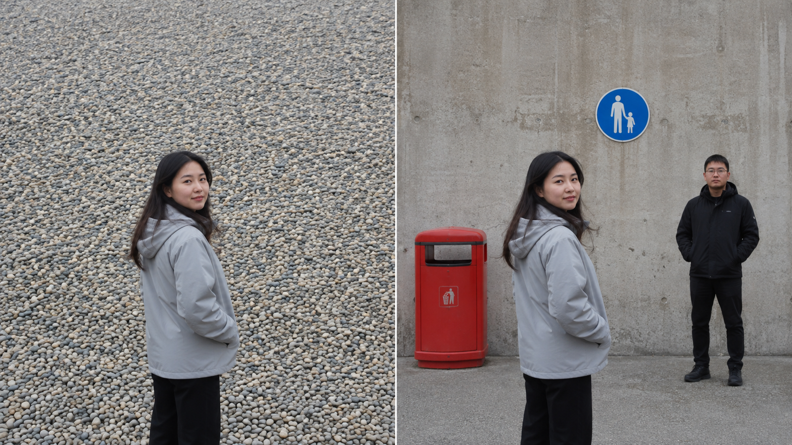
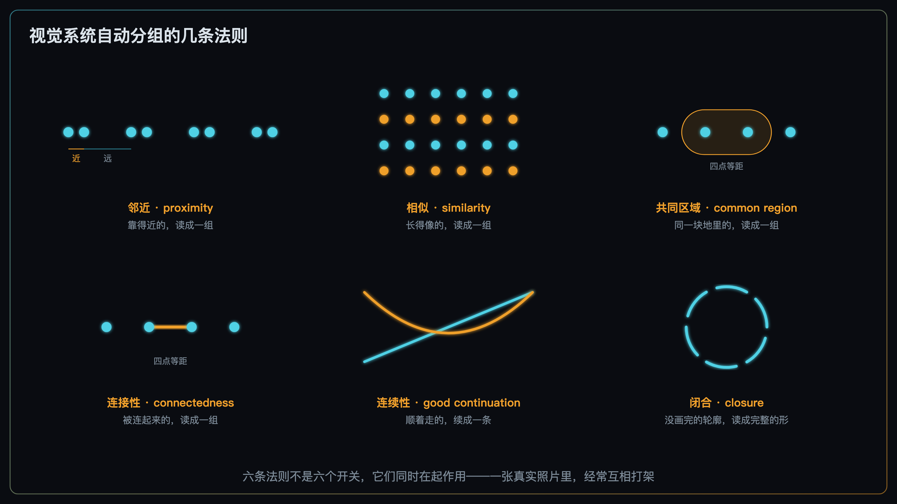
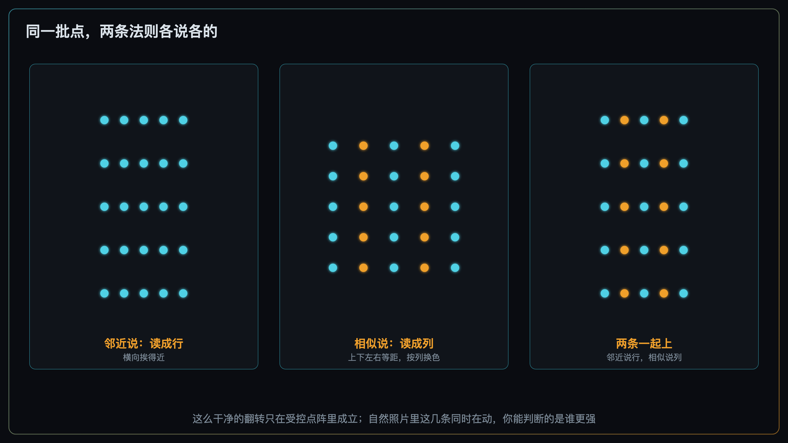
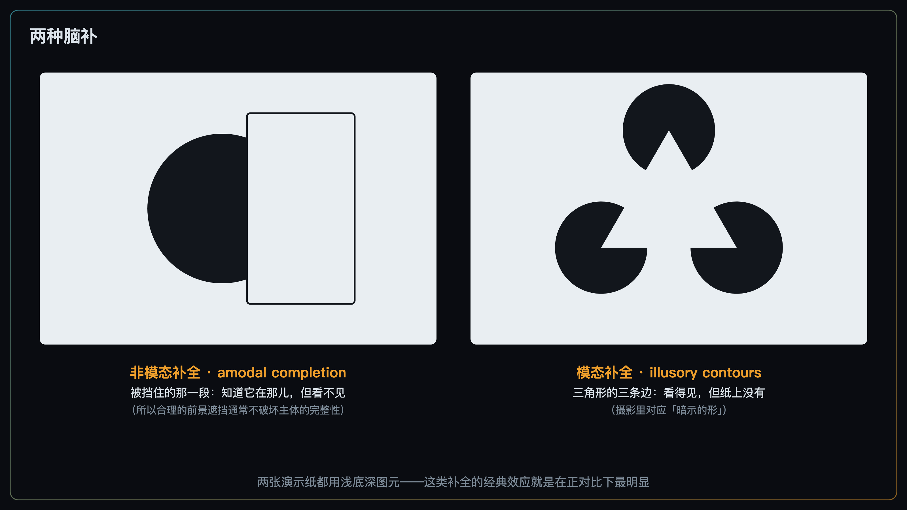
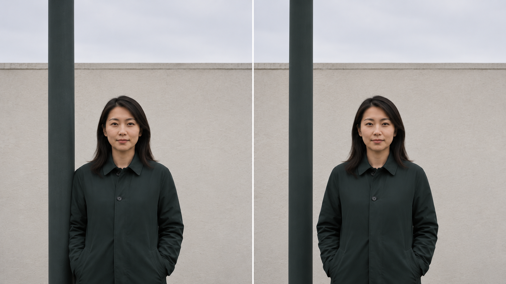

+++
title = "2-4 视觉底层代码：格式塔分组与脑补"
description = "「有几处在抢」数的是分完组之后的对象，不是元素个数——而这个分组，很大程度上不归你的意志管。"
date = 2026-08-16
tags = ["摄影", "构图", "格式塔", "视觉分组", "脑补", "补全", "注意力", "视知觉"]
categories = ["摄影"]
series = ["主线"]
showTableOfContents = true
+++

> 「有几处在抢」数的是分完组之后的对象，不是元素个数——而这个分组，很大程度上不归你的意志管。

## 破题：元素少的那张，反而更乱

同一个下午在海边拍了两张。

第一张，人站在一片碎石滩前面。石头成千上万，大小不一，铺满整个背景。看着一点也不乱。

第二张，换了个地方，背景干净得多——一个红色垃圾桶、一块蓝色路牌、一个穿黑衣的路人，加起来三样东西。这张乱得没法看。

按 #2-3 那本账，第二张的元素少了几千个，怎么反而更乱？

上一篇其实给过半个答案：干扰项彼此越像，越容易被一起排除掉。碎石滩上每一块石头都和旁边那块差不多，于是整片石头合成一个「背景」。但那半句话跳过了一个关键动作——**视觉系统凭什么把上千块石头合并成「一片」？** 凭什么那三样东西就不能被这么合并？

这一篇讲的就是那个合并动作。它会顺带改写 #2-3 里一个被我们含糊带过的词：「有几处在抢」——「处」到底是怎么数出来的。

*图：同一个人、同样的光、同样的机位高度。左边背景里有成千上万块石头，右边只有三样东西。左边看着安静，右边看着吵——「乱」这件事，从来不是按元素个数算的*

## 一、被数的是「组」，不是「个」

先做一件跟拍照没关系的事。

你走进一间陌生的屋子，不会在心里数「这里有 47 件东西」。你会说：一张桌子、一排书架、窗边一盆花——三样。桌上那些杯子、笔、纸、充电线，全被归进了「桌子那一摊」，它们没有各自占一个名额。

> 注意力经常沿着已经分好的组走。所以「有几处在抢」这个数，数的是分完组之后剩下的对象，不是画面里的物件个数。

这就是 #2-3 里那个「处」。碎石滩上千块石头，被合并成一组，所以只占一处；红桶、路牌、路人彼此毫无共同点，不容易自然合并，于是占了三处。第二张照片的「处」比第一张多两倍——按注意力预算算账，它当然更乱。

要把话说准的地方有两个，都很要紧。

**第一，对象并不是注意力唯一的分配单位。** 视线沿着知觉对象走，是被反复验证过的一部分机制，但空间位置本身、以及单个的视觉特征（一块特别亮的、一块颜色特别跳的）同样在参与选择——#2-2 那三个旋钮拧的就是后者。分组之所以值得单独写一篇，不是因为它取代了别的，而是因为它此前完全没进过我们的视野，而它恰恰能被机位改写。

**第二，「几组」不是照片的固有属性。** 分组是分层的：碎石滩可以读成一颗石头、一堆石头、一整片海滩，取决于你看多近、看多久、以及你在找什么。#2-1 里说过观众自带的任务会改写他怎么看，这是同一件事在更底层的样子；那一篇把讨论范围定在短时浏览，也就顺便定下了我们通常谈的是哪一层。所以「这张照片有三组东西」永远是一句带着观看尺度的话，不是一个能贴在照片上的标签。

在这两条之内，你能指望的仍然不是直接下命令。你没法要求观众「请把这三样东西看成一坨」，他也没法决定「我今天要把这些石头一颗一颗看」——但观看的任务、注意力落在哪儿、看了多久，都会改变最后分成了几组。早期的格式塔心理学把这件事设想成一道完全跑在注意力前面的独立工序，后来的实验陆续发现没那么干净——分组会被注意力、深度关系、明暗恒常这些因素反过来影响。跨越百年的那篇综述给的口径是「分组与注意相互作用」。对拍照的人来说，可以这样记：它在很大程度上自动完成，你能改的是**输入**，不是**过程**。

顺便说，格式塔常被浓缩成「整体大于部分之和」。这句话传歪了。Koffka 在《格式塔心理学原理》里专门纠正过：更准确的说法是整体**不同于**部分之和——不是大于。因为对知觉来说，「把部分加起来」这个动作本身就没有意义，能谈的只有整体和部分的关系。这个区别待会儿有用：分组不是把权重相加，它是换了个计数单位。

所以模块 2 到这里有了两道旋钮：

- **#2-2 那三个**（明度反差、局部对比、色彩强度）拧的是「每一组有多抢眼」。
- **这一篇要讲的**拧的是「哪些元素被读成同一组」。

概念上把它们分开谈很方便，但别把这想成一条严格的流水线——真实的视觉处理里，两者在互相影响，不是先分完组再算谁更亮。对拍照的人有用的是另一件事：**你手上其实有两类动作，而以前只知道其中一类。** 这也解释了 #2-3 结尾那句结论为什么成立——很多时候解决「乱」的动作不在滑块上而在脚上：挪两步改的往往不是谁更亮，是谁跟谁被算成了一伙。

## 二、几条法则，以及它们互相打架

那视觉系统按什么标准合并？这件事一百年前就被翻出来了，柏林那批人给出的答案是一组法则。它们至今仍然是描述得最好的版本，而且每一条都能直接翻译成快门前的动作。

- **邻近（proximity）**——靠得近的读成一组。这是最经典的一条，摄影里也最常撞上：主体和背景那根柱子在画面里挨着，它们就容易被并进同一个对象里，哪怕在三维空间里隔了十米。反过来，把它们在画面里拉开，就是负空间在干的活（#2-12 会专门讲这件事的机制和代价）。
- **相似（similarity）**——长得像的读成一组。像不像可以是明度、颜色、形状、朝向、大小里的任何一项。#2-3 说的「干扰项彼此像不像」就是这一条；碎石滩之所以能被压成一组，是相似和邻近一起干的。
- **共同区域（common region）**——落在同一块地里的读成一组，哪怕彼此并不更近。一个门洞、一片阴影、一块草地、一个前景框，都会把里面的东西一起收编。「前景框景」这个老技巧之所以常常有效，共同区域是其中一个重要机制：它不是给画面加了个装饰边，而是给观众划出一块容易被整体读取的区域。（框景同时还在动遮挡和前后关系，不止这一条在起作用。）
- **连接性（connectedness）**——被连起来的读成一组。一根实线把两个东西连上，分组力常常比单纯靠近还强。栏杆、绳子、影子拉出来的一条边，都可能把你没打算凑在一起的东西串起来。
- **连续性（good continuation）**——顺着走的续成一条。视觉系统偏好把方向一致的边缘、纹理、明暗梯度读成一条延续的东西，而不是一堆断开的段。引导线为什么是「线」，答案就在这一条（作为方向性工具怎么用，留给 #2-6）。
- **闭合（closure）**——没画完的轮廓，仍被读成完整的形。一个断断续续的圆、一个缺了两段边的矩形，看上去都还是圆和矩形，而且是有「里面」和「外面」的完整面。摄影里最常借的就是这一点：一个不完整的边框——三条边，甚至两条边加一个角——已经足够让人读出一块被围起来的区域。（被前景挡掉一截的物体为什么仍读成完整的一个，那是另一回事，下一节讲。）

还有一条叫**共同命运（common fate）**：一起动、一起变的读成一组。它靠的是时间维度，所以在视频和连拍里最直接。单帧照片没有时间可用，只能靠姿态、朝向、运动模糊去暗示「这几个东西在一起动」——而那时候真正在起作用的，已经是朝向上的相似、平行关系或者连续性了，不是共同命运本身。这一条留在视频那一侧。

*图：注意第三格和第四格——四个点的间距完全相同，中间那两个之所以成一组，一次靠的是被圈进同一块地，一次靠的是被一根线连上。距离没变，分组变了*

到这儿最容易犯的错，是把这几条当成一张按重要性排好序的清单，然后想「这一处邻近得 3 分、相似得 2 分，加起来 5 分」。

不能这么用，而且这不是我保守——这正是经典格式塔一百年来最常被批评的地方：它给了一堆定性法则，却没给出它们同时出现时怎么合成的规则。后来确实有人把其中一条做成了定量的：用点阵做刺激，可以测出邻近的分组强度随距离大致按指数衰减。但那是在实验室里高度受控的点阵上做到的，一张真实照片里没有这样一个能算的总分。也没有一条法则能长期坐在第一把交椅上——在合适的条件下，一根把两样东西连起来的实线可以压过它们各自的距离和长相。

更常见的情况是它们互相打架。

*图：左边横向挨得近，读成五行；中间上下左右等距但按列换色，读成五列。右边把这两件事叠在一起——邻近说读成行，相似说读成列，谁赢取决于各自有多强。真实照片里永远是右边这种情况*

所以这几条法则的正确用法不是打分，是**在具体一处上判断谁更强**：主体和那根柱子挨得这么近（邻近在拉），但一个亮一个暗、一个圆一个直（相似在推），最后到底会不会被读成一坨？这个问题没有公式，但它是个能站在原地、眯起眼、用几秒钟回答的问题——而且比「这张构图好不好」具体得多。

## 三、脑补：视觉系统还会替你补东西

分组还有一个延伸动作，比合并更主动：**补**。它分两种，别混着讲。

第一种叫**非模态补全**。栏杆后面站着一个人，你看到的是几截被切开的人体，但你读到的是一个完整的人。补出来的那部分，你知道它在那儿，但你看不见它——它被明确地放在了遮挡物后面。

这一条解释了摄影里一个很基本的自由：**合理的前景遮挡通常不会破坏主体的完整性。** 用一根柱子、一片树叶、一个走过的路人挡住主体的一部分，观众不会觉得「这个人缺了一块」，反而会因此读出前后关系——谁挡谁，谁就在前面（这条线索本身能干什么，是 #2-13 的题目）。

第二种叫**模态补全**。错觉轮廓是它最典型的表现：三个缺了口的圆盘能让人看出一个三角形，而且三角形内部常常显得比周围还亮一点——纸上并没有那三条边，也没有那块更亮的区域。这一次补出来的东西是反过来的：你看得见它，但它物理上不存在。

摄影里最接近这件事的是「暗示的形」：三个人站的位置读出一个三角，河岸边几处反光连成一条并不存在的弧线，几个人的视线方向围出一个圈。这类形多数属于**被读出来的几何关系**——几个元素被当成一个配置来处理——不见得真的产生了 Kanizsa 那种能看见的主观边界，两者别画等号。但对拍照的人来说可用的部分是同一个：你没有画任何一条线，观众却读出了一个形。

*图：左边补的是被挡住的那截圆——知道它在，但看不见；右边补的是三角形的三条边——看得见，但纸上没有。同一件事的两个方向：视觉系统都在替你补，只是一个补在遮挡后面，一个补在什么都没有的地方*

补全不是无条件的。遮挡两侧的轮廓能不能自然地续上，是其中很重要的一条线索，但不是唯一的——整体形状、前后深度关系、两侧的相似程度，甚至观众对这东西本来长什么样的经验，都会影响补全成不成立。

这些条件反过来读，就得到了一个坏消息：**视觉系统也会把不该补的补上。** 主体的肩线和背后一根栏杆的横梁刚好接在一条直线上，两个物体的轮廓在接触处续得天衣无缝，于是它们被补成了同一个形，深度关系跟着被抹掉。这类失误在摄影里有一整套名字（切线、粘连、误连），完整的图鉴是 #2-11 的活儿；这里只需要记住它的成因不是「构图不小心」，而是分组和补全这套机制照常工作、只是工作在了你不希望的地方。

这一节还顺手还上了前两篇欠的一笔账。#2-2 和 #2-3 都反复说过一句话：虚化是磨砂玻璃，不是橡皮擦，背景里那个被虚化的人形还在拿权重。当时只给了结论，没给理由。理由在于**虚化删掉了什么、又留下了什么**：它衰减的是高频——锐利的边缘、细密的纹理；留下的是大形、明暗关系和成片的颜色，也就是低频那一半。只要这些还够让人认出「那是一个人」，它就仍然会被读成一个对象，语义那一层也就继续给它加权。这正好接上 #2-1 说的：周边视觉分辨率很低，但它读得到大形，并且据此决定下一眼看哪儿。

## 四、你能做的只有两件事：合并与切分

机制讲完了，落到手上其实很简单。面对分组，摄影师只有两个动词。

**合并**——让你希望被读成一体的东西读成一体：让它们在画面里靠近、让边缘对齐、把它们框进同一块区域或同一片阴影、用一根线（栏杆、路缘、光带）把它们串起来、让它们的明度或颜色统一。三个人要读成一组，就别让第三个人站得比另外两个远一倍。

**切分**——让不该混在一起的东西读开：把它们在画面里拉开距离、打断中间的连接、制造一处差异（一个进光里一个留在暗处、一个朝左一个朝右）、或者用一条边界、一段空白把它们隔开。

第三件事不是动词，是防守：**别让视觉系统替你合并。** 你没打算把主体和那根杆子看成一个东西，可它们在画面里挨着、轮廓还刚好续得上，于是被合成了一个。#2-3 讲的是「你没打算乱，但它乱了」；这一篇讲的是「你没打算把它们看成一个，但它们被看成了一个」。

这里要说清楚一件事，免得看起来像又来了一套新工具：**合并和切分用的手段，大部分还是 #2-3 那张性价比阶梯上的那几样。** 机位、拍摄距离与取景范围、等一等、遮挡——还是它们，还是越靠前越便宜。区别只在于这一次你拧的不是谁更重，是谁跟谁被算成一伙。挪两步，既改变了背景那块亮斑的权重，也改变了它和主体之间的距离；这两件事一直是同一个动作的两个后果，只是我们到现在才把第二个说清楚。

*图：同一个人、同一支镜头、同样的光，只挪了机位。左边主体和那根柱子在画面里贴在一起，中间连一丝墙面都不剩，于是合成了一块连着的深色形；右边把柱子推开之后，它们变成了两个各自独立的对象。三维空间里两者的距离一步没变，变的只是它们在二维画面上的间隔*

最后要给这套东西装一个阀门，否则它很容易变成教条。

**这些法则是描述性的，不是规定性的。** 它们描述视觉系统会怎么读一张照片，不规定照片应该怎么排。有相当多的好照片是靠让分组失败活着的——超现实和错视摄影专门制造读不通的分组；密集纹理和重复图案的目的恰恰是让整张画面读成一组，压根不给你挑对象的机会（这组反例 #2-1 和 #2-3 已经点过名了）；还有那种把远处的塔「顶」在手上的合影，玩的正是邻近加遮挡歧义带来的误分组，它把 bug 直接当成了内容。碰上这类照片，该被怀疑的是判据，不是照片。

另外，口径还是老样子：这几条法则说的是「通常更容易被读成一组」，不是「必然」。

还有一件事这一篇故意没碰。分完组之后，还剩一个问题没定：这几组里，哪一组站到前面来当主角，哪一组退回去当背景？那是图底关系，和「眯起眼睛只看大形」一起，是下一篇的题目。这一篇只到「分成了几组」为止。

## 拍摄行动点

三个实验，各自只改一个变量，其余全部固定。

1. **测一次邻近的边界。** 找一个主体和一个背景里的竖直物体（灯柱、树干、门框边）。第一张让它们在画面里几乎贴着，然后每次只挪一小步机位，把两者在画面里的间隔一点点拉开，一直拍到它们明显分开为止，中间至少拍五张。回来一张张翻过去，看它们是从哪一张开始不再像一个东西的。这个位置每张照片都不一样，取决于两者的明暗、粗细和背景，你要拿到的不是一个数字，是对「多近算近」的一次亲身校准。
2. **试一次共同区域。** 找一个边界清楚、又不会改变主体受光的框：门框、窗框、墙上一块颜色不同的区域。（别用树荫或阴影的边界——主体走进去的同时亮度和局部对比也一起变了，那就不是只在测共同区域了。）第一张把主体放在框外面，第二张把主体放进框里，机位、焦段、光、曝光全部不动，只让主体走两步。两张放一起看，注意的不是哪张好看，而是主体和框里其他东西的关系有没有变——它是不是从「站在那儿的一个人」变成了「那一块里的一个人」。
3. **找一次补全的失效点。** 找一个能挡人的前景（栏杆、门框、走过的行人、一片树叶）。让它先挡住主体一点点，然后逐步加大遮挡面积，从挡掉一成拍到挡掉六七成，每一步一张。翻的时候盯住一件事：从哪一张开始，你读到的不再是「一个被挡住一部分的完整的人」，而是「一个被切掉了一块的人」。那个转折点在哪儿，单凭遮挡比例说了不算——挡掉的是脸、是手，还是一段没什么识别信息的衣服，结果会差很多，主体的轮廓在遮挡两侧能不能对上也一样要紧。多试几种挡法，比只盯着面积推有用。

## 收尾

读这篇之前，「构图」这件事大概还停在摆放和权重上：把东西放在哪儿、让谁更亮。读完之后，中间应该多出来一层——除了「谁更亮」，还有「谁跟谁被读成了一个」，而这一层同样是可以操作的。#2-3 里数出来的「几处在抢」，数的从来不是元素，是组。

这一层带来的实际好处很朴素：你多了一批新的动作。以前面对「主体不够突出」，手上只有更亮、更艳、更锐三条路；现在还可以问一句——它是不是正跟旁边什么东西被算成了一伙？如果是，那么把它们拉开半米，可能比把主体提亮一档管用得多。而且这个动作是免费的。

不过这一篇只把画面拆成了几组，没说哪一组说了算。三组东西摆在那儿，谁站到前面来当主角，谁退回去成为背景，还是个悬着的问题。而且我们一路上用了好几次「大形」这个词，一直没定义它。下一篇 #2-5，我们把眼睛眯起来，先不看细节——看看那几块明暗决定了什么。

## 参考资料 / 推荐阅读

- Wertheimer, M., *Untersuchungen zur Lehre von der Gestalt II*（Psychologische Forschung, 1923；英译常作 *Laws of Organization in Perceptual Forms*）——分组法则的源头，邻近、相似、连续、闭合都出自这一支。
- Koffka, K., *Principles of Gestalt Psychology*（1935）——「整体大于部分之和」这句流行语的出处，也是它的纠正处：Koffka 写的是整体**不同于**部分之和，因为把知觉的部分相加这件事本身没有意义。
- Palmer, S. E., *Common Region: A New Principle of Perceptual Grouping*（Cognitive Psychology, 1992）；Palmer, S. E. & Rock, I., *Rethinking Perceptual Organization: The Role of Uniform Connectedness*（Psychonomic Bulletin & Review, 1994）——共同区域与连接性两条法则的来源，也是本篇讲前景框景时的依据。要留意 1992 那篇本身就显示共同区域会受知觉深度关系影响——所以它是框景起作用的机制之一，不是全部；而 1994 那一支的相关工作又是「没有哪条法则永远最强」的来源。
- Egly, R., Driver, J. & Rafal, R. D., *Shifting Visual Attention Between Objects and Locations*（Journal of Experimental Psychology: General, 1994）——注意力沿知觉对象展开的经典证据。要留意它证明的是注意里存在 object-based 的成分，不是对象为唯一的分配单位。
- Kubovy, M. & Wagemans, J., *Grouping by Proximity and Multistability in Dot Lattices*（Psychological Science, 1995）——用点阵把邻近的分组强度做成了可测量的函数，也是「定量只在受控刺激下成立」这个边界的来源。
- Wagemans, J. et al., *A Century of Gestalt Psychology in Visual Perception*（Psychological Bulletin, 2012，分 I / II 两篇）——百年综述。本篇「分组与注意相互作用、不是严格的两阶段」以及「经典格式塔缺少定量合成规则」两处口径都来自它。
- Kanizsa, G., *Organization in Vision*（1979）——错觉轮廓的经典整理。需要说明的是，错觉轮廓究竟产生在视觉处理的哪一层，至今仍有不同看法（轮廓插补与表面填充可能是两套相对独立的过程），本篇只描述现象、不选边。
- 回看 #2-1 与 #2-2——注意力预算的三层框架，以及三个权重旋钮。本篇加的这一层就长在它们旁边。
- 回看 #2-3——「乱」的信噪比定义与那张降噪手段的性价比阶梯。这一篇的合并与切分，用的是同一批动作。
