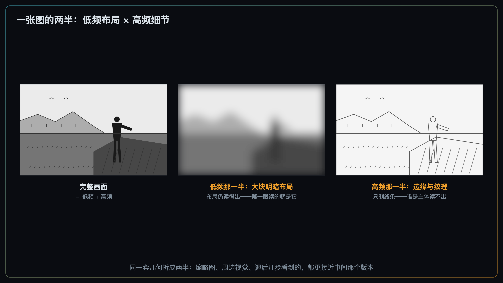
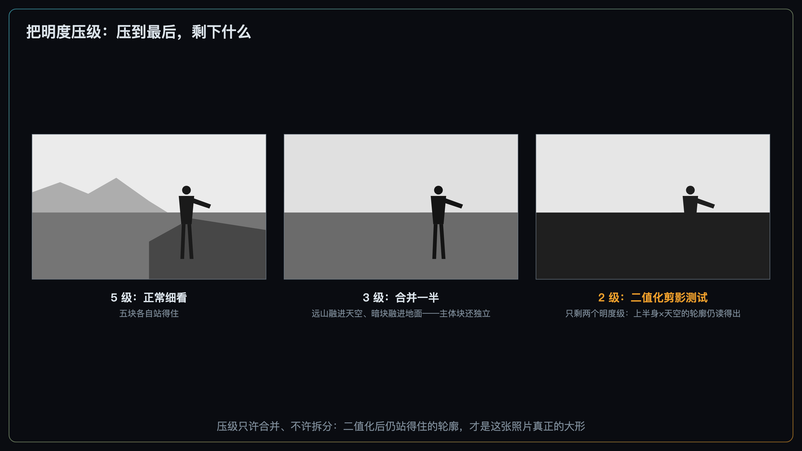
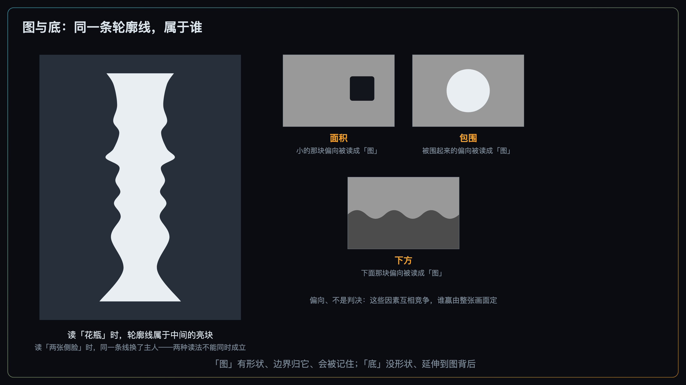
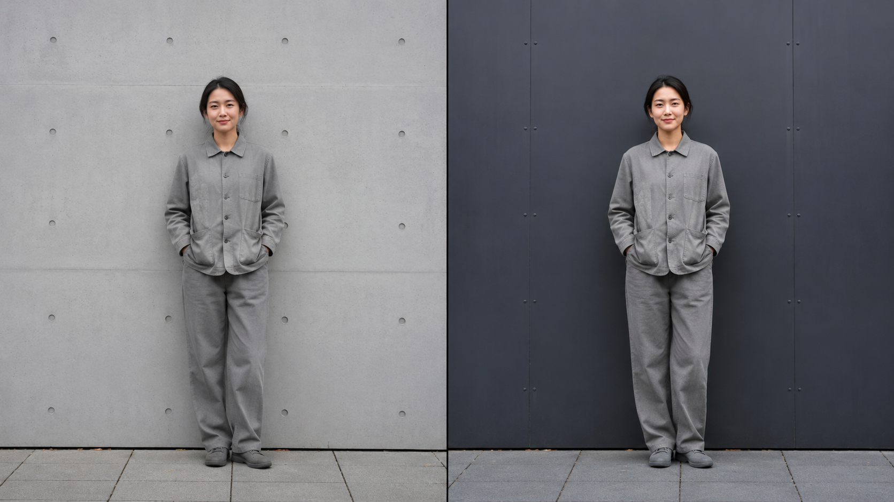

+++
title = "2-5 形状优先：大形（Massing）决定生死"
description = "照片先以几块大明暗的布局被整体读一遍；这一遍读不出东西，细节就没有上场机会。"
date = 2026-08-23
tags = ["摄影", "构图", "大形", "Massing", "图与底", "剪影", "眯眼法", "视知觉"]
categories = ["摄影"]
series = ["主线"]
showTableOfContents = true
+++

> 照片先以几块大明暗的布局被整体读一遍；这一遍读不出东西，细节就没有上场机会。

你精心拍了一张街头：主体的表情抓得准，衣服纹理清晰，背景层次丰富。发出去没什么人点开；自己翻图库九宫格时，甚至要凑近找一下它在哪。而旁边一张随手拍的逆光剪影，隔着一屏都能认出来。

问题不在细节——细节你给足了。问题在于：缩到两三百像素之后，那些细节大部分被压掉了，真正占住知觉权重的是几块大明暗的布局——而你那张照片的大明暗，糊成了一锅粥。

这背后是观看的次序在起作用：细节是后半场才被读的，第一眼读的是**大形（Massing）**。这一篇讲清楚四件事：为什么大形先被读、大形到底是什么、块与块之间怎么分主角和背景（图与底），以及一个现场就能用的检查工具——眯眼法。

*图：缩略图尺寸下，能活下来的只有大形*

## 一、先读大形：观看是从粗到细的

我们在 #2-4 拆虚化时用过一个拆法：虚化删掉的是高频（锐利边缘、细密纹理），留下的是低频（大块明暗、成片颜色）。这个拆法其实适用于任何一张图：把它想成两半——一半是低空间频率的「布局版」，隔着毛玻璃看到的那些大块明暗；另一半是高空间频率的「细节版」，边缘、纹理、小字。两半叠在一起才是你看到的完整画面。

> 一张照片同时存在两个版本：模糊的布局版和清晰的细节版。观众先遇到的，通常是前者。

为什么是「先」？三条证据线，都指向同一个方向：

第一，#2-1 讲过「第一眼不是空的」——一次注视内就能拿到场景要旨（gist）。而那一眼读到的主要是粗略布局：Oliva 与 Torralba 的 spatial envelope 工作表明，场景类别可以在不显式识别单个物体的情况下，仅由频谱特征与粗尺度空间布局提供足够强的判断线索。这是一个关于「信息够不够用」的结论——粗布局里就藏着足以区分「海滩还是街道」的信息，至于人脑是不是只走这一条路，不是这篇论文能单独回答的。

第二，短暂呈现下，场景识别常呈「先粗后细」的默认次序。Schyns 与 Oliva（1994）做过一个很直接的实验：把两张图拼成一张混合图——低频那半装着城市，高频那半装着高速公路。只给看 30 ms 时，人们按低频那个场景归类；给到 150 ms，才翻成高频那个。不过这里有个必须交代的边界：「先粗后细」是常见默认，不是铁律——同一批研究者后来又证明，当任务需要的信息藏在细尺度里时，观众会先去读细尺度（他们称之为诊断性驱动的尺度选择）。这和 #2-1 那句「任务是观众自带的天气」是同一件事：你能设计默认路径，但改不了观众带着什么目的来。类似地，「森林先于树」（Navon 1977）这个说法你可能听过，它同样有适用条件（依赖刺激大小与观看距离），当个方向性的路标用就好。

第三，也是对拍照最要紧的一条：#2-1 讲过「中央凹负责看清，周边视觉负责决定下一个看清哪儿」。周边视觉分辨率低，它读到的更偏向粗尺度、低空间频率的信息。也就是说：**观众还没正眼看你的主体之前，「要不要看它」已经由那个粗糙版本投过票了**。主体在布局版里站不住，就很难排进注视队列——哪怕它的细节再好。

*图：一张图的两半——低频版布局仍读得出，高频版只剩线条*

把这三条翻译到发布场景，就是开头那个九宫格问题：**缩略图经历的是一次大幅降采样**——原图里大量高频细节被削弱或丢失，大块明暗与主要轮廓因此占据了更大的知觉权重。所以「大形决定生死」在信息流场景里几乎是字面意思：没人点开，细节就从未被看见。而在画册、展览这种长时观看场景里（#2-1 的观看分档），它降级为「决定第一眼的印象与第一跳的方向」——不致命，但仍然是开场。

小结：细节决定观众留多久，大形决定观众来不来。

## 二、大形是什么：块面、明度骨架与剪影

给大形一个能操作的定义：**在最粗的尺度上，画面被读成的几块连成一片的明暗或色块区域**。它和 #2-4 是同一套机制：那篇讲过分组是分层的——石块→石堆→海滩，看多粗算多粗。大形就是最粗那一层的分组结果。#2-4 回答「哪些元素被读成一组」，本篇关心的是：组在最粗尺度上剩几块，这几块的布局能不能读。

多少块算健康？一个好记的启发式：**眯眼之后还能读出 3–5 个稳定块面**。和 #2-1 那个「三五处」一样，这是方便心算的构图启发式，不是生理指标：高调、低调、极简风两块也完全成立，复杂场景六七块也能成立。真正要检查的不是数字，而是两件事：块面的边界稳不稳定，主体所在的块独不独立。

那么块面靠什么撑？这里有个可以量化的事实：**人眼对亮度细节的空间分辨能力通常高于色度细节**。JPEG 和视频的色度抽样（4:2:0）正是利用这一点——把两个色度平面的宽高各减半，色度采样数降到亮度的四分之一，在大多数自然影像里不容易察觉。但它也不是没有代价：高饱和边缘、文字与界面元素、细小的彩色结构，都会把色度抽样暴露出来。

所以准确的说法是：明度结构往往是大形最稳健的骨架，而不是唯一的骨架。等明度的色彩边缘同样可以独立承担分割与形状信息——自然场景里的色彩边缘和亮度边缘在统计上是相对独立的两套信息来源，不是同一套的附属品。

举个反例就清楚了：一个穿正红上衣的人站在一片明度接近的深绿树篱前。彩色画面里两者分得干干净净，红绿在色彩对立方向上差得很远；一转黑白，人和树篱塌成同一坨。这时候黑白测试给出的是「大形不成立」，而那张彩色照片其实是成立的。

> 转黑白是大形的鲁棒性测试，不是判断构图是否成立的唯一标准。

它测的是这件事：这张照片的分离，能不能耐受缩图、低照度、黑白转换这类条件。明度差撑起来的结构通常更能耐受这些条件——但也不是绝对不会丢。做这个测试时记得固定同一套黑白转换配置，#2-2 讲过：通道混合器一动，明暗关系就重排，结论不作数。至于色彩自己的完整语言，留给模块 5。

大形的极限测试是**剪影可读性（silhouette readability）**：把画面压到只剩两个明度级——主体一档、背景一档，二值化之后，轮廓本身还认不认得出。这个标准来自角色设计和动画的 staging 传统：一个角色的姿态如果在纯黑剪影下读不出来，再好的上色也救不回来。摄影里对应的场景是逆光、大光比、雾天：人形四肢与躯干分开的姿态，剪影一眼可认；贴身站立、双手插兜，剪影就是一坨。至于剪影被背景元素粘连污染——树从头上长出来那类视觉 bug，是 #2-11 的正题，本篇只立标准：主体剪影应当独立可读。

*图：把明度压级——二值化之后仍站得住的轮廓，才是这张照片真正的大形*

小结：大形是最粗尺度上的几块明暗，明度是它最稳健的骨架、但不是唯一的骨架；剪影是它的极限测试。

## 三、图与底：块与块之间不平等

块面分完了，下一个问题马上到：同样是块，为什么有的被当主角读，有的只被当环境？视觉系统对块面做的不止是分组，还有角色分派：有的块被读成**图（figure）**——有形状、像个东西、会被记住；有的块被读成**底（ground）**——没有形状，只是延伸到图背后的一片环境，不被当对象读。

这里有个很反直觉的细节：图与底共享同一条轮廓线，但这条线只「属于」图——这叫边界归属（border ownership）。百年前 Rubin 的双关图把这件事钉死了：同一条曲线，读花瓶时它是瓶的边，读两张侧脸时它是脸的轮廓。

*图：同一条轮廓线，属于谁*

哪些因素影响分派？和 #2-4 的分组法则清单一样，下面这些是描述性的观察、互相竞争，没有普适的优先级排序：

- **面积小的偏向为图**。主体占画面比例小，反而更容易被授予「图」的资格——这也是负空间为什么有效的先声，正题留 #2-12。
- **被包围的偏向为图**。门洞里的人、一片暗色中的亮窗。
- **凸形偏向为图**。外凸的轮廓更像「一个东西」。
- **下方区域偏向为图**（Vecera 等人 2002）。和「地面在下、天空在上」的环境统计一致。
- **对称区域偏向为图**。
- **认得出的形状偏向为图**（Peterson 一线的研究）。熟悉的轮廓会参与图底竞争——#2-1 讲的高层语义「地形」又出现了：人形、脸、认得出的物体，天生更容易拿到「图」的身份。

这份清单其实分成了两拨，而这正是最容易搞混的地方：

> 看见一条边界，和决定这条边界属于谁，是两个问题。

色彩边缘、纹理边界、遮挡、深度和运动，主要回答前一个问题——它们告诉视觉系统「这里有条边、两边不是一块」，都能提供主体与背景分离的线索。但边界清楚不等于角色已定：一块纯红紧挨一块纯绿，边界锐利得毫无疑问，谁是图、谁是底却仍然悬着。上面那份清单里的面积、包围、凸性、对称、下方区域、认得出的形状，回答的才是后一个问题。真实场景里两拨线索共同起作用，**多个较弱的线索也可以叠加**，最终把归属定下来。

所以现场判断该问的是：**主体的轮廓处，分离线索够不够强**——明度、色彩、纹理、遮挡与深度，单独一样足够强就行，几样都不算强时也可以叠起来用。明度只是其中最容易在现场控制、也最耐受各种观看条件的那一项，不是唯一那项。

摄影里的图底问题常见两种，诊断动作完全不同：

第一种是**图底同化**：主体主要靠明度和背景分离，而它的明度恰好落进所在背景块的同一档，轮廓处没有足够的分离线索，主体从未被授予「图」的资格。注意它和 #2-3 的「乱」不是同一种故障：乱是竞争者太多、把预算抢走了，解法是压噪声；同化是主体自己没资格入场，解法是在轮廓处造出分离——最直接的是拉开明度差，换背景块、换角度、等一束侧光。拍前分清这两种，才知道该动哪个变量。

第二种是**图底歧义**：两种组织都能成立，知觉在它们之间交替切换。每一种读法本身是完整的，问题在于它不稳定——如果这张照片需要一个明确的主体，多稳态就会削弱图底关系的稳定性。多数时候这是 bug；少数时候它是手法本身——影子当主体的街拍、刻意的错视作品，歧义就是内容，后面反例那段再说。

操作端怎么把分派提前设计好？用模块 1 的语言讲最顺：#1-11 的 Zone 落子、#1-12 的中间调锚定，当时是从「保住信息」的角度讲的；换成构图侧的读法就是——**给主体和它紧邻的背景块各安排一个 Zone，让轮廓处有明确的局部明度差**。阴天街头拍深色外套的人，外套大约落在 Zone III～IV：背后是同样 Zone III～IV 的湿水泥墙，这就是同化；挑一扇落在 Zone II 的背阴门洞，或者等主体走到 Zone V～VI 的亮墙前，分离就稳了。一个 Zone 左右的差异（大致对应 1 EV）是个好用的现场起点，但它是经验起点、不是知觉阈值——同 Zone 不等于一定没轮廓（颜色或纹理可能顶上来），隔开一个 Zone 也不等于一定成为图（主体太小、被切散、背景抢戏，都可能翻车）。

小结：主体想稳定地成为图，需要在轮廓处拿到足够的分离线索；明度差是摄影里最直接、最稳健的一种。

## 四、眯眼法：按快门之前先验一遍大形

前面都是机制，现在给工具。继 #2-1 的三秒测试、#2-3 的竞争版三秒测试之后，这是模块 2 的第三个诊断工具：**眯眼法（squint test）**。

它的效果是老手都验证过的：眯起眼看取景器或屏幕，细节弱化，大明暗关系反而更突出，块面布局一下子看清楚了。不过机制比通常说的复杂——眯眼并不是给眼睛加了一道高斯模糊。眯眼会改变有效通光孔径、遮挡掉一部分视野、减少入眼光量，而它对细节与对比可见性的实际影响还取决于你的屈光状态、环境亮度和眯的程度：缩小通光孔径带来的类似针孔的效应，在有屈光误差时甚至可能让某些细节看得更清。

> 眯眼是一次够用的现场近似，不是一台低通滤波器。

这和三秒测试那句「口头回忆是代理、不是眼动仪」是同一款声明：工具有效，但别把它当仪器，也别把结论说得比工具精确。正因为如此，另外三个等价形值得优先用：

- **手机图库缩略图，不点开直接看**——最贴近真实发布场景的一个，因为它直接经历了平台上实际发生的缩放与重采样；
- **退后三步**——降低画面在视野中所占的角度，细节自然退场；
- **后期软件里套一层高斯模糊预览**——数字端最可控的粗尺度模拟，想模糊多少就多少。

眯眼胜在零成本、随时能做；上面三个胜在可复现。四个都行，判读方式一样——看完之后问三个问题：

1. **还剩几块？**——3–5 块的启发式。块面边界模糊不清、数不出块，通常就是大形没立住。
2. **主体块还独立吗？**——图底分派还在吗，还是粗尺度下主体已经融进了背景块（图底同化）？
3. **块面布局本身像不像一张能看的图？**——本篇只问到这里。布局的方向性怎么引导视线是 #2-6 的事，块面摆在哪里才平衡是 #2-7 的事。

*图：同一个人、同一套衣服、同一片光，只换了身后那面墙。左幅上衣与混凝土落在相近的明度上，躯干那一段的轮廓几乎消失；右幅换到深色钢板前，同一件上衣立刻分离出来。注意裤子在两幅里都还看得清——分离是逐段发生的，看的是轮廓每一段与它紧邻的背景差多少*

发现大形不成立，怎么改？手段你全部见过——还是 #2-3 那张性价比阶梯上的动作：机位、拍摄距离与取景、等光、前景遮挡。只是前两篇用它们拧单点权重、#2-4 用它们拧分组边界，这次拧的是最粗尺度的块面布局：挑一块干净的暗墙做底、等云遮住半边街道把地面分成两块、让亮主体落进阴影大块里。后期端对应的是大尺度的 dodge & burn 和区域压暗提亮——注意尺度：这是 #2-2 里「大尺度明暗关系」那一半的操作，不是清晰度、纹理那种中小尺度的局部对比。至于眯眼＋转黑白＋翻转的完整自检组合拳，留到 #2-16 统一交付，本篇只把眯眼这一件讲透。

### 什么时候别信这套判据

和前几篇一样，判据是检查清单，不是审美定律。四类照片会让它误判：纹理与重复图案摄影，全画面均匀就是目的，本来就没有「主体块」；画册与展览等长时观看场景，预算充足，细节有完整的上场机会，「生死」降级为「第一眼」；刻意图底歧义的错视作品和影子摄影，歧义即内容；高调、低调与极简，块面数少于 3 也完全成立。碰上这些，该被怀疑的是判据，不是照片。另外，这一路的措辞一直是「通常先被读」「偏向为图」——都是概率，不是必然，这个口径从 #2-1 一路沿用到这里。

小结：眯眼三问——剩几块、主体块独不独立、布局像不像图；改大形的手段不新增，只是换了拧的尺度。

## 拍摄行动点

三个独立小实验，今天就能做，每个只动一个变量：

1. **缩略图回看**：打开手机图库，最近 20 张照片不点开，逐张记下「这张在缩略图里还能读出什么」，再点开对比。观察哪几张在缩略图里已经读不出主体，再看它们的大形出了什么问题。
2. **同主体换背景块**：同一主体同一姿态，第一张让它落在与它明度接近的背景块前，第二张挑一块明显更暗（或更亮）的背景重拍。**相机切 M 档，或用 AE-L 锁定曝光，白平衡也固定**——否则背景一换，自动测光和自动白平衡会跟着变，实验就不止一个变量了。分别看缩略图，观察主体块从哪一档明度差开始站得住。
3. **剪影姿态**：找一个逆光场景（黄昏的天空、亮窗前都行）。**曝光策略是对亮背景确定曝光并锁住**，让背景保留你要的亮度、人物自然落进阴影；如果评价（矩阵）测光给出的结果让亮背景过亮，就从 -1～-3 EV 补偿开始试，看直方图和高光警告调整。ISO 从 100 起步，光圈与快门按现场亮度和是否需要凝固动作来定。先拍一张贴身站立，再拍一张四肢与躯干分开的姿态，在缩略图尺寸下对比两张剪影各自还能读出多少信息。

## 收尾

读完这篇，有一个认知应该换掉了：构图不是「把元素摆好、把细节雕好」的一道工序，而是两道——先保块面布局，再雕细节。你的每一张照片都有两个版本，而观众先遇到的往往是那个粗糙的低频版——它站不住，精雕细刻的那个版本就很难轮到出场。缩略图、退后三步、高斯模糊预览、眯眼，都是在按快门之前提前看一眼那个版本。

块面立住了，下一个问题随之就来：视线落进画面之后，沿着什么路线移动？为什么有些照片里视线会顺着一条小路、一排栏杆、甚至一片云的走势一路滑向主体——而另一些照片里同样的线条把视线直接带出了画框？任何方向一致的边缘、纹理、光影梯度都能形成视线的流场，这就是下一篇 #2-6「几何骨架 1：引导线与流场」。

## 参考资料

- Schyns, P. G., & Oliva, A. (1994). From blobs to boundary edges: Evidence for time- and spatial-scale-dependent scene recognition. *Psychological Science*.
- Oliva, A., & Schyns, P. G. (1997). Coarse blobs or fine edges? Evidence that information diagnosticity changes the perception of complex visual stimuli. *Cognitive Psychology*.
- Oliva, A., & Torralba, A. (2001). Modeling the shape of the scene: A holistic representation of the spatial envelope. *International Journal of Computer Vision*.
- Navon, D. (1977). Forest before trees: The precedence of global features in visual perception. *Cognitive Psychology*.
- Rubin, E. (1915). *Synsoplevede Figurer*（德译本 *Visuell wahrgenommene Figuren*, 1921）.
- Wagemans, J., Elder, J. H., Kubovy, M., Palmer, S. E., Peterson, M. A., Singh, M., & von der Heydt, R. (2012). A century of Gestalt psychology in visual perception: I. Perceptual grouping and figure-ground organization. *Psychological Bulletin*, 138(6), 1172–1217.
- Vecera, S. P., Vogel, E. K., & Woodman, G. F. (2002). Lower region: A new cue to figure-ground assignment. *Journal of Experimental Psychology: General*.
- Peterson, M. A., & Gibson, B. S. (1994). Must figure-ground organization precede object recognition? An assumption in peril. *Psychological Science*.
- Hansen, T., & Gegenfurtner, K. R. (2009). Independence of color and luminance edges in natural scenes. *Visual Neuroscience*.
- Mullen, K. T. (1985). The contrast sensitivity of human colour vision to red-green and blue-yellow chromatic gratings. *The Journal of Physiology*.
- Sheedy, J. E., Truong, S. D., & Hayes, J. R. (2003). What are the visual benefits of eyelid squinting? *Optometry and Vision Science*.
