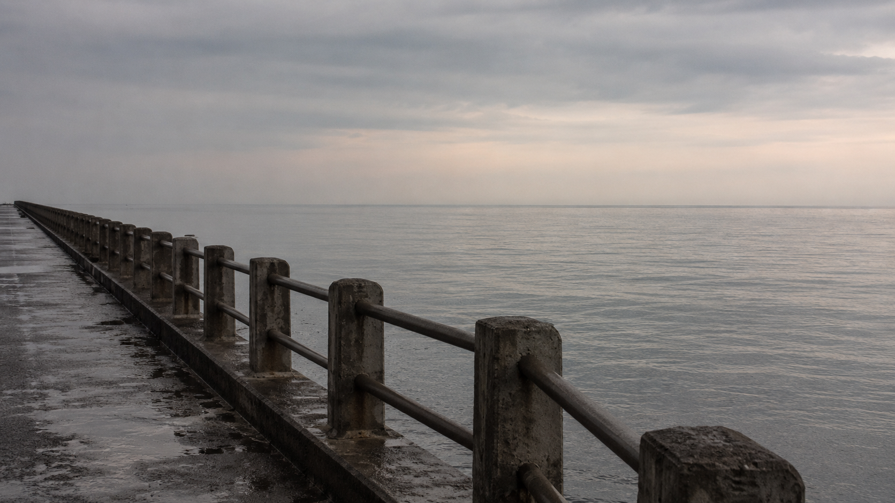
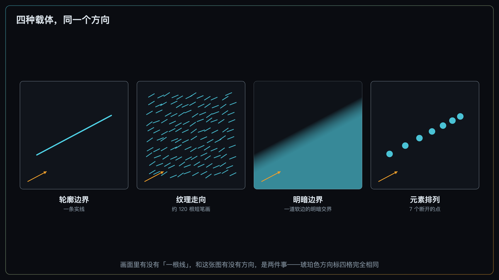
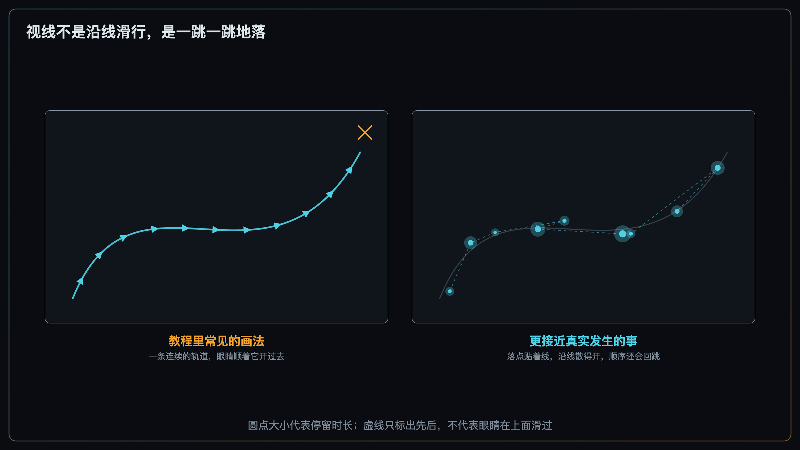
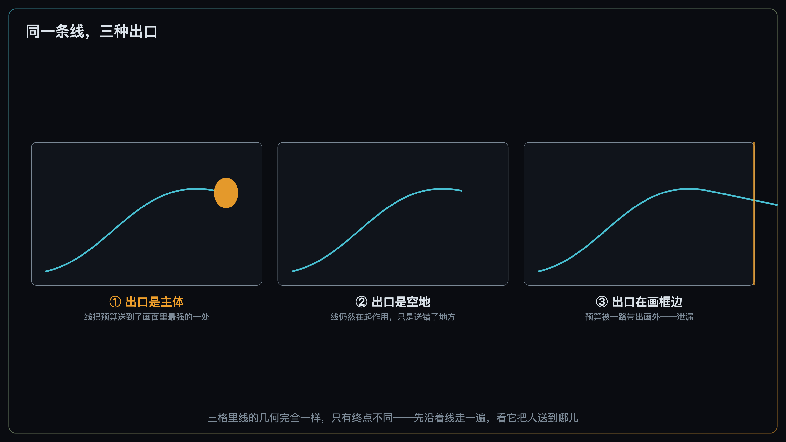
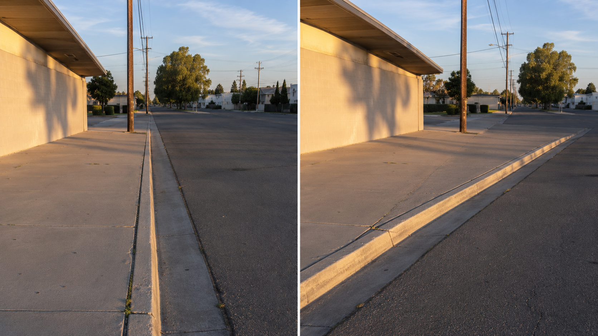

+++
title = "2-6 几何骨架 1：引导线与流场"
description = "引导线改变的不是视线的轨迹，而是下一跳的候选分布；决定它成不成立的是出口。"
date = 2026-08-30
tags = ["摄影", "构图", "引导线", "流场", "眼动", "透视汇聚", "视知觉"]
categories = ["摄影"]
series = ["主线"]
showTableOfContents = true
+++

> 引导线改变的不是视线的轨迹，而是下一跳的候选分布；决定它成不成立的是出口。

你照着教程找了一条漂亮的线。海堤的栏杆从画面右下角斜斜地伸向远处，柱子一根比一根小、一根比一根密，透视收得很干净。发出来之后，没人觉得这张照片有什么方向感。而同一天随手拍的另一张，画面里一根线也没有，别人一眼就知道该往哪儿看。

这件事在构图口诀里是解释不通的——口诀说「找一条线，让它指向主体」，你找了，也让它指了。问题出在这句口诀藏着两个错误的前提：第一，它把「线」当成了画面里的一类物件，好像有线才有方向；第二，它默认观众的视线会沿着这条线滑过去，像水顺着沟走。两个前提都不成立。

这一篇讲四件事：方向是从哪儿来的（不只是线）、视线到底怎么被影响（不是滑行）、一条线成不成立由什么决定（出口），以及怎么在取景器里一次看全画面的方向。

*图：线本身没问题——方向清楚，柱距均匀地收缩，透视干净。问题在它一路收到远处之后，尽头什么也没有*

## 一、方向不是线的专利

先把「线」这个词放下，换一个问题：一张照片里的「方向」是从哪儿来的？

拿一片被风梳过的麦田当例子。画面里没有任何一根可以称为「线」的东西——没有路，没有栏杆，没有河。但你一眼就知道这片麦子朝哪边倒。给你这张照片，你甚至能说出风是从哪个方向来的。

> 方向感来自一大批元素的朝向恰好一致，而不是来自某一个叫做「线」的物件。

麦田里每一根麦秆都是一个短短的、朝向大致相同的元素。单独看一根，什么方向也说明不了；成千上万根叠在一起、朝向一致，方向就出来了，而且比一根真正的直线还结实。**能给出方向的，是「方向一致性」这条属性，线只是它最显眼的一种载体。**

载体可以是很多东西：

- **轮廓边界**——屋脊、桅杆、树干，最像「线」的那一类；
- **明暗边界**——一道斜穿墙面的阴影，两侧没有任何实体的边，但明暗的交界本身是有方向的；
- **色彩边界**——两块颜色接壤的地方，即使明度接近，接缝仍然有走向；
- **纹理走向**——麦田、水面的波纹、沙丘的纹路、砖缝、木纹；
- **元素排列**——一排路灯、一列停着的自行车、一串脚印，元素之间是断开的，方向却是连续的；
- **透视汇聚**——多条平行线在画面上收敛，收敛本身就是一种强方向。

这份清单有一个直接的用处：当你在现场找不到「一条线」的时候，通常不是这个场景没有方向可用，而是你只在找最像线的那一类载体。

**这里要避开一个很容易犯的过度概括。** 上一周那篇经典拆解讲 Ansel Adams 的《Tetons and the Snake River》——蛇河在画面里拧成一个 S 形，从下缘一路把人带向远处的大提顿峰。那张照片里，河面比紧邻两岸亮了大约三档，很容易让人总结出「引导线的本质是一条亮带」。这个总结是错的：一条深色的路穿过亮雪地同样是很强的引导，暗线穿亮底、亮线穿暗底都成立。准确的说法是**在那张照片里**，河的几何已经给出了方向，明度反差又把这条通道进一步强化了——是这一张照片的两件事叠加，不是引导线的定义。任何一种载体都不能升格为「本质」。

那一条线的强度由什么决定？两件事同时在起作用。

一是**它与紧邻背景的反差**。我们在 #2-2 说过，视觉权重不来自绝对亮度，而来自一块区域与它紧邻周围的差异——雪地里的白婚纱不抢眼，暗巷里的白衬衫才抢眼。线也一样：一条与两侧几乎同明度、同颜色的边界，就算方向再一致，也很难被读出来。

二是**它的方向一致性与延续长度**。我们在 #2-4 讲分组法则时提到过连续性（good continuation）：视觉系统偏好把方向一致的边缘、纹理、明暗梯度读成一条延续的东西，而不是一堆断开的段。方向一致性越高、延续得越长，这条「东西」就越成立。

两件事必须同时够。只有反差没有一致方向，得到的是一块显眼的斑；只有方向没有反差，得到的是一条你自己知道、观众看不见的线。要提醒的是，这两项**不能各打一个分再相加**——沿用 #2-4 对分组法则的同一条纪律：它们是竞争与协作的关系，没有一套定量的合成规则可以把它们折算成一个数。能说的只是：两者都不够时，这条线立不住。

小结：找方向不等于找线；方向来自朝向一致的一批元素，而线只是它最容易被认出来的形状。

*图：四种完全不同的载体，给出的是同一个方向。画面里有没有「一根线」，和这张图有没有方向，是两件事*

## 二、视线不会沿着线滑过去

几乎每一本构图教程里都有那张图：一张照片上叠着一条弯弯曲曲的箭头，从画面下缘出发，沿着小路绕过前景的石头，一路滑到远处的房子。这张图给人的印象是，观众的眼睛会像小车一样沿着这条轨道开过去。

它不是这么工作的。

我们在 #2-1 讲过一个基本事实：人看图不是均匀扫描，而是**注视**（Fixation）+ **跳视**（Saccade）交替推进——眼睛跳到某个位置停下来看清，停两三百毫秒，再跳到下一个位置。中间那一跳是很快的弹射，跳的过程中几乎读不进什么东西。除非画面里有一个真在运动的目标可以追（那叫平滑追随，需要有东西在动才做得出来），否则我们做不出平滑的眼动。一张静止的照片上没有任何东西在动，所以不存在「视线沿着线滑过去」这回事。

> 观众不是开着车沿线走，是站在几个点上跳。线改变的不是运动的轨迹，是**下一跳的候选**。

那条线在做的，是三件更朴素的事。

**第一，它把散开的元素合并成一个。** 视觉系统对「沿一条平滑路径排列、且朝向彼此对齐」的元素有很强的整合倾向：把一串短线段散在一堆朝向随机的背景元素里，只要这串线段的朝向沿着一条平滑曲线依次对齐，人就能把它当成一条完整的轮廓挑出来；朝向偏差越大、元素间隔越远，就越挑不出来（Field、Hayes 与 Hess 在 1993 年用一组 Gabor 元素做的经典实验，他们把这套局部朝向之间的整合关系称为「关联场」）。落到照片上：八根路灯本来是八个东西，一旦它们在画面里排成一条走向清楚的曲线，就被读成了一样东西。

这正是 #2-4 那个结论在方向维度上的应用——分组改写的是计数单位。#2-3 问的「有几处在抢」，那个「处」不是画面里的物件数，是分完组之后剩下的对象数。八根路灯排成一条线，抢注意力的对象就从八个降成了一个。

**第二，同一个对象内部的注意扩散更便宜。** 有一个很干净的实验范式：屏幕上放两个平行的长方形，先在某个角落给一个提示，再在别处呈现目标。当目标出现在**同一个长方形的另一端**，反应比出现在**另一个长方形上、但距离完全相同**的位置更快（Egly、Driver 与 Rafal，1994）。也就是说，同样远的两个位置，落在同一个对象上的那个更容易被够到。

这条要立刻加一个限制，和 #2-4 里那条是同一条：**注意力并不是「只按对象分配」**。基于对象的注意只是注意的一个组成部分，空间位置和单个特征同样参与选择——#2-2 那三个旋钮（明度反差、局部对比、色彩强度）拧的正是后者。正确的说法是：注意力经常沿着已经分好的组走，所以「被读成一个对象」这件事显著影响后面的分配；但对象不是唯一的分配单位。

**第三，方向本身进入下一跳的候选排序。** #2-1 里说过，下一次眼跳往哪儿去，主要靠周边视觉开候选名单——中央凹负责看清，周边视觉负责开出「下一个看清哪儿」的候选。方向明确的结构会让沿着它延伸方向的那些位置更容易进入这份名单。

这一条不是从前两条推出来的，它被直接测过。Van Humbeeck 等人（2013）让观察者在一片朝向随机的元素里找出一条隐藏的轮廓，同时记录眼动，再用上面那套关联场模型算出画面各处的「轮廓显著度」——结果这个模型能相当程度地预测实际的注视落点，观察者确实更多地注视那些彼此共线的元素。作者的结论是：轮廓整合会主动参与眼动的引导。这里要守住它的适用范围：实验是在抽象的 Gabor 阵列上做的轮廓搜索任务，不是自由观看照片，所以它支持的是「共线结构参与决定眼跳落在哪儿」，不是「照片里的引导线会规定观看路线」。

三条合起来，能说的是这一句：**线让沿线方向的落点更可能被选中。** 更可能，不是必然；影响的是候选的排序，不是规定了一条观看路线。这个口径从 #2-1 一路沿用到这里——构图提高某些落点与次序出现的可能性，不给所有观众规定唯一路线。

小结：把「轨道」这个形象换掉，换成「候选名单」——线不铺路，它只是让某些落点排到前面去。

*图：左边是教程里常见的画法，右边接近真实发生的事——落点贴着这条线，但沿线的位置散得很开，顺序也会回跳*

## 三、出口决定这条线是不是在「引导」

回到开头那张海堤。线是清楚的，方向是一致的，反差也够。它缺的是终点——栏杆一路收到远处，尽头是一片空的海天交界。

这一维在构图口诀里几乎从不被提。要说清楚它是什么级别的东西，先看看现有的实验能给到哪一步。

直接以摄影「引导线」为对象的眼动实证研究很少，Chuang、Tseng 与 Chiang（2024）是其中比较直接的一项。它很容易被当成「引导线有效」的实验证据来引用，但把自变量逐字核对一遍会发现，**它比较的不是有线和没线**：研究用的 30 张黑白照片**全部**是专家挑选的引导线构图，被操纵的是「主体元素有没有被数字方式去掉」——15 张原图配 15 张抹掉主体的版本，同一批观众看同一批场景的两个版本。34 名 18–25 岁的大学生，每张自由观看 10 秒，之后就美感、复杂度、方向感做五点量表评分。结果是：

- 有主体那一版，注视次数与跳视次数都明显更少，总注视时长反而更长。次数少、停得久，读起来像是少了些四处找、多了些停下来看；
- 主观评分里，有主体那一版不只是更好看，**连「方向感」这一项的评分也更高**——同一条线，终点站着一个人，这条线才被感觉成「有方向」。

它还给了定性的多人热区图与扫视路径，作者据此认为视线会沿引导线分布。这部分要小心地读：它是定性展示，既没有「有引导线 vs 无引导线」的对照组，也没有「轨迹贴线到什么程度」这类定量指标；作者自己在局限里写明，除了操纵主体有无，接下来还要设计有无明显引导线的对照组。

**所以这项研究支持到哪一步，得说准。** 它证明的是**主体在不在**会改变眼动指标与方向感评分。由于这些主体通常正好承担着视觉目标的角色，这个结果支持「引导结构需要一个明确的目标区域」这条实践判断；但它没有单独操纵「线的出口有没有东西」，也没有「主体还在、只是挪离出口」的对照组——所以不能反过来说「出口位置本身已经被实验独立验证过了」。

> 一条线通向哪里，比它长什么样重要得多。

下面这个三档，是把上面那条实践判断落到取景器里的一把尺子——**它是摄影侧的诊断模型，不是实验直接给出的三档规律**。这么标注不是谦虚，是因为你用它的方式会不一样：诊断模型的作用是让你在按快门前多问一句，而不是给照片判分。

**出口落在画面里最强的那一处。** 这时「引导」这个词才名副其实。上周那篇经典拆解里，Adams 那张照片最关键的安排不是河的形状，而是河向远处收窄、最后消失的那个位置，与大提顿峰在横向上几乎对齐——通道的出口，恰好就是画面里最重的那个东西。

**出口落在一片空地。** 这就是开头那张海堤。线仍然在起作用，观众的注意力仍然更容易沿它走，只不过被送到了一个什么也没有的地方。这一档和下一档的差别在于：它是自己收没在远处那片空里的，不是被画框切断的。注意这不是「线失败了」，是线成功地把预算送错了地方——诊断动作不是加强这条线，是给它一个终点，或者干脆换一条出口更好的线。

**出口落在画框边上。** 线把注意力一路带到边缘，然后带出去了。这是 #2-1 就命名过、#2-3 升格成上位概念的**权重泄漏**：注意力预算流向了不服务于主题的元素，其中一支就是往画外走的那一支。四条边具体怎么封口、边缘的亮块与出框的线怎么处理，是 #2-10 的正题，这里只把它认出来。

但「出框」本身不是错。街拍、运动、叙事照片里常常故意让道路、人物的朝向或者运动的轨迹通向画外，为的正是做出画外空间与「事情还在继续」的延续感。**只有当它把注意力从你希望的落点上无意带走时，才叫泄漏**——判据问的是「这是不是你要的」，不是「有没有线出框」。

### 汇聚：证据最硬的一种方向结构

在所有载体里，**透视汇聚**是证据最扎实的一种。多条平行线在画面上收敛的那个区域会吸引注视，而且这不只是「大家本来就爱看中间」的副产品——Ueda、Kamakura 与 Saiki（2017）在自由观看与视觉搜索两类任务里，把汇聚点附近的注视密度分别与**图像中心**和随机选取的位置做了对照，注视仍然向汇聚点集中；即使任务本身与汇聚点毫无关系——在画面里找一个随机位置的 Gabor 斑块、并报告它是顺时针还是逆时针偏 45°——眼动依然往那儿收。

边界要写清楚，作者自己也写了：这个效应在**人造场景**里明显更强——街道、走廊、建筑物里有大量清晰的直边，汇聚点好找；自然场景弱得多，而这里有个绕不开的样本问题，他们那 40 张自然场景里真正含清晰汇聚点的只有 5 张。而且观众未必真的「识别」出了一个汇聚点，也可能只是顺着收敛的那几条线走。

对拍照的人来说，这条的用法是：**汇聚点是一个很强的路径终点候选，但它不一定在画面里，也不一定是你要的主体。** 一条走廊拍下来，汇聚点在尽头的墙上，而你的主体站在左前方——你等于同时开了两个终点，观众的注意力得在两处之间分。要么让主体挪到汇聚点附近，要么改机位把汇聚点推出画外，别放任它们各拉各的。

顺带守住三条口径。第一，平行线为什么会汇聚、机位与拍摄距离怎么改变汇聚的角度，那是投影几何，留给 #2-8；这里只讲它在注意力这一侧怎么读。全局口径不变：**透视只由相机位置和拍摄距离决定，焦段改变的是取景范围**。第二，汇聚点具体落在画面的哪个位置，除了机位还取决于**相机的朝向**——镜头上仰或者下俯，同一组平行线的汇聚点会在画面里上下移动，取景时这一下往往比换焦距管用得多。第三，承接经典拆解那一篇的提醒：**宽度均匀的直路、护栏、铁轨才是更纯粹的透视收缩例子**——像河道这种自身宽度就会变化的对象，它在画面上收窄了多少，不能全部记在「距离更远」这笔账上。

小结：先沿着线走一遍，看它把人送到哪儿；出口是空的，线再漂亮也只是把预算送去了空地。

*图：三格里线的几何完全一样，只有终点不同。第一格是引导，第二格是把预算送到空地，第三格是泄漏*

## 四、在取景器里一次看全画面的方向

前面三节都在讲单条线。现场真正要处理的往往不是一条，是好几条同时存在，而且互相不服。

这时候有一个说法很好用：把整张画面看成一个**方向场（flow field）**——不只看最显眼那一条线朝哪儿，而是看画面里所有有方向的东西合起来朝哪儿。栏杆往右上走，云的走势往左上，前景的影子往右下，远处的水平线把一切压平，这几股方向凑在一起是收敛的还是打架的。

> 「方向场」是一个借来的说法，画面上并没有真的存在一个矢量场，观众眼里也没有。它是给你在取景器里用的一个视角，不是一个能测量的量。

这个声明和 #2-3 对「注意力信噪比」的处理是同一款：结构上像，但量纲不通，没有仪器能测，也不可换算。它唯一的价值是让你**同时看全画面的方向，而不是只盯着最显眼那一条线**——现场最常见的失误，就是盯住了那条漂亮的栏杆，完全没注意到脚下的影子正把人往反方向拽。

所以本篇给的工具很轻，就是在 #2-5 的眯眼法后面再追加一问：

**眯眼看完大形之后，再问一句——这张图整体在往哪儿走？**

答得出一个方向（哪怕说得很笼统，「往右上」「往里」「往下沉」），方向场是收敛的。答出三四个互相打架的方向，或者干脆答不出来，那就是方向维度上的分散。

**分散不等于失败。** 紧张、动荡、速度感这些东西，很多时候恰恰是靠方向互相拉扯做出来的——灾难与冲突的报道摄影几乎全靠它。所以这一问不是在给照片判分，它问的是同一件事：这是不是你要的？答得出一个方向而你要的正是安定，好；答出三股打架而你要的正是不安，也好。真正的问题只出现在两者对不上的时候。

这里还要和 #2-3 划清界限：**「方向场打架」和「乱」是两条独立的失败线，不是同一件事的两种说法。** #2-3 的信噪比说的是权重怎么分配——有几处在抢、抢得凶不凶；本篇说的是方向一致不一致。一张只有一个高权重点的照片可以完全不「乱」，同时方向场一塌糊涂：主体清清楚楚，可画面里三股方向各拉各的，看完只觉得别扭又说不出哪儿别扭。反过来也成立。两条线各查各的。

还有一件事得说清楚，否则会把这套东西讲得太机械：**方向也有语义那一层。** 一条路之所以让人觉得「通向远方」，一部分靠的是它的几何和反差，另一部分靠的是你知道那是一条路、路是可以走的。#2-1 把注意分成三层——低层显著性是你的旋钮、高层语义是地形、任务是观众自带的天气——方向这件事同样横跨前两层。这里有个便宜但不能占的便宜：心理学里确实有一批关于符号性方向线索（箭头、人物的视线朝向）的研究，但**一条路不是一个箭头**，把那批结论直接搬给引导线是越权的。至于「给人物的朝向留出空间」这个具体做法，属于负空间的题目，留 #2-12。

### 怎么拧

改方向场用的手段，你已经全部见过——还是 #2-3 那张性价比阶梯上的动作：机位、拍摄距离与取景、等光、前景遮挡。#2-2 用它们拧单点权重，#2-4 用它们拧分组边界，#2-5 用它们拧最粗尺度的块面布局，这次拧的是方向的分布和出口的位置：

- **机位左右挪一步**，改的是线在画面上的斜率——同一条路缘，站在它正后方是一条竖直往里的线，往旁边挪两步就变成一条斜穿画面的对角；
- **取景决定线从哪条边进入**，也就是入口。同一条线，从下缘进来和从左下角进来，读起来完全是两回事；
- **等光**，因为影子是唯一一条你可以「等它转过来」的线。同一堵墙，上午和下午的斜影方向差得很远；
- **前景遮挡**，用来切断一条正把人往画外带的线——一根近处的柱子、一片虚化的树叶，挡掉线出框的那一段就够了。

后期端只有一条值得说：沿着线做局部的加深减淡（dodge & burn），加强它与紧邻背景的反差。注意尺度——这是 #2-2 里「大尺度明暗关系」那一半的操作，不是清晰度、纹理那种中小尺度的局部对比。至于裁切怎么改写入口与出口，留 #2-15。

小结：一条线的问题在这条线上解决，一张照片的方向问题得退一步、看全画面。

*图：同一条路缘、同一时刻的光，只把机位往旁边横移了几步。左幅里相机正对着它，它是一条竖直往画面深处走的线；右幅里同一条路缘变成从左下角斜穿到右上的对角——一步机位改的就是这个*

### 什么时候别信这套判据

和前几篇一样，这是一份检查清单，不是审美定律。有两类照片会让它整套失效。

**没有任何方向结构的照片照样成立。** 正面证件式的肖像、刻意压平的图案摄影、极简作品——它们不靠路径工作，靠的是正面对峙或者纯粹的形。

**重复图案与纹理摄影。** 全画面同一个方向意味着没有路径可言，目的就是让人整体读一遍——这一类从 #2-1 到 #2-5 一直在反例组里，这次也一样。

另外两种情况前面已经各自交代过条件，不算判据失效：开放式构图里那条通向画外的线、以及为了不安感刻意打架的方向场——那不是判据没抓住，是你本来就要那个效果。

还有一条**混淆项**必须单独拎出来，因为它直接影响你怎么给自己的照片找证据：观众的注视本来就强烈偏向画面中心（Tatler 在 2007 年做过一项分析，这个中心偏置不能仅仅用画面特征的分布来解释）。很多「你看，线把大家都带到中心的主体上了」的例子，注视集中在中心可能只是中心偏置在起作用，跟你那条线没多大关系。**别用「大家都看那儿」来反证自己的线有效**——尤其当那儿正好是画面中央的时候。

最后重复一遍全篇的口径：这里所有的说法都是概率性的——「更容易成为候选」「偏向」「通常」，没有一句是「必然」。而且任务凌驾于这一切之上：Yarbus 在 1967 年就演示过，同一幅画，问观众不同的问题，扫描路径会完全不同。你能做的是提高某些落点和次序出现的可能性，不是给观众发路线图。

## 拍摄行动点

三个独立的小实验，今天就能做，每个只动一个变量，做之前别预设结果。

1. **一步机位。** 找一条真实的线——路缘、栏杆、地面上的影子边界都行。**相机切 M 档，或者用 AE-L 锁定曝光，白平衡固定，焦距也固定**，然后只左右移动一步，其余什么都不动，拍三张。回来对比：这条线从哪条边进入画面变了吗？斜率变了多少？这一步是在建立「机位和线的斜率之间」的直觉。
2. **出口三版。** 挑一条线，只改取景，拍三张：终点分别落在一个主体上、落在一片空地上、落在画框的边上。缩到缩略图大小再看一遍，看哪一版读起来像「到达了某处」。
3. **无线之线。** 挑一个没有明显线状物件的场景——一片纹理、一组朝向一致排列的物体、一道墙面的明暗渐变。只靠取景，让它的方向一致性变强、变弱各拍一张。这一条是用来验证第一节那份载体清单的：把「找线」换成「找方向」之后，可用的东西一下子多了很多。

## 收尾

读完这篇，有两个说法应该换掉了。

第一个是「找一条线让它指向主体」。线不是画面里的一类物件，它是方向一致性这条属性最显眼的载体；麦田的倒伏、墙上的斜影、一排路灯，都在做同一件事。第二个是「视线会沿着线滑过去」。观众是一跳一跳地看的，线改变的不是运动的轨迹，而是下一跳的候选排序——它让沿线方向的落点更容易被选中，仅此而已。这两条换掉之后，判断一条线成不成立的问题就从「它好不好看」变成了「它把人送到哪儿」。

线把注意力送到了某处。可是这一处，该摆在画面的什么位置？为什么主体放在正中间常常显得呆，放偏了反而更稳？为什么一小块很亮的东西能压住对面一大片暗部，好像它更「重」？下一篇 #2-7「几何骨架 2：平衡的物理学——视重、重心与力矩」，把画面当成一根杠杆来称。

## 参考资料

- Field, D. J., Hayes, A., & Hess, R. F. (1993). Contour integration by the human visual system: Evidence for a local "association field". *Vision Research*.
- Van Humbeeck, N., Schmitt, N., Hermens, F., Wagemans, J., & Ernst, U. A. (2013). The role of eye movements in a contour detection task. *Journal of Vision*, 13(14):5.
- Egly, R., Driver, J., & Rafal, R. D. (1994). Shifting visual attention between objects and locations: Evidence from normal and parietal lesion subjects. *Journal of Experimental Psychology: General*.
- Wagemans, J., Elder, J. H., Kubovy, M., Palmer, S. E., Peterson, M. A., Singh, M., & von der Heydt, R. (2012). A century of Gestalt psychology in visual perception: I. Perceptual grouping and figure-ground organization. *Psychological Bulletin*, 138(6), 1172–1217.
- Kowler, E. (2011). Eye movements: The past 25 years. *Vision Research*.
- Ueda, Y., Kamakura, Y., & Saiki, J. (2017). Eye movements converge on vanishing points during visual search. *Japanese Psychological Research*, 59(2), 109–121.
- Chuang, H.-C., Tseng, H.-Y., & Chiang, C.-Y. (2024). Impact of leading line composition on visual cognition: An eye-tracking study. *Journal of Eye Movement Research*, 17(5).
- Tatler, B. W. (2007). The central fixation bias in scene viewing: Selecting an optimal viewing position independently of motor biases and image feature distributions. *Journal of Vision*, 7(14):4.
- Yarbus, A. L. (1967). *Eye Movements and Vision*. Plenum Press.
