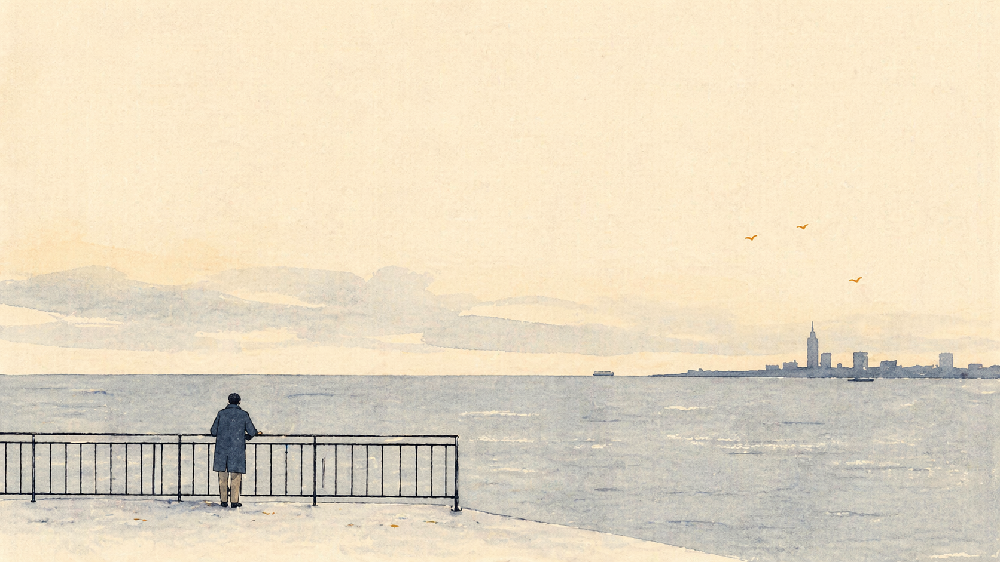

+++
title = "生活的真相是什么？"
description = "罗曼罗兰那句被讲滥了的话，难点不在「热爱」，而在「真相」二字。借《大医》里的「凑近看都是浊」和《大明王朝1566》里胡宗宪那句反问，把这件事掰开看一看。"
date = 2026-04-22
tags = ["随笔", "思辨", "罗曼罗兰", "大明王朝1566", "大医"]
categories = ["写作"]
showTableOfContents = false
+++

有一种句子流传得太广，广到一听见就想戒备——不是因为它不对，恰恰是因为它对得过于顺口。罗曼罗兰那句话就属于这一类：世上只有一种真正的英雄主义，就是在认清生活的真相之后依然热爱生活。真正值得琢磨的，其实是最容易被滑过去的「真相」两个字。

我们都默认自己知道什么叫「生活的真相」，好像这个东西不需要解释。但你把它停下来问一问，很多人其实说不清。大概是挣不到的钱、回不去的故乡、合上手机就不知道该叹气还是骂娘的新闻。或者更抽象：人际里的势利、规则背后的不规则、口号与实操之间的深渊。

这些都真。但把「真」停在这里不够——你把一百件坏事看得明明白白，也解决不了一件事。「看透」本身不生产任何东西，它只是一种状态。

而这种状态下，可选的姿态其实很少。一种是把愤怒当作证据——把自己活成一把没开刃的刀，见人就在心里划一下，以此证明自己还没麻木。另一种是退到岸上，做「都想明白了」的人，看河里扑腾的人。两样都不难。摆久了甚至舒服。舒服到某个时刻你会发觉，自己似乎不是在生活，而是在评论生活。

---

马伯庸在《大医》结尾写过一段还算有意思的话。大意是说，大江也好，大事业也好，你凑近了看，看到的永远都是一堆乱七八糟的事：混乱、逆流、无法理解的荒唐。法国大革命念着自由平等，转头就把一批人送上了断头台；美国独立举着天赋人权，奴隶制照旧搁在那里；明治维新光鲜亮丽，背面是农民和武士的血。凑近看任何一件被后世唱颂的大事，一个理性的旁观者都能找到当场放弃的理由。

但这些事还是过去了。过去的方式并不是有谁把它搞干净了，而是它们在你还没来得及彻底失望之前，就已经往前流了——流过那些山口，去了下一个海。

这段话真正有意思的不是「大势」两个字，而是它把「凑近看都是浊」设成了前提。它没打算替那些血污辩护，它只是指出：凑近这件事本身有局限。你站得近，你就只能看见浪花、泡沫、塑料袋和死鱼。你看不见这条江从哪里来，向哪里去，也看不见它整体在动。

个人的生活其实也是这么一条江。凑近看一周、一个月、一年，基本都是失败、错付和难堪。但把同样的日子拉成十年，会发现有些东西在悄悄长。这种长势你当时感觉不到，因为当时你忙着在浪里挣扎。

所以「看清真相」的第一层大概是：承认凑近看很难看，但也承认凑近看不是全部。不是「一切都会变好」那种糊涂乐观——那是另一种偷懒——而是不再把当下这一口浊水当成唯一判据。

---

但就算承认了这一层，事情也只解决了一半。下一步的问题是：你该不该下水？

《大明王朝1566》里有一段对话我反复想过。海瑞是那种读书读到骨子里的人，嘴边常挂着「沧浪之水清兮，可以濯吾缨；沧浪之水浊兮，可以濯吾足」。水清我做官，水浊我归隐——他觉得这是进退有度。胡宗宪反驳过他。大意是：沧浪之水那是春秋战国才说得通的事，七国纷争，此地不留爷自有留爷处。如今天下一统，你归到哪里去？孔子出过，孟子也出过，黄河清过吗？最狠的是最后一句——「像你这样视百姓饥寒如自己饥寒的官都不愿意致君尧舜，稍不顺心便要辞官归隐，不说江山社稷，奈天下苍生何？」

这话挺扎人。胡宗宪不是在说海瑞不好——海瑞没有不好，他干净、清廉、心里装着百姓。胡宗宪指出的是另一件事：你这份干净是有代价的，代价不由你付，由那些没得选的人替你付。

「看透之后洁身自好」这条路，在读书人里一直是个体面收场。看透是一次性的消耗，看透之后装作没看透继续干，才是每天都要再消耗一次的事。谁不想选前者？转身归隐，回家煮茶，读几本闲书，既保住了自己，也给自己留下一个「不随波逐流」的评语。这套动作做下来非常漂亮。

胡宗宪那句话把这个漂亮戳破了。你归你的隐，可本来指望你的人呢？

---

这两件事放一起看，说的其实是一回事。小说在第一层上停下来，告诉你凑近看都是浊，你没看错。剧在第二层上追问一句，说你不能用浊作为撒手的理由——因为从来不会有一个「水清了再下场」的时刻在前面等你。圣人都出过了，黄河也没清。你想做事，只能在这种水里做。

「生活的真相」大概就是这个样子。它不是廉价的「生活很苦」——那话讲多了就变成一块保护壳，承认了以后人可以名正言顺地缩回小角落。它也不是「努力就有回报」那种成功学——那种话经不起一次真实荒唐事的撞击。

它更像一句冷一点的陈述：你所在的河确实浊、确实脏、确实时不时漂过来一些让人反胃的东西；但它整体在流向某个方向，只是你在岸边看不清楚。而且更关键的是，不管你看清没看清，这条河不会暂停下来等你理顺。身边的人、手里的事、肩上的责，都不会因为你站定了就跟着站定。你可以选择不下水，但「不下水」本身就是一种回答，这个回答会落在别人身上。

---

到这里回看罗曼罗兰那个「英雄主义」。这个词我一度觉得太重——跟挤早高峰、被工作和家事推着走的人有什么关系？但「看清了依然去爱」恰恰是没有爆发、没有观众、没有掌声的事。它全然是私事，没有一次性完成的版本，每一天都要重新做一次。生活每天会给你一点新理由想撒手；所谓英雄主义，无非是在这些时刻一次又一次没有撒手。

不是披风飘起来的那种英雄，多半只是在自己那一小块位置上继续把事情做完的人。第二天早上还是会起床，继续做。罗曼罗兰用这个词不是在替他们戴花，是替他们称一下重量。

所以那句话并不是鸡汤，而是一句挺冷的实话：你迟早要在看清之后做一个选择，这个选择没有人能替你做。

---

生活不要求你做圣人，也不劝你做隐士。它只冷静地问一句——你所在的位置上还有事等着你去做，你做不做？

回答「做」的人，不一定比别人高尚。但至少比昨天的自己多了一点重量。能多出这一点重量，大概就是生活愿意交给我们的全部。
