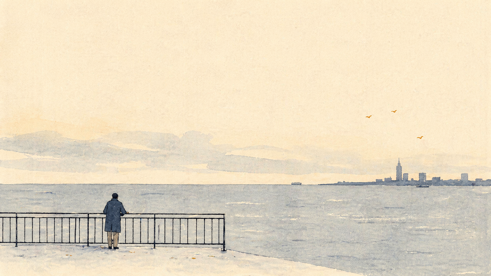

+++
title = "生活的真相是什么？"
description = "罗曼罗兰那句被讲滥了的话，难点不在「热爱」，而在「真相」二字。借《大医》里的「凑近看都是浊」和《大明王朝1566》里胡宗宪那句反问，把这件事掰开看一看。"
date = 2026-04-22
tags = ["随笔", "思辨", "罗曼罗兰", "大明王朝1566", "大医"]
categories = ["写作"]
series = ["随笔"]
showTableOfContents = false
+++

有一种句子流传得太广，广到一听见就想戒备——不是因为它不对，恰恰是因为它对得过于顺口。罗曼罗兰那句话就属于这一类：世上只有一种真正的英雄主义，就是在认清生活的真相之后依然热爱生活。

传到后来，它只剩下一点劝人振作的意思。日子再难，也要热爱；现实再坏，也要向前。话当然没错，只是听多了难免让人起疑：究竟要认清什么，才值得动用「英雄主义」这么重的词？

如果所谓真相，不过是生活很苦、人心复杂、世事不公，那它其实算不上什么秘密。挣不到的钱，回不去的故乡，口号与实操之间的深渊，合上手机以后不知道该叹气还是骂娘的新闻——这些东西每天都摆在眼前，根本不劳谁来揭开。

知道这些，也未必就叫认清生活。一个人可以把一百件坏事看得明明白白，仍然不知道该怎样过好明天。看透只是一种状态，它本身不生产任何东西。

停在这种状态里，人很容易把自己放到生活的对面。一种是把愤怒当作证据，把自己活成一把没开刃的刀，见人就在心里划一下，以此证明自己还没麻木；另一种是退到岸上，做那个「都想明白了」的人，看河里的人扑腾。两样都不难，摆久了甚至舒服。舒服到某个时刻你会发觉，自己不再生活，只负责评论生活。

可人真的能站到岸上吗？

---

马伯庸在《大医》的结尾谈过大江。大江也好，大事业也好，凑近了看，总是一片浑浊。自由平等后面跟着断头台，天赋人权旁边放着奴隶制，光鲜的变革背后压着普通人的血。任何一件后来被写进书里的大事，回到当时，都是混乱、逆流和叫人失望的荒唐。一个足够理性的旁观者，总能找到不再相信它的理由。

这段话容易被读成一种「历史自有大势」的乐观，好像只要忍过眼下，河水迟早会流向好地方。我倒觉得它没有这么热。它没有打算替那些血污辩护，也没有许诺河流必会抵达一个更好的地方。它真正说中的，是「凑近」本身的局限。

人站在一条江边，低头能看见泡沫、塑料袋和死鱼，这些都是真的；但低头看不见江的全貌，也是真的。我们总拿眼前的一段水，替整条江下结论，又拿此刻的一点得失，替自己的一生下结论。身在其中时，一周是疲惫，一个月是反复，一年也未必看得出什么。许多变化只有隔得足够远才显形，可当时的人正忙着呛水，哪里顾得上回头看。

这不是说一切终究会好。河流只负责往前，并没有承诺流向哪里。承认自己看不全，也不是要把已经看见的污浊说成清澈；只是说，看清生活的第一件事，也许恰恰是看清自己的眼睛：眼前的确实是真的，却不是全部。

然而，人若只是因此变得谦逊一点，事情仍没有说完。因为江水不等人想明白。它流它的，而我们早就在水里。

---

《大明王朝1566》里，海瑞说起「沧浪之水清兮，可以濯吾缨；沧浪之水浊兮，可以濯吾足」。水清便出仕，水浊便归隐，在他看来，这是读书人的进退，也是一个人保全自己的办法。

胡宗宪偏偏追问：孔子出过，孟子也出过，黄河清过吗？像海瑞这样把百姓饥寒当成自己饥寒的人，稍不顺心便要辞官归隐，那天下苍生怎么办？

这句话扎人的地方，不是它要求所有人都留下，也不是它把自我牺牲说成天经地义。人离开一份差事、一段关系，有时不是逃避，而是自救。真正被它戳破的，是另一种东西：我们总以为留下的人才会弄脏手，转身的人便能清清白白；好像只要自己不参与，事情的后果也就与自己无关。

「看透之后洁身自好」，在读书人那里一直是个体面的收场。看透是一次性的消耗，带着已经看见的东西继续做，才是每天都要再消耗一次。谁不想选前者？转身归隐，回去煮茶、读书，既保住了自己，也给自己留下一个「不随波逐流」的评语。这套动作做下来，非常漂亮。

胡宗宪那句话把这份漂亮戳破了：海瑞若归隐，海瑞当然保住了海瑞，可本来指望他的人呢？他的干净不是没有代价，只是那代价未必由他来付。

人很难得到一种全然清白的选择。留下会辜负一些东西，离开也会；伸手可能做错，袖手同样会把结果推向某处。我们当然可以走，也可以不接，但不能因为自己站远了一点，就假装那不是一种回答。

所谓真相，大概不只在河水有多浊，更在于世上原本没有一块真正的岸。我们生在关系里，也活在后果里。身边的人、手里的事、肩上的责任，不会因为我们还没想通就暂停下来。生活给人的，从来不是一道善恶分明、答对便可全身而退的题；它给的是一团混杂的现实，再催着人从里面作出选择。

这才是「认清」真正困难的地方。看见别人的污浊不难，看见自己也在水中，难。承认现实荒唐不难，承认自己无论进退都要分担一点后果，难。前一种清醒让人显得锐利，后一种清醒却要人付账。

---

这样再回头看「依然热爱生活」，那个「爱」便不太像一种热烈的感情。生活可爱的时候，爱它不需要英雄主义；顺风顺水时说愿意，也用不着多大的勇气。

它更像是不撤回自己的回应。不是相信努力必有回报，不是假装河水已经干净，也不是不许自己疲惫、转身和离开；而是在作出这些选择时，仍肯承认自己与生活的联系，肯看见代价，肯为能够承担的那一部分负责。

有时这种回应是留下，把一件麻烦的事继续做完；有时是离开，却不把残局理所当然地扔给别人；有时只是第二天照常起床，照顾一个人，守住一句话，把已经失望过的事情再认真做一次。没有披风，没有观众，也没有哪一刻可以宣布从此完成。罗曼罗兰用「英雄主义」这个词，不是在替这些人戴花，只是替他们称一下重量。

生活每天都可能给人一个撒手的理由。所谓英雄主义，无非是理由都看见了，手却没有因此立刻收回。不是因为确信前面有好结果，只是因为眼前还有人和事，值得自己给出一个回答。

所以，生活的真相或许不是「世界很坏」，也不是「未来会好」。它是一句更冷的实话：水从来没有清过，我们也从来不真正在岸上。能做的，不过是带着已经看见的一切，决定这一次要不要伸手。

那只伸出去的手，未必改变河流。生活也不要求你做圣人，它只冷静地问一句——你的位置上，还有人和事在等你回应。接不接？

回答「接」的人，不一定比别人高尚，但至少比昨天的自己多了一点重量。能多出这一点重量，大概就是生活愿意交给我们的全部。
