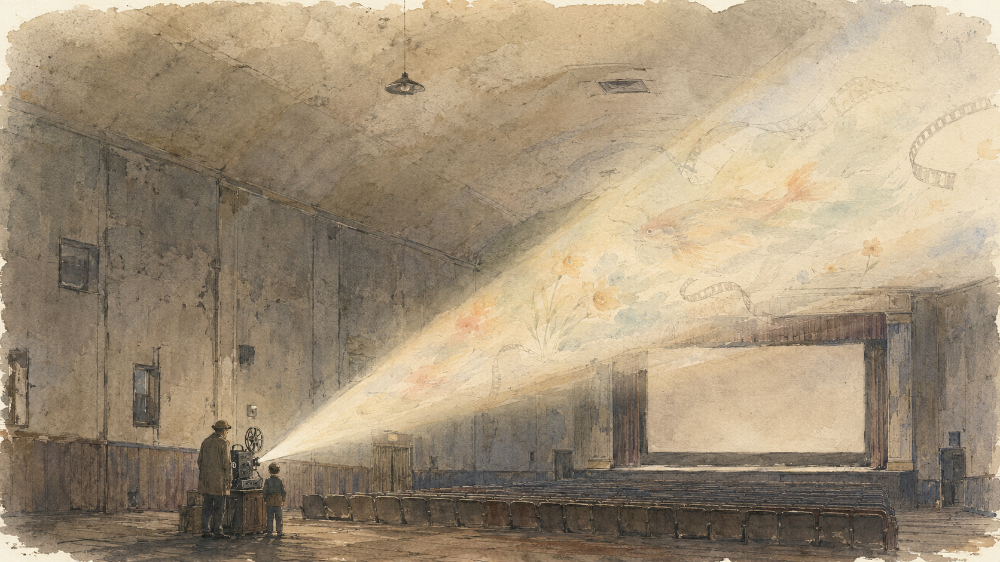

+++
title = "给生活涂上彩虹色的人"
description = "《大鱼》下面有一条评论说，那些在生活外表涂上彩虹色的人值得信赖。借爱德华·布鲁姆、《天堂电影院》的艾弗多和王小波那把尺子，看看这个反常的判断为什么成立。"
date = 2026-08-03
tags = ["随笔", "思辨", "大鱼", "天堂电影院", "王小波"]
categories = ["写作"]
series = ["随笔"]
showTableOfContents = false
+++

《大鱼》下面有一条评论，我记了很久：

> 在这世界上，只有在你所爱的人之外，才需要辨别所谓真假。生活的事，有种种说法。所谓真相，可能是最令人乏味、最让人难以接受的。而那些在生活外表涂上彩虹色的人，他们值得尊重和信赖，因为他们的爱。

这段话里有一个很奇怪的判断：一个给生活涂颜色的人，反而值得信赖。

照常理说，可信的人应该忠于事实。见过什么就说什么，发生几分便讲几分，不夸大，也不添枝。可爱德华·布鲁姆显然不是这种人。他说自己遇见过女巫，女巫的眼睛里映着每个人死去的方式；说他在战场上见过连体歌唱的姐妹；说一整片水仙花一夜之间从草地里长出来，只因为他要向一个姑娘求婚。

真实里的他，不过是个挨家挨户的推销员。一份枯燥得不用多讲的工作，被他沿途讲下来，竟成了一圈奇观。若按事实核查，他大概处处可疑。可那条评论偏偏说，这样的人值得信赖。

为什么？

---

爱德华的儿子威尔也想问这个问题。他是个记者，习惯把故事还原成事实。父亲讲得越热闹，他越觉得自己离父亲越远：一个人若把一生都编成传奇，那个真正的他究竟藏在哪里？

父子俩为此较劲了半辈子。直到电影尾声，爱德华躺在病床上，再也没有力气讲完最后一个故事，威尔才替他接了下去。他带着父亲逃出医院，奔向河边；镇上的每一个人都在那里等候；父亲变成一条大鱼，游回了河里。

威尔当然没有突然相信世上真有这样的结局。他只是终于明白，父亲那些不可靠的故事，并不是为了藏起自己，恰恰是他把自己交给世界的方式。

水仙花地未必真的一夜长成，可他爱一个姑娘时，心里发生过的事，大概只能由一整片水仙花来形容。送行的人未必挤满河岸，可那些被他认真遇见、又认真讲述过的人，确实组成了他的一生。故事改动了事实的形状，却没有减轻感情的分量。

儿子最后替父亲讲故事，也不是终于向虚假投降。他只是借父亲的眼睛看了一次世界，也用父亲的方式爱了他一次。

在你所爱的人之外，才需要辨别真假——这句话大概不是说，爱可以替谎言开脱。它说的是另一件事：事实并不总能装下一个人全部的真实。有些东西若只照原样记下来，反而会漏掉最重要的部分。

---

而生活最难让人接受的，未必都是苦。

讲到「生活的真相」，我们习惯往苦那边想：失去、不公、无能为力。可苦多少还有一点形状，能撑起愤怒，也能撑起悲剧。生活里更大的一块，常常连悲剧都算不上。早上闹钟，出门通勤，吃饭洗碗，睡觉，第二天再来一遍。无聊不给人反抗的对象，也不给人哀伤的资格。它只是把一天磨平，再拿下一天接上来。

所以那条评论真正扎人的词，也许不是「真相」，而是「乏味」。

如果一个人只是忠实记录，生活的确很容易剩下一份流水账。但有些人偏能从流水账里挑出一点什么。不是因为他们没有见过灰色，也不是因为他们比别人天真；他们只是不肯承认，灰色就是眼前一切的总和。

《天堂电影院》里的老放映师艾弗多，也是这样的人。

他的生活甚至比爱德华更重复：每天把一部电影放完，第二天再放一次。小镇不大，放映厅也不大，连银幕上的吻都要先被神父剪掉。艾弗多没有写文章控诉，也没把自己活成什么反抗者。他只是舍不得扔，于是把那些被剪掉的吻一段一段收起来，偷偷接成一卷。

这件事很小，甚至有点孩子气：我知道这些东西好，所以我要把它留下来。

后来他又把年轻的托托推出小镇，不许他回来。他知道这孩子若留下，会慢慢变成另一个困在放映室里的自己。于是他替托托拿了一个近乎蛮横的主意，把孩子推向更远的地方，自己留下，守着机器，也守着那一屋子的胶片。

爱德华用故事改变生活的讲法，艾弗多没有讲那么多。他只是替一些东西留了位置：替银幕上的吻，替一个孩子还没发生的人生，也替这座乏味的小镇保存了一点不肯消失的东西。

这种人在那里，整个镇子便不再只是一个纯然乏味的镇子。它里面有一种看不见的光斑在转。

到这里，「涂上彩虹色」才不只是一个人的想象力。颜色若只够自己欣赏，顶多算趣味；愿意把它保存下来，再交到别人手里，才开始接近爱。

---

王小波说过：我活在世上，无非想要明白些道理，遇见些有趣的事。倘能如我所愿，我的一生就算成功。

这句话给前面两个人补上了一把尺子。

「明白些道理」是往真相里走。它要求人看见荒谬、愚蠢和时代怎样把人按在地上，不拿漂亮故事遮住现实。「遇见些有趣的事」却是在真相之后，仍然给生活留一点余地：现实已经如此，人能不能不把自己也活得同样僵硬？

光搞懂是冷的，像书呆子；光觉得有趣是飘的，像嬉皮。只有明白而没有趣味，人容易把清醒活成刻薄；只有趣味而不肯明白，颜色又会变成薄薄一层油漆，经不起一次真正的荒唐。

王小波的文字好，就好在两样东西同时都在。他知道底色是灰的，甚至比许多人看得更清楚；可他总能从荒谬里再看出一点好笑，从规训里拐出一点自由。他不是用有趣否认真相，而是不肯让真相垄断生活。

这也正是爱德华和艾弗多做的事。爱德华用故事留，艾弗多用胶片留，王小波用小说留。他们不是凭空给灰墙刷上一层颜色，也不只是站在那里等着颜色自己出现。生活里原本有一点微弱的可能，他们先看见，再用自己的讲述、选择和偏爱，把它变成别人也能看见的形状。

所谓彩虹色，大概就是这样来的。

---

上一篇谈「认清之后依然热爱」，最后落在一个人愿不愿意继续回应。这一篇再往前走一点：回应生活，并不总是咬紧牙关把事情做完。它也可以是替平常的一天多看一眼，替容易消失的东西留一个位置，再把自己看见的那一点颜色交给别人。

身边若有这样的人，是一种运气。他不一定是你的父亲，不一定是老放映师，也不必是作家。你只是会慢慢发觉，同样一件事，在别人嘴里是平的，到他那里便多出一层意思；同样的一天经他的眼睛，被裁成另一个形状，比原先灰的、平的、重复的日子，多了一点什么。

那一点什么，是他的有趣；而他愿意把它分给你，是他的爱。

所以我后来才明白，那条评论为什么说这些人值得信赖。我们未必能相信爱德华讲过的每一件事，却可以相信，他不会把爱过的人讲得无关紧要；未必能相信生活处处都有奇迹，却可以相信，有些颜色确实会因为一个人的珍惜，被从乏味里保留下来。

给生活涂上彩虹色，不是拿故事遮住真相，而是因为有人知道：灰色不必照料，自己就会铺满日子；颜色却需要一双眼睛先看见，再需要一双手把它留下。

所谓值得信赖，大概就是你知道——这个人不会把你，也不会把他经过的世界，轻易活成一件乏味的事。
