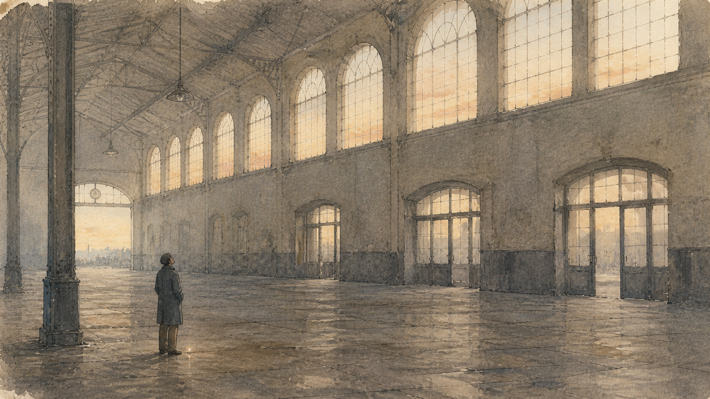

+++
title = "曙光在头上，不抬起头，便永远只能看见物质的闪光"
description = "鲁迅那句话常被读成「别忘了仰望星空」。可把它和《月亮与六便士》摆在一起会发现，难的不是在月亮与六便士之间选一个，而是除了价格与回报，我们还准备用什么判断一件事值不值得。"
date = 2026-08-09
tags = ["随笔", "思辨", "鲁迅", "随感录五十九", "月亮与六便士"]
categories = ["写作"]
series = ["随笔"]
showTableOfContents = false
+++

> 鲁迅那句话常被读成「别忘了仰望星空」。可把它和《月亮与六便士》摆在一起会发现，难的不是在月亮与六便士之间选一个，而是除了价格与回报，我们还准备用什么判断一件事值不值得。

如果只截取最后一句，《随感录五十九》很像是在劝人不要太看重物质。

低头，只能看见眼前的利益；抬头，才能看见更远的理想。这个意思并不难懂，也很容易接着说下去：人不能只顾挣钱，还要读书、创作、追求精神生活。说到最后，文章大概会变成一句熟悉的劝告——别忘了仰望星空。

可一个人为什么会一直低着头？

很多时候不是因为他不喜欢天空，而是因为脚边的事情更紧迫。工作要完成，账单要支付，家里有人需要照顾。物质的好处正在这里：它可以被看见、计算，拿到手里以后也确实能解决问题。比起一种不知道何时才能实现的理想，眼前的收入和结果当然更可靠。

所以鲁迅没有简单地说「物质」，而是说「物质的闪光」。这个「闪光」很准确。物质并不总以贪婪的面目出现，它常常明亮、具体，而且有用。人被它吸引，不是什么不可理解的事。

真正的问题是，如果眼睛长期只适应这种近处的光，别的东西会不会渐渐显得暗淡，最后像是根本不存在？

---

《随感录五十九》原本讨论的，也不是一个人该不该追求财富。

鲁迅先写秦始皇的「阔气」。刘邦看见了，说「大丈夫当如此也」；项羽看见了，说「彼可取而代也」。一个羡慕，一个想取而代之，心里装的却是同一幅图景：得到威势，占有财富，让天下的好东西尽可能归于自己。

等这些欲望得到满足，人又开始害怕死亡，于是求神仙；神仙没有求来，便修造坟墓，希望死后仍能长久地占据一块地方。鲁迅把这一连串愿望写得很不客气，因为在他看来，这些所谓的「最高理想」虽然越来越大，始终没有离开一个「取」字。

想要更多并不是它唯一的问题。更要紧的是，在这种想象里，世界只是供一个人取用的东西，别人要么是被征服的人，要么是帮助自己留下功名的人。无论理想说得多么宏大，中心仍然只有一个「我」。

所以文章写到后面，鲁迅才转向自由、平等和互助共存。这些观念与前面的「取」不同：它们未必能给相信的人带来好处，甚至可能要求人放弃原本可以保全的东西。他写那些有主义的人用骨肉碰钝锋刃，用血液浇灭烟焰；刀光火色退下去以后，天边才露出一点新世纪的曙光。

这样再看「抬头」，它就不只是从现实望向梦想。

一个人抬起头，是因为他终于承认，世上除了可以拿到自己手里的东西，还有一些不能被占有，却值得相信和维护的东西。它可能和自己有关，也可能要等到很久以后才有结果；有时甚至轮不到自己看见结果。

曙光与物质的闪光，区别不只在高低，也在于我们用什么衡量一件事。前一种光问的是：这件事值得吗？后一种光更习惯问：它能给我什么？

这两个问题本来都需要。只是第二个问题答案清楚，又时时催人作答，久而久之，便很容易替我们回答了全部生活。

---

这种变化很少发生在某个戏剧性的时刻。

没有人会在一天早晨醒来，郑重决定从此只相信有用的东西。更多时候，我们只是一次次选择更确定的事。读一本暂时用不上的书，可以留到以后；花时间做一件没有结果保证的事，也可以再等等。先把正事做完，这个理由每一次听起来都很充分。

可「正事」是做不完的。昨天是一项任务，今天是一笔开支，明天又有新的安排。那些无法立即说明用途的事情并没有被否定，只是不断往后挪。挪得久了，人甚至会对它们感到陌生，不再知道自己当初为什么喜欢。

到这时，《月亮与六便士》这个书名才显出它的意思。

一枚六便士躺在脚边，月亮挂在头上。六便士可以捡起来，月亮只能看见；六便士拿到手就多了一点财产，月亮却不提供这样的凭据。人很难同时盯住两者，低头的时候会错过月亮，抬头的时候也可能看不清脚下。

这个书名好，并不是因为它替人作出了选择。它没有说月亮一定比六便士高贵，也没有说为生活弯腰的人缺少理想。它只是把两种不同的价值放在了同一幅画面里：一种可以计价，一种无法计价；一种解决眼前的问题，一种决定人为什么愿意继续过这样的生活。

六便士当然重要。把钱说得毫无价值，通常是因为说话的人暂时不缺钱。真正值得警惕的不是人捡起六便士，而是六便士慢慢成了唯一的尺子。

一件事情若不能带来收入、成绩或认可，便很难证明自己值得时间。就连理想也会被这把尺子重新量过：热爱最好能变成职业，创作最好有人看见，付出的时间最好留下一个可以展示的结果。否则，人便难免怀疑自己是不是做了一件无用的事。

看起来我们仍在谈月亮，实际上只是把月亮想象成了一枚更大的六便士。

---

斯特里克兰德似乎完全不受这把尺子支配。

他在中年离开伦敦的职业和家庭，跑到巴黎画画。贫穷、疾病和别人的轻视都没有使他停下来。他也不在乎作品能不能卖出去。到了塔希提岛，他在失明前完成最后的壁画，死后整间屋子连同画一起被烧掉。那幅画没有给他换来财富，甚至没有留下供后人赞叹的机会。

从这一点看，他确实只看月亮。绘画不是他获取成功的办法，而是一件无论有没有回报都必须去做的事。

可毛姆没有因此把他写成一个高尚的人。

他抛弃妻子和孩子，也伤害帮助过他的施特略夫。他对自己的愿望异常诚实，对别人的痛苦却近乎冷酷。绘画使他摆脱了金钱和体面的尺度，却没有使他走出那个过于强大的「我」。

这也是鲁迅的曙光和斯特里克兰德的月亮不能简单画上等号的地方。鲁迅所说的自由、平等与互助，要求人看见自己之外的人；斯特里克兰德的理想却只服从内心的驱使，别人很容易成为他经过时留下的代价。

一个人不再用六便士衡量生活，不等于他已经找到了一把更好的尺子。

理想可以解释他为什么出发，却不能替他免除沿途的责任。月亮若只照见自己的方向，看不见脚边被踩伤的人，它依然可能是另一种自我占有。区别只在于，有人想占有财富，有人想让整个世界为自己的理想让路。

《月亮与六便士》因此没有给出一个轻松的答案。它既让人相信，有些愿望确实不能用利益解释；又让人看见，拒绝利益并不会自动把一个人变好。真正困难的从来不是在月亮和六便士之间选一个，而是除了价格和回报之外，我们究竟还准备用什么判断一件事是否值得。

---

这把新的尺子未必写得出刻度。

它不会简单地把「不赚钱」判为高贵，也不会要求所有人放下眼前的生活。它只是让人在问「我能得到什么」之外，再多问一句：如果这样的选择重复许多年，它会把我带向一种怎样的生活？

有些事情没有立刻的用处，却让一个人的眼睛不只盯着自己；有些时间没有留下成果，却使生活不至于全部变成任务。它们未必是月亮，更谈不上曙光，只是提醒人：能够被计算的东西很重要，却并不因此拥有解释一切的资格。

鲁迅写的是「曙光」，不是已经升起的太阳。刀光火色刚刚退下去，天边只有一点薄明，前面的路仍然看不清。曙光不替人解决眼前的困难，也不保证人一定抵达哪里。它只让人知道，黑夜不是天空唯一的样子。

物质的闪光比它近，也往往比它明亮。但近处的光只能照见手里有什么，不能替人决定什么值得相信，什么值得维护，又愿意为怎样的生活承担代价。

人当然可以低头，把脚边的六便士捡起来。

只是起身以后，总该再看一眼天色。不是为了证明自己有理想，只是不要让一枚硬币替自己决定，什么才算值得。
