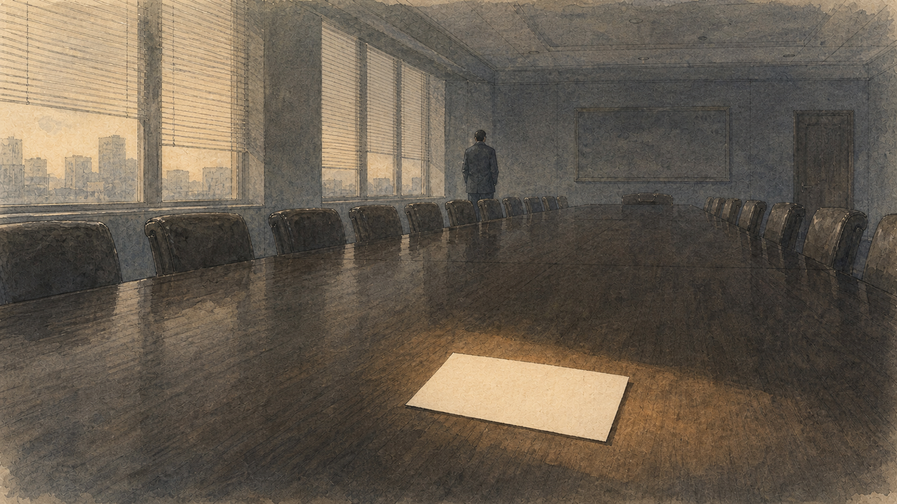

+++
title = "当名片开始替人活着"
description = "《美国精神病人》里那几张名片，差别细到外人根本看不出来，却足以让一个人怀疑自己的价值。把它和《完美的日子》里的平山摆在一起：同样是重复的日子，有人需要东西替自己说话，有人只是借它与世界多发生一次关系。"
date = 2026-08-16
tags = ["随笔", "思辨", "美国精神病人", "完美的日子", "消费社会"]
categories = ["写作"]
series = ["随笔"]
showTableOfContents = false
+++

> 《美国精神病人》里那几张名片，差别细到外人根本看不出来，却足以让一个人怀疑自己的价值。把它和《完美的日子》里的平山摆在一起：同样是重复的日子，有人需要东西替自己说话，有人只是借它与世界多发生一次关系。

吃饭之前，已经知道照片应当从哪个角度拍；跑步的时候，想着身体，也想着结束后那张配速截图；书读到年末，渐渐排成一份可以晒出的书单。

这些事本身都没有问题。真正的变化发生在更早的地方：一件事还没有开始，我们已经能够想象它被别人看见时的样子。

我们习惯以为，人先有欲望，然后去寻找满足它的东西。可如果一种愿望连同满足它的姿势，一开始就是一起送到手里的，它还算不算自己的？

《美国精神病人》把这件事推到了尽头。

---

这部电影里最有名的一场戏，没有血，只有几张名片。

几个年轻人围坐在会议室里，穿着几乎相同的西装，做着谁也说不清内容的工作。有人拿出新印的名片，象牙白的纸，字体雅致；另一个人不动声色地掏出自己的，蛋壳色，带浮水印。轮到保罗·艾伦的名片摆上桌面时，帕特里克·贝特曼的手指开始发抖，额头渗出细汗，像被人当众剥夺了什么。

其实那几张名片放在一起，外人根本看不出差别。纸张的厚薄，字距的松紧，白与白之间的深浅——细到要凑近了才能辨认。

真正值得追问的不是那张名片好在哪里，而是：为什么一张纸上几毫米的区别，足以让一个人怀疑自己的价值？

答案也许就藏在他们彼此的样子里。这群人穿相似的西装，梳相似的头发，出入相似的餐厅，连名字都经常被认错。人和人之间几乎没有区别，于是区别只好由名片来承担。

名片原本是代表一个人的东西。到了贝特曼那里，人反而成了名片的背面。

把镜头从会议室移开，贝特曼的一整天都在做同一件事：介绍自己。

清晨起床，先是几百个卷腹，然后冰袋敷眼、磨砂膏、面膜、须后水、保湿霜，一步不能乱。他对镜子里的身体非常尽责，像保养一件随时要拿去展示的商品。他能认出同事西装出自哪位裁缝，分得清手表的产地，背得出城里最难订的餐厅；谈起流行音乐，他可以从专辑的制作水准一路讲到歌手的转型意义，措辞标准得像一份印刷品。

他几乎一直在说话，一直在展示。可他说出的每一件事，都来自外部：什么样的身体值得展示，什么样的餐厅代表地位，什么样的音乐显得有品位，什么样的名片证明自己胜过别人。这些标准没有一条是他定的，他只是逐条对照，逐条达标。

把这些标签一件件拿掉，剩下的是什么？

他自己倒说得很清楚。他对着镜子说，帕特里克·贝特曼只是一个概念，一种抽象；那里面并没有一个真正的我。

这句话常常被理解成空虚。可空虚是个太轻的词。他并不是没有自我表达——恰恰相反，他表达得太多了。只是所有替他说话的东西，都可以从商店里买到。

于是电影里那个反复出现的笑料，也就不再是笑料：这些人不断认错彼此。贝特曼被叫成别人的名字，别人也被当成贝特曼，认错的人不在意，被认错的人懒得纠正。他们拼命借物品证明自己与众不同，最后却连彼此是谁都分不清。

名片上那一点白色的差别，比人本身还要清楚。

---

到了电影结尾，他终于在深夜的电话里向律师承认了一切：他杀了保罗·艾伦，杀了很多人。这是全片里他第一次不借名片、西装或餐厅介绍自己。他只说：这些事是我做的。这句话总该只能属于他。

第二天，律师笑着拍他的肩膀，夸这个玩笑开得妙，顺口叫了他另一个人的名字。至于保罗·艾伦，律师说，前几天还在伦敦同他吃过两次饭。

社会当然没有追究他。更冷的是，在那个世界里，他和其他人原本就没有足够的区别，连这份自白都找不到一个确定的主人。

电影的最后一个镜头，停在他身后的一扇门上。门上贴着一行字：

THIS IS NOT AN EXIT.

---

另一部电影里，另一个男人也过着几乎不变的日子。

《完美的日子》里的平山，清晨被扫街老人的竹帚声唤醒，叠好铺盖，给窗台的树苗喷水，刮脸，穿上工作服，在楼下的自动贩卖机买一罐咖啡，开车去东京各处清扫公共厕所。傍晚去澡堂，在地铁站里的小馆子吃饭，睡前读几页旧书。第二天再来一遍。

从外面看，他的生活比贝特曼单调得多。没有餐厅的预约，没有名片，几乎没有对白。

可两个人的重复，完全不是一回事。

贝特曼清晨护理身体，是把自己维护成一件合格的展品；平山蹲下来，用一面小镜子检查马桶的下沿——那里不会有人看到，他检查它，只是因为这是他手里的工作，而他打算把它做好。贝特曼谈音乐，像在背诵一份文化消费说明；平山把磁带推进车里的卡座，音乐真的改变了那一段路。

平山也拍照。一台旧胶片相机，对着头顶的树影，每天按一次快门。照片冲洗出来，他挑出留下的，装进铁盒，按年份码在壁橱里。没有人看，他也不打算给谁看。那些照片不替他证明什么，只是保存了一次看见。

同样是拥有一件东西，有人需要它替自己说话，有人只是借它与世界多发生一次关系。

他拍的那种树影，电影里有个说法，叫木漏れ日——从枝叶缝隙里漏下来的光。它每天都有，又每天不同：同一棵树，同一个时辰，风一动，地上的光斑就换了一副样子。平山看得见这种差别，所以他的日子虽然重复，却没有哪一天可以互相顶替。

而贝特曼的日子，连同他这个人，恰恰是可以顶替的。

但《完美的日子》没有把话说满。

电影后段，平山的妹妹来接离家出走的侄女。她坐在司机驾驶的黑色轿车里，隔着车窗问哥哥：你真的在打扫厕所吗？

这个短暂的照面透露了一件事：平山并非从来只有这一种生活。他大约出身于一个体面甚至优渥的人家，如今的日子至少有一部分来自选择，而不是因为所有的门都已经关上。

一个身后还留着另一种生活的人，和一个从来没有退路的人，即使每天做着同样的工作，也不在同一种处境里。前者可以在重复中安排自己的节奏，替树影留出一次快门；后者的重复，可能只是不得不交出的时间。

所以这部电影不能被读成「收入不重要，学会欣赏树影就好」。这种话说给一个没有休息、没有安稳住处、也没有拒绝余地的人听，未免太轻巧。

平山真正让人看到的，不是清贫的美，而是一个更朴素的前提：一个人要与眼前的事建立真正的关系，先得有一段真正属于自己的时间，也有说「不」的资格。城市里还要有不必花钱就能停留的地方，生活也不能脆弱到一次失败便整个压垮。

劝一个疲于奔命的人抬头看树影并不困难。难的是先别把他的白天全部拿走。

---

应对这样的生活，未必从扔掉多少东西开始。同一盘磁带，可以用来说明自己懂什么，也可以真的装着一首陪人上班的歌。区别不在磁带，而在它究竟帮人与世界多发生了一次关系，还是代替了这种关系。

平山把冲洗出来的照片装进壁橱里的铁盒。它们没有观众，写不进履历，也换不来任何东西；只是把一些真正属于他的时间留了下来。在可以被标价、比较和替换的部分之外，一个人还剩下一点别人代替不了的东西。

名片原本只是让两个人以后还能找到彼此。它可以写上职位、电话和地址，却不该成为一个人最后还能被找到的地方。
