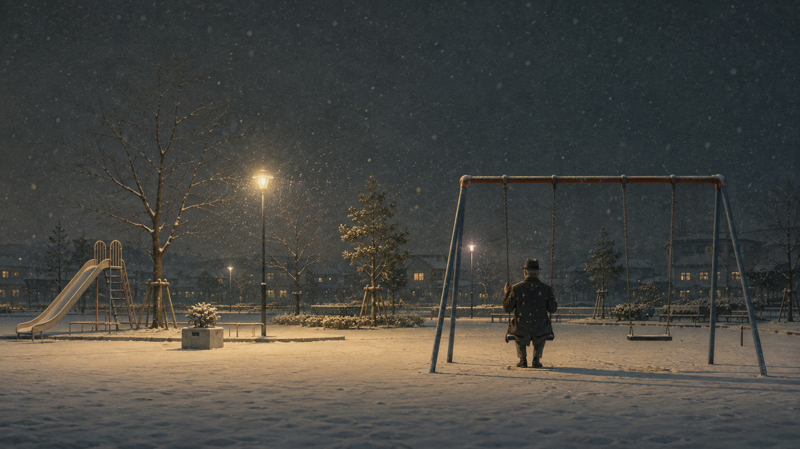

+++
title = "我们总以为以后还来得及"
description = "「以后」没有日期，走近一步它就退后一步。借《生之欲》里的渡边勘治和托尔斯泰笔下的伊凡·伊里奇，看那个背了一辈子的三段论突然轮到自己头上的瞬间——以及知道时间有限之后，真正困难的部分才刚开始。"
date = 2026-08-23
tags = ["随笔", "思辨", "生之欲", "伊凡·伊里奇之死", "黑泽明", "托尔斯泰"]
categories = ["写作"]
series = ["随笔"]
showTableOfContents = false
+++

一天是从什么时候开始不属于自己的，很难说清。早上被闹钟叫醒，通勤，回消息，把一件事处理完，又来三件。偶尔在电梯里，或者深夜的出租车上，会觉得这样的日子有点不对。也不是没想过办法：以后换一份工作，以后多读点书，以后把落灰的相机重新拿出来，以后去一个远一点的地方，以后有时间了，认真想一想自己到底想怎么过。

这些念头并不虚假。问题只有一个：「以后」没有日期。它永远站在今天后面一点点，走近一步，它就退后一步。

于是今天照原样过下去，并不显得像一个重大的决定。我们从来没有郑重宣布过「我要这样过一辈子」，只是每天都觉得，今天先这样。一天当然算不了什么。可一辈子，偏偏就是由一个个「今天先这样」组成的。

海德格尔写过一种再普通不过的处境：世界早就替我们备好了全部答案，什么算成功，什么年龄该做什么，一个正常人应该怎样度过一生；人不知不觉住进这些答案里，「我想怎样活」，慢慢变成了「一个人一般应该怎样活」。

《生之欲》里的渡边勘治，就是把这句话过成了三十年。他是市政府的市民课课长，三十年没有请过一天假。文件从左手边移到右手边，市民的申请从一个科转到另一个科，桌上的图章一天要盖几百次。没有哪个早晨，他认真决定过要把一生耗在这张桌子后面。事情只是一天接一天地发生了：最初大概只是「先干几年」，几年变成十几年，十几年变成三十年。

电影没有把他拍成一个可怜人。他有职位，有儿子，有房子，在同事眼里稳重可靠。真正让人不安的恰恰是，这样的生活看起来太正常了。正常到如果没有后来的事，他可以一直坐到退休，中间不会有任何一天显得特别。

人能够安心沿着一条现成的路一直走，多半不是因为确信它正确，而是因为总觉得，哪天不喜欢了，还可以换——这又不是一辈子。可很多一辈子，就是这样开始的。

---

托尔斯泰在《伊凡·伊里奇之死》里，写过这条路的尽头。

伊凡·伊里奇从小在逻辑课上背过一个三段论：凯尤斯是人，人都会死，所以凯尤斯会死。他一直觉得这个推理无懈可击——对凯尤斯而言。凯尤斯是抽象的人，抽象的人会死，天经地义。可他自己不是凯尤斯。他是小时候被叫作万尼亚的那个人，有过母亲，有过家庭教师，有过一只他喜欢得不得了的条纹皮球。凯尤斯没有闻过那只皮球的味道。凯尤斯会死是对的，但我，是另一回事。

这就是两句话之间的距离。

一句是：人都会死。

另一句是：我要死。

前一句谁都知道，从小就知道，它像「地球绕着太阳转」一样正确。正确，却和今晚吃什么没有关系。在那句话里，死亡永远发生在凯尤斯身上——某个老人，某个病人，新闻里的某个名字。而我们还有明年，还有五年后，还有退休以后。

渡边就是在诊室里，从前一句掉进了后一句。医生说，只是轻度的胃溃疡，不碍事。可他在候诊室里早就听人讲过，医生用这种口气说话的时候，意味着什么。胃癌，剩下的时间大约半年。《生之欲》的剧本，当年也正是把托尔斯泰这本小书当作起点之一写出来的。两个隔了六十多年的作者，写的其实是同一个瞬间：那个背了一辈子的三段论，突然轮到了自己头上。

这时真正消失的并不是生命——它本来就一直在流走——而是一种从未被察觉过的东西：那种「我随时都可以重新开始」的感觉。一个人第一次发现，有些电话今天不打，也许以后真的不会再打了；有些地方一直不去，这一生就是没有去过；有些事情不断推迟，并不是「暂时没做」，而是在一小步一小步地，选择「不做」。

塞内加早就写过这件怪事：人守钱财守得很紧，被占一点便宜都要发火，唯独对时间慷慨得惊人，谁来取用都不设防。两千年过去，我们还是这样。当然，谁也不会每天收到一张诊断书；恰恰因为绝大多数日子里什么都不会发生，延期才显得那么合理：明天大概率真的会来，于是今天可以放心地借给明天。真正的问题只是，没有人知道自己还能借多少次。

---

知道真相以后，渡边做的第一件事，不是去修公园。

他取出半生的存款，走进夜里的酒馆，让一个偶然认识的作家带着他喝酒、跳舞、逛遍东京的夜生活。后来他又一次次去找那个辞了职的年轻女同事，只因为她坐在那里，浑身都是他早已失去的活气。他以为跟着这些东西，就能找回一点「活着」。这些路最后都走不通。

知道时间有限，并不会自动告诉一个人应该怎样生活。「不要虚度人生」的后面，很容易接上「所以要及时行乐」——去旅行，辞职，做从前不敢做的事。可这些同样可能只是另一套现成的答案，和「人就该安分工作」出自同一家店铺，只是摆在相反的货架上。

死亡能把「以后」拿走，却不能替人决定「现在」。真正困难的部分这时才开始：不是意识到不能再这样活，而是在没有标准答案之后，决定明天早上醒来，究竟拿这一天做什么。

---

渡边回到了办公室。

桌上那份申请还在：一群母亲想把住处附近一片积水的洼地填掉，改成孩子们的公园。这份申请在市政府里转了很久，道路科推给公园科，公园科推给下水道科，再被指回市民课——没有人拒绝过她们，每个人只是在履行程序，于是事情永远不会发生。过去的渡边，就是这台机器上的一枚图章。

现在他把这份文件重新拿了起来。此后几个月他做的事，概括起来只有一句话：一个科不批，就去下一个科；被推出来，第二天再进去。他没有辞职，没有控诉，甚至没有离开那张桌子，只是在同样的制度里，第一次不再把「程序如此」当作最后一句话。过去他的工作，是证明这件事为什么不归我管；现在变成了：既然它落在我手里，我能不能让它发生。

不必把这座公园说成他找到的「人生意义」。渡边到死也没有得到关于人生的完整答案，没有参透什么，也来不及重新活一遍。他只是做成了一件具体的事。这反而更要紧。因为我们总把「找到意义」想象成一场巨大的领悟：终于知道自己是谁，终于找到毕生热爱的事业，终于看清今后几十年的方向。这种答案太大了，大到可以让人继续等下去。

而且很多时候，我们嘴上说在等时间，真正想等的却是确定性：等一个终于想清楚的自己，等一个保证不会后悔的选择，等某件事先向我们证明它值得，然后再动身。可这样的证明不会来。一件事值不值得，常常要做到一半才知道；而「等确定了再开始」，翻译过来往往就是「不开始」。

渡边等不起了。他只剩几个月，于是不再问「什么才是最值得过的一生」，转而处理眼前那一小块现实：一片积水的洼地，几张被推来推去的申请表，一群没有地方玩的孩子。托尔斯泰笔下的伊凡·伊里奇没有这样的运气——他在病床上才第一次怀疑，自己那体面的、每一步都按「大家都这样」走下来的一生，会不会全过错了。渡边比他多出来的，只是几个月可以行动的时间，和桌上一份还没有被彻底推死的申请。

很多时候，人并不是想明白了才开始生活。恰恰是开始做一件真正由自己负责的事以后，生活才慢慢有了形状。想过的事可以有一千件，做成的事哪怕只有一件，也足够让一个名字，不再只是一个「谁来都一样」的位置。

---

五个月后，渡边死了。公园已经建成。

真正冷的一幕发生在他的葬礼上。守灵的同事们喝着酒，一点一点拼出这件事的经过，才终于明白：公园不是因为程序突然顺畅才修成的，是这个早就知道自己快死的老人，一个科一个科跑下来的。有人哭了，有人捶着桌子发誓：从明天起，我们都要像课长那样工作。

如果电影停在这里，《生之欲》就只是一个关于榜样的故事，看完让人感动一阵。黑泽明没有停。

第二天，办公室还是那个办公室，文件还是那些文件。市民又来申请，熟悉的推诿重新开始：这件事，请去别的科问一问。有一个人看不下去，从座位上站了起来。周围的人抬起头看他。他站了一会儿，又慢慢坐了回去。

这是整部电影最重的一刀。它说的是：看见过一次，不代表以后就永远看得见。人不会因为某个深夜想明白了人生，第二天醒来就换了一个人。我们照样会赶时间，会疲惫，会觉得今天实在太忙，会重新对自己说，以后再说。日常什么都不用做，只要一天接一天地重复，就能把大多数人送回原来的位置上。

所以最后想留下的，不是葬礼，而是那个雪夜。

那首歌在电影里出现过两次。第一次在酒馆里，灯很亮，人很多，他刚知道自己快死了，握着酒杯低声唱：生命短暂，去恋爱吧，少女。琴声停了，喧闹的酒馆一点点安静下来，所有人看着这个不知为何流泪的老人。那一次，歌里唱的是：我快没有时间了。

第二次，还是这首歌。没有酒馆，没有听众，只有刚刚修好的公园、夜里的雪，和一架轻轻晃动的秋千。他还是快死了，这件事一点也没有改变。可这一次，他不再是在向谁呼救。他晃得很慢，也唱得很慢，像一个终于不必赶去任何地方的人。

雪一直下。他坐在自己终于没有错过的那一点时间里。
