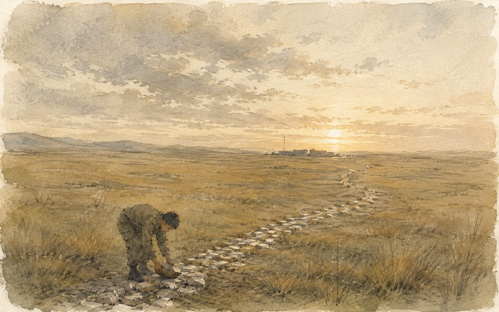

+++
title = "意义常常在后来才看见"
description = "许三多在草原五班一块一块搬石头的时候，并不知道那条路会把自己带到哪里。收益可以提前计算，意义往往不行——从《士兵突击》里的成才与许三多，到弗兰克尔在集中营里的那个清晨。"
date = 2026-08-30
tags = ["随笔", "思辨", "士兵突击", "活出生命的意义", "弗兰克尔"]
categories = ["写作"]
series = ["随笔"]
showTableOfContents = false
+++

许三多说过一句听起来什么都没说的话：有意义就是好好活，好好活就是做有意义的事。

什么叫有意义？好好活。什么叫好好活？做有意义的事。绕了一圈，又回到原处。

我们真正想问的当然不是这个。我们想问的是：到底什么事情才有意义——而且最好在开始之前就告诉我。这份工作值不值得做，这个人值不值得交，这条路有没有前途，这几年投进去会不会白费。我们希望在交出时间之前，先拿到一张证明。

《士兵突击》里其实有一个比我们更擅长这件事的人：成才。

他身上永远揣着三包烟，档次不同，见什么人递什么牌子，算得清清楚楚。他不是不努力，恰恰相反，他一直很努力，只是每做一件事之前，都要先看清它通向哪里。什么人值得结交，什么地方值得留下，下一步去哪儿更有前途，他总能比别人更早看见那条路线。

许三多正好相反。他常常连路在哪里都不知道。别人让他修路，他就真的去修路。

这两个人真正的差别，也许不是聪明和愚笨。而是：成才要先看见终点，才决定要不要走；许三多往往走了很久以后，才知道这条路把自己带到了哪里。

一件事的意义，真的必须在开始之前就被看见吗？

---

草原五班在整部剧里，是一个被遗忘的地方。

荒草，营房，望不到尽头的天。五个兵守着一片没人来的地方，打牌，聊天，混时间。日子不难过，只是每一天都和前一天一样。让新来的许三多去修路，本来更像是给这个不合群的人随便找点事干——那条路通向哪里，没有人真的关心。

许三多当真了。

他一块石头一块石头地搬，从荒草里挑出来，摆到该放的位置上。最开始只有他一个人。班长骂过，其他人笑过，他还是每天出去。后来老马开始跟着出去看，再后来，整个五班都被拖了进来。

可真正重要的事，在直升机出现以前就已经发生了：老马重新像一个班长了，那些混日子的兵重新开始干活，许三多第一次用自己的方式改变了身边的环境。如果一定要说「因为后来他进了钢七连，所以当初修路是对的」，那这条路就又变成了一张通行证——而这恰恰是成才的算法，只不过换了个人来算。

修路的人，最后也被那条路改变了。

后来到了钢七连，他做那三百三十三个腹部绕杠。开始的时候没有人当回事，做到几十个，围观的人开始起哄，做到一百多个，起哄声慢慢没有了。身体在转，一圈，又一圈。

他不是先想明白「这件事将如何塑造我的人生」，才开始做的。人很少有这么清醒。多数时候我们只是先把眼前的一件事做好，然后某一天回头才发现：原来我做的不只是那件事，那件事也一直在做我。

就算有人在许三多第一次摸到单杠的时候，把后来发生的一切都提前告诉他，他大概也未必真的明白。有些东西不是提前知道了结果就能理解的——站在起点的那个人，本来就还不是后来那个自己。

刚拿起相机的时候，我们也不会知道几年以后自己会怎样看世界。不是因为器材还不够熟，而是那双眼睛本来就还没有长出来。它要在一张又一张照片里，慢慢变成后来的样子。

人也是这样。很多事情的意义，只有被它改变过以后才真正看得懂。我们以为自己在经历生活，很多时候，生活也在慢慢做出那个将来能够理解它的我们。

站在起点看，那只是一堆石头；走远以后再回头，才发现那里已经有了一条路。

---

不过，成才也认真。

他的努力从来不比许三多少，甚至更清醒、更能吃苦。可同样的年头过下来，他身上却没有长出那样的东西。差别不在投入的多少——认真只能证明你投入过，不能替你投入的那个东西证明它值得。

成才的问题从来不是他太聪明，也不是他想进老A。想去更好的地方没有错。他的问题是太容易把眼前的一切都变成通往下一站的工具——一个班，一支连队，一段关系，甚至一个人，都可以因为「对下一步还有没有用」而重新估价。于是他走得比谁都快，只是很久以后坐在同一片草原上，他才说得出那句话：自己像一棵没有枝枝蔓蔓的树，看着很直，没什么多余东西，可也因为什么都没有长出来。那些被他一路剪掉的东西，后来都得重新一点一点长回去。

这也是许三多的「笨」真正珍贵的地方。他不是从来不判断，而是至少在一些时刻，他能先不急着问「这件事最后能给我什么」，而是问「这件事本身，值不值得我把它做好」。

到这里，两个人的差别已经不只是算不算回报了。更像是一路走来，有没有什么人、什么地方，真正留在自己身上。成才一直在经过：经过一个班，经过一支连队，经过一些对他好的人，脚步不停，所以很少有什么真正留了下来。许三多走得慢，却和每一个地方都缠在了一起——五班的路上有他搬过的石头；钢七连解散以后只剩下他一个人，他还是每天起床、出操、打扫营房，像那些人随时都会回来。很多东西为什么值得珍惜，往往不是事先想明白的，而是在这样的牵连里一点点知道的。

收益可以提前计算，意义往往不行。

---

可这些牵连并不牢靠。工作会失去，集体会解散，人也会离开。要是一个人连这些都保不住呢？

弗兰克尔遇到的，就是这样的处境。被关进集中营以后，他几乎失去了所有东西：工作，写了多年的手稿，父母和妻子，连名字都被换成了一串号码。而他后来反复讲的，是在那样的处境里他仍然看见的一件事：外面的一切几乎都由不得自己，但用什么姿态去面对落到眼前的这一天，那点余地还在。

《活出生命的意义》里写过一个清晨。天没亮，一队人被赶着在结冰的风里走向工地，有人摔倒，有人挨打，身边的人压低声音说：要是我们的妻子看见我们现在这个样子。黑暗里，弗兰克尔想起了自己的妻子。他不知道她是否还活着，也没有任何办法知道。可在那段路上，她的面容、她的笑，比脚下的冰更真实。至少在那个清晨，有一样东西没有被集中营拿走：他还可以爱一个人。

我们总在问：我的生命究竟有什么意义？——好像世界欠我们一个答案，交出来我们才肯认真活。弗兰克尔把这个问题掉了个头：也许不是我们在审问生命，而是生命不断把具体的事情放到人面前，问你打算怎么回应。

至于它对你意味着什么，通常要很久以后才知道。

草原五班。荒草，营房，望不到尽头的天，和地上那一块一块被搬来的石头。

许三多修那条路的时候，不知道有一天直升机会从上空经过，不知道团部会注意到这条路，更不知道自己会因此离开五班。如果他当初非要生活先给他一个保证，那条路大概永远不会出现。

可也不是因为后来进了钢七连，那条路才终于有了意义。在任何人看见它以前，五班已经变了，他也已经变了。后来发生的一切，只是让别人终于看见了这件事。

人生里真正重要的东西，也许经常是这样。我们并不知道它会把自己带到哪里。只是有一天，面对眼前的那一块石头，你弯下腰，把它放到该放的位置上。

然后是下一块。
